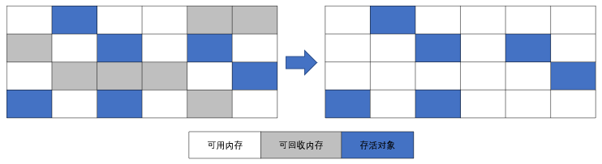
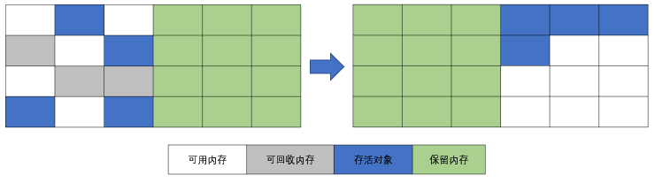
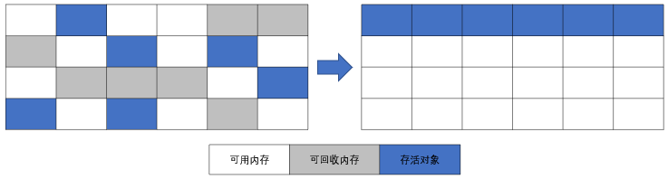

- [垃圾收集策略与算法](#垃圾收集策略与算法)
  - [确认对象是否存活](#确认对象是否存活)
    - [引用计数法](#引用计数法)
    - [可达性分析法](#可达性分析法)
  - [引用的类型](#引用的类型)
    - [强引用](#强引用)
    - [软引用](#软引用)
    - [弱引用](#弱引用)
    - [虚引用](#虚引用)
  - [回收堆中无效对象](#回收堆中无效对象)
    - [判定 finalize() 是否有必要执行](#判定-finalize-是否有必要执行)
    - [对象重生或死亡](#对象重生或死亡)
  - [回收方法区内存](#回收方法区内存)
    - [判定废弃常量](#判定废弃常量)
    - [判定无用的类](#判定无用的类)
  - [垃圾收集算法](#垃圾收集算法)
    - [标记 - 清除算法](#标记---清除算法)
    - [复制算法](#复制算法)
    - [标记 - 整理算法](#标记---整理算法)
    - [分代收集算法](#分代收集算法)
- [内存分配与回收策略](#内存分配与回收策略)
  - [Minor GC 和 Full GC](#minor-gc-和-full-gc)
  - [对象优先在 Eden 分配](#对象优先在-eden-分配)
  - [大对象直接进入老年代](#大对象直接进入老年代)
  - [长期存活的对象将进入老年代](#长期存活的对象将进入老年代)
  - [动态对象年龄判定](#动态对象年龄判定)
  - [空间分配担保](#空间分配担保)
  - [总结](#总结)
- [JVM 性能调优（待完成）](#jvm-性能调优待完成)

# 垃圾收集策略与算法

程序计数器、虚拟机栈、本地方法栈随线程而生，也随线程而灭；栈帧随着方法的开始而入栈，随着方法的结束而出栈。这几个区域的内存分配和回收都具有确定性，在这几个区域内不需要过多考虑回收的问题，因为方法结束或者线程结束时，内存自然就跟随着回收了。

而对于 Java 堆和方法区，我们只有在程序运行期间才能知道会创建哪些对象，这部分内存的分配和回收都是动态的，垃圾收集器所关注的正是这部分内存。

## 确认对象是否存活

若一个对象不被任何对象或变量引用，那么它就是无效对象，需要被回收。

### 引用计数法

在对象头维护着一个 counter 计数器，对象被引用一次则计数器 +1；若引用失效则计数器 -1。当计数器为 0 时，就认为该对象无效了。

引用计数算法的实现简单，判定效率也很高，在大部分情况下它都是一个不错的算法。但是主流的 Java 虚拟机里没有选用引用计数算法来管理内存，主要是因为它很难解决对象之间循环引用的问题。
> 对象 objA 内部有一个引用指向对象 objB，对象 objB 内部也有一个引用指向对象 objA，也就是说 objA 和 objB 相互引用。此情形下，即使没有任何其他对象引用 objA 和 objB，它们的引用计数值也是不为 0，也就无法通知垃圾回收器回收它们。

### 可达性分析法

这个算法的基本思想就是通过一系列的称为 “GC Roots” 的对象作为起点，从这些节点开始向下搜索，节点所走过的路径称为引用链，当一个对象到 GC Roots 没有任何引用链相连的话，则证明此对象是不可用的。

GC Roots
- Java 虚拟机栈中引用的对象（栈帧中的本地变量表）
- 本地方法栈中引用的对象（Native 对象）
- 方法区中常量引用的对象
- 方法区中类静态属性引用的对象

GC Roots 并不包括堆中对象所引用的对象，这样就不会有循环引用的问题。

## 引用的类型

判定对象是否存活与“引用”有关。在 JDK 1.2 以前，Java 中的引用定义很传统，一个对象只有被引用或者没有被引用两种状态。

若我们希望能描述这一类对象：当内存空间还足够时，则保留在内存中；如果内存空间在进行垃圾手收集后还是非常紧张，则可以抛弃这些对象。很多系统的缓存功能都符合这样的应用场景。

在 JDK 1.2 之后，Java 对引用的概念进行了扩充，将引用分为了以下四种。不同的引用类型，主要体现的是对象不同的可达性状态 `reachable` 和垃圾收集的影响。

### 强引用

强引用（Strong Reference）：类似 "Object obj = new Object()" 这类方式创建的引用，这是使用最普遍的引用。如果一个对象具有强引用，那就类似于**必不可少**的生活用品，垃圾回收器绝不会回收它。当内存空间不足时，JVM 宁愿抛出 OutOfMemoryError 错误，使程序异常终止，也不会靠随意回收具有强引用的对象来解决内存不足问题。

但是，如果我们错误地保持了强引用，比如：赋值给了 static 变量，那么对象在很长一段时间内不会被回收，会产生内存泄漏。

### 软引用

如果一个对象只具有软引用（Soft Reference），那就类似于**可有可无**的生活用品。如果内存空间足够，垃圾回收器就不会回收它，如果内存空间不足了，就会回收这些对象的内存。只要垃圾回收器没有回收它，该对象就可以被程序使用。

软引用通常用来实现**内存敏感的缓存**，如果还有空闲内存，就可以暂时保留缓存，当内存不足时清理掉，这样就保证了使用缓存的同时，不会耗尽内存。

软引用可以和一个引用队列（ReferenceQueue）联合使用，如果软引用所引用的对象被垃圾回收，JVM 就会把这个软引用加入到与之关联的引用队列中。

### 弱引用

如果一个对象只具有弱引用（Weak Reference），那就类似于**可有可无的生活用品**。

弱引用与软引用的区别在于：只具有弱引用的对象拥有更短暂的生命周期。在垃圾回收器线程扫描它 所管辖的内存区域的过程中，一旦发现了只具有弱引用的对象，不管当前内存空间足够与否，都会回收它的内存。不过，由于垃圾回收器是一个优先级很低的线程， 因此不一定会很快发现那些只具有弱引用的对象。

弱引用可以和一个引用队列（ReferenceQueue）联合使用，如果弱引用所引用的对象被垃圾回收，JVM 就会把这个弱引用加入到与之关联的引用队列中。

### 虚引用

虚引用（Phantom Reference），顾名思义，就是**形同虚设**，与其他几种引用都不同，虚引用并不会决定对象的生命周期。如果一个对象仅持有虚引用，那么它就和没有任何引用一样，在任何时候都可能被垃圾回收。

虚引用主要用来跟踪对象被垃圾回收的活动。

虚引用与软引用和弱引用的一个区别在于： 虚引用必须和引用队列（ReferenceQueue）联合使用。当垃 圾回收器准备回收一个对象时，如果发现它还有虚引用，就会在回收对象的内存之前，把这个虚引用加入到与之关联的引用队列中。程序可以通过判断引用队列中是否已经加入了虚引用，来了解被引用的对象是否将要被垃圾回收。程序如果发现某个虚引用已经被加入到引用队列，那么就可以在所引用的对象的内存被回收之前采取必要的行动。

特别注意，在程序设计中一般很少使用弱引用与虚引用，使用软引用的情况较多，这是因为软引用可以加速 JVM 对垃圾内存的回收速度，可以维护系统的运行安全，防止内存溢出（OutOfMemory）等问题的产生。

## 回收堆中无效对象

即使在可达性分析法中不可达的对象，也并非是“非死不可”的，这时候它们暂时处于“缓刑阶段”，要真正宣告一个对象死亡，至少要经历两次标记过程。
可达性分析法中不可达的对象被第一次标记并且进行一次筛选，筛选的条件是此对象的 finalize() 是否有必要执行 。

### 判定 finalize() 是否有必要执行

JVM 会判断不可达的对象是否有必要执行 finalize() 方法，如果对象没有覆盖 finalize() 方法，或者 finalize() 方法已经被虚拟机调用过，那么视为“没有必要执行”。那么对象基本上就真的被回收了。

如果对象被判定为有必要执行 finalize() 方法，那么对象会被放入一个 F-Queue 队列中，虚拟机会以较低的优先级执行这些 finalize()方法，但不会确保所有的 finalize() 方法都会执行结束。如果 finalize() 方法出现耗时操作，虚拟机就直接停止指向该方法，将对象清除。

### 对象重生或死亡

如果在执行 finalize() 方法时，将 this 赋给了某一个引用，那么该对象就重生了。如果没有，那么就会被垃圾收集器清除。

任何一个对象的 finalize() 方法只会被系统自动调用一次，如果对象面临下一次回收，它的 finalize() 方法不会被再次执行，想继续在 finalize() 中自救就失效了。

## 回收方法区内存

方法区中存放生命周期较长的类信息、常量、静态变量，每次垃圾收集只有少量的垃圾被清除。
方法区中主要清除两种垃圾：
- 废弃常量
- 无用的类

### 判定废弃常量

只要常量池中的常量不被任何变量或对象引用，那么这些常量就会被清除掉。
比如，一个字符串 "bingo" 进入了常量池，但是当前系统没有任何一个 String 对象引用常量池中的 "bingo" 常量，也没有其它地方引用这个字面量，必要的话，"bingo"常量会被清理出常量池。

### 判定无用的类

判定一个类是否是“无用的类”，条件较为苛刻。
- 该类的所有对象都已经被清除
- 加载该类的 ClassLoader 已经被回收
- 该类的 java.lang.Class 对象没有在任何地方被引用，无法在任何地方通过反射访问该类的方法。
    > 一个类被虚拟机加载进方法区，那么在堆中就会有一个代表该类的对象：java.lang.Class。这个对象在类被加载进方法区时创建，在方法区该类被删除时清除。

可以对满足上述 3 个条件的无用类进行回收，这里说的仅仅是“可以”，而并不是和对象一样不使用了就会必然被回收。

## 垃圾收集算法

学会了如何判定无效对象、无用类、废弃常量之后，剩余工作就是回收这些垃圾。常见的垃圾收集算法有：
- 标记 - 清除算法（Mark-Sweep）
- 复制算法（Copying）
- 标记 - 整理算法（Mark-Compact）

### 标记 - 清除算法

标记-清除算法分为标记和清除两个阶段。该算法首先从根集合进行扫描，对存活的对象对象标记，标记完毕后，再扫描整个空间中未被标记的对象并进行回收.
它是最基础的收集算法，后续的算法都是对其不足进行改进得到。这种垃圾收集算法会带来两个明显的问题：
- 效率问题：标记和清除两个过程的效率都不高;
- 空间问题：标记清除后会产生大量不连续的碎片

### 复制算法

复制算法将可用内存按容量划分为大小相等的两块，每次只使用其中的一块。当这一块的内存用完了，就将还存活着的对象复制到另外一块上面，然后再把已使用过的内存空间一次清理掉。
这种算法适用于对象存活率低的场景，比如新生代。这样使得每次都是对整个半区进行内存回收，内存分配时也就不用考虑内存碎片等复杂情况，只要移动堆顶指针，按顺序分配内存即可，实现简单，运行高效。

### 标记 - 整理算法

复制收集算法在对象存活率较高时就要进行较多的复制操作，效率将会变低。更关键的是，如果不想浪费50%的空间，就需要有额外的空间进行分配担保，以应对被使用的内存中所有对象都100%存活的极端情况，所以在老年代一般不能直接选用这种算法。

标记整理算法的标记过程类似标记清除算法，但后续步骤不是直接对可回收对象进行清理，而是让所有存活的对象都向一端移动，然后直接清理掉端边界以外的内存，类似于磁盘整理的过程，该垃圾回收算法适用于对象存活率高的场景（老年代）

### 分代收集算法

对于一个大型的系统，当创建的对象和方法变量比较多时，堆内存中的对象也会比较多，如果逐一分析对象是否该回收，那么势必造成效率低下。

分代收集算法是基于这样一个事实：不同的对象的生命周期(存活情况)是不一样的，而不同生命周期的对象位于堆中不同的区域，因此对堆内存不同区域采用不同的策略进行回收可以提高 JVM 的执行效率。

当代商用虚拟机使用的都是分代收集算法：新生代对象存活率低，就采用复制算法；老年代存活率高，就用标记清除算法或者标记整理算法。

例如
- 在新生代中，每次收集都会有大量对象死去，所以可以选择复制算法，只需要付出少量对象的复制成本就可以完成每次垃圾收集。
- 老年代的对象存活几率是比较高的，而且没有额外的空间对它进行分配担保，所以我们必须选择“标记 - 清除”或“标记 - 整理”算法进行垃圾收集。

# 内存分配与回收策略

对象的内存分配，就是在堆上分配（也可能经过 JIT 编译后被拆散为标量类型并间接在栈上分配），对象主要分配在新生代的 Eden 区上，少数情况下可能直接分配在老年代，分配规则不固定，取决于当前使用的垃圾收集器组合以及相关的参数配置。

## Minor GC 和 Full GC

Minor GC：回收新生代（包括 Eden 和 Survivor 区域），因为 Java 对象大多都具备朝生夕灭的特性，所以 Minor GC 非常频繁，一般回收速度也比较快。

Major GC / Full GC: 回收老年代，出现了 Major GC，经常会伴随至少一次的 Minor GC，但这并非绝对。Major GC 的速度一般会比 Minor GC 慢 10 倍 以上。

在 JVM 规范中，Major GC 和 Full GC 都没有一个正式的定义，所以有人也简单地认为 Major GC 清理老年代，而 Full GC 清理整个内存堆。

## 对象优先在 Eden 分配

大多数情况下，对象在新生代 Eden 区中分配。当 Eden 区没有足够空间进行分配时，虚拟机将发起一次 Minor GC。

## 大对象直接进入老年代

大对象是指需要大量连续内存空间的 Java 对象，如很长的字符串或数据。

一个大对象能够存入 Eden 区的概率比较小，发生分配担保的概率比较大，而分配担保需要涉及大量的复制，就会造成效率低下。

虚拟机提供了一个 `-XX:PretenureSizeThreshold` 参数，令大于这个设置值的对象直接在老年代分配，这样做的目的是避免在 Eden 区及两个 Survivor 区之间发生大量的内存复制。

## 长期存活的对象将进入老年代

JVM 给每个对象定义了一个对象年龄计数器。当新生代发生一次 Minor GC 后，存活下来的对象年龄 +1，当年龄超过一定值时，就将超过该值的所有对象转移到老年代中去。

使用 `-XX:MaxTenuringThreshold` 设置新生代的最大年龄，只要超过该参数的新生代对象都会被转移到老年代中去。

## 动态对象年龄判定

如果当前新生代的 Survivor 中，相同年龄所有对象大小的总和大于 Survivor 空间的一半，年龄 >= 该年龄的对象就可以直接进入老年代，无须等到 `MaxTenuringThreshold` 中要求的年龄。

## 空间分配担保

JDK 6 Update 24 之前的规则是这样的：在发生 Minor GC 之前，虚拟机会先检查老年代最大可用的连续空间是否大于新生代所有对象总空间， - 如果这个条件成立，Minor GC 可以确保是安全的；
- 如果不成立，则虚拟机会查看 `HandlePromotionFailure` 值是否设置为允许担保失败，
    - 如果是，那么会继续检查老年代最大可用的连续空间是否大于历次晋升到老年代对象的平均大小
        - 如果大于，将尝试进行一次 Minor GC，尽管这次 Minor GC 是有风险的。如果出现风险，即 Minor  GC 导致老年代内存不足，则进行一次 Full GC
        - 如果小于，那此时直接进行一次 Full GC。
    - 如果不是，则不允许冒险，直接进行一次 FUll GC

JDK 6 Update 24 之后的规则变为：只要老年代的连续空间大于新生代对象总大小或者历次晋升的平均大小，就会进行 Minor GC，否则将进行 Full GC。

通过清除老年代中废弃数据来扩大老年代空闲空间，以便给新生代作担保。这个过程就是分配担保。

## 总结

可能触发 Full GC 的情形
1. System.gc() 方法的调用
    此方法的调用是建议 JVM 进行 Full GC，注意这只是建议而非一定，但在很多情况下它会触发 Full GC，从而增加 Full GC 的频率。通常情况下我们只需要让虚拟机自己去管理内存即可，我们可以通过 -XX:+ DisableExplicitGC 来禁止调用 System.gc()。
2. 老年代空间不足
    老年代空间不足会触发 Full GC操作，若进行该操作后空间依然不足，则会抛出如下错误：java.lang.OutOfMemoryError: Java heap space
3. 永久代空间不足
    JVM 规范中运行时数据区域中的方法区，在 HotSpot 虚拟机中也称为永久代（Permanet Generation），存放一些类信息、常量、静态变量等数据，当系统要加载的类、反射的类和调用的方法较多时，永久代可能会被占满，会触发 Full GC。如果经过 Full GC 仍然回收不了，那么 JVM 会抛出如下错误信息：java.lang.OutOfMemoryError: PermGen space
4. CMS GC 时出现 promotion failed 和 concurrent mode failure
    promotion failed，就是上文所说的担保失败。
    而 concurrent mode failure 是在执行 CMS GC 的过程中同时有对象要放入老年代，而此时老年代空间不足造成的。
5. 统计得到的Minor GC晋升到旧生代的平均大小大于老年代的剩余空间

# JVM 性能调优（待完成）

在高性能硬件上部署程序，目前主要有两种方式：
- 通过 64 位 JDK 来使用大内存；
- 使用若干个 32 位虚拟机建立逻辑集群来利用硬件资源。