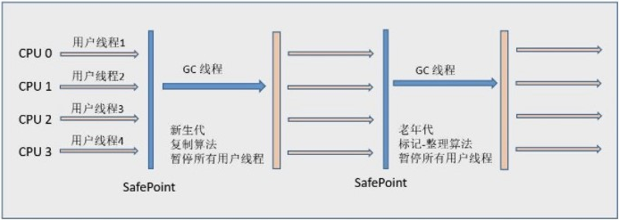
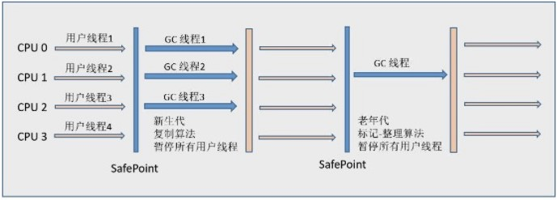
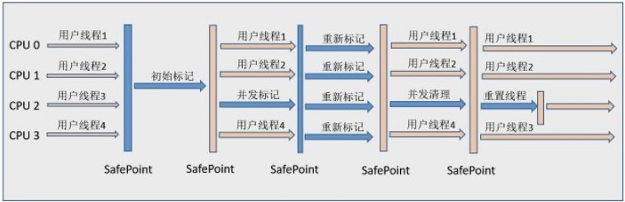
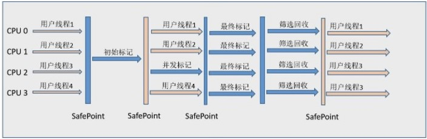
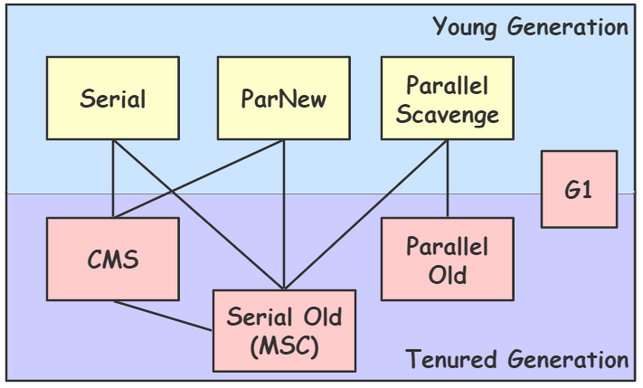

- [新生代垃圾收集器](#新生代垃圾收集器)
  - [Serial](#serial)
  - [ParNew](#parnew)
  - [Parallel Scavenge](#parallel-scavenge)
- [老年代垃圾收集器](#老年代垃圾收集器)
  - [Serial Old](#serial-old)
  - [Parallel Old](#parallel-old)
  - [CMS](#cms)
- [G1](#g1)
  - [特点](#特点)
  - [工作过程](#工作过程)
- [总结](#总结)
  - [垃圾收集器对比](#垃圾收集器对比)
  - [串行、并发和并行](#串行并发和并行)
  - [垃圾回收参数](#垃圾回收参数)
    - [垃圾回收器选择](#垃圾回收器选择)
    - [内存分配](#内存分配)
    - [并行回收器设置](#并行回收器设置)
    - [并发回收器设置](#并发回收器设置)
    - [垃圾搜集器性能通用参数](#垃圾搜集器性能通用参数)
    - [GC 信息输出设置](#gc-信息输出设置)

# 新生代垃圾收集器

## Serial

采用复制算法。

Serial（串行）收集器收集器是最基本、历史最悠久的垃圾收集器。看名字就知道这个收集器是一个单线程收集器。它的 “单线程” 的意义不仅仅意味着它只会使用一条垃圾收集线程去完成垃圾收集工作，更重要的是它在进行垃圾收集工作的时候必须暂停其他所有的工作线程（ "Stop The World" ），直到它收集结束。

由于 Serial 收集器只使用一条 GC 线程，避免了线程切换的开销，从而简单高效。

一般客户端应用所需内存较小，不会创建太多对象，而且堆内存不大，因此垃圾收集器回收时间短，即使在这段时间停止一切用户线程，也不会感觉明显卡顿。因此 Serial 收集器对于运行在 Client 模式下的虚拟机来说是个不错的选择。

## ParNew

采取复制算法。

ParNew 是 Serial 的多线程版本。由多条 GC 线程并行地进行垃圾清理。但清理过程依然需要 Stop The World。

ParNew 追求“低停顿时间”,与 Serial 唯一区别就是使用了多线程进行垃圾收集，在多 CPU 环境下性能比 Serial 会有一定程度的提升；但线程切换需要额外的开销，因此在单 CPU 环境中表现不如 Serial。

它是许多运行在 Server 模式下的虚拟机的首要选择，除了 Serial 收集器外，只有它能与 CMS 收集器配合工作。

## Parallel Scavenge

采取复制算法。

Parallel Scavenge 和 ParNew 一样，都是多线程、新生代垃圾收集器。但是两者有巨大的不同点：
- Parallel Scavenge：追求 CPU 吞吐量（高效率的利用 CPU），能够在较短时间内完成指定任务，因此适合没有交互的后台计算。
- ParNew：追求降低用户停顿时间，适合交互式应用。

追求高吞吐量，可以通过减少 GC 执行实际工作的时间，然而，仅仅偶尔运行 GC 意味着每当 GC 运行时将有许多工作要做，因为在此期间积累在堆中的对象数量很高。单个 GC 需要花更多的时间来完成，从而导致更高的暂停时间。而考虑到低暂停时间，最好频繁运行 GC 以便更快速完成，反过来又导致吞吐量下降。

通过参数 -XX:GCTimeRadio 设置垃圾回收时间占总 CPU 时间的百分比。
通过参数 -XX:MaxGCPauseMillis 设置垃圾处理过程最久停顿时间。
通过命令 -XX:+UseAdaptiveSizePolicy 开启自适应策略。我们只要设置好堆的大小和 MaxGCPauseMillis 或 GCTimeRadio，收集器会自动调整新生代的大小、Eden 和 Survivor 的比例、对象进入老年代的年龄，以最大程度上接近我们设置的 MaxGCPauseMillis 或 GCTimeRadio。

# 老年代垃圾收集器

## Serial Old

Serial 收集器的老年代版本，它同样是一个单线程收集器。它主要有两大用途：一种用途是在 JDK1.5 以及以前的版本中与 Parallel Scavenge 收集器搭配使用，另一种用途是作为 CMS 收集器的后备方案。

也称为 MSC（MarkSweepCompact)。

## Parallel Old

采用标记 - 清除算法。

Parallel Scavenge 收集器的老年代版本，多线程收集器。在注重吞吐量以及 CPU 资源的场合，都可以优先考虑 Parallel Scavenge 收集器和 Parallel Old 收集器。

## CMS

CMS（Concurrent Mark Sweep）收集器是一种以获取最短回收停顿时间为目标的收集器。它而非常符合在注重用户体验的应用上使用。

CMS（Concurrent Mark Sweep）收集器是 HotSpot 虚拟机第一款真正意义上的并发收集器，它第一次实现了让垃圾收集线程与用户线程（基本上）同时工作。

从名字中的Mark Sweep这两个词可以看出，CMS 收集器是一种 标记 - 清除算法实现的，它的运作过程相比于前面几种垃圾收集器来说更加复杂一些。整个过程分为四个步骤：
1. 初始标记
    - 暂停所有的其他线程（Stop The World）
    - 仅使用一条初始标记线程对所有与 GC Roots 直接关联的对象进行标记。
    - 速度很快；
2. 并发标记
    - 同时开启多条标记线程和用户线程并发执行
    - 用一个闭包结构去记录可达对象。
    - 但在这个阶段结束，这个包结构并不能保证包含当前所有的可达对象。因为用户线程可能会不断的更新引用域，所以 GC 线程无法保证可达性分析的实时性。所以这个算法里会跟踪记录这些发生引用更新的地方。
    - 速度很慢。
3. 重新标记
    - 站暂停所以其他线程（Stop The World）
    - 使用多条标记线程并发执行，将刚才并发标记过程中新出现的废弃对象标记出来。
    - 重新标记阶段就是为了修正并发标记期间因为用户程序继续运行而导致标记产生变动的那一部分对象的标记记录
    - 速度比初始标记慢，但远远比并发标记快。
4. 并发清除
    - 只使用一条 GC 线程，与用户线程并发执行，清除刚才标记的对象。
    - 速度很慢。

CMS是一款优秀的收集器,主要优点：并发收集、低停顿。

缺点：
1. CMS 收集器对 CPU 资源非常敏感。在并发阶段，它虽然不会导致用户线程停顿，但是会因为占用了一部分线程而导致应用程序变慢，总吞吐量会降低。
2. 浮动垃圾：由于 CMS 并发清理阶段用户线程还在运行着，伴随着程序运行自然就会有新的垃圾不断产生，这部分垃圾出现的标记过程之后，CMS 无法在当次收集中处理掉它们，只好留待下一次 GC 中再清理。这些垃圾就是“浮动垃圾”。
3. CMS 收集器无法处理浮动垃圾，可能会出现“Concurrent Mode Failure（并发模式故障）”失败而导致 Full GC 产生。
4. CMS 是一款“标记--清除”算法实现的收集器，容易出现大量空间碎片。当空间碎片过多，将会给大对象分配带来很大的麻烦，往往会出现老年代还有很大空间剩余，但是无法找到足够大的连续空间来分配当前对象，不得不提前触发一次 Full GC。

# G1

G1 (Garbage-First) 是一款面向服务器的垃圾收集器,主要针对配备多颗处理器及大容量内存的机器. 以极高概率满足 GC 停顿时间要求的同时,还具备高吞吐量性能特征。

## 特点
被视为 JDK1.7 中 HotSpot 虚拟机的一个重要进化特征。它具备一下特点：

1. 并行与并发：G1 能充分利用 CPU、多核环境下的硬件优势，使用多个 CPU（CPU 或者 CPU 核心）来缩短 Stop-The-World 停顿时间。部分其他收集器原本需要停顿 Java 线程执行的 GC 动作，G1 收集器仍然可以通过并发的方式让 java 程序继续执行。
2. 分代收集：虽然 G1 可以不需要其他收集器配合就能独立管理整个 GC 堆，但是还是保留了分代的概念。它能够采用不同的方式去处理新创建的对象和已经存活了一段时间，熬过多次GC的旧对象以获取更好的收集效果。
3. 空间整合：与 CMS 的“标记--清理”算法不同，G1 从整体来看是基于“标记整理”算法实现的收集器；从局部上来看是基于“复制”算法实现的。
4. 可预测的停顿：这是 G1 相对于 CMS 的另一个大优势，降低停顿时间是 G1 和 CMS 共同的关注点，但 G1 除了追求低停顿外，还能建立可预测的停顿时间模型，能让使用者明确指定在一个长度为 M 毫秒的时间片段内。

## 工作过程

G1 没有新生代和老年代的概念，而是将堆划分为一块块独立的 **Region**。当要进行垃圾收集时，首先估计每个 Region 中垃圾的数量，每次都从垃圾回收价值最大的 Region 开始回收，因此可以获得最大的回收效率。

从整体上看（对于所有 Region）， G1 是基于“标记-整理”算法实现的收集器，从局部上看（对于单个 Region ），是基于“复制”算法实现的，这意味着运行期间不会产生内存空间碎片。

每个 Region 都有一个 **Remembered Set**，用于记录本区域中所有对象引用的对象所在的区域，进行可达性分析时，只要在 GC Roots 中再加上 Remembered Set 即可防止对整个堆内存进行遍历。

如果不计算维护 Remembered Set 的操作，G1 收集器的工作过程分为以下几个步骤：
1. 初始标记：Stop The World，仅使用一条初始标记线程对所有与 GC Roots 直接关联的对象进行标记。
2. 并发标记：使用一条标记线程与用户线程并发执行。此过程进行可达性分析，速度很慢。
3. 最终标记：Stop The World，使用多条标记线程并发执行。
4. 筛选回收：首先对各个Region的回收价值和成本进行排序，根据用户所期望的GC停顿时间来制定回收计划。然后回收废弃对象，此时也要 Stop The World，并使用多条筛选回收线程并发执行。

G1 收集器在后台维护了一个优先列表，每次根据允许的收集时间，优先选择回收价值最大的 Region(这也就是它的名字 Garbage-First 的由来)。这种使用 Region 划分内存空间以及有优先级的区域回收方式，保证了 G1 收集器在有限时间内可以尽可能高的收集效率（把内存化整为零）。

# 总结

HotSpot 虚拟机提供了多种垃圾收集器，每种收集器都有各自的特点，虽然我们要对各个收集器进行比较，但并非为了挑选出一个最好的收集器。我们选择的只是对具体应用最合适的收集器。

- 连线代表可以搭配使用

## 垃圾收集器对比

|                   | 目标           | 线程           | 回收算法    | 特点       |
| :---------------- | :------------- | :------------- | :---------- | :--------- |
| Serial            | 新生代         | 单线程         | 复制        | 简单       |
| ParNew            | 新生代         | 多线程         | 复制        | 低停顿时间 |
| Parallel Scavenge | 新生代         | 多线程         | 复制        | 高吞吐量   |
| Serial Old        | 老年代         | 单线程         | 标记 - 整理 | 简单       |
| Parallel Old      | 老年代         | 多线程         | 标记 - 整理 | 高吞吐量   |
| CMS               | 老年代         | 单线程和多线程 | 标记 - 清除 | 低停顿时间 |
| G1                | 新生代和老年代 | 单线程和多线程 |             |

## 串行、并发和并行

串行（Serial）
- 单线程垃圾收集器工作，用户线程处于等待状态。
- 缺点是只有一个线程，执行垃圾回收时程序停止的时间比较长。
- 语法
    - `-XX:+UseSerialGC`

并行（Parallel）
- 多条垃圾收集线程工作，用户线程处于等待状态。
- 适合于吞吐量的系统。
- 语法
    - `-XX:+UseParallelGC`
    - `-XX:+UseParallelOldGC`
    - `-XX:ParallelGCThreads`
    - `-XX:MaxGCPauseMills`
    - `-XX:GCTimeRatio`

并发（Concurrent）
- 系统和多条垃圾收集线程一起工作，用户线程处于工作状态。
- 适合于响应要求高的系统。
- 语法
    - `-XX:+UseConcMarkSweepGC`

## 垃圾回收参数

### 垃圾回收器选择

`-XX:+UseSerialGC`：Serial & Serial Old（client模式默认值）
`-XX:+UseParNewGC`：ParNew & Serial Old
`-XX:+UseParallelGC`：Parallel Scavenge & Serial Old（server模式默认值）
`-XX:+UseParallelOldGC`：Parallel Scavenge & Parallel Old（JDK 1.5 后失效）
`-XX:+UseConcMarkSweepGC`：ParNew & CMS（Serial Old 为替补）

### 内存分配

`-Mms`：最小堆大小。默认为物理内存的 1/64，最大不超 1G。
`-Xmx`：最大堆大小。默认为物理内存的 1/4，最大不超 1G。
`-Mmn`：新生代大小。
`-Xss`：线程栈大小。
`-XX:PermSize=n`：最小永久代大小。默认为物理内存的 1/64，最大不超1G。
`-XX:MaxPermSize=n`：最大永久代大小。默认为物理内存的 1/4，最大不超1G。
`-XX:NewRatio=n`：老年代和新生代的比例。
`-XX:SurvivorRatio=n`：新生代中调整 eden 区与 survivor 区的比例，默认为 8（8:1:1)。

### 并行回收器设置

`-XX:ParallelGCThreads=n`：回收时开启的线程数。默认与 CPU 个数相等。
`-XX:GCTimeRatio=n`：设置系统的吞吐量。若无法满足会缩小新生代大小。
`-XX:MaxGCPauseMillis=n`：设置垃圾回收的最大停顿时间。若无法满足设置值，则会优先缩小新生代大小，仍无法满足的话则会牺牲吞吐量。

### 并发回收器设置

`-XX:CMSInitiatingOccupancyFraction`：触发 CMS 收集器的内存比例。当内存达到比例，就会开始进行CMS并发收集。
`-XX:UseCMSCompactAtFullCollection`：用于在每一次CMS收集器清理垃圾后送一次内存整理。
`-+XX:CMSFullGCsBeforeCompaction`：设置在几次CMS垃圾收集后，触发一次内存整理。

### 垃圾搜集器性能通用参数

`-XX:PretenureSizeThreshold`：晋升年老代的对象大小。默认为0，比如设为10M，则超过10M的对象将不在eden区分配，而直接进入年老代。
`-XX:MaxTenuringThreshold`：晋升老年代的最大年龄。默认为15，比如设为10，则对象在10次普通GC后将会被放入年老代。
`-XX:DisableExplicitGC`：禁用System.gc()。

### GC 信息输出设置

`-XX:+printGC`：输出 GC 信息
`-XX:+PrintGCDetails`：输出 GC 详情

[Java HotSpot VM Options](https://www.oracle.com/technetwork/java/javase/tech/vmoptions-jsp-140102.html)
[垃圾收集器详解及参数配置](https://www.cnblogs.com/rwxwsblog/p/6248205.html)