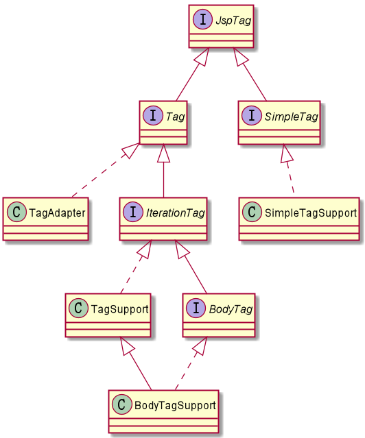

- [page指令](#page指令)
    - [语法](#语法)
    - [说明](#说明)
- [include指令](#include指令)
    - [语法](#语法-1)
    - [说明](#说明-1)
- [taglib指令](#taglib指令)
    - [语法](#语法-2)
    - [JSTL](#jstl)
    - [自定义taglib](#自定义taglib)
        - [标签类](#标签类)
        - [TLD](#tld)
        - [使用自定义标签库](#使用自定义标签库)

# page指令

page指令用于定义jsp页面的各种属性，无论page指令出现在jsp页面的什么地方， 他作用的都是整个jsp页面，为了保持程序的可读性和遵循良好的编程习惯，page指令最好是放在整个页面的起始位置。

## 语法

```
<%@page [language="java"]
    [extends="package.class"]
    [import="{package.class|package.*},..."]
    [contentType="MIME-TYPE; charset=CHARSET"]
    [pageEncoding="CHARSET"]
    [session="true|false"]
    [buffer="none|8kb|SIZE"]
    [autoFlush="true|false"]
    [isThreadSafe="true|false"]
    [info="text"]
    [isELIgnored="true|false"]
    [errorPage="RELATIVE-URL"]
    [isErrorPage="true|false"]
%>
```

## 说明

- language
    - 声明脚本语言的种类。
    - 默认情况下为java。

- extends
    - 指定JSP页面所生成的servlet的超类。这个属性一般为开发人员或提供商保留，由他们对页面的运作方式做出根本性的改变（如添加个性化特性）。
    - 一般应该避免使用这个属性，除非引用由服务器提供商专为这种目的提供的类。

- import
    - import属性指定JSP页面转换成的servlet应该输入的包。在JSP中，包是绝对必需的。 原因是，如果没有使用包，系统则认为所引用的类与当前类在同一个包中。
    - 默认情况下，servlet导入一些服务器特有的包，例如：java.lang.* javax.servlet.* javax.servlet.jsp.* javax.servlet.http.* 在编译时已导入了，不需要再指明。
    ```
    <%@ page import="package.class" %>
    <%@ page import="package1.class1, ..., packageN.classN" %>
    ```
- contentType/pageEncoding
    - contentType属性设置Content-Type响应报头，标明即将发送到客户程序的文档的MIME类型。
    - 默认MIME类型是text/html，默认字符集为ISO-8859-1。
    - pageEncoding指的是JSP文件本身的编码，而contentType中charset指的是服务器向客户端发送为客户端的内容编码（优先起决定作用的是pageEncoding）
    ```
    <%@ page contentType="text/html" %>
    <%@ page pageEncoding="GBK" %>
    <%@ page contentType="text/html; charset=utf-8" %>
    ```
- session
    - 控制页面是否参与HTTP会话。
    - 默认值为true。若存在已有会话，则预定义变量session（类型为HttpSession）应该绑定到现有的会话；否则，创建新的会话并将其绑定到session。
    - false值表示不自动创建会话，在JSP页面转换成servlet时，对变量session的访问会导致错误。
    - 注意，`session="false"`并不禁用会话跟踪，它只是阻止JSP页面为那些尚不拥有会话的用户创建新的会话。由于会话是针对用户，不是针对贞面，所以，关闭某个页面的会话跟踪没有任何益处，除非有可能在同一客户会话中访问到的相关页面都关闭会话跟踪。
- buffer
    - buffer的大小被out对象用于缓存处理执行后的JSP对客户端浏览器的输出。
    - none是指没有任何缓存，直接输出到客户端浏览器。用户可通过指定buffer的大小来指定缓存处理的大小，默认值为8kb。
- autoFlush
    - 控制当缓冲区充满之后，是应该自动清空输出缓冲区（true），还是在缓冲区溢出后抛出一个异常（false）。
    - 默认值为true。
    - 在`buffer="none"`时，false值是不合法的。
- isThreadSafe
    - 设置JSP文件是否多线程使用。若为True，那么一个JSP能同事处理多个用户的请求。
    - 默认值为True。
- info
    - 定义一个可以在servlet中通过`getServletInfo()`方法获取的字符串。
    - 在JSP被执行时， 用来描述当前JSP文件的相关信息。
- isELIgnored
    - isELIgnored属性控制的是：忽略（true）JSP2.0表达式语言（EL），还是进行正常的求值（false）。
    - 这是JSP 2.0新引入的属性；在只支持JSP1.2及早期版本的服务器 中，使用这项属性是不合法的。
    - 这个属性的默认值依赖于Web应用所使用的web.xml的版 本。如果web.xml指定servlet2.3（对应JSP1.2）或更早版本，默认值为true（但变更默认值依旧是合法的，JSP2.0兼容的服务器中都允许使用这项属性，不管web.xml的版本如何）。如果web.xml指定servlet 2.4（对应JSP 2.0）或之后的版本， 那么默认值为false。
- errorPage/isErrorPage
    - errorPage属性用来指定一个JSP页面，由该页面来处理当前页面中抛出但未被捕获的任何异常（即类型为Throwable的对象）。
    - 指定的错误页面可以通过exception变量访问抛出的异常。isErrorPage属性表示当前 页是否可以作为其他JSP页面的错误页面。默认为false。

# include指令

jsp中include指令是将不同的文件插入到JSP网页中，这些文件可以是文本文件、HTML文件、JSP文件等。

## 语法
    ```
    <%@include file="RELATIVE-URL"%>
    ```

## 说明

- **include被引入的文件必须遵循JSP语法**，其中的内容可以包含静态HTML、JSP脚本元素、JSP指令和JSP行为元素等普通JSP页面所具有的一切内容；
- **include被引入的文件可以使用任意的扩展名**，即使其扩展名是html，JSP引擎也会按照处理jsp页面的方式处理它里面的内容，为了见明知意，JSP规范建议使用.jspf（JSP fragments）作为静态引入文件的扩展名；
- 在将JSP文件翻译成Servlet源文件时，JSP引擎将合并被引入的文件与当前JSP页面中的指令元素（设置pageEncoding属性的page指令除外) ，所以，除了import和pageEncoding属性之外，page指令的其他属性不能在这两个页面中有不同的设置值；
- 除了指令元素之外，被引入的文件中的其他元素都被转换成相应的Java源代码，然后插入进当前JSP页面所翻译成的Servlet源文件中，插入位置与include指令在当前JSP页面中的位置保持一致；
- **include引入文件与被引入文件是在被JSP引擎翻译成Servlet的过程中进行合并**，而不是先合并源文件后再对合并的结果进行翻译。当前JSP页面的源文件与被引入文件的源文件可以采用不同的字符集编码，即使在一个页面中使用page指令的pageEncoding或contentType属性指定了其源文件的字符集编码，在另外一个页面中还需要用page指令的pageEncoding或contentType属性指定其源文件所使用的字符集；
- **include中file属性的设置值必须使用相对路径**。如果以 “/” 开头，表示相对于当前WEB应用程序的根目录（注意不是站点根目录，否则，表示相对于当前文件）。
- **指令包含为静态包含**。先包含，后编译，不会检查所包含文件的变化。适合包含静态网页。只是简单的嵌入到主文件中，就是在jsp页面转化成Servlet时才嵌入到主文件中，因为运行的结果 是只生成了一个Servlet。

# taglib指令

Taglib指令是定义一个标签库以及其自定义标签的前缀。一个自定义的tag标签是用户定义的一种JSP标记。当一个含有自定义的tag标签的JSP页面被jsp引擎编译成servlet时，tag标签被转化 成了对一个称为tag处理类的对象进行的操作。当JSP页面被jsp引擎转化为servlet后，实际上tag标签被转化成为了对tag处理类的操作。

## 语法

```
<%@ taglib uri="..." prefix="..." %>
```
prefix是一个标签库别名，taglib的uri引入jsp的标签库。

## JSTL

JSP标准标签库（JSTL）是一个JSP标签集合，它封装了JSP应用的通用核心功能。JSTL支持通用的、结构化的任务，比如迭代，条件判断，XML文档操作，国际化标签，SQL标签。 除了这些，它还提供了一个框架来使用集成JSTL的自定义标签。

根据JSTL标签所提供的功能，可以将其分为5个类别：
- **核心标签库**：数据处理、流程控制
- **格式化标签库**：日期、时间处理
- **SQL标签库**：数据库连接、查询、更新、事务
- **XML标签库**：XML解析、输出、流程控制
- **JSTL函数库**：字符串、数组处理

[JSP标准标签库（JSTL）](https://www.runoob.com/jsp/jsp-jstl.html)
[JSTL核心标签库 使用](https://www.cnblogs.com/lihuiyy/archive/2012/02/24/2366806.html)

使用注意事项：
- JSTL的版本不同，URL也不同，需要使用正确的URL
- 标签的scope标签不能单独出现，必须和var属性连用（scope表示var的作用域）
- 标签的value属性一般使用el表达式来设置
- 函数用于el表达式中，而不能单独作为标签

## 自定义taglib

自定义标签的步骤大概有三步：

1. 继承javax.servlet.jsp.tagext.* 下提供的几个标签类，如：
    - Tag
    - TagSupport
    - BodyTagSupport
    - SimpleTagSupport（JSP2.0）

2. 在tld文件中配置标签库信息，以及标签与实现类的映射。

3. 在jsp文件中引用自定义标签。

### 标签类



Tag
- doEndTag()：执行当前标签实例的结束标签。在doStartTag() 执行后调用
- doStartTag()：执行当前标签实例的开始标签。
- getParent()：获取当前标签的父标签
- release()：释放当前标签的状态
- setPageContext(PageContext)：设置当前标签的页面
- setParent(Tag)：设置当前标签的父标签

TagSupport
- TagSupport类是实现Tag接口的一个模板类。
- 用户只需要实现doStartTag() 和doEndTag() 方法。

SimpleTag接口 (JSP2.0)
- JSP2.0的接口，比Tag接口更简单。
- doTag()：执行当前标签的所有处理任务。
- getParent()：获取当前标签的父标签。
- setJspBody(JspFragment)：提供当前标签的实体为一个JspFragment对象
- setJspContext(JspContext)：设置JSP页面的
- setParent(JspTag)：设置当前标签的父标签。

SimpleTagSupport类 (JSP2.0)
- SimpleTagSupport类是实现SimpleTag接口的一个模板类。
- 用户只需要实现doTag() 方法。

### TLD

TLD全称为Tag Library Description，即标签库描述文件,用来配置标签库的基本信息。
```
<?xml version="1.0" encoding="ISO-8859-1"?>

<taglib xmlns="http://java.sun.com/xml/ns/javaee"
        xmlns:xsi="http://www.w3.org/2001/XMLSchema-instance"
        xsi:schemaLocation="http://java.sun.com/xml/ns/javaee http://java.sun.com/xml/ns/javaee/web-jsptaglibrary_2_1.xsd"
        version="2.1">

    <tlib-version>1.0</tlib-version>
    <short-name>hello</short-name>
    <uri>http://hkllyx.com/taglib/hello</uri>

    <tag>
        <name></name>
        <tag-class></tag-class>
        <body-content></body-content>
        <attribute>
            <name></name>
            <required></required>
        </attribute>
    </tag>

</taglib>
```
1. **tlib-version**：Tag库的版本
2. jsp-version：Tag库所需要的jsp的版本
3. **short-name**：助记符，tag的一个别名（可选）
4. **uri**：用于确定一个唯一的tag库
5. display-name：被可视化工具（诸如Jbuilder）用来显示的名称（可选）
6. small-icon：被可视化工具（诸如Jbuilder）用来显示的小图标（可选）
7. large-icon：被可视化工具（诸如Jbuilder）用来显示的大图标（可选）
8. description：对tag库的描述（可选）
9. listener：一个tag库可能定义一些类做为它的事件侦听类，这些类在TLD中被称为listener元素，jsp服务器将会实例化这些侦听类，并且注册它们。Listener元素中有一个叫listener-class的子元素，这个元素的值必须是该侦听类的完整类名
10. **tag**：每个tag元素在tag库中都要指出它的名字、类名、脚本变量、tag的属性。其中脚本变量的值可以直接在TLD中定义或通过tag附加信息的类来取得。每个属性描述了这个属性是否可以省略，它的值是否可以通过 <%= …%> 这样的JSP语法来获得，以及属性的类型。
    1. **name**：独一无二的元素名
    2. **tag-class**：Tag标签对应的tag处理类
    3. tei-class：javax.servlet.jsp.tagext.TagExtraInfo的子类，用于表达脚本变量（可选）
    4. **body-content**：Tag标签body的类型。有3种取值：empty（不允许有标签体存在）、JSP（允许有标签体存在） 和tagdependent（允许有标签体存在，但是标签体内的JSP代码不会被执行）。
    5. display-name：被可视化工具（诸如Jbuilder）用来显示的名称（可选）
    6. small-icon：被可视化工具（诸如Jbuilder）用来显示的小图标（可选）
    7. large-icon：被可视化工具（诸如Jbuilder）用来显示的大图标（可选）
    8. description：此tag标签的描述
    9. variable：提供脚本变量的信息（同tei-class）(可选)
    10. **attribute**：Tag标签的属性
        1. **name** 表示属性名称
        2. **required** 是否是必须的

### 使用自定义标签库

- 如果tld文件位于 /WEB-INF/ 下面，Tomcat会自动加载tld文件中的标签库。
- 如果位于其他的位置，可以在web.xml中配置。
    ```
    <jsp-config>
        <taglib>
            <taglib-uri></taglib-uri>
            <taglib-location></taglib-location>
        </taglib>
    </jsp-config>
    ```
- 在JSP中直接使用
    ```
    <%@ taglib prefix="" uri=""%>
    ```