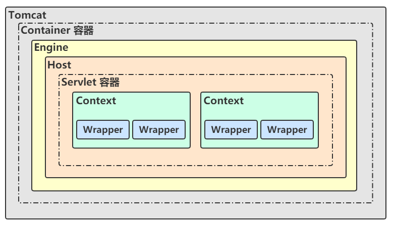
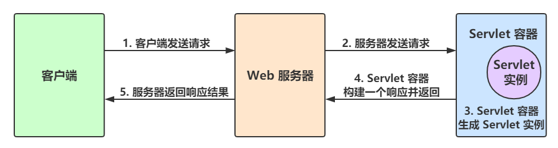
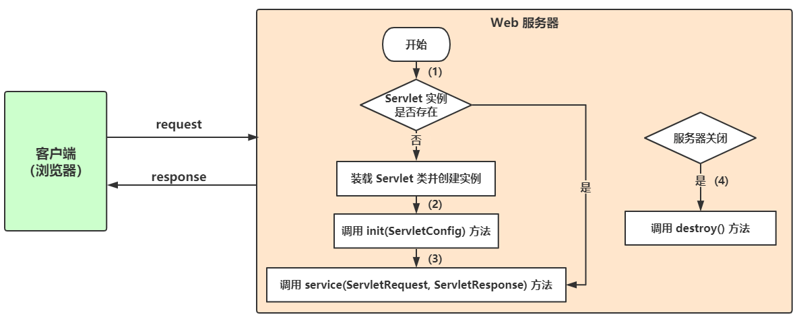
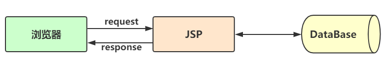
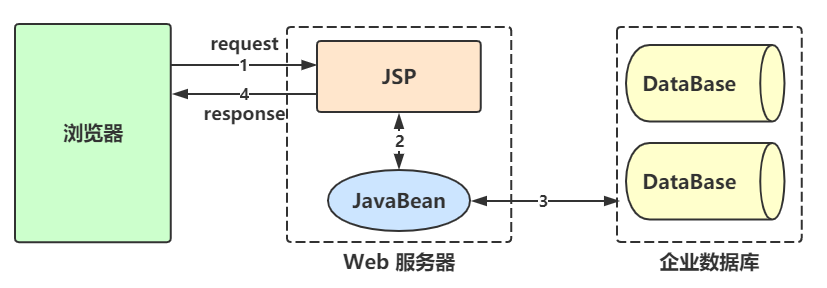
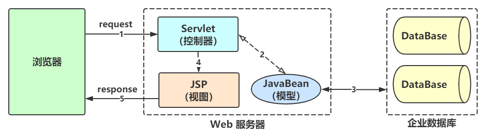

- [一、概述](#一概述)
- [Servlet 容器](#servlet-容器)
  - [执行过程](#执行过程)
- [Tomcat 容器](#tomcat-容器)
  - [Tomcat 服务器接受客户请求并做出响应的过程](#tomcat-服务器接受客户请求并做出响应的过程)
  - [Tomcat 体系结构](#tomcat-体系结构)
  - [Tomcat 容器等级](#tomcat-容器等级)
- [Servlet 工作过程和生命周期](#servlet-工作过程和生命周期)
  - [工作过程](#工作过程)
  - [生命周期](#生命周期)
- [JSP 生命周期和工作过程](#jsp-生命周期和工作过程)
  - [生命周期](#生命周期-1)
  - [工作过程](#工作过程-1)
- [Servlet 类中获取 JSP 内置对象](#servlet-类中获取-jsp-内置对象)
- [Servlet 配置](#servlet-配置)
  - [web.xml 配置](#webxml-配置)
  - [@WebServlet 注解](#webservlet-注解)
  - [URL 相关](#url-相关)
    - [匹配规则](#匹配规则)
    - [匹配顺序](#匹配顺序)
    - [`\*` & `\`](#--)
- [异步 Servlet](#异步-servlet)
- [JSP 架构模型](#jsp-架构模型)
  - [JSP Model 1](#jsp-model-1)
  - [JSP Model 2](#jsp-model-2)
  - [JSP MVC](#jsp-mvc)

# 一、概述

Java Servlet 是运行在 Web 或应用服务器上的程序。一个 Servlet 就是一个 Java 类，并且可以通过 “请求 - 响应” 编程模型来访问的这个驻留在服务器内存里的 Servlet 程序。

作为在来自 Web 浏览器或其他 HTTP 客户机的请求和在 HTTP 服务器上的数据库或应用程序的中间层。使用 Servlet，可以通过 Web 页面表单来收集用户的输入，显示从数据库或其他来源的记录，动态地创建 Web 页面。

# Servlet 容器

Servlet 容器也叫做 Servlet 引擎，是 Web 服务器或应用程序服务器的一部分，用于在发送的请求和 响应之上提供网络服务，解码基于 MIME 的请求，格式化基于 MIME 的响应。

Servlet 没有 `main()` 方法， 不能独立运行，它必须被部署到 Servlet 容器中，由容器来实例化和调用 Servlet 的方法（如 `doGet()` 和 `doPost()`），Servlet 容器在 Servlet 的生命周期内包容和管理 Servlet。在 JSP 技术推出后，管理和运行 Servlet/JSP 的容器也称为 Web 容器。

## 执行过程

1. 有了 servlet 之后，用户通过单击某个链接或者直接在浏览器的地址栏中输入 URL 来访问 Servlet。
2. Web 服务器接收到该请求后，并不是将请求直接交给 Servlet，而是交给 Servlet 容器。
3. Servlet 容器实例化 Servlet，调用 Servlet 的一个特定方法对请求进行处理，并产生一个响应。
4. 这个响应由 Servlet 容器返回给 Web 服务器，Web 服务器包装这个响应，以 HTTP 响应的形式发送给 Web 浏览器。

# Tomcat 容器

Tomcat 是一个免费的开放源代码的 Servlet 容器，它是 Apache 软件基金会 （Apache Software Foundation）的一个顶级项目，由 Apache、Sun 和其他一些公司及个人共 同开发而成。由于有了 Sun 的参与和支持，最新的 Servlet 和 JSP 规范总是能在 Tomcat 中得到体现，Tomcat 6 支持最新的 Servlet 2.5 和 JSP 2.1 规范。因为 Tomcat 技术先进、性能稳定，而且免费， 因而深受 Java 爱好者的喜爱，并得到了部分软件开发商的认可，成为目前比较流行的 Web 服 务器。

Tomcat 和 IIS、Apache 等 Web 服务器一样，具有处理 HTML 页面的功能，另外它还是一个 Servlet 和 JSP 容器，独立的 Servlet 容器是 Tomcat 的默认模式。不过，Tomcat 处理静态 HTML 的能力不如 Apache，我们可以将 Apache 和 Tomcat 集成在 一起使用，Apache 作为 HTTP Web 服务器， Tomcat 作为 Web 容器。

## Tomcat 服务器接受客户请求并做出响应的过程

1. 客户端（通常都是浏览器）访问 Web 服务器，发送 HTTP 请求。
2. Web 服务器接收到请求后，传递给 Servlet 容器。
3. Servlet 容器加载 Servlet，产生 Servlet 实例后，向其传递表示请求和响应的对象。
4. Servlet 实例使用请求对象得到客户端的请求信息，然后进行相应的处理。
Servlet 实例将处理结果通过响应对象发送回客户端，容器负责确保响应正确送出，同时将 控制返回给 Web 服务器。

## Tomcat 体系结构

Tomcat 服务器是由一系列可配置的组件构成的，其中核心组件是 Catalina Servlet 容器，它是所 有其他 Tomcat 组件的顶层容器。我们可以通过查看 Tomcat 安装文件夹下的 conf 文件夹中的 server.xml 文件 来了解 Tomcat 各组件之间的层次关系。由于 server.xml 注释太多，特简化如下：
```
<?xml version='1.0' encoding='utf-8'?>
<Server port="8005" shutdown="SHUTDOWN">
    <Service name="Catalina">
        <Connector port="8080" protocol="HTTP/1.1" connectionTimeout="20000" redirectPort="8443" URIEncoding="UTF-8"/>

        <Engine name="Catalina" defaultHost="localhost">
            <Host name="localhost">
                <Context path="" docBase="WORK_DIR" reloadable="true"/>
            </Host>
        </Engine>
    </Service>
</Server>
```
其中 WORK_DIR 为你想要导入的项目路径。
- **Server**
    - Server 表示整个的 Catalina Servlet 容器。Tomcat 提供了 Server 接口的一个默认实现，这通常不需要用户自己去实现。在 Server 容器中，可以包含一个或多个 Service 组件。

- **Service**
    Service 是存活在 Server 内部的中间组件，它将一个或多个连接器（Connector）组件绑定到一个单独的引擎（Engine）上。在 Server 中，可以包含一个或多个 Service 组件。Service 也很少由用户定制，Tomcat 提供了 Service 接口的默认实现，而这种实现既简单又能满足应用。

- **Connector**
    连接器（Connector）处理与客户端的通信，它负责接收客户请求，以及向客户返回响应结果。在 Tomcat 中，有多个连接器可以使用。

- **Engine**
    - 在 Tomcat 中，每个 Service 只能包含一个 Servlet 引擎（Engine）。引擎表示一个特定的 Service 的请求处理流水线。
    - 作为一个 Service 可以有多个连接器，引擎从连接器接收和处理所有的请求，将响应返回给适合的连接器，通过连接器传输给用户。用户允许通过实现 Engine 接口提供自定义的引擎，但通常不需要这么做。

- **Host**
    - Host 表示一个虚拟主机，一个引擎可以包含多个 Host。
    - 用户通常不需要创建自定义的 Host， 因为 Tomcat 给出的 Host 接口的实现（类 StandardHost）提供了重要的附加功能。

- **Context**
    - 一个 Context 表示了一个 Web 应用程序，运行在特定的虚拟主机中。
    - **Web 应用程序**：在 Sun 公司发布的 Java Servlet 规范中，对 Web 应用程序做出了如下的定义：“一个 Web 应 用程序是由一组 Servlet、HTML 页面、类，以及其他的资源组成的运行在 Web 服务器上的完整的应用程序。它可以在多个供应商提供的实现了 Servlet 规范的 Web 容器中运行”。
    - 一个 Host 可以包含多个 Context（代表 Web 应用程序），每一个 Context 都有一个唯一的路径。
    - 用户通常不需要创建自定义的 Context，因为 Tomcat 给出的 Context 接口的实现 （类 StandardContext）提供了重要的附加功能。

## Tomcat 容器等级



# Servlet 工作过程和生命周期

## 工作过程

Servlet 是运行在 Servlet 容器（有时候也叫 Servlet 引擎，是 web 服务器和应用程序服务器的一部分， 用于在发送的请求和响应之上提供网络服务，解码基于 MIME 的请求，格式化基于 MIME 的响应。常用的 tomcat、jboss、weblogic 都是 Servlet 容器）中的，其生命周期是由容器来管理。


## 生命周期

Servlet 的生命周期通过 java.servlet.Servlet 接口中的 `init()`、`service()`、和 `destroy()` 方法表示。Servlet 的生命周期有四个阶段： 加载并实例化、初始化、请求处理、销毁。

1. **加载并实例化**
    - Servlet 容器负责加载和实例化 Servelt。
    - 当 Servlet 容器启动时，或者在容器检测到需要这个 Servlet 来响应第一个请求时，创建 Servlet 实例。
    - 当 Servlet 容器启动后，Servlet 通过类加载器来加载 Servlet 类，加载完成后再 `new` 一个 Servlet 对象来完成实例化。

2. **初始化**
    - 在 Servlet 实例化之后，容器将调用 `init()` 方法，并传递实现 ServletConfig 接口的对象。
    - 在 `init()` 方法中，Servlet 可以部署描述符中读取配置参数，或者执行任何其他一次性活动。
    - 在 Servlet 的整个生命周期类，`init()` 方法只被调用一次。

3. **请求处理**
    - 当 Servlet 初始化后，容器就可以准备处理客户机请求了。
    - 当容器收到对这一 Servlet 的请求，就调用 Servlet 的 `service()` 方法，并把请求和响应对象作为参数传递。
    - 当并行的请求到来时，多个 `service()` 方法能够同时运行在独立的线程中。通过分析 ServletRequest 或者 HttpServletRequest 对象，`service()` 方法处理用户的请求，并调用 ServletResponse 或者 HttpServletResponse 对象来响应。

4. **销毁**
    - 一旦 Servlet 容器检测到一个 Servlet 要被卸载，这可能是因为要回收资源或者因为它正在被关闭，容器会在所有 Servlet 的 `service()` 线程之后，调用 Servlet 的 `destroy()` 方法。然后，Servlet 就可以进行无用存储单元收集清理。这样 Servlet 对象就被销毁了。



# JSP 生命周期和工作过程

理解 JSP 底层功能的关键就是去理解它们所遵守的生命周期。
JSP 生命周期就是从创建到销毁的整个过程，类似于 servlet 生命周期，区别在于 JSP 生命周期还包括将 JSP 文件编译成 servlet。

## 生命周期

1. **解析阶段**
    Servlet 容器解析 JSP 文件代码，如果有语法错误，就会向客户端返回错误信息

2. **翻译阶段**
    Servlet 容器把 JSP 文件翻译成 Servlet 源文件

3. **编译阶段**
    Servlet 容器编译 Servlet 源文件，生成 servlet

4. **初始化阶段**
    加载与 JSP 对应的 Servlet 类，创建其实例，并调用它的初始化方法

5. **运行时阶段**
    调用与 JSP 对应的 Servlet 实例的服务方法

6. **销毁阶段**
    调用与 JSP 对应的 Servlet 实例的销毁方法，然后销毁 Servlet 实例

## 工作过程

1. **JSP 编译**
    当浏览器请求 JSP 页面时，JSP 引擎会首先去检查是否需要编译这个文件。如果这个文件没有被编译过，或者在上次编译后被更改过，则编译这个 JSP 文件。
    编译的过程包括三个步骤：
    - 解析 JSP 文件。
    - 将 JSP 文件转为 servlet。
    - 编译 servlet。

2. **JSP 初始化**
    容器载入 JSP 文件后，它会在为请求提供任何服务前调用 `JSPInit()` 方法。如果您需要执行自定义的 JSP 初始化任务，复写该方法就行了，就像下面这样：
    ```
    public void JSPInit(){
        // 初始化代码
    }
    ```
    一般来讲程序只初始化一次，servlet 也是如此。通常情况下您可以在 `JSPInit()` 方法中初始化数据库连接、打开文件和创建查询表。

3. **JSP 执行**
    这一阶段描述了 JSP 生命周期中一切与请求相关的交互行为，直到被销毁。
    当 JSP 网页完成初始化后，JSP 引擎将会调用 `_JSPService()` 方法。该方法需要一个 HttpServletRequest 对象和一个 HttpServletResponse 对象作为它的参数，就像下面这样：
    ```
    void _JSPService(HttpServletRequest request, HttpServletResponse response) {
        // 服务端处理代码
    }
    ```
    `_JSPService()` 方法在每个 request 中被调用一次并且负责产生与之相对应的 response，并且它还负责产生所有 7 个 HTTP 方法的回应，比如 GET、POST、DELETE 等等。

4. **JSP 清理**
    JSP 生命周期的销毁阶段描述了当一个 JSP 网页从容器中被移除时所发生的一切。
    `JSPDestroy()` 方法在 JSP 中等价于 servlet 中的销毁方法。当您需要执行任何清理工作时复写该方法，比如释放数据库连接或者关闭文件夹等等。
    ```
    public void JSPDestroy() {
        // 清理代码
    }
    ```

# Servlet 类中获取 JSP 内置对象

req、resp 为传入参数，表示请求和响应，方法为基类方法。

- out $\rightarrow$ resp.getWriter()
- request $\rightarrow$ req
- response $\rightarrow$ resp
- session $\rightarrow$ req.getSession()
- application $\rightarrow$ getServletContext()
- exception $\rightarrow$ Throwable
- page $\rightarrow$ this
- pageConfig $\rightarrow$ PageContext
- Config $\rightarrow$ getServletConfig()

# Servlet 配置

## web.xml 配置

```
<servlet>
    [<description>message</description>]
    [<display-name>displayName<display-name>]
    <servlet-name>servletName</servlet-name>
    [<servlet-class>package.ClassName</servlet-class>
        |<jsp-file>/demo.jsp</jsp-file>]
    [<init-param>
        <param-name>paramName</param-name>
        <param-value>paramValue</param-value>
    </init-param>]
    [<load-on-startup>int</load-on-startup>]
    [<async-supported>true|false</async-supported>]
</servlet>
<servlet-mapping>
    <servlet-name>servletName</servlet-name>
    <url-pattern>URL</url-pattern>
</servlet-mapping>
```
- **servlet**
    - **servlet-name** 用于为 Servlet 指定一个名字，该元素的内容不能为空。
    - **servlet-class** 用于指定 Servlet 的完整限定类名。
    - **jsp-file** 用于指定 Servlet 的决定路径，开头必须为 `/`。
    - **init-param** 指定初始化参数，它的子元素 **param-name** 指定参数 的名字，**param-value** 指定参数的值。在 Servlet 类中，可以使用 ServletConfig 接口对象来访问初始化参数。
    - **load-on-startup** 当值为 0 或者大于 0 时，表示容器在应用启动时就加载这个 servlet；指定加载顺序，数字越小，优先级越高。当是一个负数时或者没有指定时，则指示容器在该 servlet 被选择时才加载。
    - **async-support** 是否支持异步处理

- **servlet-mapping**
    - **servlet-name** 指定 servlet 名，同 servlet 标签中值
    - **url-pattern** 指定访问 Servlet 的 URL

## @WebServlet 注解

```
@Target({ElementType.TYPE})
@Retention(RetentionPolicy.RUNTIME)
@Documented
public @interface WebServlet {
    String name() default ""; //名称

    String[] value() default {}; // 同 urlPatterns，优先级更高

    String[] urlPatterns() default {};

    int loadOnStartup() default -1;

    WebInitParam[] initParams() default {};

    boolean asyncSupported() default false;

    String smallIcon() default "";

    String largeIcon() default "";

    String description() default "";

    String displayName() default "";
}
```

## URL 相关

### 匹配规则

- 精确匹配
    ```
    <url-pattern>/demo/index.jsp</url-pattern>
    <url-pattern>/servletName</url-pattern>
    ```
    可以匹配
    ```
    http://localhost:8080/ContextPath/demo/index.jsp
    http://localhost:8080/ContextPath/servletName
    ```
    - 注意：`http://localhost:8080/ContextPath/servletName/` （结尾多斜杠）是非法的 URL，不会被当做 `http://localhost:8080/ContextPath/servletName` 识别。
    - 另外上述 URL 后面可以跟任意的查询条件，都会被匹配，如 `http://localhost:8080/ContextPath/servletName?param=value`

- 路径匹配
    ```
    <url-pattern>/demo/*</url-pattern>
    ```
    - 以 `/` 字符开头，并以 `/*` 结尾的字符串用于路径匹配。如果可以匹配多个路径，那么以最长的为结果。
    - 路径以 `/demo/*` 开始，后面的路径可以任意。如： `http://localhost:8080/ContextPath/demo/index.html`

- 扩展名匹配
    ```
    <url-pattern>*.jsp</url-pattern>
    <url-pattern>*.html</url-pattern>
    ```
    - 以 `*.` 开头的字符串被用于扩展名匹配，则任何扩展名为 jsp 或 action 的 URL 请求都会匹配，* 前面不能有东西，不能和路径匹配一起用，比如` /demo/*.jsp` 是不允许的。

- 省缺（`/`）
    ```
    <url-pattern>/</url-pattern>
    ```
    - 如果前面三条规则都没有找到一个 servlet，容器会根据 URL 选择对应的请求资源。如果应用定义了一个 default servlet，则容器会将请求丢给 default servlet。

### 匹配顺序

精确匹配 $\rightarrow$ 路径匹配（长路径 $\rightarrow$ 短路径）$\rightarrow$ 扩展匹配 $\rightarrow$ 默认匹配

对于 filter，不会像 servlet 那样只匹配一个 servlet，因为 filter 的集合是一个链，所以只会有处理的顺序不同，而不会出现只选择一个 filter。Filter 的处理顺序和 filter-mapping 在 web.xml 中定义的顺序相同。

### `\*` & `\`

- `/*` 属于路径匹配，并且可以匹配所有 request，由于路径匹配的优先级仅次于精确匹配，所以 `/*` 会覆盖所有的扩展名匹配，很多 404 错误均由此引起，所以这是一种特别恶劣的匹配模式，一般只用于 filter 的 url-pattern
- `/` 是 servlet 中特殊的匹配模式，切该模式有且仅有一个实例，优先级最低，不会覆盖其他任何 url-pattern，只是会替换 servlet 容器的内建 default servlet ，该模式同样会匹配所有 request。

[servlet 和 filter 的 url-pattern 匹配规则详细描述](https://juejin.im/post/5af3b6cf518825671d20939a)

# 异步 Servlet

```
// 获取异步上下文
AsyncContext asyncCtx = req.startAsync();

// 设置异步超时时间(millisecond)，默认 30000。
// 在指定的时间内没有执行完异步操作，response 依然会依据 Servlet 的结束逻辑
// 后续的异步操作执行完再写回的时候，可能会遇到异常
asyncCtx.setTimeout(10000);

// 异步执行任务：
//     1：AsyncContext 调用 start 方法
//     2：开启线程
asyncCtx.start(Runnable);
```

[servlet3 异步原理与实践](https://www.jianshu.com/p/c23ca9d26f64)

# JSP 架构模型

## JSP Model 1

传统的 JSP Model 1 模型， JSP 是独立的，自主完成所有的任务，如图：



改进的 JSP Model 1 模型，JSP 页面与 JavaBeans 共同协作完成任务，如图：



Model 1 模式的实现比较简单，适用于快速开发小规模项目。但从工程化的角度看，它的局限性非常明显：JSP 页面身兼 View 和 Controller 两种角色，将控制逻辑和表现逻辑混杂在一起，从而导致代码的重用性非常低，增加了应用的扩展性和维护的难度。

早期有大量 ASP 和 JSP 技术开发出来的 Web 应用，这些 Web 应用都采用了 Model 1 架构。

## JSP Model 2

JSP Model2 中使用了三种技术 JSP、Servlet 和 JavaBeans。

- JavaBeans：负责业务逻辑，对数据库的操作。（M）
- JSP：负责生成动态网页，只用做显示页面。（V）
- Servlet：负责流程控制，用来处理各种请求的分派。（C）


交互过程：用户通过浏览器向 Web 应用中的 Servlet 发送请求，Servlet 接受到请求后实例化 JavaBeans 对象，调用 JavaBeans 对象的方法，JavaBeans 对象返回从数据库中读取的数据。Servlet 选择合适 JSP，并且把从数据库中读取的数据通过这个 JSP 进行显示，最后 JSP 页面把 最终的结果返回给浏览器。

Model 2 已经是 MVC 设计思想下的架构，由于引入了 MVC 模式，使 Model2 具有组件化的特点，更适用于大规模应用的开发，但也增加了应用开发的复杂程度。

## JSP MVC

- 模型层 ——Model
    是应用程序的核心部分。由 JavaBean 组件来充当，可以是一个实体对象，或者一种业务逻辑，之所以成为模型，是因为它在应用程序中，有更好的重用性和扩展性

- 视图层 ——View
    提供应用程序与用户之间的交互界面。由 JSP 或者 HTML 界面充当，在 MVC 架构中，这一层并不包含任何的业务逻辑，仅仅提供一种与用户相交互的视图

- 控制层 ——Controller
    用于对程序中的请求进行控制。由 Servlet 来充当，起到一种宏观调控的作用，它可以通知容器选择什么样的视图，什么样的模型组件

[Servlet 工作原理解析](https://www.ibm.com/developerworks/cn/java/j-lo-servlet/)