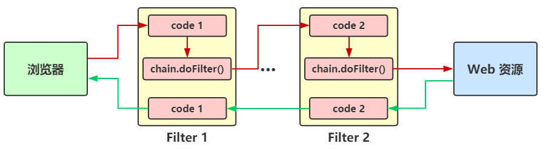

- [Filter](#filter)
    - [概述](#概述)
    - [生命周期](#生命周期)
    - [Filter配置](#filter配置)
        - [web.xml配置](#webxml配置)
        - [@WebFilter注解](#webfilter注解)
    - [异步Filter](#异步filter)
    - [过滤器的实际应用](#过滤器的实际应用)
- [Listener](#listener)
    - [概述](#概述-1)
    - [监听器的分类](#监听器的分类)
    - [配置](#配置)
        - [web.xml配置](#webxml配置-1)
        - [@WebListener注解](#weblistener注解)

# Filter

## 概述

**过滤器：**
- javax.servlet.Filter，是一个interface，属于服务器端组件。
- 过滤器是处于客户端与服务器资源文件之间的一道过滤网，在访问资源文件之前，通过一系列的过滤器对请求进行修改、判断等，把不符合规则的请求在中途拦截或修改。
- 也可以对响应进行过滤，拦截或修改响应。

**过滤链：**
- 多个过滤器共同组成一条过滤链。
- 浏览器发出的请求先递交给第一个filter进行过滤，符合规则则放行，递交给filter链中的下一个过滤器进行过滤。
- 过滤器在链中的顺序与它在web.xml中配置的顺序有关，配置在前的则位于链的前端。
- 当请求通过了链中所有过滤器后就可以访问资源文件了，如果不能通过，则可能在中间某个过滤器中被处理掉。
- 在`doFilter()`方法中，方法前的一般是对request执行的过滤操作，方法后的代码一般是对response执行的操作。


## 生命周期

1. **实例化**
    - Web容器启动时，即会根据web.xml中声明的filter顺序依次实例化这些filter。
    - 容器启动程序时执行，且执行一次。

2. **初始化**
    - Web容器调用`init(FilterConfig)`来初始化过滤器。容器在调用该方法时，向过滤器传递FilterConfig对象，FilterConfig的用法和ServletConfig类似。
    - 利用FilterConfig对象可以得到ServletContext对象，以及在web.xml中配置的过滤器的初始化参数。
    - 在这个方法中，可以抛出ServletException异常，通知容器该过滤器不能正常工作。此时的Web容器启动失败，整个应用程序不能够被访问。
    - 容器启动程序时执行，且执行一次。

3. **过滤**
    - `doFilter()` 方法类似于Servlet接口的`service()`方法。当客户端请求目标资源的时候，容器会筛选出符合filter-mapping中的url-pattern的filter，并按照声明filter-mapping的顺序依次调用这些filter的doFilter方法。
    - 在这个链式调用过程中，可以调用`chain.doFilter(ServletRequest, ServletResponse)`将请求传给下一个过滤器 (或目标资源)，也可以直接向客户端返回响应信息，或者利用RequestDispatcher的forward和include方法，以及HttpServletResponse的sendRedirect方法将请求转向到其它资源。
    - 需要注意的是，这个方法的请求和响应参数的类型是ServletRequest和ServletResponse，也就是说，过滤器的使用并不依赖于具体的协议。
    - 程序第一次运行，会在servlet调用`init()`方法以后调用，不管第几次，都在调用`doGet()`, `doPost()`方法之前。

4. **销毁**
    - Web容器调用`destroy()`方法指示过滤器的生命周期结束。在这个方法中，可以释放过滤器使用的资源。
    - 与开发Servlet不同的是，Filter接口并没有相应的实现类可供继承，要开发过滤器，只能直接实现Filer接口。

## Filter配置

### web.xml配置

```
<filter>
    [<description>message</description>]
    [<display-name>displayName<display-name>]
    <filter-name>filterName</filter-name>
    <filter-class>package.ClassName</filter-class>
    [<init-param>
        <param-name>paramName</param-name>
        <param-value>paramValue</param-value>
    </init-param>]
    [<async-support>true|false<:/async-support>
</filter>
<filter-mapping>
    <filter-name>filterName</filter-name>
    <url-pattern>URL</url-pattern>
    [<servlet-name>servletName</servlet-name>]
    [<dispatcher>REQUEST|INCLUDE|FORWARD|ERROR</dispatcher>]
</filter-mapping>
```
- **filter**
    - **filter-name** 用于为过滤器指定一个名字，该元素的内容不能为空。
    - **filter-class** 用于指定过滤器的完整的限定类名。
    - **init-param** 用于为过滤器指定初始化参数，它的子元素 **param-name** 指定参数的名字，**param-value** 指定参数的值。在过滤器类中，可以使用FilterConfig接口对象来访问初始化参数。
    - **async-support** 是否支持异步处理

- **filter-mapping**
    - **filter-name** servlet-name指定过滤器所拦截的Servlet名称。
    - **url-pattern** 指定访问Servlet的URL
    - **servlet-name** 指定要过滤的Servlet
    - **dispatcher** 指定过滤器所拦截的资源被Servlet容器调用的方式，可以是REQUEST, INCLUDE,FORWARD和ERROR之一，默认REQUEST。用户可以设置多个dispatcher子元素用来指定Filter对资源的多种调用方式进行拦截。
        - REQUEST：当用户直接访问页面时，Web容器将会调用过滤器。如果目标资源是通过`RequestDispatcher.include()/forward()`方法访问时，那么该过滤器就不会被调用。
        - INCLUDE：如果目标资源是通过`RequestDispatcher.include()`方法访问时，那么该过滤器将被调用。除此之外，该过滤器不会被调用。
        - FORWARD：如果目标资源是通过`RequestDispatcher.forward()`方法访问时，那么该过滤器将被调用，除此之外，该过滤器不会被调用。
        - ERROR：如果目标资源是通过声明式异常处理机制调用时，那么该过滤器将被调用。除此之外，过滤器不会被调用。
        - ASYNC：servlet 3.0 / javaEE 6新增，用于异步处理。

### @WebFilter注解

```
@Target({ElementType.TYPE})
@Retention(RetentionPolicy.RUNTIME)
@Documented
public @interface WebFilter {
    String description() default "";

    String displayName() default "";

    WebInitParam[] initParams() default {};

    String filterName() default "";

    String smallIcon() default "";

    String largeIcon() default "";

    String[] servletNames() default {};

    String[] value() default {};

    String[] urlPatterns() default {};

    DispatcherType[] dispatcherTypes() default {DispatcherType.REQUEST};

    boolean asyncSupported() default false;
}
```

## 异步Filter

```
```

## 过滤器的实际应用

- 编码转换
- 对用户请求进行统一认证
- 对用户发送的数据进行过滤转换
- 转换图像格式
- 对响应内容进行压缩

# Listener

## 概述

监听器Listener是Servlet规范定义的一种特殊类，用于监听ServletContext、HttpSession、ServletRequest等域对象的创建与销毁事件、属性变动事件，可以在事件发生前后做一些处理

常见用途：
- 统计在线人数和在线用户
- 系统启动时加载初始化信息
- 统计网站访问量
- 跟Spring结合

组件启动顺序：
- 监听器 -> 过滤器 -> Servlet
- 监听器之间按web.xml注册顺序加载

## 监听器的分类

- 按监听的对象划分
    - 用于监听应用程序环境对象（ServletContext）的事件监听器
    - 用于监听用户会话对象（HttpSession）的事件监听器
    - 用于监听请求消息对象（ServletRequest）的事件监听器
- 按监听的事件划分
    - 监听域对象自身的创建和销毁的事件监听器
        - 这一类监听器主要监听ServletContext、HttpSession和ServletRequest这三个域对象创建和销毁的事件，要实现这一类监听器，需要继承ServletContextListener、HttpSessionListener或者ServletRequestListener接口。
        - 需要在web.xml注册
        - 定时器、全局属性对象
    - 监听域对象中的属性的增加和删除的事件监听器
        - 这一类监听器主要监听ServletContext、HttpSession和ServletRequest这三个域对象中属性的创建、销毁和修改的事件，要实现这三种监听器，就需要继承ServletContextAttributeListener、HttpSessionAttributeListener和ServletRequestAttributeListener这三个接口，并实现接口中的方法。
        - 需要在web.xml注册
        - 统计在线人数、记录访问日志
    - 监听绑定到HttpSession域中的某个对象的状态的事件监听器
        - 这类监听器主要监听的是绑定到HttpSession域中某个对象状态的事件，HttpSession中对象的状态有两种：绑定与解除绑定、钝化与活化。
        - 所谓的绑定与解除绑定，就是指在HttpSession中将某个对象设置为属性值或者移除某个属性的值。
        - 而钝化是指服务器会将不常使用的Session对象暂时序列化到系统文件或数据库中，而活化就是将暂存在系统文件或数据库中的Session对象反序列化到服务器中，当Tomcat服务 器被关闭或者重启时，Tomcat会将Session对象钝化到服务器文件系统中，当服务器被重新加载时，Session对象也会被钝化。
        - 要实现这两种的监听器，就需要继承HttpSessionBindingListener和HttpSessionActivationListener。此外，钝化/活化需要实现serializable接口。
        - 不需要在web.xml注册，**实体（Java Bean）实现接口**后自动被监听

## 配置

### web.xml配置

```
<listener>
    <listener-class>listenerClass</listener-class>
</listener>
```
- **listener-class** 监听器类

### @WebListener注解

该注解用于将类声明为监听器，被 @WebListener标注的类必须实现以下至少一个接口：
- ServletContextListener
- ServletContextAttributeListener
- ServletRequestListener
- ServletRequestAttributeListener
- HttpSessionListener
- HttpSessionAttributeListener

注解只有一个描述属性，无需再web.xml注册，无法指定启动顺序