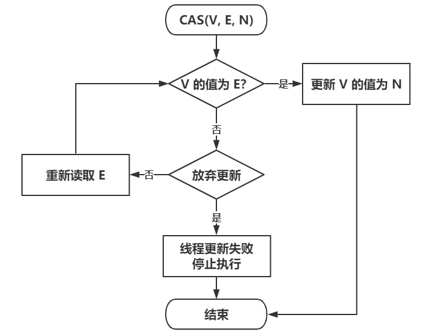

# CAS & `Unsafe` & Atomic类

## 乐观锁和悲观锁

### 乐观锁

Optimistic Lock。每次去拿数据的时候都认为别人不会修改，所以不会上锁，但是在提交更新的时候会判断一下在此期间别人有没有去更新这个数据。乐观锁适用于读多写少的应用场景，这样可以提高吞吐量。

实现方式：

- CAS
- 版本号机制

适用场景：对共享资源读多写少

### 悲观锁

Pessimistic Lock。每次去拿数据的时候都认为别人会修改，所以每次在拿数据的时候都会上锁，这样别人想拿这个数据就会阻塞，直到它拿到锁。

实现方式;

- Java `synchronized`关键字、`ReentrantLock`等独占锁。

适用场景：对共享资源写多读少

## CAS

CAS的全称是Compare and Swap，即比较并交换。比较的是当前内存中存储的值与预期原值，交换的是新值与内存中的值。这个操作是硬件层面的指令，因此能够保证原子性。Java通过JNI（本地方法调用）来使用这个原子操作。
> 执行函数：CAS(V, E, N)

CAS操作包含三个操作数 —— 需要进行更新的变量（V）、预期值（E）和新值（N）。在执行CAS操作时，先进行Compare操作，即比较V的值是否等于E，若相等则说明该值没有被其他线程修改，就执行Swap操作将V的值设为N。若相等则表示V别其他线程修改了，就重新读取E重复执行CAS操作知道成功或主动放弃更新。



由于CAS操作属于乐观派，它总认为自己可以成功完成操作，当多个线程同时使用CAS操作一个变量时，**只有一个会胜出，并成功更新，其余均会失败**，但失败的线程并不会被挂起，仅是被告知失败，并且允许再次尝试，当然也允许失败的线程放弃操作，这点从图中也可以看出来。基于这样的原理，CAS操作即使没有锁，同样知道其他线程对共享资源操作影响，并执行相应的处理措施。同时从这点也可以看出，由于无锁操作中没有锁的存在，因此不可能出现死锁的情况，也就是说无锁操作天生免疫死锁。

### CPU对CAS的支持

CAS是一种系统原语，原语属于操作系统用语范畴，是由若干条指令组成的，用于完成某个功能的一个过程，并且原语的执行必须是连续的，在执行过程中不允许被中断，也就是说CAS是一条CPU的原子指令，不会造成所谓的数据不一致问题。

## `Unsafe`类

`Unsafe`类存在于`sun.misc`包中，其内部方法操作可以像C的指针一样直接操作内存，单从名称看来就可以知道该类是非安全的，毕竟`Unsafe`拥有着类似于C的指针操作，因此总是不应该首先使用`Unsafe`类，Java官方也不建议直接使用的`Unsafe`类。但我们还是很有必要了解该类，因为Java中CAS操作的执行依赖于`Unsafe`类的方法，注意`Unsafe`类中的所有方法都是`native`修饰的，在JVM中使用C++实现。`Unsafe`类中的方法都直接调用操作系统底层资源执行相应任务，关于`Unsafe`类的主要功能点如下：

### 内存管理

直接操作内存的方法。可以做本地缓存。

```java
// 分配内存指定大小的内存
public native long allocateMemory(long bytes);
// 将指定对象的给定offset偏移量内存块中的所有字节设置为固定值
public native void setMemory(Object o, long offset, long bytesbyte value);
// 设置或获取指定内存的byte值
public native byte  getByte(long address);
public native void  putByte(long address, byte x);
```

### 创建实例

```java
// 传入一个对象的class并创建该实例对象，但不会调用构造方法
public native Object allocateInstance(Class cls) throws InstantiationException;
```

### 类和实例对象以及变量的操作

```java
// 获取字段f在实例对象中的偏移量
public native long objectFieldOffset(Field f);
// 静态属性的偏移量，用于在对应的Class对象中读写静态属性
public native long staticFieldOffset(Field f);
// 返回值就是f.getDeclaringClass()
public native Object staticFieldBase(Field f);

// 获得给定对象偏移量上的int值，所谓的偏移量可以简单理解为指针指向该变量的存地址，
// 通过偏移量便可得到该对象的变量，进行各种操作
public native int getInt(Object o, long offset);
// 设置给定对象上偏移量的int值
public native void putInt(Object o, long offset, int x);

// 设置给定对象的int值，使用volatile语义，即设置后立马更新到内存对其他程可见
public native void  putIntVolatile(Object o, long offset, int x);
// 获得给定对象的指定偏移量offset的int值，使用volatile语义，总能获到最新的int值。
public native int getIntVolatile(Object o, long offset);

// 这是一个有序或者有延迟的putIntVolatile方法，并且不保证值的改变被其他线程立 即看到。
// 只有在字段被volatile修饰并且期望被意外修改的时候使用才有用
public native void putOrderedInt(Object o,long offset,int x);
```

### 数组操作

```java
// 获取数组第一个元素的偏移地址
public native int arrayBaseOffset(Class arrayClass);
// 数组中一个元素占据的内存空间,arrayBaseOffset与arrayIndexScale配合用，可定位数组中每个元素在内存中的位置
public native int arrayIndexScale(Class arrayClass);
```

### CAS操作相关

Atomic类、AQS相关类原理

```java
// 第一个参数o为给定对象，offset为对象内存的偏移量，通过这个偏移量迅速定位字段并设置或获取该字段的值，
// expected表示期望值（E），x表示要设置的新值（N），下面3个方法都通过CAS原子指令行操作。
public final native boolean compareAndSwapObject(Object o, long offset, Object expected, Object x);
public final native boolean compareAndSwapInt(Object o, long offset, int expected, int x);
public final native boolean compareAndSwapLong(Object o, long offset, long expected, long x);
```

还有一些JDK8新增的方法

```java
// 给定对象o，根据获取内存偏移量指向的字段，将其增加delta，
// 这是一个CAS操作过程，直到设置成功方能退出循环，返回旧值
public final int getAndAddInt(Object o, long offset, int delta) {
    int e;
    do {
        // 获取原值，作为CAS操作的期待值E
        e = this.getIntVolatile(o, offset);
        // CAS操作
    } while(!this.compareAndSwapInt(o, offset, e, e + delta));

    // 返回原值
    return e;
}

// 获取原值后将其设为新增
public final int getAndSetInt(Object o, long offset, int n) {
    int e;
    do {
        e = this.getIntVolatile(o, offset);
    } while(!this.compareAndSwapInt(o, offset, e, n));

    return e;
}

// Long和Object类似
```

### 挂起与恢复

`LockSupport`类底层方法

```java
// 线程调用该方法，线程将一直阻塞直到超时，或者是中断条件出现。
public native void park(boolean isAbsolute, long time);

// 终止挂起的线程
public native void unpark(Object thread);
```

### 内存屏障

```java
// 在该方法之前的所有读操作，一定在load屏障之前执行完成
public native void loadFence();
// 在该方法之前的所有写操作，一定在store屏障之前执行完成
public native void storeFence();
// 在该方法之前的所有读写操作，一定在full屏障之前执行完成，这个内存屏障相于上面两个的合体功能
public native void fullFence();
```

### 其他

```java
//获取持有锁，已不建议使用
@Deprecated
public native void monitorEnter(Object var1);
//释放锁，已不建议使用
@Deprecated
public native void monitorExit(Object var1);
//尝试获取锁，已不建议使用
@Deprecated
public native boolean tryMonitorEnter(Object var1);
...
```

## JUC中的Atomic类

### 基本类型

- `AtomicBoolean`：布尔型原子类
- `AtomicInteger`：整形原子类
- `AtomicLong`：长整形原子类

这些类内部保存了一个`volatile`修饰的`value`值，`AtomicBoolean`和`AtomicInteger`中`value`为`int`类型（`AtomicBoolean`中`value`为`0`表示`false`），而`AtomicLong`中为`long`。

此外包含一个`Unsafe`类静态常量（`static final`修饰），以及一个表示`value`字段的内存偏移的字段`valueOffset`，该字段也为静态常量，用于内部一系列`Unsafe`方法进行原子操作。

`AtomicInteger`：

```java
private static final Unsafe unsafe = Unsafe.getUnsafe();
    // value字段内存偏移
    private static final long valueOffset;
    static {
        try {
            // 使用Unsafe类初始化内存偏移
            valueOffset = unsafe.objectFieldOffset
                (AtomicInteger.class.getDeclaredField("value"));
        } catch (Exception ex) { throw new Error(ex); }
    }
    // 内部保存的int值
    private volatile int value;
    ...
}
```

### 引用类型

- `AtomicReference`：引用类型原子类
- `AtomicMarkableReference`：额外维护了一个`boolean`型标记的引用类型原子类，CAS同时需要对标记和引用对象进行验证
- `AtomicStampedReference`：额外维护了一个`int`类型标记的引用原子类，CAS同时需要对标记和引用对象进行验证

`AtomicReference`：

```java
public class AtomicReference<V> implements java.io.Serializable {
    private static final Unsafe unsafe = Unsafe.getUnsafe();
    private static final long valueOffset;

    static {
        try {
            valueOffset = unsafe.objectFieldOffset
                (AtomicReference.class.getDeclaredField("value"));
        } catch (Exception ex) { throw new Error(ex); }
    }

    private volatile V value;
    ...
}
```

`AtomicMarkableReference`：

```java
public class AtomicMarkableReference<V> {

    private static class Pair<T> {
        final T reference;
        final boolean mark; // 额外维护的mark
        private Pair(T reference, boolean mark) {
            this.reference = reference;
            this.mark = mark;
        }
        static <T> Pair<T> of(T reference, boolean mark) {
            return new Pair<T>(reference, mark);
        }
    }

    private volatile Pair<V> pair;

    private static class Pair<T> {
        final T reference;
        final boolean mark;
        private Pair(T reference, boolean mark) {
            this.reference = reference;
            this.mark = mark;
        }
        static <T> Pair<T> of(T reference, boolean mark) {
            return new Pair<T>(reference, mark);
        }
    }
}
```

### 数组类型

- `AtomicIntegerArray`：整形数组原子类
- `AtomicLongArray`：长整形数组原子类
- `AtomicReferenceArray`：引用类型数组原子类

```java
public class AtomicIntegerArray implements java.io.Serializable {

    private static final Unsafe unsafe = Unsafe.getUnsafe();
    // 数组中第一个元素的内存偏移
    private static final int base = unsafe.arrayBaseOffset(int[].class);
    // 获取当元素所占字节数二进制下从第一个非0位起到结尾的长度 - 1，
    // 可根据1 << shift可以计算处一个元素所占的字节数
    private static final int shift;
    private final int[] array;

    static {
        // 获取单个元素所占位置，整形为4
        int scale = unsafe.arrayIndexScale(int[].class);
        if ((scale & (scale - 1)) != 0)
            throw new Error("data type scale not a power of two");
        // 31 - 29 = 2
        shift = 31 - Integer.numberOfLeadingZeros(scale);
    }
    ...

    // 更新第i位元素
    public final boolean compareAndSet(int i, int expect, int update) {
        return compareAndSetRaw(checkedByteOffset(i), expect, update);
    }

    private boolean compareAndSetRaw(long offset, int expect, int update) {
        // 调用Unsafe方法更新数组中指定偏移的值
        return unsafe.compareAndSwapInt(array, offset, expect, update);
    }

    // 检查index是否越界，如果没有越界则返回偏移
    private long checkedByteOffset(int i) {
        if (i < 0 || i >= array.length)
            throw new IndexOutOfBoundsException("index " + i);

        return byteOffset(i);
    }

    // 获取偏移i << shift就是i * 单个元素所占字节数
    private static long byteOffset(int i) {
        return ((long) i << shift) + base;
    }
}
```

### 字段更新类型

- `AtomicIntegerFieldUpdater`：用于原子更新一个类的整形字段的类
- `AtomicLongFieldUpdater`：用于原子更新一个类的长整形字段的类
- `AtomicReferenceFieldUpdater`：用于原子更新一个类引用类型字段的类

`AtomicIntegerFieldUpdater`：

```java
public abstract class AtomicIntegerFieldUpdater<T> {
    // 构造方法非public，使用此静态方法。
    // 指定需要更新的类的类对象，以及需要更新的字段名
    public static <U> AtomicIntegerFieldUpdater<U> newUpdater(Class<U> tclass,
                                                              String fieldName) {
        return new AtomicIntegerFieldUpdaterImpl<U>
            (tclass, fieldName, Reflection.getCallerClass());
    }
    ...

    // HotSpot虚拟机标准实现类
    private static final class AtomicIntegerFieldUpdaterImpl<T>
        extends AtomicIntegerFieldUpdater<T> {
        private static final sun.misc.Unsafe U = sun.misc.Unsafe.getUnsafe();
        private final long offset;
        /** 如果该字段是protected，则令cclass为其子类，否则为该类本身 */
        private final Class<?> cclass;
        /** 声明字段的类 */
        private final Class<T> tclass;
        ...
    }
}
```
