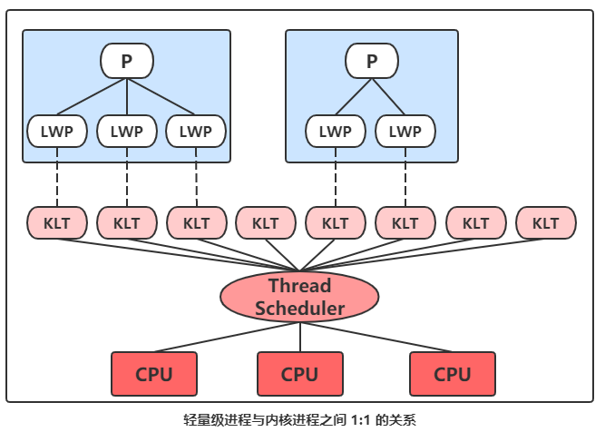
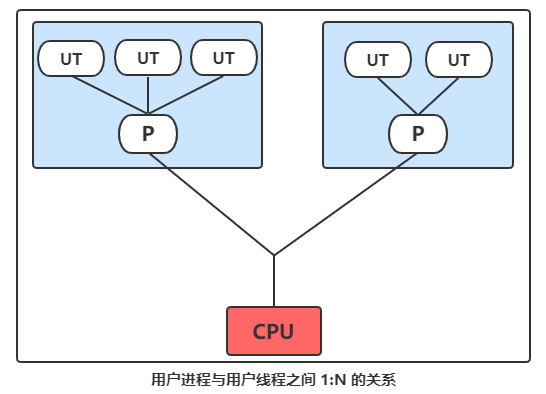
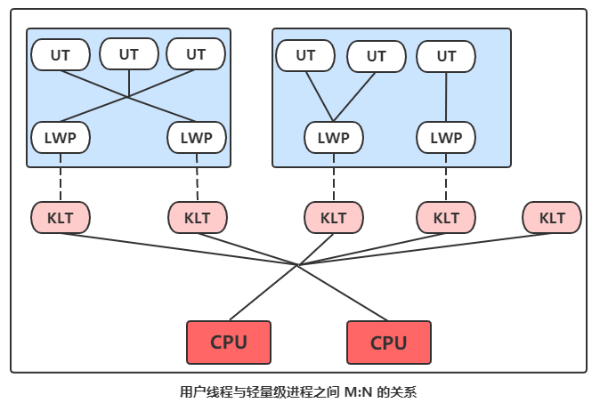
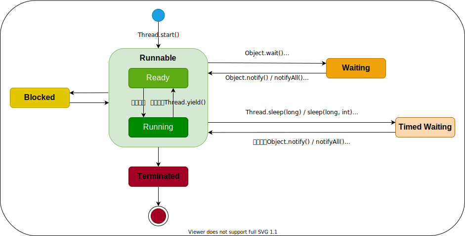

# Java & Thread

并发不一定要依赖多线程（如PHP中很常见的多进程并发），但是在Java里面谈论并发，大多数都与线程脱不开关系。

## 进程和线程

**进程是资源（CPU、内存等）分配的基本单位**，它**是程序执行时的一个实例**。程序运行时系统就会创建一个进程，并为它分配资源，然后把该进程放入进程就绪队列，进程调度器选中它的时候就会为它分配CPU时间，程序开始真正运行。

**线程是程序执行时的最小单位**，它**是进程的一个执行流**，是CPU调度和分派的基本单位，一个进程可以由很多个线程组成，线程间共享进程的所有资源，每个线程有自己的堆栈和局部变量。线程由CPU独立调度执行，在多CPU环境下就允许多个线程同时运行。同样多线程也可以实现并发操作，每个请求分配一个线程来处理。

对比：

- 进程是资源分配的最小单位，线程是程序执行的最小单位。
- 进程有自己的独立地址空间，每启动一个进程，系统就会为它分配地址空间，建立数据表来维护代码段、堆栈段和数据段，这种操作非常昂贵。而线程是共享进程中的数据的，使用相同的地址空间，因此CPU切换一个线程的花费远比进程要小很多，同时创建一个线程的开销也比进程要小很多。
- 线程之间的通信更方便，同一进程下的线程共享全局变量、静态变量等数据，而进程之间的通信需要以通信的方式（IPC）进行。不过如何处理好同步与互斥是编写多线程程序的难点。
- 但是多进程程序更健壮，多线程程序只要有一个线程死掉，整个进程也死掉了，而一个进程死掉并不会对另外一个进程造成影响，因为进程有自己独立的地址空间。

[一道面试题：说说进程和线程的区别](https://foofish.net/thread-and-process.html)

[线程和进程的区别是什么？](https://www.zhihu.com/question/25532384)

[进程与线程的一个简单解释](http://www.ruanyifeng.com/blog/2013/04/processes_and_threads.html)

## 线程的实现

我们知道，线程是比进程更轻量级的调度执行单位，线程的引入，可以把一个进程的资源分配和执行调度分开，各个线程既可以共享进程资源（内存地址、文件IO等），又可以独立调度（线程是CPU调度的最基本单位）。

主流的操作系统都提供了线程实现，Java语言则提供了在不同硬件和操作系统平台下对线程操作的统一处理，每个`java.lang.Thread`类的实例就代表了一个线程。不过`Thread`类与大部分的Java API有着显著的差别，它的所有关键方法都被声明为`native`。在Java API中一个`native`方法可能就意味着这个方法没有使用或无法使用平台无关的手段来实现（当然也可能是为了执行效率而使用`native`方法，不过通常最高效率的手段也就是平台相关的手段）。正因为这个原因，本节标题为“线程的实现”而不是“Java线程的实现”。

实现线程主要有三种方式：

1. 使用内核线程实现
2. 使用用户线程实现
3. 使用用户线程加轻量级进程混合实现

### 使用内核线程实现

内核线程（Kernel Thread，KLT）就是直接由操作系统内核（Kernel，下称内核）支持的线程，这种线程由内核来完成线程切换，内核通过操纵调度器（Scheduler）对线程进行调度，并负责将线程的任务映射到各个处理器上。每个内核线程都可以看做是内核的一个分身，这样操作系统就有能力同时处理多件事情，支持多线程的内核就叫多线程内核（Multi-Threads Kernel）。

程序一般不会直接去使用内核线程，而是去使用内核线程的一种高级接口——轻量级进程（Light Weight Process，LWP），**轻量级进程就是我们通常意义上所讲的线程**，由于每个轻量级进程都由一个内核线程支持，因此只有先支持内核线程，才能有轻量级进程。这种轻量级进程与内核线程之间1：1的关系称为一对一的线程模型。



优势：由于内核线程的支持，每个轻量级进程都成为一个独立的调度单元，即使有一个轻量级进程在系统调用中阻塞了，也不会影响整个进程继续工作。

劣势：首先，由于是基于内核线程实现的，所以各种进程操作，如创建、析构及同步，都需要进行系统调用。而系统调用的代价相对较高，需要在用户态（User Mode）和内核态（Kernel Mode）中来回切换。其次，每个轻量级进程都需要有一个内核线程的支持，因此轻量级进程要消耗一定的内核资源（如内核线程的栈空间），因此一个系统支持轻量级进程的数量是有限的。

### 使用用户线程实现

广义上来讲，一个线程只要不是内核线程，那就可以认为是用户线程（User Thread，UT），因此从这个定义上来讲轻量级进程也属于用户线程，但轻量级进程的实现始终是建立在内核之上的，许多操作都要进行系统调用，因此效率会受到限制。

而狭义上的用户线程指的是完全建立在用户空间的线程库上，系统内核不能感知到线程存在的实现。用户线程的建立、同步、销毁和调度完全在用户态中完成，不需要内核的帮助。如果程序实现得当，这种线程不需要切换到内核态，因此操作可以是非常快速且低消耗的，也可以支持规模更大的线程数量，部分高性能数据库中的多线程就是由用户线程实现的。这种进程与用户线程之间1：N的关系称为一对多的线程模型。



优势：使用用户线程的优势在于不需要系统内核支援。

劣势：也在于没有系统内核的支援，所有的线程操作都需要用户程序自己处理。使用用户线程时，线程的创建、切换和调度都是需要考虑问题，而且由于操作系统只把处理器资源分配到进程，那诸如“阻塞如何处理”、“多处理器系统中如何将线程映射到其他处理器上”这类问题解决起来将会异常困难，甚至不可能完成。因而使用用户线程实现的程序一般都比较复杂，除了以前在不支持多线程的操作系统中（如DOS）的多线程程序与少数有特殊需求的程序外，现在使用用户线程的程序越来越少了，Java、Ruby等语言都曾经使用过用户线程，最终又都放弃了使用它。

### 混合实现

线程除了依赖内核线程实现和完全由用户程序自己实现之外，还有一种将内核线程与用户线程一起使用的实现方式。在这种混合实现下，既存在用户线程，也存在轻量级进程。

用户线程还是完全建立在用户空间中，因此用户线程的创建、切换、析构等操作依然廉价，并且可以支持大规模的用户线程并发。而操作系统提供支持的轻量级进程则作为用户线程和内核线程之间的桥梁，这样可以使用内核提供的线程调度功能及处理器映射，并且用户线程的系统调用要通过轻量级线程来完成，大大降低了进程被阻塞的风险。在这种混合模式中，用户线程与轻量级进程的数量比是不定的，是M:N的关系，如图下图所示，这种就是多对多的线程模型。



许多Unix系列的操作系统，如Solaris、HP-UX等都提供了M:N的线程模型实现。

### Java线程的实现

Java线程在JDK1.2之前，是基于名为“绿色线程”（Green Threads）的用户线程实现的，而在JDK1.2中，线程模型被替换为基于操作系统原生线程模型来实现。因此在目前的JDK版本中，操作系统支持怎样的线程模型，在很大程度上就决定了Java虚拟机的线程是怎样映射的，这点在不同的平台上没有办法达成一致，虚拟机规范中也并未限定Java线程需要使用哪种线程模型来实现。线程模型只对线程的并发规模和操作成本产生影响，对Java程序的编码和运行过程来说，这些差异都是透明的。

对于Sun JDK来说，它的Windows版与Linux版都是使用一对一的线程模型来实现的，一条Java线程就映射到一条轻量级进程之中，因为Windows和Linux系统提供的线程模型就是一对一的。
而在Solaris平台中，由于操作系统的线程特性可以同时支持一对一（通过Bound Threads或Alternate Libthread实现）及多对多（通过LWP/Thread Based Synchronization实现）的线程模型，因此在Solaris版的JDK中也对应提供了两个平台专有的虚拟机参数：`-XX:+UseLWPSynchronization`（默认值）和`-XX:+UseBoundThreads`来明确指定虚拟机使用的是哪种线程模型。

## 线程调度

线程调度是指系统为线程分配处理器使用权的过程，主要调度方式有两种：

- 协同式（Cooperative Threads-Scheduling）线程调度
- 抢占式（Preemptive Threads-Scheduling）线程调度。

### 协同式调度

如果使用协同式调度的多线程系统，线程的执行时间由线程本身来控制，线程把自己的工作执行完了之后，要主动通知系统切换到另外一个线程上去。

协同式多线程的最大好处是实现简单，而且由于线程要把自己的事情干完后才会进行线程切换，切换操作对线程自己是可知的，所以没有什么线程同步的问题。

它的坏处也很明显：线程执行时间不可控制，甚至如果一个线程编写有问题，一直不告知系统进行线程切换，那么程序就会一直阻塞在那里。

### 抢占式调度

如果使用抢占式调度的多线程系统，那么每个线程将由系统来分配执行时间，线程的切换不由线程本身来决定（在Java中，`Thread.yield()`可以让出执行时间，但是要获取执行时间的话，线程本身是没有什么办法的）。

在这种实现线程调度的方式下，线程的执行时间是系统可控的，也不会有一个线程导致整个进程阻塞的问题。

### Java线程调度及优先级控制

**Java线程调度使用的线程调度方式就是抢占式调度**。

虽然说Java线程调度是系统自动完成的，但是我们还是可以“建议”系统给某些线程多分配一点执行时间，另外的一些线程则可以少分配一点——这项操作可以通过设置线程优先级来完成。

Java语言一共设置了10个级别的线程优先级（`Thread.MIN_PRIORITY` - `Thread.MAX_PRIORITY`），在两个线程同时处于Ready状态时，优先级越高的线程越容易被系统选择执行。

不过，线程优先级并不是太靠谱。首先，Java的线程是被映射到系统的原生线程上来实现的，所以线程调度最终还是由操作系统说了算，虽然现在很多操作系统都提供线程优先级的概念，但是并不见得能与Java线程的优先级一一对应。其次，优先级可能会被系统自动地改变。如Windows中的“优先级推进器”，（Priority Boosting，当然它可以被关闭掉），它的大致作用就是当系统发现一个线程被执行得特别“勤奋努力”的话，可能会越过线程优先级去为它分配执行时间。

因此我们不能在程序中通过优先级来完全准确地判断一组状态都为Ready的线程将会先执行哪一个。

## Java线程的状态/生命周期

Java语言定义了6种线程状态，在任意一个时间点中，一个线程只能有且只有其中的一种状态。

1. **New**：新建。线程被创建，但是未调用`start()`方法启动。
2. **Runnable**：运行。Runable包括了操作系统线程状态中的Running和Ready。也就是处于此状态的线程有可能正在执行，也有可能正在等待着CPU为它分配执行时间。

   | Ready->Running |      Running->Ready      |
   | :------------: | :----------------------: |
   |    系统调度    | 系统调度、Thread.yield() |
3. **Blocked**：阻塞。线程被阻塞了，等待一个排他锁。
4. **Waiting**：无限期等待。处于这种状态的线程不会被分配CPU执行时间，它需要被其他线程显示地唤醒。

   |          Runnable->Waiting          |          Waiting->Runnable          |
   | :---------------------------------: | :---------------------------------: |
   |   没有设置Timeout的Object.wait()    | Object.notify() /Object.notifyAll() |
   |   没有设置Timeout的Thread.join()    |        被调用的线程执行完毕         |
   | 没有设置Timeout的LockSupport.park() |     LockSupport.unpark(Thread)      |
5. **Timed Wating**：限期等待。处于这种状态的进程也不会被分配CPU执行时间，不过无须等待被其他线程显式地唤醒，在一定时间之后它们会由系统自动唤醒。

   |   Runnable->Timed Waiting    |            Timed Waiting->Runnable            |
   | :--------------------------: | :-------------------------------------------: |
   |        Thread.sleep()        |                   超时结束                    |
   | 设置了Timeout的object.wait() | 超时结束 /Object.notify() /Object.notifyAll() |
   | 设置了Timeout的Thread.join() |        超时结束 / 被调用的线程执行完毕        |
   |   LockSupport.parkUntil()    |       LockSupport.unpark(Thread thread)       |
   |   LockSupport.parkNanos()    |       LockSupport.unpark(Thread thread)       |
6. **Terminated**：终止。线程已经执行结束。



## 使用Java线程

有三种使用线程的方法：

- 实现`Runnable`接口
- 实现`Callable`接口
- 继承`Thread`类

实现`Runnable`和`Callable`接口的类只能当做一个可以在线程中运行的任务，不是真正意义上的线程，因此最后还需要通过`Thread`来调用。可以说任务是通过线程驱动从而执行的。

### `Runnable`

`Runnable`自JDK 1.0就存在了。`Runnable`接口应该由那些打算通过某一线程执行其对象的类来实现，其设计目的就是为想要在存活时（即该对象的线程已经启动但未停止）被执行的对象提供一个公共协议，如`java.lang.Thread`。

```java
@FunctionalInterface
public interface Runnable{
 public abstract void run();
}
```

### `Callable`

`Callable`自JDK 1.5增加，与`Runnable`提供类似功能。不同的是，`Callable`要求执行任务之后有一个返回值。

```java
@FunctionalInterface
public interface Callable<V> {
 V call()throws Exception;
}
```

### `Thread`

`Thread`自JDK 1.0就存在了。`Thread`表示程序执行的线程。JVM运行一个程序并发执行多个线程。每个线程都有一个优先级，具有较高优先级的线程优先于优先级较低的线程执行。每个线程可能也可能不会被标记为守护程序。当在某个线程中运行的代码创建一个新的`Thread`对象时，新线程的优先级初始设置为创建该线程的线程的优先级，并且当且仅当创建新线程的线程是守护进程时新线程才是守护线程。

```java
public class Thread implements Runnable{
    private volatile String name;
    private int priority;                             // 线程的优先级
    private boolean daemon=false;                     // 是否为守护线程
    private Runnable target;                          // 线程需要执行代码
    private ThreadGroup group;                        // 线程所属的组
    private static int threadInitNumber;              // 用于Thread的匿名子类命名
    ThreadLocal.ThreadLocalMap threadLocals=null;     // 此线程相关的ThreadLocal对象
    ThreadLocal.ThreadLocalMap inheritableThreadLocals=null; // 此线程相关的ThreadLocal对象
    private long stackSize; // 线程请求的栈大小，未指定时为0，表示由JVM分配。优点JVM会忽略此属性。
    private long tid;                                 // 线程ID
    private static long threadSeqNumber;              // 用于生成线程ID
    private volatile int threadStatus=0;              // 表示线程的状态，初始时表示“未启动的”
    public final static int MIN_PRIORITY=1;           // 最小的线程优先级
    public final static int NORM_PRIORITY=5;          // 一般的线程优先级
    public final static int MAX_PRIORITY=10;          // 最大的线程优先级
}
```

#### 构造方法

`Thread`的构造方法内部读书调用其内部`init()`方法，所有只需要参见该方法。**需要注意的是，`public`构造方法将默认是继承调用构造方法线程的`InheritableThreadLocal`。**

```java
// public方法均调用这个init方法，acc默认为null，inheritThreadLocals为true
private void init(ThreadGroup g, Runnable target, String name, long stackSize) {
    init(g,target,name,stackSize,null,true);
}

private void init(ThreadGroup g,              // 线程组
                  Runnable target,            // 线程调用run()方法的实现，线程运行内容
                  String name,                // 线程的名称
                  long stackSize,             // 线程申请的栈大小
                  AccessControlContext acc,   // 访问控制上下文
                  boolean inheritThreadLocals // 如果为true，从构造当前线程的线程继承可继承的ThreadLocal作为初始值
                  ) {
    // 线程名称不可为null
    if (name == null) {
        throw new NullPointerException("name cannot be null");
    }
    this.name = name;
    // 获取构建当前线程的线程，标为新建线程的父线程。
    Thread parent = currentThread();
    SecurityManager security = System.getSecurityManager();
    if (g == null) {
        // 如果有安全管理器，询问安全管理器获取线程组
        if (security != null) {
            g = security.getThreadGroup();
        }
        // 如果没有安全管理器或其没有指定线程组，则令线程组同父线程
        if (g == null) {
            g = parent.getThreadGroup();
        }
    }
    // 检查线程组的访问权限，不管线程组是否是显示传递
    g.checkAccess();

    /* Do we have the required permissions? */
    if (security != null) {
        if (isCCLOverridden(getClass())) {
            security.checkPermission(SUBCLASS_IMPLEMENTATION_PERMISSION);
        }
    }

    // 增大线程组的“为启动”线程的个数
    g.addUnstarted();
    // 设置新建线程的线程组
    this.group = g;
    // 当前线程初始时是否为守护线程决定于父线程
    this.daemon = parent.isDaemon();
    // 当前线程初始时的优先级等于父线程的优先级
    this.priority = parent.getPriority();
    // 设置contextClassLoader
    if (security == null || isCCLOverridden(parent.getClass())) {
        this.contextClassLoader = parent.getContextClassLoader();
    } else {
        this.contextClassLoader = parent.contextClassLoader;
    }
    // 设置inheritedAccessControlContext
    this.inheritedAccessControlContext = acc != null ? acc : AccessController.getContext();
    // 设置需要调用的run() 的Runnable对象
    this.target = target;
    // 修正优先级已经调用本地方法设置线程在系统调度中的优先级
    setPriority(priority);
    // 如果允许，继承父线程的可继承ThreadLocal值
    if (inheritThreadLocals && parent.inheritableThreadLocals != null)
        this.inheritableThreadLocals = ThreadLocal.createInheritedMap(parent.inheritableThreadLocals);
    // 保存指定的申请的栈大小，以防JVM使用该值
    this.stackSize = stackSize;

    // 设置线程ID
    tid = nextThreadID();
}
```

#### 静态方法

```java
/** 获取当前运行的线程 */
public static native Thread currentThread();

/**
 * 让步，告知线程调度器当前线程愿意放弃处理器的当前使用，但调度器可以忽略这个信息
 * 注意：这里放弃的CPU资源，和是否放弃相关的锁没有任何关系
 */
public static native void yield();

/**
 * 使当前线程停止执行指定时间，这个时间取决于系统计时器和调度器的精确和准确性
 * 注意：这里只是暂时停止运行，线程不会放弃相关对象的锁
 */
public static native void sleep(long millis)throws InterruptedException;

/**
 * 试图对休眠时间进行纳秒级控制
 * 但实际上未实现，只是根据指定的纳秒是否达到500000（半秒）决定休眠的mills时间是否+1
 */
public static void sleep(long millis,int nanos)throws InterruptedException{
    if (millis < 0) {
        throw new IllegalArgumentException("timeout value is negative");
    }
    if (nanos < 0 || nanos > 999999) {
        throw new IllegalArgumentException("nanosecond timeout value out of range");
    }
    if (nanos >= 500000 || (nanos != 0 && millis == 0)) {
        millis++;
    }
    sleep(millis);
}

/**
 * 测试当前方法是否中断
 * 由于线程在执行interrupt()中断时未处于活动状态而被忽略的线程中断将通过此方法返回false的方法反映出来
 * 此方法会清除中断状态，即一个线程连续调用此方法多次，除了第一次调用返回值为真正的中断状态，后面均返回false
 */
public static boolean interrupted() {
    // 本地方法
 return currentThread().isInterrupted(true);
}
```

#### 实例方法

```java
/** 启动当前线程，使线程可执行
 * JVM将调用此对象的run()方法
 * 一个线程不能调用此方法超过一次，除非是该线程已经执行完成且需要再次执行，即已经启动且未终止的线程不能调用此方法
 */
public synchronized void start() {
    // 0代表“NEW”
    if (threadStatus != 0)
        throw new IllegalThreadStateException();

    // 通知线程组当前线程需要被启动，所以讲当前线程加到组的线程数组中，并将组的为启动线程数-1
    group.add(this);

    boolean started = false;
    try {
        // 调用本地方法启动线程
        start0();
        started = true;
    } finally {
        try{
            // 如果启动时出现异常导致启动失败，将该线程从组的线程数组中移除，并且再次将未启动线程数 +1
            if (!started) {
                group.threadStartFailed(this);
            }
        } catch (Throwable ignore) {
            /*do nothing.If start0 threw a Throwable then it will be passed up the call stack*/
        }
    }
}

/**
 * 如果使用一个独立的Runnable对象构建当前线程，则调用该Runnable对象的run()，否则该方法什么都不做
 * Thread类的子类应该覆盖这个方法
 */
@Override
public void run() {
    if (target != null) {
        target.run();
    }
}

/**
 * 中断线程
 * - 除非当前运行的线程中断自身（总是被允许的），否则会调用checkAccess()方法，该方法可能会抛出一个SecurityException。
 * - 如过线程因为Object.wait()、Thread.sleep()、Thread.join()的调用而被阻塞，调用此方法会导致线程的中断状态被清除，并且抛出InterruptedException。
 * - 如果线程被java.nio.channels.InterruptibleChannel上IO操作锁阻塞，调用此方法会导致相应的通道关闭，线程的中断状态被设置，并且抛出一个java.nio.channels.ClosedByInterruptException。
 * - 如果线程被java.nio.channels.Selector阻塞，调用此方法会导致该Selector的选择 操作立马返回，线程的中断状态被设置。选择操作肯返回一个空值，类似调用Selector.wakeup()。
 * 如果上述情况均为发生，则线程的中断状态被设置
 *
 * 注意：当线程调用此方法时，它只是修改线程的中断状态，并不会真正地中断线程！！！
 *
 * 一个线程在未正常结束之前, 被强制中断或终止是很危险的事情
 * 因为它可能带来完全预料不到的严重后果比如会带着自己所持有的锁而永远的休眠，迟迟不归还锁等
 * 所以Thread.suspend()、Thread.stop()等方法都被注释为Deprecated
 */
public void interrupt() {
    if (this != Thread.currentThread())
        checkAccess();
    synchronized (blockerLock) {
        Interruptible b = blocker;
        if (b != null) {
            interrupt0();           //Just to set the interrupt flag
            b.interrupt(this);
            return;
        }
    }
    interrupt0();
}

/**
 * 功能同Thread.interrupted()，但isInterrupted不会对线程造成任何影响（不清除中断状态），线程每次调用此方法都将返回线程调用时的中断状态
 * 由于线程在执行interrupt()中断时未处于活动状态而被忽略的线程中断将通过此方法返回false的方法反映出来。
 */
public boolean isInterrupted() {
    return isInterrupted(false);
}

/**
 * 调用此方法的线程最多等待此线程指定毫秒就继续执行后续代码，超时为0意味着永远等待
 * 在线程A上，线程B调用了join()，则线程A会等待线程B执行完成或者是等待的时间超过了指定的时间才能继续执行
 */
public final synchronized void join(long millis) throws InterruptedException{
    long base = System.currentTimeMillis();
    long now = 0;

    if (millis < 0) {
        throw new IllegalArgumentException("timeout value is negative");
    }

    // 如果指定时间为0
    if (millis == 0) {
        // 被调用线程是否存活
        while(isAlive()) {
            // 注意，wait(0)方法是在调用线程执行的，所以被阻塞的是调用线程，被调用线程继续执行
            wait(0);
        }
    } else {
        while(isAlive()) {
            long delay = millis - now;
            // 等待超时
            if (delay <= 0) {
                break;
            }
            // 继续等待
            wait(delay);
            now = System.currentTimeMillis() - base;
        }
    }
}

/**
 * 将此线程标记为守护线程或者或用户线程
 * 当运行的线程都是守护进程线程时，JVM会立马推出结束程序，而不会等待线程执行完成
 */
public final void setDaemon(boolean on) {
    checkAccess();
    if (isAlive()) {
        throw new IllegalThreadStateException();
    }
    daemon=on;
}
```

### 实现接口or继承`Thread`

实现接口会更好一些，因为：

- Java不支持多重继承，因此继承了`Thread`类就无法继承其它类，但是可以实现多个接口；
- 类可能只要求可执行就行，继承整个`Thread`类开销过大。

## 使用多线程的原因

先从总体上来说：

- **从计算机底层来说：** 线程可以比作是轻量级的进程，是程序执行的最小单位,线程间的切换和调度的成本远远小于进程。另外，多核CPU时代意味着多个线程可以同时运行，这减少了线程上下文切换的开销。
- **从当代互联网发展趋势来说：** 现在的系统动不动就要求百万级甚至千万级的并发量，而多线程并发编程正是开发高并发系统的基础，利用好多线程机制可以大大提高系统整体的并发能力以及性能。

再深入到计算机底层来探讨：

- **单核时代：** 在单核时代多线程主要是为了提高CPU和IO设备的综合利用率。举个例子：当只有一个线程的时候会导致CPU计算时，IO设备空闲；进行IO操作时，CPU空闲。我们可以简单地说这两者的利用率目前都是50%左右。但是当有两个线程的时候就不一样了，当一个线程执行CPU计算时，另外一个线程可以进行IO操作，这样两个的利用率就可以在理想情况下达到100%了。
- **多核时代**: 多核时代多线程主要是为了提高CPU利用率。举个例子：假如我们要计算一个复杂的任务，我们只用一个线程的话，CPU只会一个CPU核心被利用到，而创建多个线程就可以让多个CPU核心被利用到，这样就提高了CPU的利用率。

## 线程同步

### 互斥同步（Mutual Exclusion&Synchronization）

同步是指在多个线程并发访问共享数据时，保证共享数据在同一个时刻只被一条（或者是一些，使用信号量的时候）线程使用。

互斥是实现同步的一种手段，临界区（Critical Section）、互斥量（Mutex）和信号量（Semaphore）都是主要的互斥实现方式。

在这四个字里面，互斥是因，同步是果，互斥是方法，同步是目的。

- `synchronized`关键字是Java中最基本的互斥同步手段。
- JUC的`ReentrantLock`。

### 线程通信与协作

- 等待/通知
    - `java.lang.Object`的`wait/notify/notifyAll`方法
    - `java.lang.Thread`类`join`方法
    - `java.util.concurrent.locks.Condition`的`await/signal/signalAll`方法
    - `java.util.concurrent.locks.LockSupport`的`park/parkNanos/parkUntil/unpark`方法

- 共享内存
    - `volatile`
    - `final`

- 管道通信
    - `PipedInputStream/PipedOutputStream`
    - `PipedReader/PipedWriter`

- JUC工具
    - `CountDownLatch`
    - `CycleBarrier`
    - `Semaphore`
    - `Exchanger`

### 使用多线程可能带来的问题

并发编程的目的就是为了能提高程序的执行效率提高程序运行速度，但是并发编程并不总是能提高程序运行速度的，而且并发编程可能会遇到很多问题。比如：

- 内存泄漏
- 上下文切换
- 死锁
- 线程污染
- 还有受限于硬件和软件的资源闲置问题

#### 上下文切换

多线程编程中一般线程的个数都大于CPU核心的个数，而一个CPU核心在任意时刻只能被一个线程使用，为了让这些线程都能得到有效执行，CPU采取的策略是为每个线程分配时间片并轮转的形式。当一个线程的时间片用完的时候就会重新处于就绪状态让给其他线程使用，这个过程就属于一次上下文切换。

概括来说就是：**当前任务在执行完CPU时间片切换到另一个任务之前会先保存自己的状态，以便下次再切换会这个任务时，可以再加载这个任务的状态。任务从保存到再加载的过程就是一次上下文切换**。

上下文切换通常是计算密集型的。也就是说，它需要相当可观的处理器时间，在每秒几十上百次的切换中，每次切换都需要纳秒量级的时间。所以，上下文切换对系统来说意味着消耗大量的CPU时间，事实上，可能是操作系统中时间消耗最大的操作。

Linux相比与其他操作系统（包括其他类Unix系统）有很多的优点，其中有一项就是，其上下文切换和模式切换的时间消耗非常少。

#### Java线程阻塞的代价

Java的线程是映射到操作系统原生线程之上的，如果要阻塞或唤醒一个线程就需要操作系统介入，需要**在户态与核心态之间切换**，这种切换会消耗大量的系统资源，因为用户态与内核态都有各自专用的内存空间，专用的寄存器等，用户态切换至内核态需要传递给许多变量、参数给内核，内核也需要保护好用户态在切换时的一些寄存器值、变量等，以便内核态调用结束后切换回用户态继续工作。

如果线程状态切换是一个高频操作时，这将会消耗很多CPU处理时间；如果对于那些需要同步的简单的代码块，获取锁挂起操作消耗的时间比用户代码执行的时间还要长，这种同步策略显然非常糟糕的。

#### 死锁

多个线程同时被阻塞，它们中的一个或者全部都在等待某个资源被释放。由于线程被无限期地阻塞，因此程序不可能正常终止。

死锁产生的条件：

- 互斥条件：该资源任意一个时刻只由一个线程占用。
- 请求与保持条件：一个进程因请求资源而阻塞时，对已获得的资源保持不放。
- 不剥夺条件:线程已获得的资源在末使用完之前不能被其他线程强行剥夺，只有自己使用完毕后才释放资源。
- 循环等待条件:若干进程之间形成一种头尾相接的循环等待资源关系。

避免死锁：我们只要破坏产生死锁的四个条件中的其中一个就可以了。

- 破坏互斥条件。这个条件我们没有办法破坏，因为我们用锁本来就是想让他们互斥的（临界资源需要互斥访问）。
- 破坏请求与保持条件。一次性申请所有的资源。
- 破坏不剥夺条件。占用部分资源的线程进一步申请其他资源时，如果申请不到，可以主动释放它占有的资源。
- 破坏循环等待条件。靠按序申请资源来预防。按某一顺序申请资源，释放资源则反序释放。破坏循环等待条件。
