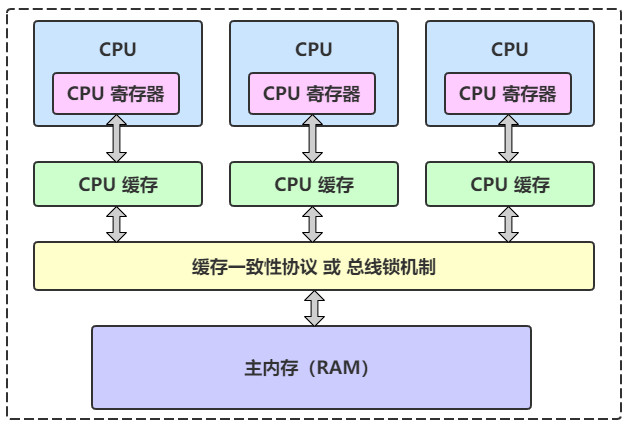
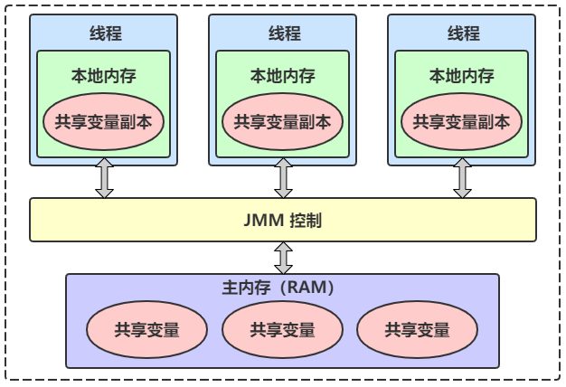
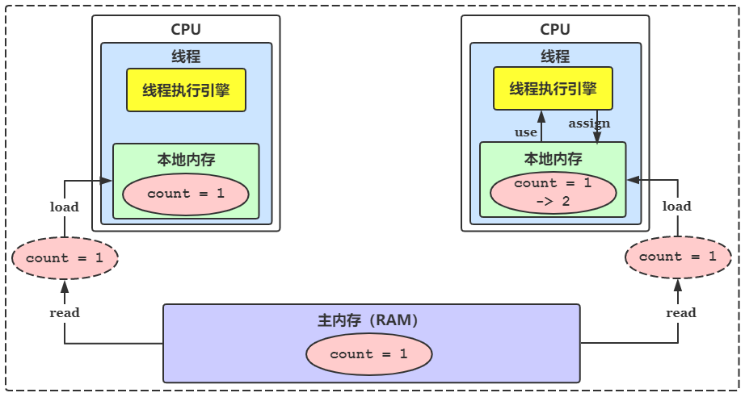
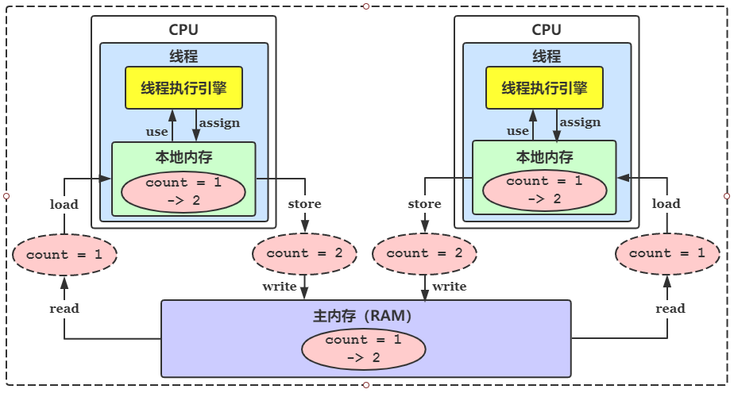

# MESI & JMM

## CPU多级缓存与缓存一致性

CPU缓存（cache）是位于CPU与内存之间的临时存储器，它的容量比内存小的多，但是交换速度却比内存(Memory，RAM）要快得多。

### CPU缓冲的作用及意义

作用：CPU的频率太快了，快到主存跟不上，这样在处理器时钟周期内，CPU常常需要等待主存，浪费资源。缓存的出现，是为了缓解CPU和主存之间速度的不匹配问题。

结构：CPU $\rightarrow$ cache $\rightarrow$ memory

意义：

- 时间局部性：如果某个数据被访问，那么在不久的将来它很可能被再次访问；
- 空间局部性：如果某个数据被访问，那么与它相邻的数据很快也可能被访问；

### CPU缓存模型



### 总线锁机制

操作系统提供了总线锁定的机制。前端总线(也叫CPU总线)是所有CPU与芯片组连接的主干道，负责CPU与外界所有部件的通信，包括高速缓存、内存等，其控制总线向各个部件发送控制信号、通过地址总线发送地址信号指定其要访问的部件、通过数据总线双向传输。

在一个CPU要执行一个操作操作时，它在总线上发出一个LOCK#信号请求总线锁。在获取锁成功后，其他CPU就不能再获取锁，不能操作缓存了该共享变量内存地址的缓存，也就是阻塞了其他CPU，使该处理器可以独享此共享内存。

但是总线锁机制使得同一时间只能是单个CPU能和内存通信，而其他CPU即使是访问非共享内存也无法成功，这是CPU资源无法得到充分的利用。

### 缓存一致性

缓存一致性机制就整体来说，是当某块CPU对缓存中的数据进行操作了之后，就通知其他CPU放弃储存在它们内部的缓存，或者从主内存中重新读取。

核心思想：当CPU写数据时，如果发现操作的变量是共享变量，即在其他CPU中也存在该变量的副本，会发出信号通知其他CPU将该变量的缓存行置为无效状态，因此当其他CPU需要读取这个变量时，发现自己缓存中的缓存该变量的缓存行是无效的，那么它就会重新从内存中读取。

#### MESI协议

MESI协议是以缓存行（缓存的基本数据单位，在Intel的CPU上一般是64字节）的几个状态来命名的（全名是Modified、Exclusive、Share or Invalid)。该协议要求在每个缓存行（Cache line）上维护两个状态位，使得每个数据单位可能处于M、E、S和I这四种状态之一，各种状态含义如下：

- M（Modified）：被修改，该缓存行只被缓存在该CPU的缓存中，并且是被修改过的，目前与主存的数据不一致，即该缓存需要在未来的某个时间点（并且允许其他CPU读取该主存中相应内存之间）写回主内存，当被写回主存之后，该缓存行的状态会变成Exclusive状态
- E（Exclusive）：独享的，该缓存行只被缓存在该CPU的缓存中，它是未被修改过的，与主存中的数据一致。该状态可以在任何时刻当有其它CPU读取该内存时变成共享状态。同样地，当CPU修改该缓存行中内容时，该状态可以变成Modified状态
- S（Share）：共享的，该状态意味着该缓存行可能被多个CPU缓存，并且各个缓存中的数据与主存数据一致，当有一个CPU修改该缓存行时，其他CPU中对该缓存行的缓存可以被作废，变为无效状态（Invalid）
- I（Invalid）：无效的。本CPU中的这份缓存已经无效。

##### 缓存一致性规则

1. 一个处于M状态的缓存行，必须时刻监听所有试图读取该缓存行对应的主存地址的操作，如果监听到，则必须在此操作执行前把其缓存行中的数据写回主存并将状态修改为S。

    ```c
    while (this.status == M) {
        if (anotherCache.tryRead(this)) {
            writeToMemory(this);
            this.status = S;
        }
    }
    ```

2. 一个处于E状态的缓存行，必须时刻监听其他试图读取该缓存行对应的主存地址的操作，如果监听到，则必须把其缓存行状态设置为S。

    ```c
    while this.(status == E) {
        if (anotherCache.tryRead(this)) {
            this.status = S;
        }
    }
    ```

3. 一个处于S状态的缓存行，必须时刻监听使该缓存行无效或者独享该缓存行的请求，如果监听到，则必须把其缓存行状态设置为I。

    ```s
    while (this.status == S) {
        if (anthorCache.tryExclusive(this) || anthor.tryInvalid(this.status)) {
            this.status == I;
        }
    }
    ```

##### MESI下的CPU读写

当CPU需要读取数据时：如果其缓存行的状态是I的，则需要从内存中读取，并把自己状态变成S或E。如果不是I，则可以直接读取缓存中的值，但在此之前，必须要等待其他CPU的监听结果，如其他CPU也有该数据的缓存且状态是M，则需要等待其把缓存更新到内存之后，再读取。

当CPU需要写数据时：只有在其缓存行是M或者E的时候才能执行，否则需要发出特殊的RFO指令(Read Or Ownership，这是一种总线事务)，通知其他CPU置缓存无效(I)，这种情况下性能开销是相对较大的。在写入完成后，修改其缓存状态为M。

总结：

- CPU读请求：缓存处于M、E、S状态都可以被读取，I状态CPU只能从主存中读取数据
- CPU写请求：缓存处于M、E状态才可以被写。对于S状态的写，需要将其他CPU中缓存行置为无效才可写。

##### 缓存行状态的精确性

- ​对于M和E状态而言总是精确的，他们在和该缓存行的真正状态是一致的。而S状态可能是非一致的。
- 假设只有两个缓存中保存了某一个个缓存行，该缓存行在两个缓存中的状态为S。如果其中一个缓存将处于S状态的缓存行设为I。此时另一个缓存中的缓存行实际上是处于E状态的。但是该缓存却不会将该缓存行升迁为E状态，这是因为缓存不会广播他们作废掉该缓存行的通知。
- 同样由于缓存不会保存一个缓存行的在所以缓存copy的数量，因为可能同时有两个缓存中有该缓存行且处于S状态，因此，即使在缓存将S状态缓存行作废的通知也没有办法确定自己是否已经独享了该缓存行。

[并发编程与高并发解决方案学习（CPU多级缓存和缓存一致性）](https://blog.csdn.net/andy2019/article/details/79787888)

## 并发编程

在并发编程领域，有两个关键问题：线程之间的通信和同步。

### 通信

线程的通信是指线程之间以何种机制来交换信息。在命令式编程中，线程之间的通信机制有两种**共享内存**和**消息传递**。

在共享内存的并发模型里，线程之间共享程序的公共状态，线程之间通过写-读内存中的公共状态来隐式进行通信，典型的共享内存通信方式就是通过共享对象进行通信。

在消息传递的并发模型里，线程之间没有公共状态，线程之间必须通过明确的发送消息来显式进行通信，在Java中典型的消息传递方式就是`wait()`和`notify()`。

### 同步

同步是指程序用于控制不同线程之间操作发生相对顺序的机制。

在共享内存并发模型里，同步是显式进行的。程序员必须显式指定某个方法或某段代码需要在线程之间互斥执行。

在消息传递的并发模型里，由于消息的发送必须在消息的接收之前，因此同步是隐式进行的。

### Java的并发采用的是共享内存模型

Java线程之间的通信总是隐式进行，整个通信过程对程序员完全透明。如果编写多线程程序的Java程序员不理解隐式进行的线程之间通信的工作机制，很可能会遇到各种奇怪的内存可见性问题。

## Java内存模型

Java内存模型（Java Memory Model，JMM）定义了JVM在计算机内存(RAM)中的工作方式。JVM是整个计算机虚拟模型，所以JMM是隶属于JVM的。

在上面并发编程讲到了Java线程之间的通信采用的是过共享内存模型，这里提到的共享内存模型指的就是JMM。JMM类似CPU的缓存模型。

如果我们要想深入了解Java并发编程，就要先理解好Java内存模型。Java内存模型定义了多线程之间共享变量的可见性以及如何在需要的时候对共享变量进行同步。原始的Java内存模型效率并不是很理想，因此Java 5版本对其进行了重构，现在的Java 8仍沿用了Java 5的版本。

JMM决定一个线程对共享变量的写入何时对另一个线程可见。从抽象的角度来看，JMM定义了线程和主内存之间的抽象关系：线程之间的共享变量存储在主内存（main memory）中，每个线程又都有一个私有的本地内存（local memory）。

本地内存，又被叫做工作内存。它存储了该线程以读/写共享变量的副本。本地内存是JMM的一个抽象概念，并不真实存在。它涵盖了缓存，写缓冲区，寄存器以及其他的硬件和编译器优化。



从上图看，如果一个线程想要同另一个线程通信，必须经过两步：

- 将通信的信息从本地内存中写道主存中。
- 另一个线程再从主存中读取通信信息。

[全面理解Java内存模型](https://blog.csdn.net/suifeng3051/article/details/52611310)

### JMM数据原子操作及其规则

Java内存模型对主内存与本地内存（工作内存）之间的具体交互协议定义了八种操作，具体如下：

| 操作   | 作用于   | 说明                                                                                                       |
| :----- | :------- | :--------------------------------------------------------------------------------------------------------- |
| read   | 主内存   | 把一个变量从主内存传输到线程的工作内存中，以便随后的load动作使用                                         |
| load   | 工作内存 | 把read操作从主内存中得到的变量值放入工作内存的变量副本中                                                 |
| use    | 工作内存 | 把工作内存中的一个变量值传递给执行引擎，每当虚拟机遇到一个需要使用变量值的字节码指令时执行此操作           |
| assign | 工作内存 | 把一个从执行引擎接收的值赋值给工作内存的变量，每当虚拟机遇到一个需要给变量进行赋值的字节码指令时执行此操作 |
| store  | 工作内存 | 把工作内存中一个变量的值传递到主内存中，以便后续write操作                                                |
| write  | 主内存   | 把store操作从工作内存中得到的值放入主内存变量中                                                          |
| lock   | 主内存   | 把一个变量标识为一条线程独占状态                                                                           |
| unlock | 主内存   | 把一个处于锁定状态的变量释放出来，释放后的变量才可以被其他线程锁定                                         |

Java内存模型还规定了在执行上述八种基本操作时，必须满足如下规则：

- 如果要把一个变量从主内存中复制到工作内存，就需要按顺寻地执行`read`和`load`操作，如果把变量从工作内存中同步回主内存中，就要按顺序地执行`store`和`write`操作。但Java内存模型只要求上述操作必须按顺序执行，而没有保证必须是连续执行。
- 不允许`read`和`load`、`store`和`write`操作之一单独出现
- 不允许一个线程丢弃它的最近`assign`的操作，即变量在工作内存中改变了之后必须同步到主内存中。
- 不允许一个线程无原因地（没有发生过任何`assign`操作）把数据从工作内存同步回主内存中。
- 一个新的变量只能在主内存中诞生，不允许在工作内存中直接使用一个未被初始化的变量（工作内存变量初始化可以通过`load`或`assign来完成`）。即对一个变量实施`use`和`store`操作之前，必须先执行过了`assign`和`load`操作。
- 一个变量在同一时刻只允许一条线程对其进行`lock`操作，但`lock`操作可以被同一条线程重复执行多次，多次执行`lock`后，只有执行相同次数的`unlock`操作，变量才会被解锁。`lock`和`unlock`必须成对出现。
- 如果对一个变量执行`lock`操作，将会清空工作内存中此变量的值，在执行引擎使用这个变量前需要重新执行`load`或`assign`操作初始化变量的值
- 如果一个变量事先没有被`lock`操作锁定，则不允许对它执行`unlock`操作；也不允许去`unlock`一个被其他线程锁定的变量。
- 对一个变量执行`unlock`操作之前，必须先把此变量同步到主内存中（执行`store`和`write`操作）。

### JMM解决的问题

当对象和变量被存放在计算机中各种不同的内存区域中时，就可能会出现一些具体的问题。而JMM建立所围绕的问题就是：在多线程并发过程中，如何处理**多线程读**同步问题与可见性（多线程缓存与指令重排序）、**多线程写**同步问题与原子性（多线程竞争race condition）。

#### 多线程读同步与可见性

可见性（共享对象可见性）：线程对共享变量修改的可见性。当一个线程修改了共享变量的值，其他线程能够立刻得知这个修改。

##### 线程缓存导致的可见性问题

如果两个或者更多的线程在没有正确的使用volatile声明或者同步的情况下共享一个对象，一个线程更新这个共享对象可能对其它线程来说是不可见的：共享对象被初始化在主存中。运行在CPU上的一个线程将这个共享对象读到CPU缓存中，然后修改了这个对象。只要CPU缓存没有被刷新会主存，对象修改后的版本对跑在其它CPU上的线程都是不可见的。这种方式可能导致每个线程拥有这个共享对象的私有拷贝，每个拷贝停留在不同的CPU缓存中。

下图示意了这种情形。两个CPU的线程拷贝这个共享对象到它的CPU缓存中，之后右边线程执行引擎将将count变量的值修改为2。这个修改左边CPU上的线程是不可见的，因为修改后的count的值还没有被刷新回主存中去。



可以使用Java中的`volatile`、`synchronized`、`final`关键字解决可见性问题。

##### 重排序导致的可见性问题

Java程序中天然的有序性可以总结为一句话：

- 如果在本地线程内观察，所有操作都是有序的（“线程内表现为串行”(Within-Thread As-If-Serial Semantics)）；
- 如果在一个线程中观察另一个线程，所有操作都是无序的（“指令重排序”现象和“线程工作内存与主内存同步延迟”现象）。

Java语言提供了`volatile`和`synchronized`两个关键字来保证线程之间操作的有序性：

- `volatile`关键字本身就包含了禁止指令重排序的语义。
- `synchronized`则是由“一个变量在同一个时刻只允许一条线程对其进行`lock`操作”这条规则获得的，这个规则决定了持有同一个锁的两个同步块只能串行地进入。

###### 指令序列的重排序

- 编译器优化的重排序：编译器在不改变单线程程序语义的前提下，可以重新安排语句的执行顺序。
- 指令级并行的重排序：现代处理器采用了指令级并行技术（Instruction-LevelParallelism，ILP）来将多条指令重叠执行。如果不存在数据依赖性，处理器可以改变语句对应机器指令的执行顺序。
- 内存系统的重排序：由于处理器使用缓存和读/写缓冲区，这使得加载和存储操作看上去可能是在乱序执行。


每个处理器上的写缓冲区，仅仅对它所在的处理器可见。这会导致处理器执行内存操作的顺序可能会与内存实际的操作执行顺序不一致。由于现代的处理器都会使用写缓冲区，因此现代的处理器都会允许对写-读操作进行重排序。

###### 数据依赖

编译器和处理器在重排序时，会遵守数据依赖性，编译器和处理器不会改变存在数据依赖关系的两个操作的执行顺序。（这里所说的数据依赖性仅针对单个处理器中执行的指令序列和单个线程中执行的操作，不同处理器之间和不同线程之间的数据依赖性不被编译器和处理器考虑）

如果两个操作访问同一个变量，且这两个操作中有一个为写操作，此时这两个操作之间就存在数据依赖性。

|  类型  |     代码示例      |             说明             |
| :----: | :---------------: | :--------------------------: |
| 写后读 | a = 1;<br> b = a; | 写一个变量之后，再读这个位置 |
| 写后写 | a = 1;<br> a = 2; | 写一个变量之后，再写这个变量 |
| 读后写 | b = a;<br> a = 1; | 读一个变量之后，再写这个变量 |

###### 指令重排序对内存可见性的影响

```
class ReOrder {
    private int a = 0;
    private boolean flag = false;

    public void writer() {
        a = 1;// 1
        flag = true;// 2
    }

    public void reader() {
        if (flag) {// 3
            System.out.println("a = " + a);// 4
        }
    }
}
```
flag变量是个标记，用来标识变量a是否已被写入。这里假设有两个线程A和B，A首先执行writer() 方法，随后B线程接着执行reader() 方法。线程B在执行操作4时，能否看到线程A在操作1对共享变量a的写入呢，即 能不能输出 “a = 1” 呢？

答案是：不一定。由于操作1和操作2没有数据依赖关系，编译器和处理器可以对这两个操作重排序。

###### as-if-serial语义

不管怎么重排序（编译器和处理器为了提高并行度），（单线程）程序的执行结果不能被改变。（编译器、runtime和处理器都必须遵守as-if-serial语义）

###### happens-before（先行发生）原则

从JDK 5开始，Java使用新的JSR-133内存模型，JSR-133使用happens-before的概念来阐述操作之间的内存可见性：在JMM中，如果一个操作执行的结果需要对另一个操作可见（两个操作既可以是在一个线程之内，也可以是在不同线程之间），那么这两个操作之间必须要存在happens-before关系：

- **Program Order Rule**：程序顺序规则。在一个线程内，按照程序代码顺序，书写在前面的操作先行发生于书写在后面的操作。准确地说，应该是控制流顺序而不是程序代码顺序，因为要看分支、循环等结构
- **Monitor Lock Rule**：监视器锁/管程锁定 规则。一个unlock操作先行发生于后面对同一个锁的lock操作。必须强调的是同一个锁，而“后面”指的是时间上的先后顺序。
- Volatile Variable Rule：volatile变量规则。对一个volatile变量的写操作先行发生后面对这个变量的对操作。
- Thread Start Rule：线程启动规则。Thread对象的start() 方法先行发生于此线程的每一个操作。
- Thread Terminnation Rule：线程终止规则：线程的所有的操作都先行发生于对此线程的终止检测，可以通过Thread.join() 方法结束，Thread.isAlive() 方法的返回值等手段检测到线程已经终止执行。
- Thread Interruption Rule：线程中断原则。对线程interrupt() 方法的调用先行发生于被中断线程的代码检测到中断事件的发生，可以通过Thread.interrupted() 方法检测到是否有中断发生。
- Finalizaer Rule：对象终结规则。一个对象的初始化完成（构造方法执行结束）先行发生于它的finilize() 方法的开始。
- **Transitivity**：传递性。如果操作A先行发生于操作B，且操作B先行发生于操作C，那么就可以得出操作A先行发生于操作C的结论。

一个先行发生规则对应于一个或多个编译器和处理器重排序规则。

###### 内存屏障 禁止特定类型的处理器重排序

重排序可能会导致多线程程序出现内存可见性问题。对于处理器重排序，JMM的处理器重排序规则会要求Java编译器在生成指令序列时，插入特定类型的内存屏障（Memory Barriers，Intel称之为Memory Fence）指令，通过内存屏障指令来禁止特定类型的处理器重排序。通过禁止特定类型的编译器重排序和处理器重排序，为程序员提供一致的内存可见性保证。

为了保证内存可见性，Java编译器在生成指令序列的适当位置会插入内存屏障指令来禁止特定类型的处理器重排序。

|      屏障类型       |                  指令示例                   |                                                                                  说明                                                                                   |
| :-----------------: | :-----------------------------------------: | :---------------------------------------------------------------------------------------------------------------------------------------------------------------------: |
|  LoadLoad Barriers  |   Load1;<br> LoadLoadBarriers;<br> Load2;   |                                                        确保Load1数据的装载先于Load2及所有后续装载指令的装载                                                         |
| StoreStore Barriers | Store1;<br> StoreStoreBarriers;<br> Store2; |                                           确保Store1数据对其他处理器可见（刷新到内存）先于Store2及所有后续存储指令的存储                                            |
| LoadStore Barriers  |  Load1;<br> LoadStoreBarriers;<br> Store2   |                                                      确保Load1数据装载先于Store2及所有后续的存储指令刷新到内存                                                      |
| StoreLoad Barriers  |  Store1;<br> StoreLoadBarriers;<br> Load2   | 确保Store1数据对应其他处理器变得可见先于Load2及所有后续装载指令的装载。<br>该屏障之前的所有内存访问指令（存储和装载指令）完成之后，才能执行该屏障之后的内存访问指令 |

StoreLoad Barriers是一个“全能型”的屏障，它同时具有其他3个屏障的效果。现代的多处理器大多支持该屏障（其他类型的屏障不一定被所有处理器支持）。执行该屏障开销会很昂贵，因为当前处理器通常要把写缓冲区中的数据全部刷新到内存中（Buffer Fully Flush）。

#### 多线程写同步与原子性

##### 多线程竞争（Race Conditions）问题

当读，写和检查共享变量时出现多线程竞争。

如果两个或者更多的线程共享一个对象，多个线程在这个共享对象上更新变量，就有可能发生多线程竞争。

假设有两个线程在不同的CPU，将同一个变量count = 1读到各自所在CPU的缓存中，然后执行+1的操作。此时两个CPU的缓存中的变量count = 2，然后两个线程都各自将缓存刷新到内存中。执行之后内存中的count = 2。尽管count在总共被+1两次，但是因为两个线程中操作不是顺序执行的，无论哪一个线程执行完将CPU缓存刷新到内存是count的值只能变成2。



解决这个问题可以使用Java同步块。一个同步块可以保证在同一时刻仅有一个线程可以进入代码的临界区（共享变量内存区域）。同步块还可以保证代码块中所有被访问的变量将会从主存中读入，当线程退出同步代码块时，所有被更新的变量都会被刷新回主存中去，不管这个变量是否被声明为`volatile`。

##### 使用原子性保证多线程写同步问题

原子性：指一个操作是按原子的方式执行的。要么该操作不被执行；要么以原子方式执行，即执行过程中不会被其它线程中断。

- 由Java内存模型来直接保证的原子性变量操作。
- 除了`long`和`double`外的基本数据类型变量、引用类型变量、声明为`volatile`的任何类型变量的访问读写是具备原子性的。
- `long`和`double`的非原子性协定：对于64位的数据，如`long`和`double`，Java内存模型规范允许虚拟机将没有被`volatile`修饰的64位数据的读写操作划分为两次32位的操作来进行，即允许虚拟机实现选择可以不保证64位数据类型的`load`、`store`、`read`和`write`这四个操作的原子性。即如果有多个线程共享一个并未声明为`volatile`的`long`或`double`类型的变量，并且同时对它们进行读取和修改操作，那么某些线程可能会读取到一个既非原值，也不是其他线程修改值的代表了“半个变量”的数值。
- 但由于目前各种平台下的商用虚拟机几乎都选择把64位数据的读写操作作为原子操作来对待，因此在编写代码时一般也不需要将用到的`long`和`double`变量专门声明为`volatile`。
- 这些类型变量的读、写天然具有原子性，但类似于`int++`、`volatile int++`这种复合操作并没有原子性。
- 如果应用场景需要一个更大范围的原子性保证，需要使用同步块技术。Java内存模型提供了`lock`和`unlock`操作来满足这种需求。虚拟机提供了字节码指令`monitorenter`和`monitorexist`来隐式地使用这两个操作，这两个字节码指令反映到Java代码中就是`synchronized`关键字。

### JMM总结

Java内存模型是一种符合内存模型规范的，屏蔽了各种硬件和操作系统的访问差异的，保证了Java程序在各种平台下对内存的访问都能得到一致效果的机制及规范。目的是解决由于多线程通过共享内存进行通信时，存在的**原子性**、**可见性**（缓存一致性）以及**有序性**问题。

[Java内存模型（JMM）总结](https://zhuanlan.zhihu.com/p/29881777)
