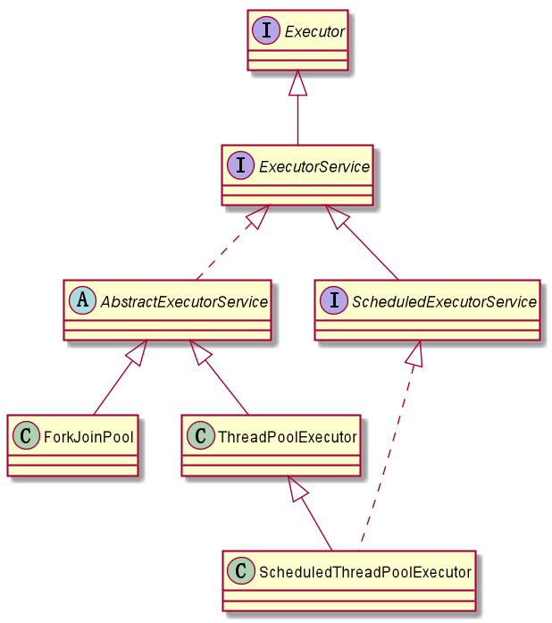
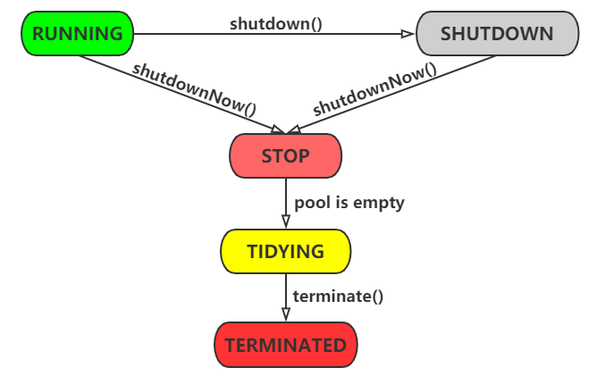
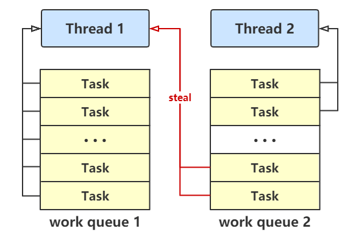
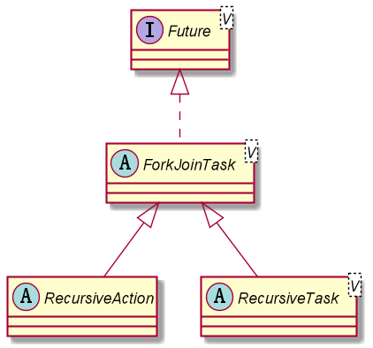

# 执行器框架与线程池

## 使用`Thread`显示创建线程方式的弊端

通常，使用Java来开发并发程序时，会创建一些`Runnable`对象，然后创建对应的`Thread`对象来执行它们。但是，如果需要开发一个程序来运行大量的并发任务，这个方法将突显以下劣势：

- 必须实现所有与`Thread`对象管理相关的代码，比如线程的创建、结束以及结果获取；
- 需要为每一个任务创建一个`Thread`对象。如果需要执行大量的任务，这将大大地影响程序的处理能力；
- 计算机的资源需要高效地进行控制和管理，如果创建过多的线程，将会导致系统负荷过重。
- 一个线程一般只能执行一个任务，执行后就被销毁，无法重复使用。不断创建和销毁线程导致系统性能下降。

## 执行器框架

自从Java 5开始，Java并发API提供了一套意在解决这些问题的机制。这套机制称之为执行器框架（Executor Framework），围绕着`Executor`接口和它的子接口`ExecutorService`，以及实现这两个接口的`ThreadPoolExecutor`类展开。



这套机制分离了任务的创建和执行。通过使用执行器，仅需要实现`Runnable`接口的对象，然后将这些对象发送给执行器即可。执行器通过创建所需的线程，来负责这些`Runnable`对象的创建、实例化以及运行。

但是执行器功能不限于此，它使用了线程池来提高程序的性能。当发送一个任务给执行器时，执行器会尝试使用线程池中的线程来执行这个任务，避免了不断地创建和销毁线程而导致系统性能下降。

执行器框架另一个重要的优势是`Callable`接口。它类似于`Runnable`接口，但是却提供了两方面的增强。这个接口的主方法名称为`call()`，可以返回结果。

当发送一个`Callable`对象给执行器时，将获得一个实现了`Future`接口的对象。可以使用这个对象来控制`Callable`对象的状态和结果。

### `Executor`

```java
public interface Executor {
    void execute(Runnable command);
}
```

此接口提供一种将任务提交与每个任务将如何运行的机制（包括线程使用的细节、调度等）分离开来的方法。不过，`Executor`接口并没有严格地要求执行是异步的。在最简单的情况下，执行程序可以在调用 `execute()`方法的调用者的线程中立即运行已提交的任务，即在`execute()`中直接调用任务的`run()`。更常见的是，任务是在某个不是调用者线程的线程中执行的，比如可以为每个提交的任务创建新线程。许多`Executor`实现都对调度任务的方式和时间强加了某种限制。

内存一致性效果：线程中将`Runnable`对象提交到`Executor`之前的操作happen-before其执行开始（可能在另一个线程中）。

### `ExecutorService`

一个提供了任务终止管理、追踪一个或多个异步任务产生`Future`的方法的`Executor`。

可以关闭`ExecutorService`，这将导致其拒绝新任务。提供两个方法来关闭`ExecutorService`。
`shutdown()`方法在终止前允许执行以前提交的任务，`shutdownNow()`方法阻止等待任务启动并试图停止当前正在执行的任务。

在终止时，执行程序没有任务在执行，也没有任务在等待执行，并且无法提交新任务。应该关闭未使用的线程以允许回收其资源。

通过创建并返回一个可用于取消执行、等待完成的线程。`submit` 扩展了`Executor`基本方法`execute(Runnable)`，`invokeAny()`和`invokeAll()`是批量执行的最常用形式，它们执行任务collection，然后等待至少一个，或全部任务完成（可使用`ExecutorCompletionService`类来编写这些方法的自定义变体）。

内存一致性效果：线程中向`ExecutorService`提交`Runnable`或`Callable`任务之前的操作happen-before由该任务所提取的所有操作，后者依次happen-before通过`Future.get()`获取的结果。

### `Future`

```java
public interface Future<V> {
    boolean cancel(boolean mayInterruptIfRunning);
    boolean isCancelled();
    boolean isDone();
    V get() throws InterruptedException, ExecutionException;
    V get(long timeout, TimeUnit unit)
        throws InterruptedException, ExecutionException, TimeoutException;
}
```

`Future`表示异步计算的结果。它提供了检查计算是否完成的方法，以等待计算的完成，并获取计算的结果。计算完成后只能使用`get`方法来获取结果，如有必要，计算完成前可以阻塞此方法。取消则由`cancel`方法来执行。还提供了其他方法，以确定任务是正常完成还是被取消了。一旦计算完成，就不能再取消计算。如果为了可取消性而使用`Future`但又不提供可用的结果，则可以声明`Future<?>`形式类型、并返回`null`作为底层任务的结果。

## 执行器的线程池

执行器框架使用线程池来提高程序的性能：

- 减少资源的开销。减少了每次创建线程、销毁线程的开销。
- 提高响应速度 ,每次请求到来时，由于线程的创建已经完成，故可以直接执行任务，因此提高了响应速度。
- 提高线程的可管理性 ,线程是一种稀缺资源，若不加以限制，不仅会占用大量资源，而且会影响系统的稳定性。因此，线程池可以对线程的创建与停止、线程数量等等因素加以控制，使得线程在一种可控的范围内运行，不仅能保证系统稳定运行，而且方便性能调优。

### `ThreadPoolExecutor`

一个`ExecutorService`，它使用可能的几个池线程之一执行每个提交的任务，通常使用`Executors`工厂方法配置。

线程池可以解决两个不同问题：由于减少了每个任务调用的开销，它们通常可以在执行大量异步任务时提供增强的性能，并且还可以提供绑定和管理资源（包括执行任务集时使用的线程）的方法。每个`ThreadPoolExecutor`还维护着一些基本的统计数据，如完成的任务数。

为了便于跨大量上下文使用，此类提供了很多可调整的参数和扩展钩子(hook)。但是，强烈建议程序员使用较为方便的`Executors`工厂方法

- `Executors.newCachedThreadPool()`：返回无界线程池，可以进行自动线程回收
- `Executors.newFixedThreadPool(int)`：固定大小线程池
- `Executors.newSingleThreadExecutor()`：单个后台线程

#### 构造方法

```java
public ThreadPoolExecutor(int corePoolSize,
                          int maximumPoolSize,
                          long keepAliveTime,
                          TimeUnit unit,
                          BlockingQueue<Runnable> workQueue) {
    this(corePoolSize, maximumPoolSize, keepAliveTime, unit, workQueue,
         Executors.defaultThreadFactory(), defaultHandler);
}

/**
 *
 * @param corePoolSize 核心线程数
 * @param maximumPoolSize 最大线程数
 * @param keepAliveTime 不活动的非核心线程保持活动的时限
 * @param unit keepAliveTime参数的时间单位
 * @param workQueue 保存加入的任务并传递给线程的队列
 * @param threadFactory 线程创建工厂
 * @param handler 任务拒绝策略
 */
public ThreadPoolExecutor(int corePoolSize, int maximumPoolSize,
                          long keepAliveTime, TimeUnit unit,
                          BlockingQueue<Runnable> workQueue,
                          ThreadFactory threadFactory,
                          RejectedExecutionHandler handler) {
    if (corePoolSize < 0 ||
        maximumPoolSize <= 0 ||
        maximumPoolSize < corePoolSize ||
        keepAliveTime < 0)
        throw new IllegalArgumentException();
    if (workQueue == null || threadFactory == null || handler == null)
        throw new NullPointerException();
    this.acc = System.getSecurityManager() == null ?
            null :
            AccessController.getContext();
    this.corePoolSize = corePoolSize;
    this.maximumPoolSize = maximumPoolSize;
    this.workQueue = workQueue;
    this.keepAliveTime = unit.toNanos(keepAliveTime);
    this.threadFactory = threadFactory;
    this.handler = handler;
}
```

#### 生命周期及状态转换



- **RUNNING**：接受新任务并处理排队中的任务
- **SHUTDOWN**：不接受新任务，而是处理排队中的任务
- **STOP**：不要接受新任务，不处理排队中的任务，并且中断正在进行的任务
- **TIDYING**：所有任务都已终止，workerCount为零，过渡到状态清理的线程将运行`terminate()`钩子方法
- **TERMINATED**：`terminated()`已完成。注意，在`ThreadPoolExecutor`类中`terminated()`方法为空实现方法，子类可以继承，令线程终止时完成某些任务。

#### 创建线程池指导

在不使用`Executors`类的工厂方法创建线程池时，需要根据以下指导：

##### 核心和最大线程池大小

`ThreadPoolExecutor`将根据corePoolSize和maximumPoolSize设置的边界自动调整池大小。

- 当新任务在方法`execute(java.lang.Runnable)`中提交时，如果运行的线程少于corePoolSize，则创建新线程来处理请求，即使其他辅助线程是空闲的。
- 如果运行的线程多于corePoolSize而少于maximumPoolSize，则仅当队列满时才创建新线程。
- 如果设置的corePoolSize和maximumPoolSize相同，则创建了固定大小的线程池。
- 如果将maximumPoolSize设置为基本的无界值（如Integer.MAX_VALUE），则允许池适应任意数量的并发任务。

在大多数情况下，核心和最大池大小仅基于构造来设置，不过也可以使用`setCorePoolSize(int)` 和`setMaximumPoolSize(int)`进行动态更改。

##### 按需构造

默认情况下，即使是核心线程也只是是在新任务到达时才初始创建和启动的，也可以使用方法`prestartCoreThread()`或`prestartAllCoreThreads()`对其进行动态重写。如果构造带有非空队列的池，则可能希望预先启动线程。

##### 创建新线程

使用`ThreadFactory`创建新线程。如果没有另外指明`ThreadFactory`，则一律使用`Executors.defaultThreadFactory()`获取`ThreadFactory`来创建线程，这使得创建的线程在同一个`ThreadGroup`中，并且具有相同的`NORM_PRIORITY`优先级和非守护进程状态。

通过提供不同的`ThreadFactory`，可以改变线程的名称、线程组、优先级、守护进程状态，等等。如果从`newThread()`方法未能创建线程而返回`null`是，执行器将继续运行，但不能执行任何任务。

注意：开发规范推荐不适用`Executors.defaultThreadFactory()`，因为它不能更好得区分线程池和线程的名称，所以也不推荐使用`Executors`创建线程池。

##### 保持活动时间

如果池中当前有多于corePoolSize的线程，则这些多出的线程在空闲时间超过keepAliveTime时将会终止。这提供了当池处于非活动状态时减少资源消耗的方法。如果池后来变得更为活动，则可以创建新的线程。

可以使用方法`setKeepAliveTime(long, TimeUnit)`动态地更改此参数。使用`Long.MAX_VALUE`和`TimeUnit.NANOSECONDS`作为参数的值在关闭前有效地从以前的终止状态禁用空闲线程。

默认情况下，保持活动策略只在有多于核心池大小的线程时应用。但是只要keepAliveTime值非0，`allowCoreThreadTimeOut(boolean)`方法也可将此超时策略应用于核心线程。

##### 排队

所有`BlockingQueue`都可用于传输和保持提交的任务。可以使用此队列与池大小进行交互：

- 如果运行的线程少于corePoolSize，则`Executor`始终首选添加新的线程，而不进行排队。
- 如果运行的线程等于或多于corePoolSize，则`Executor`始终首选将请求加入队列，而不添加新的线程。
- 如果无法将请求加入队列，则创建新的线程，除非创建此线程超出maximumPoolSize，在这种情况下，任务将被拒绝。

排队有三种通用策略：

- **直接提交**。工作队列的默认选项是`SynchronousQueue`，它将任务直接提交给线程而不保持它们。在此，如果不存在可用于立即运行任务的线程，则试图把任务加入队列将失败，因此会构造一个新的线程。此策略可以避免在处理可能具有内部依赖性的请求集时出现锁。直接提交通常要求无界maximumPoolSizes以避免拒绝新提交的任务。当命令以超过队列所能处理的平均数连续到达时，此策略允许无界线程具有增长的可能性。
- **无界队列**。使用无界队列（例如，不具有预定义容量的`LinkedBlockingQueue`）将导致在所有corePoolSize线程都忙时新任务在队列中等待。这样，创建的线程就不会超过corePoolSize。（因此，maximumPoolSize的值也就无效了。）当每个任务完全独立于其他任务，即任务执行互不影响时，适合于使用无界队列；例如，在Web页服务器中。这种排队可用于处理瞬态突发请求，当命令以超过队列所能处理的平均数连续到达时，此策略允许无界线程具有增长的可能性。
- **有界队列**。当使用有限的maximumPoolSizes时，有界队列（如`ArrayBlockingQueue`）有助于防止资源耗尽，但是可能较难调整和控制。队列大小和最大池大小可能需要相互折衷：使用大型队列和小型池可以最大限度地降低CPU使用率、操作系统资源和上下文切换开销，但是可能导致人工降低吞吐量。如果任务频繁阻塞（例如，如果它们是IO边界），则系统可能为超过您许可的更多线程安排时间。使用小型队列通常要求较大的池大小，CPU使用率较高，但是可能遇到不可接受的调度开销，这样也会降低吞吐量。

##### 被拒绝的任务

当`Executor`已经关闭，或者`Executor`将有限边界用于最大线程和工作队列容量，且已经饱和时，在方法`execute(Runnable)`中提交的新任务将被拒绝。在以上两种情况下，`execute`方法都将调用其`RejectedExecutionHandler.rejectedExecution(Runnable, ThreadPoolExecutor)`方法。下面提供了四种预定义的处理程序策略：

- 在默认的`ThreadPoolExecutor.AbortPolicy`中，处理程序遭到拒绝将抛出运行时RejectedExecutionException。
- 在`ThreadPoolExecutor.CallerRunsPolicy`中，执行器使用策略直接执行任务的`run()`方法。此策略提供简单的反馈控制机制，能够减缓新任务的提交速度。
- 在`ThreadPoolExecutor.DiscardPolicy`中，不能执行的任务直接被忽略，什么都不做。
- 在`ThreadPoolExecutor.DiscardOldestPolicy`中，如果执行程序尚未关闭，则位于工作队列头部的任务将被删除，然后重试执行程序（如果再次失败，则重复此过程）。

定义和使用其他种类的`RejectedExecutionHandler`类也是可能的，但这样做需要非常小心，尤其是当策略仅用于特定容量或排队策略时。

##### 钩子(hook)方法

此类提供`protected`可重写的`beforeExecute(Thread, Runnable)`和`afterExecute(Runnable, Throwable)`方法，这两种方法分别在执行每个任务之前和之后调用。它们可用于操纵执行环境；例如，重新初始化`ThreadLocal`、搜集统计信息或添加日志条目。此外，还可以重写方法`terminated()`来执行`Executor`完全终止后需要完成的所有特殊处理。

如果钩子(hook)或回调方法抛出异常，则内部工作线程可能会失败并突然终止。

##### 队列维护

方法`getQueue()`允许出于监控和调试目的而访问工作队列。但强烈反对出于其他任何目的而使用此方法。

`remove(Runnable)`和`purge()`这两种方法可用于在取消大量已排队任务时帮助进行存储回收。

##### 终止

一个线程池不再被查询引用，并且没有剩余的线程将会自动地shutdown。如果希望确保回收取消引用的池（即使用户忘记调用`shutdown()`），则必须安排未使用的线程最终终止：设置适当保持活动时间，使用0核心线程的下边界以及设置`allowCoreThreadTimeOut(true)`。

### `ScheduledThreadPoolExecutor`

可另行安排在给定的延迟后运行命令，或者定期执行命令的`ThreadPoolExecutor`。需要多个辅助线程时，或者要求`ThreadPoolExecutor`具有额外的灵活性或功能时，此类要优于`Timer`。

一旦启用已延迟的任务就执行它，但是有关何时启用，启用后何时执行则没有任何实时保证。按照提交的先进先出(FIFO)顺序来启用那些被安排在同一执行时间的任务。

虽然此类继承自`ThreadPoolExecutor`，但是几个继承的调整方法对此类并无作用。特别是，因为它作为一个使用一个无界队列和固定大小的线程池池，所以**调整maximumPoolSize没有什么效果**。

#### 构造方法

```java
public ScheduledThreadPoolExecutor(int corePoolSize) {
    super(corePoolSize, Integer.MAX_VALUE, 0, NANOSECONDS,
          new DelayedWorkQueue());
}

/**
 * 最大线程数为Integer.MAX_VALUE
 * 不活动的非核心线程存活时间为0
 * 使用DelayQueue作为工作队列
 *
 * @param corePoolSize 核心线程数
 * @param threadFactory 线程构建工厂
 * @param handler 任务拒绝策略
 */
public ScheduledThreadPoolExecutor(int corePoolSize,
                                   ThreadFactory threadFactory,
                                   RejectedExecutionHandler handler) {
    // 调用父类ThreadPoolExecutor的构造方法。
    super(corePoolSize, Integer.MAX_VALUE, 0, NANOSECONDS,
          new DelayedWorkQueue(), threadFactory, handler);
}
```

### `ForkJoinPool`

一个用于运行`ForkJoinTask`的`ExecutorService`。此外，`ForkJoinPool`提供非`ForkJoinTask`客户提交的入口点，以及管理和监视操作。

`ForkJoinPool`与其他`ExecutorService`子类不同之处在于“**工作窃取**”：所有线程池中试图找到并执行提交给线程池或由其他活动任务创建的任务(如果没有任务则阻塞)。这使得在大多数任务会产生子任务(如`ForkJoinTask`)并且将子任务也提交到池中的情况下处理过程更加高效。特别是在构造函数将`asyncMode`设置为`true`。

一个静态`commonPool()`方法适用于大部分程序，它返回一个`static final`的`ForkJoinPool`。如果一个`ForkJoinTask`没有显式地指明要提交到哪一个线程池，那么默认就是提交到这个公共池。使用公共池一般可以减少资源的使用，该池的对象在不使用的时候会缓慢地回收，并且在使用的时候恢复。

如果程序需要单独的或自定义的池，构建`ForkJoinPool`时可能会给定一个并行的级别。默认情况下是可用处理器的数量。线程池试图通过动态地添加、停止、恢复内部工作线程来维护足够的活动或可用的线程，甚至在一些任务是在停滞等待加入（join）其他任务的情况下。然而，这些调整在面对阻塞IO或者其他不能管理同步的情况下并没有保证。内部嵌套接口`ManagedBlocker`提供同步适用扩展。

除了执行和生命周期控制方法之外，此类还提供状态检查方法（例如`getStealCount()`），旨在帮助开发、调优和监视fork/join程序。 此外，方法`toString()`以方便的形式返回池状态的指示，以进行非正式监视。

与其他`ExecutorService`的情况一样，下表总结了三种主要的任务执行方法。这些主要用于当前池中尚未参与fork/join计算的客户端。这些方法的主要形式接受`ForkJoinTask`的实例，但重载的表单也允许混合执行基于`Runnable`或`Callable`的简单动作。 但是，已经在池中执行的任务通常应该使用表中列出的计算内形式，除非使用通常不连接的异步事件样式任务，在这种情况下，方法选择之间几乎没有区别。

|                    | 在fork/join客户端之外调用 | 在fork/join计算中调用                                 |
| :----------------- | :------------------------ | :---------------------------------------------------- |
| 异步执行           | `execute(ForJoinTask)`    | `ForkJoinTask.fork()`()                               |
| 等待获取结果       | `invoke(ForJoinTask)`     | `ForkJoinTask.invoke()`()                             |
| 执行和获取`Future` | `submit(ForJoinTask)`     | `ForkJoinTask.fork()`（`ForkJoinTask`是`Future`类型） |

公共池是使用默认值构造的，但是可以通过系统属性来控制这上值

- common.parallelism
- common.threadFactory
- common.exceptionHandler

注意：最大允许线程数为32767，试图创建更大的线程池将抛出`IllegalArgumentException`。

拒绝任务提交只会发生在线程池关闭或者系统资源耗尽的情况下。

#### 构造方法

```java
/**
 * 默认并行级别为当前处理器数量，且不能超过0x7fff
 */
public ForkJoinPool() {
    this(Math.min(MAX_CAP, Runtime.getRuntime().availableProcessors()),
         defaultForkJoinWorkerThreadFactory, null, false);
}


/**
 * 默认并行级别为当前处理器数量，且不能超过0x7fff
 * 默认工厂为内部定义的defaultForkJoinWorkerThreadFactory
 * 默认没有异常处理器
 * 默认非异步模式
 * 工作线程名称前缀为 "ForkJoinPool-" + nextPoolId() + "-worker-"
 *
 * @param parallelism 并行性级别
 * @param factory ForkJoinWorkerThread线程构建工厂
 * @param handler 内部工作线程产生的不可恢复错误的处理器
 * @param asyncMode 异步模式。如果为真，fork后的任务不会被join
 */
public ForkJoinPool(int parallelism,
                    ForkJoinWorkerThreadFactory factory,
                    UncaughtExceptionHandler handler,
                    boolean asyncMode) {
    this(checkParallelism(parallelism),
         checkFactory(factory),
         handler,
         asyncMode ? FIFO_QUEUE : LIFO_QUEUE,
         "ForkJoinPool-" + nextPoolId() + "-worker-");
    checkPermission();
}
```

#### 工作窃取

工作窃取（work-stealing）算法是指某个线程从其他队列里窃取任务来执行。

在`ForkJoinPool`中，每一个`ForkJoinWorkerThread`都拥有一个workQueue，用于保存该线程需要执行的所有任务，这用就可以减少不同线程之间的竞争，从而提高工作效率。在执行一个大的`ForkJoinTask`时，通常的做法是将该任务划分成一些互不依赖的小任务，并将这些任务放入不同线程的工作队列中，将所要子任务完成后整合成最终结果（分治思想）。

但是这就会出现一种情况：部分线程已经完成了自己工作队列中的任务，而另一部分却没有，而整合所要任务需要等待所以子任务完成，所以完成任务的线程就只能闲置着等待，这样就浪费了资源，所以这些完成了任务的线程就会从未完成任务的线程的工作队列中窃取任务执行。

为了减少窃取线程和被窃取线程之间的竞争，工作队列使用双端队列，被窃取线程从头部获取任务，而窃取线程从尾部窃取任务。

工作窃取算法的优点是充分利用线程进行并行计算，并减少了线程间的竞争，其缺点是在某些情况下还是存在竞争，比如双端队列里只有一个任务时。并且消耗了更多的系统资源，比如创建多个线程和多个双端队列。



#### `ForkJoinTask`

`ForkJoinPool`中执行的任务的抽象类。一个`ForkJoinTask`比一般线程轻量许多的线程。大量的ForkJoin任务及子任务可以被一个用于很少线程的`ForkJoinPool`管理。

一个“主要”`ForkJoinTask`在被显示提交到一个`ForkJoinPool`时执行，或者是是在没有进行ForkJoin计算时通过`fork()`、`invoke()`等相关方法在`ForkJoinPool.commonPool()`中开始。一旦开始执行，它会启动其他子任务。



#### `ForkJoinWorkerThread`

```java
public class ForkJoinWorkerThread extends Thread
```

由`ForkJoinPool`管理的工作线程，用于执行`ForkJoinTask`。这个类为了增加一些功能才继承自`Thread`类，并没有覆盖`Thread`的方法。在扩展这个类是可以覆盖主任务处理循环周围的初始化和终止方法（`onStart()`和`onTermination()`），并且需要提供相应的`ForkJoinPool.ForkJoinWorkerThreadFactory`在`ForkJoinPool`中使用这些扩展类。

[聊聊并发（八）——Fork/Join框架介绍](http://ifeve.com/talk-concurrency-forkjoin/)
