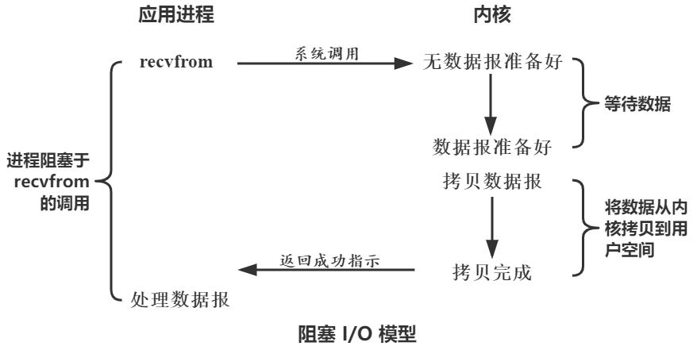
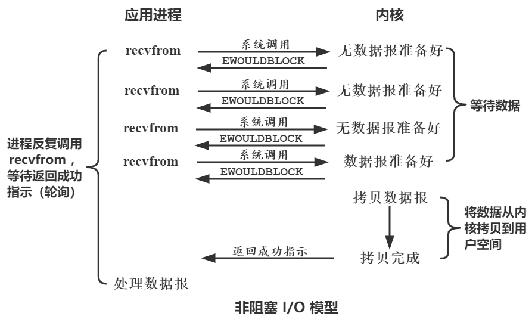
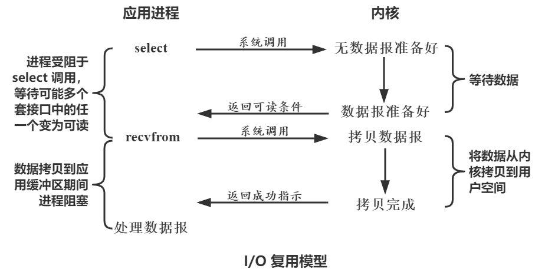
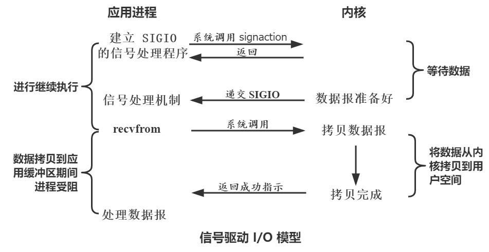
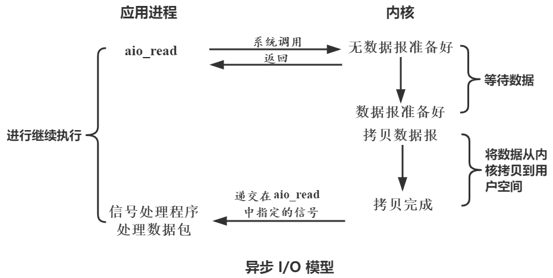
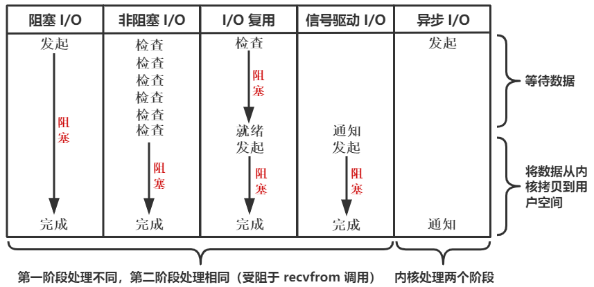

# 02 Linux五种IO模型

## Linux概述

### 用户空间和内核空间

现在操作系统都是采用虚拟存储器。那么对32位操作系统而言，它的寻址空间（虚拟存储空间）为4G（2的32次方）。

操作系统的核心是内核（kernel），独立于普通的应用程序，可以访问受保护的内存空间，也有访问底层硬件设备的所有权限。

为了保证用户进程不能直接操作内核，保证内核的安全，操作系统将虚拟空间划分为两部分，一部分为内核空间，一部分为用户空间。

对Linux操作系统而言，将最高的1G字节（从虚拟地址`0xC0000000`到`0xFFFFFFFF`）供内核使用，称为内核空间；而将较低的3G字节（从虚拟地址`0x00000000`到`0xBFFFFFFF`），供各个进程使用，称为用户空间。

### 进程切换

为了控制进程的执行，内核必须有能力挂起正在CPU上运行的进程，并恢复以前挂起的某个进程的执行。这种行为被称为进程切换（process switch）、任务切换（task switch）或上下文切换（content switch）。因此可以说，任何进程都是在操作系统内核的支持下运行的，是与内核紧密相关的。

或者说，进行进程切换就是从正在运行的进程中收回处理器，然后再使待运行进程来占用处理器。这里所说的从某个进程收回处理器，实质上就是把进程存放在处理器的寄存器中的中间数据找个地方存起来，从而把处理器的寄存器腾出来让其他进程使用。

在切换时，一个进程存储在处理器各寄存器中的中间数据叫做进程的**上下文**，所以进程的切换实质上就是被中止运行进程与待运行进程上下文的切换。在进程未占用处理器时，进程的上下文是存储在进程的私有堆栈中的。

进程上下文切换由以下4个步骤组成:

1. 决定是否作上下文切换以及是否允许作上下文切换。包括对进程调度原因的检查分析，以及当前执行进程的资格和CPU执行方式的检查等。在操作系统中，上下文切换程序并不是每时每刻都在检查和分析是否可作上下文切换，它们设置有适当的时机。
2. 保存当前执行进程的上下文。这里所说的当前执行进程，实际上是指调用上下文切换程序之前的执行进程。如果上下文切换不是被那个当前执行进程所调用，且不属于该进程，则所保存的上下文应是先前执行进程的上下文，或称为“老”进程上下文。显然，上下文切换程序不能破坏“老”进程的上下文结构。
3. 使用进程调度算法，选择一处于就绪状态的进程。
4. 恢复或装配所选进程的上下文，将CPU控制权交到所选进程手中。

### 进程的阻塞

正在执行的进程，由于期待的某些事件未发生，如请求系统资源失败、等待某种操作的完成、新数据尚未到达或无新工作做等，则由系统自动执行阻塞原语（Block），使自己由运行状态变为阻塞状态。

可见，进程的阻塞是进程自身的一种主动行为，也因此只有处于运行态（获得CPU）的进程，才可能将其转为阻塞状态。当进程进入阻塞状态，是不占用CPU资源的。

### 文件描述符

文件描述符（fd，File descriptor）是计算机科学中的一个术语，是一个用于表述指向文件的引用的抽象化概念。

文件描述符在形式上是一个非负整数。实际上，它是一个索引值，指向内核为每一个进程所维护的该进程打开文件的记录表。当程序打开一个现有文件或者创建一个新文件时，内核向进程返回一个文件描述符。在程序设计中，一些涉及底层的程序编写往往会围绕着文件描述符展开。**但是文件描述符这一概念往往只适用于UNIX、Linux这样的操作系统**。

### 文件系统IO

#### 缓存IO（Buffer IO）

缓存IO又被称作标准IO（Normal IO），大多数文件系统的默认IO操作都是缓存IO。在Linux的缓存IO机制中，数据先从磁盘复制到内核空间的缓冲区，然后从内核空间缓冲区复制到应用程序的地址空间。

读操作：操作系统检查内核的缓冲区有没有需要的数据，如果已经缓存了，那么就直接从缓存中返回；否则从磁盘中读取，然后缓存在操作系统的缓存中。

写操作：将数据从用户空间复制到内核空间的缓存中。这时对用户程序来说写操作就已经完成，至于什么时候再写到磁盘中由操作系统决定，除非显示地调用了`sync`同步命令。

缓存IO的优点：

- 在一定程度上分离了内核空间和用户空间，保护系统本身的运行安全；
- 可以减少读盘的次数，从而提高性能。

缓存IO的缺点：

- 在缓存IO机制中，DMA方式可以将数据直接从磁盘读到页缓存中，或者将数据从页缓存直接写回到磁盘上，而不能直接在应用程序地址空间和磁盘之间进行数据传输，这样，数据在传输过程中需要在应用程序地址空间（用户空间）和缓存（内核空间）之间进行多次数据拷贝操作，这些数据拷贝操作所带来的CPU以及内存开销是非常大的。

#### 直接IO（Direct IO）

直接IO就是应用程序直接访问磁盘数据，而不经过内核缓冲区，这样做的目的是减少一次从内核缓冲区到用户程序缓存的数据复制。

比如说数据库管理系统这类应用，它们更倾向于选择它们自己的缓存机制，因为数据库管理系统往往比操作系统更了解数据库中存放的数据，数据库管理系统可以提供一种更加有效的缓存机制来提高数据库中数据的存取性能。

直接IO的缺点：

- 如果访问的数据不在应用程序缓存中，那么每次数据都会直接从磁盘加载，这种直接加载会非常缓慢。
- 通常直接IO与异步IO结合使用，会得到比较好的性能。

[Linux中直接IO机制的介绍](https://www.ibm.com/developerworks/cn/linux/l-cn-directio/)

## Linux IO模型

IO（Input/Output，输入/输出）即数据的读取（接收）或写入（发送）操作，通常用户进程中的一个完整IO分为两阶段：

1. 用户进程空间<-->内核空间
2. 内核空间<-->设备空间（磁盘、网络等）

IO有内存IO、网络IO和磁盘IO三种，通常我们说的IO指的是后两者。网络IO的本质是socket的读取，socket在linux系统被抽象为流。Linux中进程无法直接操作IO设备，其必须通过系统调用请求kernel来协助完成IO动作；内核会为每个IO设备维护一个缓冲区（缓存IO）。以`read`操作为例，它会经历两个阶段：

1. 第一阶段：等待数据准备（Waiting for the data to be ready）
2. 第二阶段：将数据从内核拷贝到进程中（Copying the data from the kernel to the process）

对应Socket流而言：

1. 第一步：通常涉及等待网络上的数据分组到达网卡，然后被复制到内核的某个缓冲区
2. 第二步：把数据从内核缓冲区复制到应用进程缓冲区

### 阻塞IO模型

在这个IO模型中，用户空间的应用程序执行一个系统调用（`recvform`）转入内核空间，这会导致应用程序阻塞，什么也不干，直到数据准备好，并且将数据从内核复制到用户进程，最后进程再处理数据，在等待数据到处理数据的两个阶段，整个进程都被阻塞。

阻塞时不能处理别的IO。调用应用程序处于一种不再消费CPU而只是简单等待响应的状态，因此从处理的角度来看，这是非常有效的。

)

典型应用：Java BIO、阻塞socket

特点：

- 进程阻塞挂起不消耗CPU资源，及时响应每个操作；
- 实现难度低、开发应用较容易；
- 适用并发量小的网络应用开发；

缺点：不适用并发量大的应用。因为一个请求IO会阻塞进程，所以得为每请求分配一个处理进程（线程）以及时响应，系统开销大。

### 非阻塞IO

阻塞IO模型中，在内核准备数据时进程也被阻塞，什么也做不了，白白浪费CPU资源。所以人们就想有一种方式：当额内核中数据没有准备好时，先出内核中退出，使进程能继续执行一些其他任务。同时间断得查询内核中数据是否完成，当发现完成之后再转入内核将数据赋值到用户空间。

非阻塞IO模型就是这样的方式。在这种模型中，设备是以非阻塞的形式打开的，这意味着 内核数据为准备好时，内核立即对进程的`recvfrom`系统调用返回一个错误代码（`EAGAIN`或`EWOULDBLOCK`），说明这个命令不能立即满足。然后进程可以继续执行一些其他任务。此后进程不断地发起`recvfrom`系统调用（轮询`polling`），直至内核中数据准备好。数据准备好之后，内核拷贝数据到进程，最后进程数据处理。需要注意，拷贝数据整个过程，进程仍然是属于阻塞的状态。可以发现，非阻塞IO`将大的整片时间的`recvfrom`造成的阻塞分成多个小的阻塞，在这些小阻塞之间进行可以继续执行。在Lunix下，可以通过设置socket使其变为non-blocking。

典型应用：socket是非阻塞的方式（设置为non-blocking后）

特点：

- 进程轮询（重复）调用，消耗CPU的资源；
- 实现难度较高、开发应用相对阻塞IO模式较难；
- 适用并发量较小、且不需要及时响应的网络应用开发；

优点：能够在等待任务完成的时间里干其他活了（包括提交其他任务，也就是 “后台” 可以有多个任务在同时执行）。

缺点：任务完成的响应延迟增大了，因为每过一段时间才去轮询一次`read`操作，而任务可能在两次轮询之间的任意时间完成。这会导致整体数据吞吐量的降低。

### IO复用模型

在非阻塞IO模型中，进程需要不断主动轮询，这些操作占据了很大一部分时间，消耗大量的CPU资源。而 “后台”可能有多个任务在同时进行，人们就想到了循环查询多个任务的完成状态，只要有任何一个任务完成，就去处理它。如果轮询不是进程的用户态，而是有人帮忙就好了。那么这就是所谓的“IO多路复用”。Unix/Linux下的`select`、`poll`、`epoll`就是干这个的（`epoll`比`poll`、`select`效率高，但做的事情是一样的）。

IO复用，也有被称为事件驱动（Event Driven）IO。IO复用可能会使用到三个系统调用`select`和`epoll`。当用户进程调用了`select`，那么整个进程会被阻塞。而同时，内核会“监视”所有`select`负责的socket，当任何一个socket中的数据准备好了，`select`就会返回一个信息。这个时候用户进程再执行`recvfrom`系统调用，将数据从内核拷贝到用户进程。

IO复用模型需要使用两个系统调用（`select`和`recvfrom`），而阻塞IO模型只调用了一个（`recvfrom`），所以单进程时二者并没有什么太大区别，前者甚至可能会更差。但是，用`select`的优势在于它可以同时处理多个连接的进程。（如果处理的连接数不是很高的话，使用`select`/`epoll`的web server不一定比使用多线程 + 阻塞IO模型的web server性能更好，可能延迟还更大。`select`/`epoll`的优势并不是对于单个连接能处理得更快，而是在于能处理更多的连接）

在IO复用模型中，实际中对于每一个socket一般都设置成为non-blocking，但是，如图所示，整个用户的进程其实是一直被阻塞的。只不过进程是被`select`阻塞，而不是被socket IO阻塞。

典型应用：`select`、`poll`、`epoll`系统调用、Java NIO

特点：

- 专一进程解决多个进程IO的阻塞问题，性能好；Reactor模式;
- 实现、开发应用难度较大；
- 适用高并发服务应用开发：一个进程（线程）响应多个请求；

Linux中IO复用的实现方式主要有：`select`、`poll`和`epoll`：

- `select`：注册IO、阻塞扫描，监听的IO最大连接数不能多于`FD_SIZE`；
- `poll`：原理和`select`相似，没有数量限制，但IO数量大扫描线性性能下降；
- `epoll`：事件驱动不阻塞，mmap实现内核与用户空间的消息传递，数量很大，Linux2.6后内核支持；

### 信号驱动IO模型

首先我们允许Socket进行信号驱动IO，并安装一个信号处理函数，进程继续运行并不阻塞。当数据准备好时，进程会收到一个`SIGIO`信号，可以在信号处理函数中调用IO操作函数处理数据。过程如下图所示：

特点：回调机制，实现、开发应用难度大

### 异步IO模型

前面四个IO模型，都是属于同步IO模型。在这些模型中，真正的数据拷贝过程，都是同步进行的。在内核空间数据准备完成后，进程都需要执行`recvfrom`系统调用让内核将相应的数据从内核拷贝到用户空间时，此时用户进程是处于阻塞状态的（部分同步，就认为它是同步的）。也就是说，数据拷贝过程是主动的。

如果在数据准备阶段和数据拷贝阶段，用户进程都能不被阻塞，将数据拷贝变成被动的。也就是进程只是发送一个读取信号给内核，而内核在获取信号后立即返回，此时用户进行继续执行，而等待内核等待数据准备和将数据拷贝到用户空间都由内核自主完成，待完成后内核再通知用户进程，那么这就是异步IO模型。

典型应用：Java 7 AIO、高性能服务器应用

特点：

- 不阻塞，数据一步到位；Proactor模式；
- 需要操作系统的底层支持，LINUX 2.5版本内核首现，2.6版本产品的内核标准特性；
- 实现、开发应用难度大；
- 非常适合高性能高并发应用；

### 总结与对比

- 同步：第二阶段主动执行`recvfrom`系统调用
    - 阻塞：第一阶段时阻塞
        - 阻塞IO模型：被Socket IO阻塞
        - IO复用模型：被`select`阻塞
    - 非阻塞：第一阶段不阻塞
        - 非阻塞IO模型：第一阶段采用轮询
        - 信号驱动IO模型：第一阶段异步的方式
- 异步
    - 两个阶段都是由内核“后台”完成

## Linux IO模型和Java IO

- 阻塞IO模型 -> Java传统IO（BIO）
- IO复用模型 -> Java 4新IO（NIO）
- 异步IO模型 -> Java 7异步IO（NIO 2，AIO）
