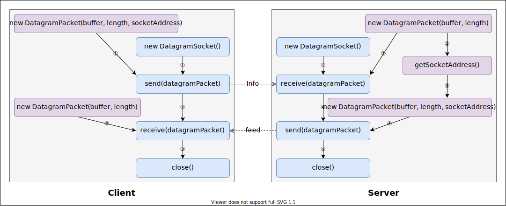

# 网络编程

Java中的网络支持：

- `InetAddress`：用于表示网络上的硬件资源，即IP地址；
- `URL`：统一资源定位符；
- `Socket`：使用TCP协议实现网络通信；
- `Datagram`：使用UDP协议实现网络通信。

## `InetAddress`

用于表示一个网际协议（IP）地址。`InetAddress`的实例由IP地址和可能的相应主机名组成。主机名是否存在取决于它是使用主机名构造或者是根据IP地址完成反向主机名解析。一个主机名可以绑定多个IP地址。

`InetAddress` 有两个子类：`Inet4Address`表示IPv4地址，`Inet6Addres`表示IPv6地址。

### 创建对象

`InetAddress`没有`public`构造方法，但提供了静态方法用于创建实例。

```java
// 获取代表本机地址的InetAddress对象
InetAddress
host = InetAddress.getLocalHost();

// 根据主机名和byte[]形式的IP地址获取InetAddress对象
host = InetAddress.getByAddress("HostName", new Byte[]{127, 0, 0, 1});

// 获取指定主机名的所有InetAddress对象数组
host = InetAddress.getAllByName("HostName");

// 获取指定主机名的所有InetAddress对象数组中的第一个。
host = InetAddress.getByName("HostName");

// 以字符串形式的IP地址作为主机名获得InetAddress对象
host = InetAddress.getByName("127.0.0.1");

// 根据byte[]形式的IP地址数组获得InetAddress对象
host = InetAddress.getByAddress(new Byte[]{127, 0, 0, 1});
```

### 获取信息

获取主机名和IP地址

```java
// 获取主机名
InetAddress ipAddr = InetAddress.getLocalHost();// HKLLY-PC/168.192.0.2
String hostName = ipAddr.getHostName();// HKLLY-PC

// 获取主机的完全限定名
String canonicalHostName = ipAddr.getCanonicalHostName();// HKLLY-PC

// 获取字符串形式的IP地址
String hostAddress = ipAddr.getHostAddress();// "192.168.0.2"

// 获取byte[] 形式的IP地址
byte[] address = ipAddr.getAddress();// [192, 168, 0, 2]
````

获取IP地址的分组

```java
// 是否是通配符地址
// IPv4通配符地址：0.0.0.0
// IPv6通配符地址：0.0.0.0.0.0，简写为::
boolean b = ipAddr.isAnyLocalAddress());

// 是否是本地连接地址
// IPv4本地连接地址：169.254.0.0 ~ 169.254.255.255
// IPv6本地连接地址：前12位是FE8，其他任意，如FE88::
b = ipAddr.isLinkLocalAddress());

// 是否是回环地址
// IPv4回环地址：127.0.0.0 ~ 127.255.255.255
// IPv6回环地址：0:0:0:0:0:0:0:1，简写::1
b = ipAddr.isLoopbackAddress());

// 是否是地区本地地址（私有地址）
// IPv4本地连接地址：10.0.0.0 ~ 10.255.255.255、172.16.0.0 ~ 172.31.255.255、192.168.0.0 ~ 192.168.255.255
// IPv6本地连接地址：前12位是FEC，其他任意，如FEC8::
b = ipAddr.isSiteLocalAddress());

// 是否是广播地址
// IPv4广播地址：224.0.0.0 ~ 239.255.255.255
// IPv6广播地址：第一个字节是FF
b = ipAddr.isMulticastAddress());

// 是否是本地接口广播地址
// IPv4本地接口广播地址：所有的IPv4广播地址都不是本地接口广播地址
// IPv6本地接口广播地址：第一个字节为FF，第二个字节为01 ~ F1
b = ipAddr.isMCNodeLocal());

// 是否是子网广播地址
// IPv4子网广播地址：224.0.0.0 ~ 224.0.0.255
// IPv6子网广播地址：第一个字节是FF，第二个字节的是02 ~ F2
b = ipAddr.isMCLinkLocal());

// 是否是站点范围的广播地址
// IPv4站点范围的广播地址：239.255.0.0 ~ 239.255.255.255
// IPv6站点范围的广播地址：第一个字节是FF，第二个字节的是05 ~ F5
b = ipAddr.isMCSiteLocal());

// 是否是组织范围的广播地址
// IPv4组织范围的广播地址：第一个字节是239，第二个字节不小于192，第三个字节不大于195
// IPv6组织范围的广播地址：第一个字节是FF，第二个字节的是08 ~ F8
b = ipAddr.isMCOrgLocal());

// 是否是全球范围的广播地址
// IPv4全球范围的广播地址：所以广播地址中，除了224.0.0.0和第一个字节是239的IP地址都是全球范围的广播地址。
// IPv6全球范围的广播地址：第一个字节为FF，第二个字节为0E ~ FE
b = ipAddr.isMCGlobal());
```

## `URL`

表示统一资源定位符，指向万维网上“资源”的指针。资源可以是文件或目录这样简单的东西，也可以是对更复杂的对象的引用，例如对数据库或搜索引擎的查询。

### 创建对象

使用`new`关键字和构造方法

```java
// 根据一个字符串形式的URL，来构建URL对象。
URL url0 = new URL("http://localhost:8080/file"); // http://localhost:8080/file

// 根据协议、主机名、文件来构造一个URL。使用该协议默认的端口号，并且文件应当以斜线开头，包括文件路径、文件名称和片段。
URL url1 = new URL("http", "localhost", "/file"); // http://localhost/file

// 根据协议、主机名、端口、文件来构造一个URL。
URL url2 = new URL("http", "localhost", 8080, "/file"); // http://localhost:8080/file

// 根据一个基础URL和一个相对URL来构建一个绝对URL。结果将基础URL的协议之后的内容（文件）替换成相对URL，而不是在其后追加。
URL url3 = new URL("http://localhost:8080/file1"); // http://localhost:8080/file1
URL url4 = new URL(url1, "/file2"); // http://localhost:8080/file2
```

### 获取信息

```java
URL url = new URL("http://127.0.0.1:8080/dir/file?query=condition#ref");

// 协议
url.getProtocol(); // http

// 主机名
url.getHost(); // 127.0.0.1

// 端口号
url.getPort(); // 8080

// 协议默认端口号
url.getDefaultPort(); // 80

// 请求（查询）条件
url.getQuery(); // query=condition

// 文件锚点
url.getRef();// ref

// 文件名（包括锚点和请求条件）
url.getFile();// /dir/file?query=condition

// 文件路径（不包括锚点）
url.getPath();// /dir/file

// 权限部分
url.getAuthority();// 127.0.0.1:8080

// 用户信息
url.getUserInfo();// null

// URL内容
//  参数是这个URL的内容对象，它是类数组中指定的类型的第一个匹配到的项。
//  如果不支持所请求的任何类型，则为null。
//  如果不能连接到URL则抛出java.net.ConnectException
Object obj = url.getContent(new Class[]{FilterInputStream.class});
```

### 使用`URL`开启输入流

```java
URL url = ...;
InputStream is = url.openStream()

// 获取`URL`指定的页面
BufferedReader in = null;
PrintWriter out = null;
try {
    in = new BufferedReader(new InputStreamReader(url.openStream(), StandardCharsets.UTF_8));
    out = new PrintWriter("src/main/resources/URL.html");
    String s;
    while ((s = in.readLine()) != null) {
        out.write(s);
        out.flush();
    }
} catch (Exception e) {
    e.printStackTrace();
} finally {
    if (in != null) {
        in.close();
    }
    if (out != null) {
        out.close();
    }
}
```

### `URLEncoder` & `URLDecoder`

`UTF-8`编码下的`URL`只能接收`[0-9a-zA-Z*_-.+]`范围的字符，所以对于这些范围之外的字符需要进行编码。`URLEncoder`类便提供了这样的功能。而`URLDecoder`则可以将编码后的内容解码成原文。

```java
String s = "0123456789" +
        "abcdefghijklmnopqrstuvwxyz"
        + "ABCDEFGHIJKLMNOPQRSTUVWXYZ"
        + "~!@#$%^&*_+=-`|:\"<>?\\;',./ (){}[]"
        + "汉字";
try {
    //使用UTF-8编码成URL可接受的字符串
    s = URLEncoder.encode(s, "UTF-8");
    System.out.println(s);
    //使用UTF-8将URL解码
    s = URLDecoder.decode(s, "UTF-8");
    System.out.println(s);
} catch (UnsupportedEncodingException e) {
    e.printStackTrace();
}

/**!output:
 * 0123456789abcdefghijklmnopqrstuvwxyzABCDEFGHIJKLMNOPQRSTUVWXYZ%7E%21%40%23%24%25%5E%26*_%2B%3D-%60%7C%3A%22%3C%3E%3F%5C%3B%27%2C.%2F+%28%29%7B%7D%5B%5D%E6%B1%89%E5%AD%97
 * 0123456789abcdefghijklmnopqrstuvwxyzABCDEFGHIJKLMNOPQRSTUVWXYZ~!@#$%^&*_+=-`|:"<>?\;',./ (){}[]汉字
 */
```

## 套接字（socket）

### `InetSocketAddress`

```java
InetSocketAddress extends SocketAddress
```

该类实现一个IP套接字地址（IP地址 + 端口号）。也可以是一对（主机名 + 端口号），在这种情况下，将尝试解析主机名。如果解析失败，那么地址被称为未解析的（unresolved），但是仍然可以在某些情况下使用，比如通过代理连接。

它提供一个不可变的对象，`Socket`将其用于绑定、连接或作为返回值。

通配符地址（通常是0.0.0.0 or ::0）是一个特殊的本地IP地址。它通常表示“任意”（any），并且只能用于`bind()`操作。

### TCP

#### `Socket`

实现了客户端套接字（也直接成为套接字）。套接字是两台机器之间通信的端点。`Socket`的实际工作由`SocketImpl`（抽象类）的一个实例执行。通过更改创建`SocketImpl`的`Socket`工厂，应用程序可以将自己配置为创建适合本地防火墙的`Socket`。

#### `ServerSocket`

该类实现服务器套接字。服务器套接字等待请求通过网络传入。它根据请求执行一些操作，然后可能返回一个结果给请求者。同服务器套接字，`ServerSocket`的实际工作由`SocketImpl`类的一个实例执行。应用程序可以更改创建`SocketImpl`工厂，将自己配置为创建适合本地防火墙的`ServerSocket`。

#### 通信模型

以单用户和单服务器为例。用户端发送信息给服务器端，服务器端收到信息后向客户端反馈。


### UDP

#### `DatagramPacket`

`DatagramPacket`用于实现无连接的包传递服务（不实现连接，用于保存数据报包）。

每条消息仅根据包中包含的信息从一台机器路由到另一台机器。从一台机器发送到另一台机器的多个包可能以不同的方式路由，并且可能以任意顺序到达。包交付不保证（接收端不会反馈是否接收成功）。

#### `DatagramSocket`

该类表示用于发送和接收`DatagramPacket`的套接字（可以表示服务器和客户套接字）。`DatagramSocket`是数据报发送服务的发送点或接收点。

在`DatagramSocket`上发送或接收的每个数据报都分别寻址和路由。从一台机器发送到另一台机器的多个包可能以不同的方式路由，并且可能以任意顺序到达。

#### 通信模型

以单用户和单服务器为例。用户端发送信息给服务器端，服务器端收到信息后向客户端反馈。


