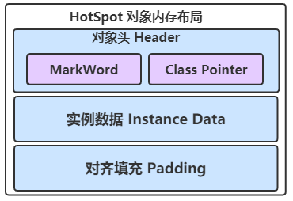
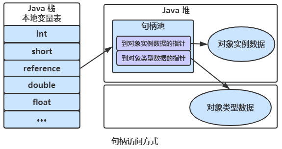
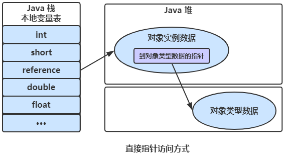

# HotSpot虚拟机对象探秘

Java里面数据类型主要分为基本数据类型，类，接口，数组这几种。原生类型包括了`int`、`long`、`double`、`char`、`byte`等基本数据类型。基本数据类型对应的包装类型如`Integer`、`Long`、`Double`这些在Java里面归类到类（`class`）里面，这里为了描述方便把接口（`class`）也归类到类（`class`）里面。所以总的来说Java的数据类型主要归为三类：

- 基本数据类型
- 类（`class`）
- 数组

其中只有类和数组在Java虚拟机里面是对象的形式的创建的，所以我们说的对象通常就是指类和数组的实例。

## 对象的内存布局

在HotSpot虚拟机中，对象的内存布局分为以下3块区域：

- 对象头（Header）
- 实例数据（Instance Data）
- 对齐填充（Padding）

### 对象头

对象头分为两部分：Mark Word与Class Pointer（类型指针）。

- Mark Word存储了对象的`hashCode`、GC信息、锁信息三部分
- Class Pointer存储了指向类对象信息的指针。

在32位JVM上对象头占用的大小是8字节，64位JVM则是16字节，两种类型的Mark Word和Class Pointer各占一半空间大小。在64位JVM上有一个压缩指针选项`-XX:+UseCompressedOops`，默认是开启的。开启之后Class Pointer部分就会压缩为4字节，此时对象头大小就会增加到12字节。

下面是用一张图展示32位JVM上Mark Word的内存分布，方便理解。

### 实例数据

实例数据部分就是成员变量的值，其中包括父类成员变量和本类成员变量。

有一种错觉就是实例数据里面通常只存了数据本身，但实际上这部分JVM也做了对齐填充，这样做的目的是为了内存对齐，为了实现这个效果JVM会执行一个字段重排列的操作。

字段重排列: 故名思义就是JVM在分配内存时不一定是完全按照类定义的字段顺序去分配，而是根据JVM选项`-XX:FieldsAllocationStyle`（默认是1） 来进行排序。对于所有的`-XX:FieldsAllocationStyle`配置选项来说都会遵守以下两个原则：

- 如果一个字段的大小为S字节，则对象开始的位置到该字段的位置的偏移量一定满足：
  - 该字段的位置 - 对象开始位置 = m * S (m>=1)
  - 在64位JVM开启压缩指针的基础上举个例子：对象的分配第一个字段是个`long`类型，这时对象头的大小为12个字节，`long`的大小8个字节。14不能整除8，这时JVM会填充4个字节。让字段的位置从16开始，这样压缩节省出来的4字节空间实际上被还回去了。
- 子类继承父类字段的偏移量一定和父类是一致的。在具体的64位JVM实现中对还会对比子类的实例数据进行以下对齐：如果开启了压缩指针则子类第一个字段的偏移量是4N，关闭压缩指针之后是8N。

### 对齐填充

对齐填充用于确保对象的总长度为8字节的整数倍。

HotSpot VM的自动内存管理系统要求对象的大小必须是8字节的整数倍。对齐填充专指对象末尾的填充，如果对象填充完实例数据后的大小不满足8N，则填充到8N。

对齐填充并不是必然存在，也没有特别的含义，它仅仅起着占位符的作用。

[聊聊java对象内存布局](https://zhuanlan.zhihu.com/p/50984945)

## 对象的创建过程

对象的创建过程分为5步

1. 类加载过程
2. 分配内存
3. 初始化零值
4. 设置对象头
5. 执行init方法

### 类加载过程

虚拟机遇到一条`new`指令时，首先将去检查这个指令的参数是否能在常量池中定位到这个类的符号引用，并且检查这个符号引用代表的类是否已被加载过、解析和初始化过。如果没有，那必须先执行相应的类加载过程。

### 分配内存

对象所需内存的大小在类加载完成后便可完全确定，接下来从堆中划分一块对应大小的内存空间给新的对象。

#### 内存分配方式

分配堆中内存有两种方式：

- 指针碰撞。如果Java堆中内存绝对规整（说明采用的是“**复制算法**”或“**标记整理法**”），空闲内存和已使用内存中间放着一个指针作为分界点指示器，那么分配内存时只需要把指针向空闲内存挪动一段与对象大小一样的距离，这种分配方式称为“指针碰撞”。
- 空闲列表。如果Java堆中内存并不规整，已使用的内存和空闲内存交错（说明采用的是“**标记-清除法**”，有碎片），此时没法简单进行指针碰撞，VM必须维护一个列表，记录其中哪些内存块空闲可用。分配之时从空闲列表中找到一块足够大的内存空间划分给对象实例。这种方式称为“空闲列表”。

#### 内存分配并发问题

在创建对象的时候有一个很重要的问题，就是线程安全，因为在实际开发过程中，创建对象是很频繁的事情，作为虚拟机来说，必须要保证线程是安全的。

通常来讲，虚拟机采用两种方式来保证线程安全：

- **CAS + 失败重试**：CAS是乐观锁的一种实现方式。所谓乐观锁就是，每次不加锁而是假设没有冲突而去完成某项操作，如果因为冲突失败就重试，直到成功为止。虚拟机采用CAS配上失败重试的方式保证更新操作的原子性。
- **TLAB**： 为每一个线程预先在Eden区分配一块TLAB内存，JVM在给线程中的对象分配内存时，首先在TLAB分配，当对象大于TLAB中的剩余内存或TLAB的内存已用尽时，再采用上述的CAS进行内存分配。

### 初始化零值

内存分配完成后，虚拟机需要将分配到的内存空间都初始化为零值（不包括对象头），这一步操作保证了对象的实例字段在Java代码中可以不赋初始值就直接使用，程序能访问到这些字段的数据类型所对应的零值。

### 设置对象头

初始化零值完成之后，虚拟机要对对象进行必要的设置。例如这个对象是哪个类的实例、如何才能找到类的元数据信息、对象的哈希码、对象的GC分代年龄等信息。这些信息存放在对象头中。另外，根据虚拟机当前运行状态的不同，如是否启用偏向锁等，对象头会有不同的设置方式。

### 执行`init`方法

在上面工作都完成之后，从虚拟机的视角来看，一个新的对象已经产生了，但从Java程序的视角来看，对象创建才刚开始，`init`方法还没有执行，所有的字段都还为零。所以一般来说，执行`new`指令之后会接着执行`init`方法，把对象按照程序员的意愿进行初始化，这样一个真正可用的对象才算完全产生出来。

## 对象的访问方式

所有对象的存储空间都是在堆中分配的，但是这个对象的引用却是在堆栈中分配的。也就是说在建立一个对象时两个地方都分配内存，在堆中分配的内存实际建立这个对象，而在堆栈中分配的内存只是一个指向这个堆对象的指针（引用）而已。根据引用存放的地址类型的不同，对象有不同的访问方式。

### 句柄访问方式

如果使用句柄的话，那么Java堆中将会划分出一块内存来作为句柄池，reference中存储的就是对象的句柄地址，而句柄中包含了对象实例数据与类型数据各自的具体地址信息；

### 直接指针访问方式

reference中直接存储对象实例的地址，从而不需要句柄池，通过引用能够直接访问对象实例数据。但对象所在的内存空间需要额外的策略存储对象所属的类信息的地址。

### 二者比较

这两种对象访问方式各有优势。

- 使用句柄来访问的最大好处是reference中存储的是稳定的句柄地址，在对象被移动时只会改变句柄中的实例数据指针，而reference本身不需要修改。
- 使用直接指针访问方式最大的好处就是速度快，它节省了一次指针定位的时间开销。
