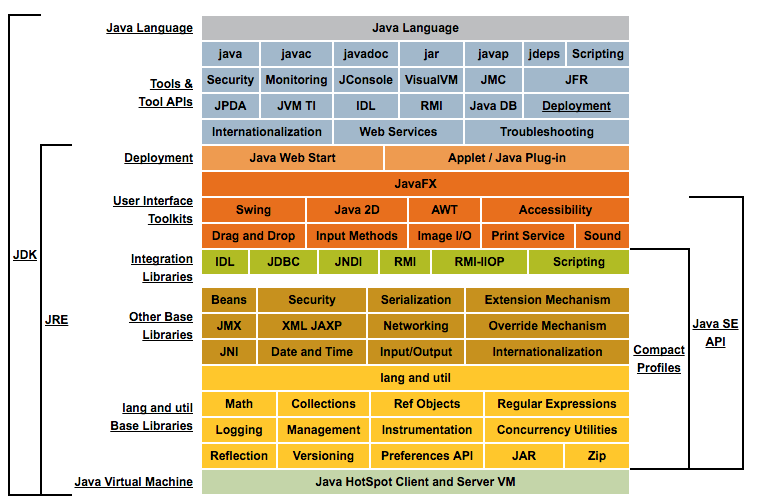
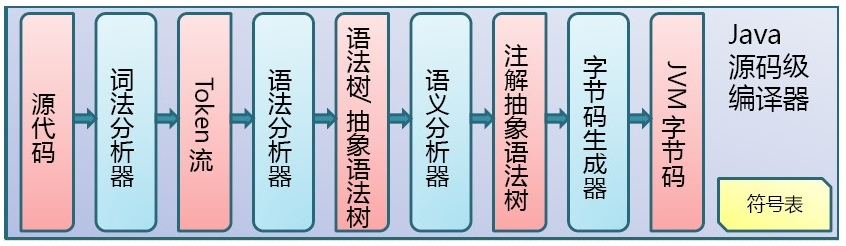
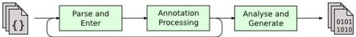
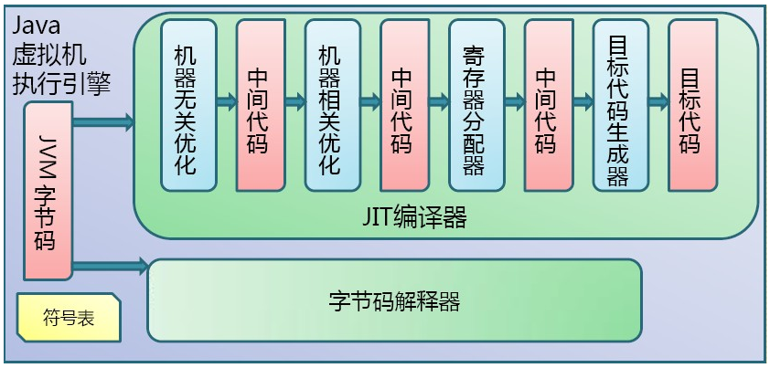

# JVM概述

Java虚拟机（Java Virtual Machine，缩写为JVM），是一种能够运行Java字节码（byte code）的虚拟机，以堆栈结构机器来进行实做。是Java平台的一部分，能够运行以Java语言写作的软件程序。

## JVM的重要性

JVM是Java的核心和基础，在Java编译器和os平台之间的虚拟处理器。它是一种基于下层的操作系统和硬件平台并利用软件方法来实现的抽象的计算机，可以在上面执行Java的字节码程序。

Java编译器只需面向JVM，生成JVM能理解的代码或字节码文件。Java源文件经编译器，编译成字节码程序，通过JVM将每一条指令翻译成不同平台机器码，通过特定平台运行。

简单的说，JVM就相当于一台柴油机，它只能用Java（柴油）运行，JVM就是Java的虚拟机，有了JVM才能运行Java程序。

Java虚拟机屏蔽了与具体操作系统平台相关的信息，使得Java语言编译程序只需生成在Java虚拟机上运行的目标代码(字节码)，就可以在多种平台上不加修改地运行。Java虚拟机在执行字节码时，实际上最终还是把字节码解释成具体平台上的机器指令执行。

## Java代码编译和执行的整个过程

包含了以下三个重要的机制：

- Java源码编译机制
- 类加载机制
- 类执行机制

### Java源码编译机制

Java代码编译是由Java源码编译器来完成，流程图如下所示：

Java源码编译由以下三个过程组成：

- 分析和输入到符号表
- 注解处理
- 语义分析和生成class文件。

最后生成的class文件由以下部分组成：

- 结构信息。包括class文件格式版本号及各部分的数量与大小的信息。
- 元数据。对应于Java源码中声明与常量的信息。包含类/继承的超类/实现的接口的声明信息、域与方法声明信息和常量池。
- 方法信息。对应Java源码中语句和表达式对应的信息。包含字节码、异常处理器表、求值栈与局部变量区大小、求值栈的类型记录、调试符号信息。

### 类加载机制

JVM的类加载是通过ClassLoader及其子类来完成的。

### 类执行机制

Java字节码的执行是由JVM执行引擎来完成，流程图如下所示：

JVM是基于栈的体系结构来执行class字节码的。线程创建后，都会产生程序计数器（PC）和栈（Stack），程序计数器存放下一条要执行的指令在方法内的偏移量，栈中存放一个个栈帧，每个栈帧对应着每个方法的每次调用，而栈帧又是有局部变量区和操作数栈两部分组成，局部变量区用于存放方法中的局部变量和参数，操作数栈中用于存放方法执行过程中产生的中间结果。
