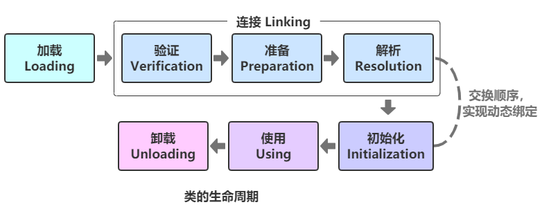
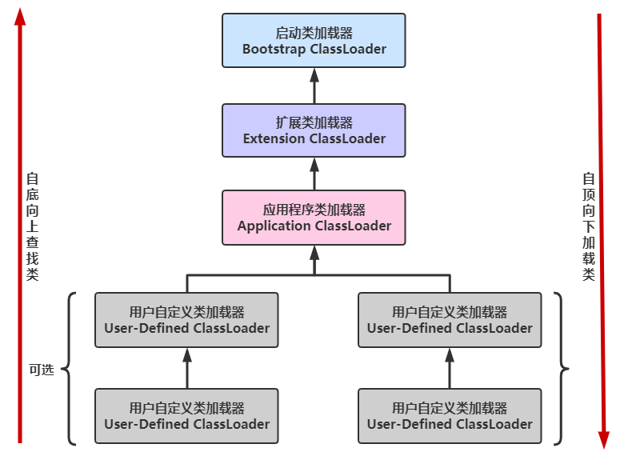

# 类加载机制

## 类的生命周期

类从被加载到虚拟机内存开始，到卸载出内存为止，它的整个生命周期包括以下7个阶段：

- **加载（Loading）**
- **验证（Verification）**
- **准备（Preparation）**
- **解析（Resolution）**
- **初始化（Initialization）**
- 使用（Using）
- 卸载（Unloading）



- 验证、准备、解析3个阶段统称为连接。
- 加载、验证、准备、初始化和卸载这5个阶段的顺序是确定的，类的加载过程必须按照这种顺序按部就班地开始（注意是“开始”，而不是“进行”或“完成”）
- 而解析阶段则不一定：它在某些情况下可以在初始化后再开始，这是为了支持Java语言的运行时绑定。

## 类加载过程

类是在运行期间第一次使用时动态加载的，而不是一次性加载所有类。因为如果一次性加载，那么会占用很多的内存。

系统加载`Class`类型的文件主要三步：加载 -> 连接 -> 初始化。
连接过程又可分为三步:验证 -> 准备 -> 解析。

### 加载

加载是类加载的一个阶段，注意不要混淆。

#### 加载过程完成三件事

1. 通过类的完全限定名称获取定义该类的二进制字节流。
2. 将该字节流表示的静态存储结构转换为方法区的运行时存储结构。
3. 在内存中生成一个代表该类的`Class`对象，作为方法区中该类各种数据的访问入口。

#### 二进制字节流获取方式

- 从zip包读取，成为jar、ear、war格式的基础。
- 从网络中获取，最典型的应用是Applet。
- 运行时计算生成，例如动态代理技术，在`java.lang.reflect.Proxy`使用`ProxyGenerator.generateProxyClass`的代理类的二进制字节流。
- 由其他文件生成，例如由JSP文件生成对应的`Class`类。

#### 数组对象的加载

数组类型不通过类加载器创建，它由Java虚拟机直接创建。

一个非数组类的加载阶段（加载阶段获取类的二进制字节流的动作）是可控性最强的阶段，这一步我们可以去完成还可以自定义类加载器去控制字节流的获取方式（重写一个类加载器的`loadClass()`方法）。

### 连接

#### 验证

确保class文件的字节流中包含的信息符合当前虚拟机的要求，并且不会危害虚拟机自身的安全。

- 文件类型验证：验证字节流是否符合class文件格式的规范，例如：是否以`0xCAFEBABE`开头、主次版本号是否在当前虚拟机的处理范围之内、常量池中的常量是否有不被支持的类型。
- 元数据验证：对字节码描述的信息进行语义分析（注意：对比`javac`编译阶段的语义分析），以保证其描述的信息符合Java语言规范的要求，例如：这个类是否有父类，除`java.lang.Object`之外所有类都有父类）、这个类是否被继承了不允许继承的类（被`final`修饰的类）等等。
- 字节码验证：最复杂的一个阶段。通过数据流和控制流分析，确定程序语义是合法的、符合逻辑的。比如保证任意时刻操作数栈和指令代码序列都能配合工作。
- 符号引用验证：确保解析动作能正确执行。

#### 准备

类变量是被`static`修饰的变量，**准备阶段为类变量分配内存并设置初始值**，使用的是方法区的内存。

实例变量不会在这阶段分配内存，它会在对象实例化时随着对象一起被分配在堆中。应该注意到，实例化不是类加载的一个过程，类加载发生在所有实例化操作之前，并且类加载只进行一次，实例化可以进行多次。

初始值一般为0值，例如下面的类变量value被初始化为0而不是123。

```java
public static int value = 123;
```

如果类变量是常量（`final`），那么它将初始化为表达式所定义的值而不是0。例如下面的常量value被初始化为123而不是0。所以必须类常量必须在声明时就进行初始化。

```java
public static final int VALUE = 123;
```

#### 解析

解析阶段是虚拟机**将常量池内的符号引用替换为直接引用**的过程。解析动作主要针对类或接口、字段、类方法、接口方法、方法类型、方法句柄和调用限定符7类符号引用进行。

符号引用和直接引用

- 符号引用就是一组符号来描述目标，可以是任何字面量。
- 直接引用就是直接指向目标的指针、相对偏移量或一个间接定位到目标的句柄。

**在程序实际运行时，只有符号引用是不够的。**

举个例子：在程序执行方法时，系统需要明确知道这个方法所在的位置。Java虚拟机为每个类都准备了一张方法表来存放类中所有的方法。当需要调用一个类的方法的时候，只要知道这个方法在方法表中的偏移量就可以直接调用该方法了。通过解析操作符号引用就可以直接转变为目标方法在类中方法表的位置，从而使得方法可以被调用。

综上，解析阶段是虚拟机将常量池内的符号引用替换为直接引用的过程，也就是得到类或者字段、方法在内存中的指针或者偏移量。

解析过程在某些情况下可以在初始化阶段之后再开始，这是为了支持Java的动态绑定。

### 初始化

初始化是类加载的最后一步，也是真正执行类中定义的Java程序代码（字节码），初始化阶段是JVM执行类构造器`<clinit>()`方法的过程。在准备阶段，类变量已经赋过一次系统要求的初始值，而在初始化阶段，根据程序员通过程序制定的主观计划去初始化类变量和其它资源。

`<clinit>()`是由编译器自动收集类中所有**类变量的赋值动作**和**静态语句块中的语句**合并产生的，编译器收集的顺序由语句在源文件中出现的顺序决定。特别注意的是，静态语句块只能访问到定义在它之前的类变量，**定义在它之后的类变量只能赋值**，不能访问。例如以下代码：

```java
public class Test {
    static {
        i = 0;                // 给变量赋值可以正常编译通过
        System.out.print(i);  // 这句编译器会提示“非法向前引用”
    }
    static int i = 1;
}
```

由于父类的`<clinit>()`方法先执行，也就意味着父类中定义的静态语句块的执行要优先于子类。

#### 多线程下的初始化

虚拟机会保证一个类的`<clinit>()`方法在多线程环境下被正确的加锁和同步。如果多个线程同时初始化一个类，只会有一个线程执行这个类的`<clinit>()`方法，其它线程都会阻塞等待，直到活动线程执行`<clinit>()`方法完毕。

如果在一个类的`<clinit>()`方法中有耗时的操作，就可能造成多个线程阻塞，在实际过程中此种阻塞很隐蔽。

#### 类初始化时机

##### 主动引用

Java虚拟机规范没有强制约束类加载过程的第一阶段（即：加载）什么时候开始，但对于“初始化”阶段，有着严格的规定。有且仅有5种情况必须立即对类进行“初始化”，这5种场景中的行为称为对一个类进行主动引用：

1. 在遇到`new`、`putstatic`、`getstatic`、`invokestatic`字节码指令时，如果类尚未初始化，则需要先触发其初始化。
2. 对类进行反射调用时，如果类还没有初始化，则需要先触发其初始化。
3. 初始化一个类时，如果其父类还没有初始化，则需要先初始化父类。
4. 虚拟机启动时，用于需要指定一个包含`main()`方法的主类，虚拟机会先初始化这个主类。
5. 当使用JDK 1.7的动态语言支持时，如果一个`java.lang.invoke.MethodHandle`实例最后的解析结果为REF_getStatic、REF_putStatic、REF_invokeStatic的方法句柄，并且这个方法句柄所对应的类还没初始化，则需要先触发其初始化。

##### 被动引用

除了5种主动动引用值之外，其它所有引用类的方式都不会触发初始化，称为被动引用。

1. 通过子类引用父类的静态字段，不会导致子类初始化。

    ```java
    class SuperClass {
        static {
            System.out.println("SuperClass init!");
        }
        public static int value = 123;
    }

    class SubClass extends SuperClass {
        static {
            System.out.println("SubClass init!");
        }
    }

    public class NotInitialization {
        public static void main(String[] args) {
            System.out.println(SubClass.value);
        }
    }

    /**!Output:
     * SuperClass init!
     * 123
     */
    ```

    对于静态字段，只有直接定义这个字段的类才会被初始化，因此通过其子类来引用父类中定义的静态字段，只会触发父类的初始化而不会触发子类的初始化。
2. 通过数组定义来引用类，不会触发此类的初始化。

    ```java
    SuperClass[] superClasses = new SuperClass[10];
    System.out.println(superClasses.getClass());

    /**!Output:
     * class [Lcom.hkllyx.advance.jvm.SuperClass;
     */
    ```

    这段代码不会触发父类的初始化，但会触发`[L*类的完全限定名;*`这个类的初始化，它由虚拟机自动生成，直接继承自`java.lang.Object`，创建动作由字节码指令`newarray`触发。
3. 常量在编译阶段会存入调用类的常量池中，本质上并没有直接引用到定义常量的类，因此不会触发定义常量的类的初始化。

    ```java
    class ConstClass {
        static {
            System.out.println("ConstClass init!");
        }
        public static final String HELLO_BINGO = "Hello Bingo";
    }

    public class NotInitialization {
        public static void main(String[] args) {
            System.out.println(ConstClass.HELLO_BINGO);
        }
    }

    /**!Output:
     * Hello Bingo
     */
    ```

    编译通过之后，常量存储到`NotInitialization`类的常量池中，`NotInitialization`的class文件中并没有`ConstClass`类的符号引用入口，这两个类在编译成class之后就没有任何联系了。

#### 接口的初始化

接口中不可以使用静态语句块，但仍然有类变量初始化的赋值操作，因此接口与类一样都会生成`<clinit>()`方法。

但接口与类不同的是

- 当一个类在初始化时，要求其父类全部都已经初始化过了。即父类的`<clinit>()`方法要先执行
- 但是一个接口在初始化时，并不要求其父接口全部都完成了初始化。即执行接口的`<clinit>()`方法不需要先执行父接口的`<clinit>()`方法。
- 另外，接口的实现类初始化也不要求接口先初始化时。

## 类加载器

### 类与类加载器

#### 判断两个类是否“相等”

任意一个类，都由加载它的**类加载器**和这个**类本身**一同确立其在Java虚拟机中的唯一性，每一个类加载器，都有一个独立的类名称空间。

因此，比较两个类是否“相等”，只有在这两个类是由同一个类加载器加载的前提下才有意义，否则，即使这两个类来源于同一个class文件，被同一个虚拟机加载，只要加载它们的类加载器不同，那么这两个类就必定不相等。

这里的“相等”，包括代表类的`Class`对象的`equals()`方法、`isInstance()`方法的返回结果，也包括使用`instanceof`关键字做对象所属关系判定等情况。

#### 类加载器分类

从Java虚拟机的角度来讲，只存在以下两种不同的类加载器：

- 启动类加载器（Bootstrap ClassLoader）：使用C++实现，是虚拟机自身的一部分；
- 所有其它类的加载器：使用Java实现，独立于虚拟机，继承自抽象类`java.lang.ClassLoader`。

从Java开发人员的角度看，类加载器可以划分得更细致一些：

- 启动类加载器（Bootstrap ClassLoader）
    - 最顶层的加载类，由C++实现
    - 此类加载器负责将存放在`%JRE_HOME%/lib`目录中的，或者被`-Xbootclasspath`参数所指定的路径中的，并且是虚拟机识别的（仅按照文件名识别，如rt.jar，名字不符合的类库即使放在lib目录中也不会被加载）类库加载到虚拟机内存中
    - 启动类加载器无法被Java程序直接引用，用户在编写自定义类加载器时，如果需要把加载请求委派给启动类加载器，直接使用`null`代替即可
- 扩展类加载器（Extension ClassLoader）
    - 这个类加载器是由`ExtClassLoader`（`sun.misc.Launcher$ExtClassLoader`）实现的
    - 它负责`%JAVA_HOME%/lib/ext`或者被`java.ext.dir`系统变量所指定路径中的所有类库加载到内存中
    - 开发者可以直接使用扩展类加载器
- 应用程序类加载器（Application ClassLoader）
    - 这个类加载器是由`AppClassLoader`（`sun.misc.Launcher$AppClassLoader`）实现的
    - 由于这个类加载器是`ClassLoader`中的`getSystemClassLoader()`方法的返回值，因此一般称为系统类加载器
    - 它负责加载用户类路径`classpath`上所指定的类库
    - 开发者可以直接使用这个类加载器
    - 如果应用程序中没有自定义过自己的类加载器，一般情况下这个就是程序中默认的类加载器

### 双亲委派模型

#### 双亲委派模型介绍

每一个类都有一个对应它的类加载器。系统中的`ClassLoader`在协同工作的时候会默认使用双亲委派模型。

即一个类加载器首先将类加载请求转发到父类加载器，只有当父类加载器无法完成时才尝试自己加载。

`AppClassLoader`的父类加载器为`ExtClassLoader`。`ExtClassLoader`的父类加载器为`null`，`null`并不代表`ExtClassLoader`没有父类加载器，而是Bootstrap ClassLoader。



过程：

- 在类加载的时候，系统会首先判断当前类是否被加载过；
- 若是已经被加载，则加载的类会直接返回；
- 若没有，则尝试加载该类；
    - 加载时，首先将请求委派给父类加载器的`loadClass()`处理。如果父类加载器为`null`或启动类加载器时，启动类加载器直接加载类。
    - 否则，父类加载器再请求其父类加载器处理。一层层向上请求，因此所有的请求最终都应该传送到顶层的启动类加载器`BootstrapClassLoader`中。
    - 但只要当父类加载器加载失败时抛出`ClassNotFoundException`，此时就尝试自己去加载。

其实这个双亲翻译的容易让别人误解，我们一般理解的双亲都是父母，这里的双亲更多地表达的是“父母这一辈”的人而已，并不是说真的有一个Mother ClassLoader和一个Father ClassLoader。另外，类加载器之间的“父子”关系也不是通过继承来体现的，是由“优先级”来决定。官方API文档对这部分的描述如下:
> The Java platform uses a delegation model for loading classes. **The basic idea is that every class loader has a "parent" class loader**. When loading a class, a class loader first "delegates" the search for the class to its parent class loader before attempting to find the class itself.

#### `loadClass()`源码分析

```java
protected Class<?> loadClass(String name, boolean resolve)
        throws ClassNotFoundException {
    synchronized (getClassLoadingLock(name)) {
        // 首先，确定类是否已经加载（本地方法实现）
        Class<?> c = findLoadedClass(name);
        // 如果没有，则进行加载
        if (c == null) {
            long t0 = System.nanoTime();
            try {
                // 如果父类加载器不是null，使用父类加载器加载
                if (parent != null) {
                    c = parent.loadClass(name, false);
                // 否则使用启动类加载器BootstrapClassLoader加载
                } else {
                    c = findBootstrapClassOrNull(name);
                }
            } catch (ClassNotFoundException e) {
                // 父类加载器加载时抛出ClassNotFoundException，说明父类加载器加载失败
            }

            // 如果仍没有加载成功，则自己加载
            if (c == null) {
                long t1 = System.nanoTime();
                c = findClass(name);
                // this is the defining class loader; record the stats
                sun.misc.PerfCounter.getParentDelegationTime().addTime(t1 - t0);
                sun.misc.PerfCounter.getFindClassTime().addElapsedTimeFrom(t1);
                sun.misc.PerfCounter.getFindClasses().increment();
            }
        }
        if (resolve) {
            resolveClass(c);
        }
        return c;
    }
}
```

#### 双亲委派模型的好处

1. 双亲委派模型保证了Java程序的稳定运行，可以避免类的重复加载（JVM区分不同类的方式不仅仅根据类名，相同的类文件被不同的类加载器加载产生的是两个不同的类），也保证了Java的核心API不被篡改。
2. 使得Java类随着它的类加载器一起具有一种带有优先级的层次关系，从而使得基础类得到统一。
    - 例如：`java.lang.Object`存放在rt.jar中，如果编写另外一个`java.lang.Object`并放到classpath中，程序可以编译通过。
    - 由于双亲委派模型的存在，所以在rt.jar中的`Object`比在classpath中的`Object`优先级更高，这是因为rt.jar中的`Object`使用的是启动类加载器，而classpath中的`Object`使用的是应用程序类加载器。
    - rt.jar中的`Object`优先级更高，那么程序中所有的`Object`都是这个`Object`。

#### 如果我们不想用双亲委派模型怎么办？

为了避免双亲委托机制，我们可以自己定义一个类加载器，然后重载`loadClass()`即可。

#### 用户自定义类加载器

除了`BootstrapClassLoader`其他类加载器均由Java实现且全部继承自`java.lang.ClassLoader`。如果我们要自定义自己的类加载器，很明显需要继承`ClassLoader`。

## 类初始化方法和对象初始化方法对比

类初始化初始化方法`<clinit>()`：编译器会按声明顺序，收集类变量的赋值语句、静态代码块，最终组成类初始化方法。**类初始化方法一般在类初始化的时候执行**。

对象初始化方法`<init>()`：编译器会按声明顺序，收集成员变量的赋值语句、普通代码块，最后收集构造函数的代码，最终组成对象初始化方法。**对象初始化方法一般在实例化类对象的时候执行。**

[两道面试题，带你解析Java类加载机制](https://www.cnblogs.com/chanshuyi/p/the_java_class_load_mechamism.html)
