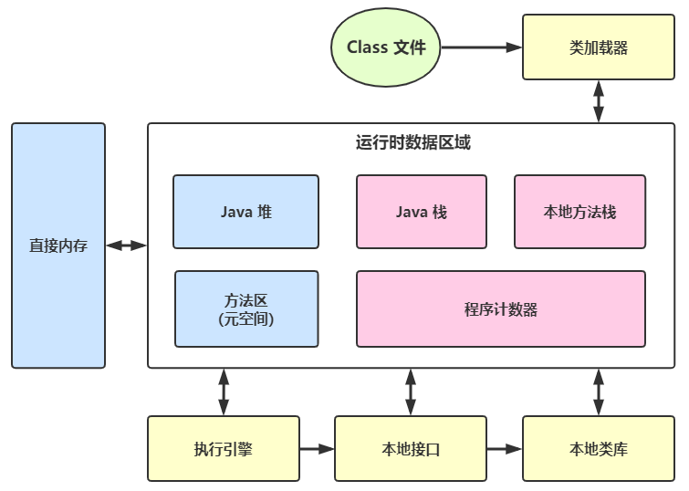
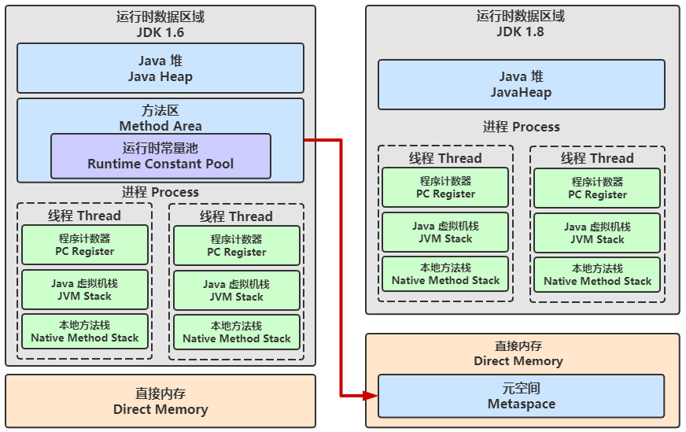

# 运行时数据区域

所有的Java开发人员可能会遇到这样的困惑：

- 我该为堆内存设置多大空间呢？
- `OutOfMemoryError`的异常到底涉及到运行时数据的哪块区域？该怎么解决呢？

其实如果你经常解决服务器性能问题，那么这些问题就会变的非常常见，了解JVM内存也是为了服务器出现性能问题的时候可以快速的了解那块的内存区域出现问题，以便于快速的解决生产故障。本文简单介绍JVM的运行时数据区域。**如果没有特殊说明，都是针对的是HotSpot虚拟机。**

从整体角度上看JVM的运行时数据区域在JVM中的位置。

Java虚拟机运行时数据区域分为5个子区域：

- Java堆
- 方法区
- 程序计数器
- Java虚拟机栈
- 本地方法栈

其中堆和方法区是属于整个进程的，线程共享。程序计数器、Java虚拟机栈以及本地方法栈是属于线程的，线程私有。

## Java堆

对于大多数应用来说，Java堆（Java Heap）是Java虚拟机所管理的内存中最大的一块。Java堆是被所有线程共享的一块内存区域，在虚拟机启动时创建。**此内存区域的唯一目的就是存放对象实例，几乎所有的对象实例都在这里分配内存。**

### 内存分配

根据Java虚拟机规范的规定，Java堆可以处于物理上不连续的内存空间中，只要逻辑上是连续的即可，就像我们的磁盘空间一样。在实现时，既可以实现成固定大小的，也可以是可扩展的，不过当前主流的虚拟机都是按照可扩展来实现的（通过`-Xmx`和`-Xms`控制）。

如果在Java堆中没有内存完成实例分配，并且Java堆也无法再扩展时，将会抛出`OutOfMemoryError`异常。

### 分代

Java堆是垃圾收集器管理的主要区域，因此很多时候也被称做“**GC堆**”。

从内存回收的角度看，由于现在收集器基本都是采用的分代收集算法，所以Java堆中还可以细分为：新生代和老年代；而新生代再细致一点划分可以分为Eden空间、From Survivor空间、To Survivor空间等，它们在默认情况下按照`8:1:1`的比例划分。

进一步划分的目的是更好地回收内存，或者更快地分配内存。

## 方法区

方法区（Method Area）与Java堆一样，是各个线程共享的内存区域，**它用于存储已被虚拟机加载的类信息、字面量、静态变量、即时编译器编译后的代码等数据**。

虽然Java虚拟机规范把方法区描述为堆的一个逻辑部分，但是它却有一个别名叫做**Non-Heap**（非堆），目的应该是与Java堆区分开来。

Java虚拟机规范只是规定了有方法区这么个概念和它的作用，并没有规定如何去实现它。那么，在不同的JVM上方法区的实现肯定是不同的了。

### 永久代

对于习惯在HotSpot虚拟机上开发和部署程序的开发者来说，很多人愿意把方法区称为“永久代（Permanent Generation）”。

本质上两者并不等价，仅仅是因为HotSpot虚拟机的设计团队选择把GC分代收集扩展至方法区，或者说使用永久代来实现方法区而已。

方法区和永久代的关系很像Java中接口和类的关系，类实现了接口，而永久代就是HotSpot虚拟机对虚拟机规范中方法区的一种实现方式。也就是说，永久代是HotSpot的概念，方法区是Java虚拟机规范中的定义，是一种规范，而永久代是一种实现，一个是标准一个是实现，其他的虚拟机实现并没有永久代这一说法。

### 元空间

JDK1.7时，HotSpot开始进行移除永久代的工作。JDK1.7中，存储在永久代的部分数据就已经转移到了Java Heap或者是Native Memory。但永久代仍存在于JDK1.7中，并没完全移除。

- 类信息（Class metadata）转移到了Native Memory；
- 符号引用 (Symbols) 转移到了Native Memory；
- 字符串字面量 (interned strings) 转移到了Java Heap；
- 类的静态变量 (class statics variables) 转移到了Java Heap。

JDK 1.8的时候，永久代被彻底移除了，取而代之是元空间（Metaspace）。元空间的本质和永久代类似，都是对JVM规范中方法区的实现。不过元空间与永久代之间最大的区别在于：元空间并不在虚拟机中，而是使用本地内存。因此，默认情况下，元空间的大小仅受本地内存限制，但可以通过参数来指定元空间的大小。

永久代转为元空间的原因

- 字符串存在永久代中，容易出现性能问题和内存溢出。
- 类及方法的信息等比较难确定其大小，因此对于永久代的大小指定比较困难，太小容易出现永久代溢出，太大则容易导致老年代溢出。
- 永久代会为GC带来不必要的复杂度，并且回收效率偏低。
- Oracle可能会将HotSpot与JRockit合二为一。

### 内存分配

Java虚拟机规范对这个区域的限制非常宽松，除了和Java堆一样不需要连续的内存和可以选择固定大小或者可扩展外，还可以选择不实现垃圾收集。相对而言，垃圾收集行为在这个区域是比较少出现的，但并非数据进入了方法区就如永久代的名字一样“永久”存在了。

这个区域的内存回收目标主要是**针对常量池的回收和对类型的卸载**，一般来说这个区域的回收“成绩”比较难以令人满意，尤其是类型的卸载，条件相当苛刻，但是这部分区域的回收确实是有必要的。

根据Java虚拟机规范的规定，当方法区无法满足内存分配需求时，将抛出`OutOfMemoryError`异常。

[Java 8内存模型 — 永久代 (PermGen) 和元空间 (Metaspace)](Java8内存模型—永久代（PermGen）和元空间（PermGen）)

## 程序计数器

程序计数器（Program Counter Register）是一块较小的内存空间，它的作用可以看做是当前线程所执行的字节码的行号指示器。在虚拟机的概念模型里（仅是概念模型，各种虚拟机可能会通过一些更高效的方式去实现），字节码解释器工作时就是通过改变这个计数器的值来选取下一条需要执行的字节码指令，**分支、循环、跳转、异常处理、线程恢复等基础功能都需要依赖这个计数器来完成**。

由于Java虚拟机的多线程是通过线程轮流切换并分配处理器执行时间的方式来实现的，在任何一个确定的时刻，一个处理器（对于多核处理器来说是一个内核）只会执行一条线程中的指令。因此，为了线程切换后能恢复到正确的执行位置，每条线程都需要有一个独立的程序计数器，**各条线程之间的计数器互不影响，独立存储**，我们称这类内存区域为“**线程私有**”的内存。

如果线程正在执行的是一个Java方法，这个计数器记录的是正在执行的虚拟机字节码指令的地址；如果正在执行的是natvie方法，这个计数器值则为空（Undefined）。

此内存区域是**唯一一个在Java虚拟机规范中没有规定任何`OutOfMemoryError`情况的区域**。

## Java虚拟机栈

与程序计数器一样，Java虚拟机栈（JVM Stacks）也是线程私有的，它的生命周期与线程相同。

虚拟机栈描述的是 **Java方法执行的内存模型**：每个方法被执行的时候都会同时创建一个栈帧（Stack Frame）**用于存储局部变量表、操作栈、动态链接、方法出口等信息**。每一个方法被调用直至执行完成的过程，就对应着一个栈帧在虚拟机栈中从入栈到出栈的过程。

- 局部变量表存放了编译期可知的各种基本数据类型、对象引用（reference类型，它不等同于对象本身，根据不同的虚拟机实现，它可能是一个指向对象起始地址的引用指针，也可能指向一个代表对象的句柄或者其他与此对象相关的位置）和`returnAddress`类型（指向了一条字节码指令的地址）。
- 其中64位长度的`long`和`double`类型的数据会占用2个局部变量空间（Slot），其余的数据类型只占用1个。**局部变量表所需的内存空间在编译期间完成分配，当进入一个方法时，这个方法需要在帧中分配多大的局部变量空间是完全确定的，在方法运行期间不会改变局部变量表的大小**。

在Java虚拟机规范中，对这个区域规定了两种异常状况

- 如果线程请求的栈深度大于虚拟机所允许的深度，将抛出`StackOverflowError`异常；
- 如果虚拟机栈可以动态扩展（当前大部分的Java虚拟机都可动态扩展，只不过Java虚拟机规范中也允许固定长度的虚拟机栈），当扩展时无法申请到足够的内存时会抛出`OutOfMemoryError`异常。

## 本地方法栈

本地方法栈（Native Method Stacks）与虚拟机栈所发挥的作用是非常相似的，其区别不过是虚拟机栈为虚拟机执行Java方法（也就是字节码）服务，而**本地方法栈则是为虚拟机使用到的`native`方法服务**。

本地方法一般是用其它语言（C、C++或汇编语言等）编写的，并且被编译为基于本机硬件和操作系统的程序，对待这些方法需要特别处理。

虚拟机规范中对本地方法栈中的方法使用的语言、使用方式与数据结构并没有强制规定，因此具体的虚拟机可以自由实现它。甚至有的虚拟机（譬如Sun HotSpot虚拟机）直接就把本地方法栈和虚拟机栈合二为一。

与虚拟机栈一样，本地方法栈区域也会抛出`StackOverflowError`和`OutOfMemoryError`异常。

## 直接内存

直接内存（Direct Memory）并不是虚拟机运行时数据区域的一部分，也不是虚拟机规范中定义的内存区域，但是这部分内存也被频繁地使用。而且也可能导致`OutOfMemoryError`异常出现。

JDK 1.4中新加入的NIO类，引入了一种基于通道（`Channel`） 与缓存区（`Buffer`） 的IO方式，它可以直接使用`native`函数库直接分配堆外内存，然后通过一个存储在Java堆中的`DirectByteBuffer`对象作为这块内存的引用进行操作。这样就能在一些场景中显著提高性能，因为避免了在Java堆和`native`堆之间来回复制数据。

本机直接内存的分配不会受到Java堆的限制，但是，既然是内存就会受到本机总内存大小以及处理器寻址空间的限制。

### 与堆内存比较

直接内存申请空间耗费更高的性能
直接内存读取IO的性能要优于普通的堆内存。
直接内存作用链：本地IO -> 直接内存 -> 本地IO
堆内存作用链：本地IO -> 直接内存 -> 非直接内存 -> 直接内存 -> 本地IO

[jvm系列（二）:JVM内存结构](https://www.cnblogs.com/ityouknow/p/5610232.html)

[Java内存区域](https://github.com/Snailclimb/JavaGuide/blob/master/docs/java/jvm/Java%E5%86%85%E5%AD%98%E5%8C%BA%E5%9F%9F.md)

## JVM内存设置控制参数

### JDK 1.6

- `Xms`：设置堆的最小空间大小
- `Xmx`：设置堆的最大空间大小
- `XX:NewSize`：设置新生代最小空间大小
- `XX:MaxNewSize`：设置新生代最大空间大小
- `XX:PermSize`：设置永久代最小空间大小
- `XX:MaxPermSize`：设置永久代最大空间大小
- `Xss`：设置每个线程的堆栈大小

没有直接设置老年代的参数，但是可以设置堆空间大小和新生代空间大小两个参数来间接控制。
> 老年代空间大小 = 堆空间大小 -新生代大空间大小

### JDK 1.8

关于永久代的设置失效

- `XX:MetaspaceSize`：设置Metaspace的初始和最小空间大小
- `XX:MaxMetaspaceSize`：设置Metaspace的最大空间大小
