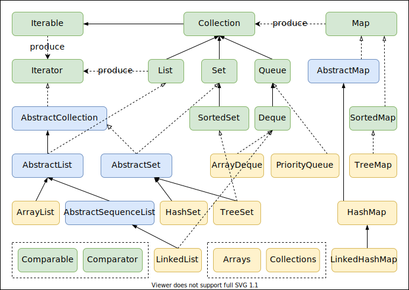

# 一般容器

## 框架类图



## `Collection`

`Collection`存储对象的集合，支持增删元素。

### `List`

`List`必须保持元素插入的顺序。支持`get/set`方法。

- `ArrayList`
    - 基于数组实现，支持随机访问。
    - 默认初始容量为10，当数组大小不足时扩大为当前长度的1.5倍。
    - 线程不安全。
- `LinkedList`
    - 基于双向链表实现，只能顺序访问，但是可以快速地在链表中间插入和删除元素。
    - 不仅如此，`LinkedList`还可以用作栈（Stack）、队列（Queue）和双向队列（Deque）。
    - 线程不安全。
- `Vector`
    - 基于数组实现，支持随机访问。
    - 默认初始容量为10，当数组大小不足时扩大为当前长度的2倍。
    - 线程安全。通过`synchronized`关键字实现的。
    - **遗留类，不推荐使用**。
- `Stack`
    - 继承自`Vector`。
    - 只是在`Vector`的基础上添加了几个方法来完成栈的功能（LIFO）。
    - 线程安全。
    - **遗留类，不推荐使用**。
- `CopyOnWriteArrayList`
    - 线程安全。在写操作的时候通过`ReentrantLock`加锁，复制内部数组修改后替代原有数组。
    - 解决了多线程迭代抛出`ConcurrentModificationException`的问题，但是复制耗费内存。

### `Set`

`Set`不能有重复元素。不支持`get/set`方法

- `HashSet`
    - 内部使用`HashMap`进行数据存储。
    - 不支持有序性操作。
    - 集合元素可以为`null`。
    - 查找的时间复杂度为`O(1)`。
    - 线程不安全。
- `TreeSet`
    - 基于红黑树实现。
    - 内部使用`NavigableMap`操作。默认元素“自然顺序”排列，可以通过`Comparator`改变。
    - 支持有序性操作。
    - 查找的时间复杂度为`O(logN)`。
    - 线程不同步。
- `LinkedHashSet`。
    - 内部使用`LinkedHashMap`进行数据存储，支持`get/set`方法。
    - 具有`HashSet`的查找效率，且内部使用双向链表维护元素的插入顺序。
    - 线程不同步。
- `CopyOnWriteArraySet`
    - 类似`CopyOnWriteArrayList`。

### `Queue`

`Queue`保存处理之前的元素，即队中元素时待处理元素。

通常维护一个先进先出的顺序（FIFO），不支持`set`和获取特定位置的元素`get(int)`，以及删除特定位置的元素。

- `LinkedList`
    - 可用于实现双向队列。
- `PriorityQueue`
    - 基于堆结构实现，默认为最小堆（堆顶最小）。
    - 可以用它来实现优先队列。

#### `Deque`

`Deque`继承自`Queue`，是一个双端队列，它拓展了双端添加/删除/获取的功能，可以支持FIFO、FILO（先进后出，栈）以及更复杂的入队出队情况。

## `Map`

`Map`存储着键值对（两个对象）的映射表。支持`get/replace`操作

- `HashMap`
    - 根据key的hashcode（在对象的`hashcode`上进行处理）进行存储，内部使用静态内部类`Node`的数组进行存储。
    - 默认初始大小为16，每次扩大一倍。
    - 可以接受为`null`的键值（key）和值（value）。
    - 当发生Hash冲突时，采用拉链法（链表）和红黑树处理。
    - JDK8：当单个桶中元素个数大于等于8时，链表实现改为红黑树实现；当元素个数小于6时，变回链表实现。由此来防止hashCode攻击。
    - 线程不安全。
- `TreeMap`
    - 基于红黑树（Red-Black Tree）的`NavigableMap`实现。
    - 能够把它保存的记录根据键排序。默认是按键值的升序排序，也可以指定排序的比较器。
    - 当用`Iterator`遍历`TreeMap`时，得到的记录是有序的。
    - 线程不安全。
- `LinkedHahMap`
    - 继承于`HashMap`。
    - 保存了记录的插入顺序。
    - 线程不安全
- `HashTable`
    - 基于数组存储。
    - `HashTable`不能存储`null`的key和value。
    - 默认的初始大小为11，之后每次扩充，容量变为原来的2n+1。
    - 线程安全。通过`synchronized`关键字实现的。
    - **遗留类，不推荐使用**。
- `WeakHashMap`
    - `WeakHashMap`的`Entry`继承自`WeakReference`，被`WeakReference`关联的对象在下一次垃圾回收时会被回收。
    - 主要用来实现缓存，通过使用`WeakHashMap`来引用缓存对象，由JVM对这部分缓存进行回收。
- `ConccurentHashMap`
    - 线程安全。
    - 内部使用CAS（Compare And Swap）乐观锁。

## 容器的区别

| 类型    | 操作对象 | 顺序       | 增删改查                                               |
| ------- | -------- | ---------- | ------------------------------------------------------ |
| `List`  | 单个对象 | 插入顺序   | 支持获取、替换、删除指定位置的元素                     |
| `Set`   | 单个对象 | 不保证顺序 | 不支持获取、替换、删除元素，只能通过`Iterator`便利元素 |
| `Queue` | 单个对象 | 入队顺序   | 支持获取、删除端处元素                                 |
| `Map`   | 键值对   | 不保证顺序 | 支持根据key获取、替换、删除指定位置的元素              |

- 注意：上面所述均为其基本功能，但可以通过继承、组合等方式实现原本不支持的方法。如：`LinkedHashMap`、`LinkedHashSet`，可以保证插入顺序以及实现指定位置的增删改查

## 迭代器模式

### `Iterator`

```java
public interface Iterator<E> {

    /** 是否有下一个元素 */
    boolean hasNext();

    /** 获取下一个元素下一个元素 */
    E next();

    /** 是移除当前元素，默认不支持 */
    default void remove() {
        throw new UnsupportedOperationException("remove");
    }

    /** 将剩余的元素传递给一个函数（Lambda表达式） */
    default void forEachRemaining(Consumer<? super E> action) {...}
}
```

- 在集合框架中代替了`Enumeration`
    - `Iterator`允许移除（`remove`）操作
    - `Iterator`方法名得到优化
- 实现`Iterator`接口的对象生成一系列元素，每次只生成一个。

### `Iterable`

```java
public interface Iterable<T> {
    /**
     * 返回一个T类型的迭代器
     */
    Iterator<T> iterator();

    /**
     * 将元素传递给一个函数（Lambda表达式）
     */
    default void forEach(Consumer<? super T> action) {...}

    default Spliterator<T> spliterator() {...}
}
```

实现`Iterable`接口的对象可用于`for-each`循环

## 比较相关接口

### `Comparable`

```java
public interface Comparable<T> {
    public int compareTo(T o);
}
```

若一个类实现了`Comparable`接口，就意味着该类支持排序。

`x.compareTo(y)`

- 若x > y，返回正数
- 若x < y，返回负数
- 若x == y，返回0

### `Comparator`

```java
@FunctionalInterface
public interface Comparator<T> {
    int compare(T o1, T o2);
    boolean equals(Object obj);
    ...
}
```

`Comparator`是比较器接口。若需要控制某个类的次序，而该类本身不支持排序(即没有实现`Comparable`接口)；那么，我们可以建立一个该类的比较器来进行排序。这个比较器只需要实现`Comparator`接口即可。也就是说，可以通过实现`Comparator`接口来新建一个比较器，然后通过该比较器对类进行排序。

### 区别与联系

`Comparable`是排序接口。

- 若一个类实现了`Comparable`接口，就意味着该类支持排序。
- 相当于“内部比较器”

`Comparator`是比较器。

- 若需要控制某个类的次序，可以建立一个该类的比较器来进行排序。
- 相当于“外部比较器”。

## 容器工具`Collections`

- 排序列表

    ```java
    // 列表元素需要实现Comparable
    <T extends Comparable<? super T>> void sort(List<T> list)
    // 排序列表，列表元素不需要实现Comparable，但需要指定一个元素的比较器
    <T> void sort(List<T> list, Comparator<? super T> c)
    ```

- 二分法查找，返回指定元素在指定列表中index

    ```java
    // 列表元素需要实现Comparable
    int binarySearch(List<? extends Comparable<? super T>> list, T key)
    // 排序列表，列表元素不需要实现Comparable，但需要指定一个元素的比较器
    int binarySearch(List<? extends T> list, T key, Comparator<? super T> c)
    ```

- 反转列表元素的顺序

    ```java
    void reverse(List<?> list)
    ```

- 打乱列表元素的顺序

    ```java
    // 使用默认随机对象
    void shuffle(List<?> list)
    // 指定随机对象
    void shuffle(List<?> list, Random rnd)
    ```

- 交换指定列表两个位置的元素

    ```java
    void swap(List<?> list, int i, int j)
    ```

- 用指定元素填充列表

    ```java
    void fill(List<? super T> list, T obj)
    ```

- 复制列表

    ```java
    void copy(List<? super T> dest, List<? extends T> src)
    ```

- 获取列表中的最值

    ```java
    // 列表元素需要实现Comparable
    <T extends Object & Comparable<? super T>> T min(Collection<? extends T> coll)
    <T extends Object & Comparable<? super T>> T max(Collection<? extends T> coll)
    // 排序列表，列表元素不需要实现Comparable，但需要指定一个元素的比较器
    <T> T min(Collection<? extends T> coll, Comparator<? super T> comp)
    T max(Collection<? extends T> coll, Comparator<? super T> comp)
    ```

- 旋转列表
    所以元素向后移动`distance`位，末尾移动后超出的元素顺序移到开头。
    可以将列表看成一个首尾相连的环，所以元素按顺序移动`distance`位

    ```java
    void rotate(List<?> list, int distance)
    ```

- 替换列表中所有指定的元素

    ```java
    <T> boolean replaceAll(List<T> list, T oldVal, T newVal)
    ```

- 查找子列表在列表中的位置

    ```java
    int indexOfSubList(List<?> source, List<?> target)
    int lastIndexOfSubList(List<?> source, List<?> target)
    ```

- 生成不可变的只读容器
    注意：生成的容器均为`Collections`的静态内部类

    ```java
    <T> Collection<T> unmodifiableCollection(Collection<T> c)
    <T> Set<T> unmodifiableSet(Set<T> s)
    <T> SortedSet<T> unmodifiableSortedSet(SortedSet<T> s)
    <T> NavigableSet<T> unmodifiableNavigableSet(NavigableSet<T> s)
    <T> List<T> unmodifiableList(List<T> list)
    <K,V> Map<K,V> unmodifiableMap(Map<K,V> m)
    <K,V> SortedMap<K,V> unmodifiableSortedMap(SortedMap<K,V> m)
    <K,V> NavigableMap<K,V> unmodifiableNavigableMap(NavigableMap<K,V> m)
    ```

- 生成不可变的空容器
    注意：生成的容器是`Collections`的内部类

    ```java
    <T> Iterator<T> emptyIterator()
    <T> ListIterator<T> emptyListIterator()
    <T> Set<T> emptySet()
    <E> SortedSet<E> emptySortedSet()
    <E> NavigableSet<E> emptyNavigableSet()
    <T> List<T> emptyList()
    <K,V> Map<K,V> emptyMap()
    <K,V> SortedMap<K,V> emptySortedMap()
    <K,V> NavigableMap<K,V> emptyNavigableMap()
    ```

- 生成不可变的没有重复元素的容器
    注意：生成的容器是`Collections`的内部类，且是不可变容器

    ```java
    <T> Set<T> singleton(T o)
    <T> List<T> singletonList(T o)
    <K,V> Map<K,V> singletonMap(K key, V value)
    ```

- 生成一个同步容器
    注意：生成的容器均为`Collections`的静态内部类，使用`synchronized`关键字保证同步

    ```java
    <T> Collection<T> synchronizedCollection(Collection<T> c)
    <T> Set<T> synchronizedSet(Set<T> s)
    <T> SortedSet<T> synchronizedSortedSet(SortedSet<T> s)
    <T> NavigableSet<T> synchronizedNavigableSet(NavigableSet<T> s)
    <T> List<T> synchronizedList(List<T> list)
    <K,V> Map<K,V> synchronizedMap(Map<K,V> m)
    <K,V> SortedMap<K,V> synchronizedSortedMap(SortedMap<K,V> m)
    <K,V> NavigableMap<K,V> synchronizedNavigableMap(NavigableMap<K,V> m)
    ```

- 生成动态类型检查的容器，需要指定元素类型
    如果尝试向容器插入一个类型不符合要求类型的元素，会立即抛出`ClassCastException`
    注意：生成的容器均为`Collections`的静态内部类

    ```java
    <E> Collection<E> checkedCollection(Collection<E> c, Class<E> type)
    <E> Set<E> checkedSet(Set<E> s, Class<E> type)
    <E> SortedSet<E> checkedSortedSet(SortedSet<E> s, Class<E> type)
    <E> NavigableSet<E> checkedNavigableSet(NavigableSet<E> s, Class<E> type)
    <E> List<E> checkedList(List<E> list, Class<E> type)
    <K, V> Map<K, V> checkedMap(Map<K, V> m, Class<K> keyType, Class<V> valueType)
    <K,V> SortedMap<K,V> checkedSortedMap(SortedMap<K, V> m, Class<K> keyType, Class<V> valueType)
    <K,V> NavigableMap<K,V> checkedNavigableMap(NavigableMap<K, V> m, Class<K> keyType, Class<V> valueType)
    ```

- 生成一个只包含指定元素指定次数的列表
    注意：生成的列表是`Collections`的内部类，是一个只读的列表

    ```java
    <T> List<T> nCopies(int n, T o)
    ```

- 将一个集合装换成`Enumeration`

    ```java
    <T> Enumeration<T> enumeration(final Collection<T> c)
    ```

- 将一个`Enumeration`转成列表

    ```java
    <T> ArrayList<T> list(Enumeration<T> e)
    ```

- 获取一个元素在集合中出现的次数/频率

    ```java
    int frequency(Collection<?> c, Object o)
    ```

- 检验两个集合是否相交

    ```java
    // 两个集合有相同的元素返回false，没有返回true
    boolean disjoint(Collection<?> c1, Collection<?> c2)
    ```

- 向一个集合中加入多个元素（变长参数）

    ```java
    <T> boolean addAll(Collection<? super T> c, T... elements)
    ```

- 根据一个`Map`生成`Set`
    注意：生成的`Set`为`Collections`的内部类

    ```java
    <E> Set<E> newSetFromMap(Map<E, Boolean> map)
    ```

- 根据一个双端队列生成后进先出（LIFO）的队列
    注意：生成的队列为`Collections`的内部类

    ```java
    <T> Queue<T> asLifoQueue(Deque<T> deque)
    ```
