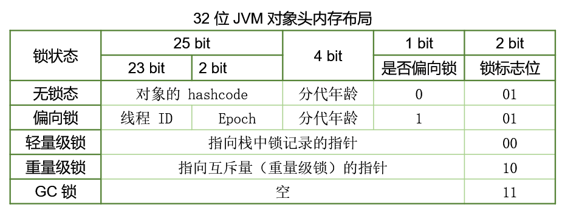
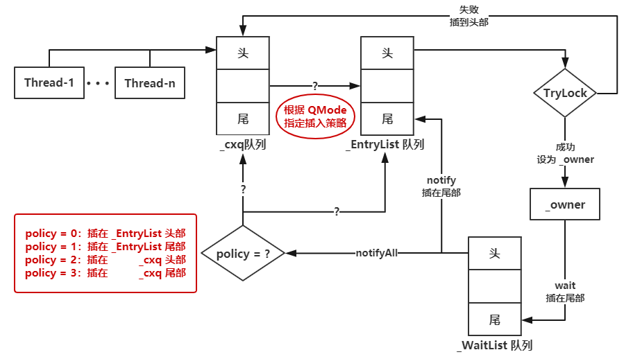
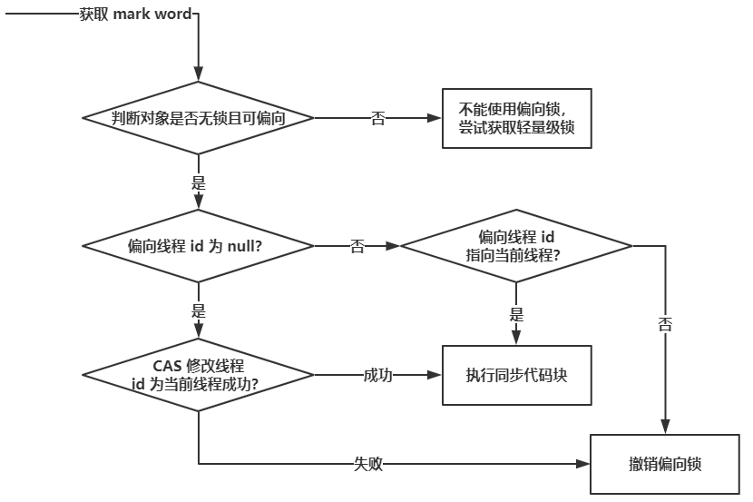
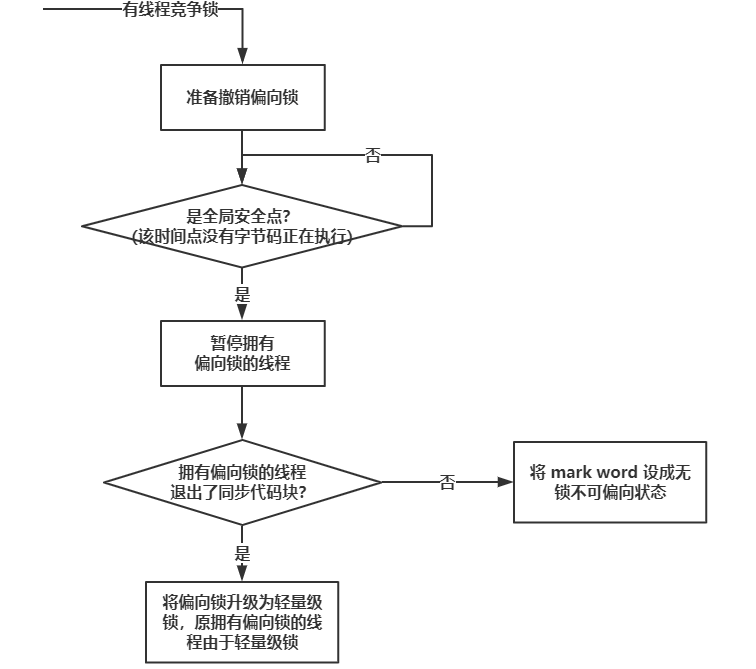
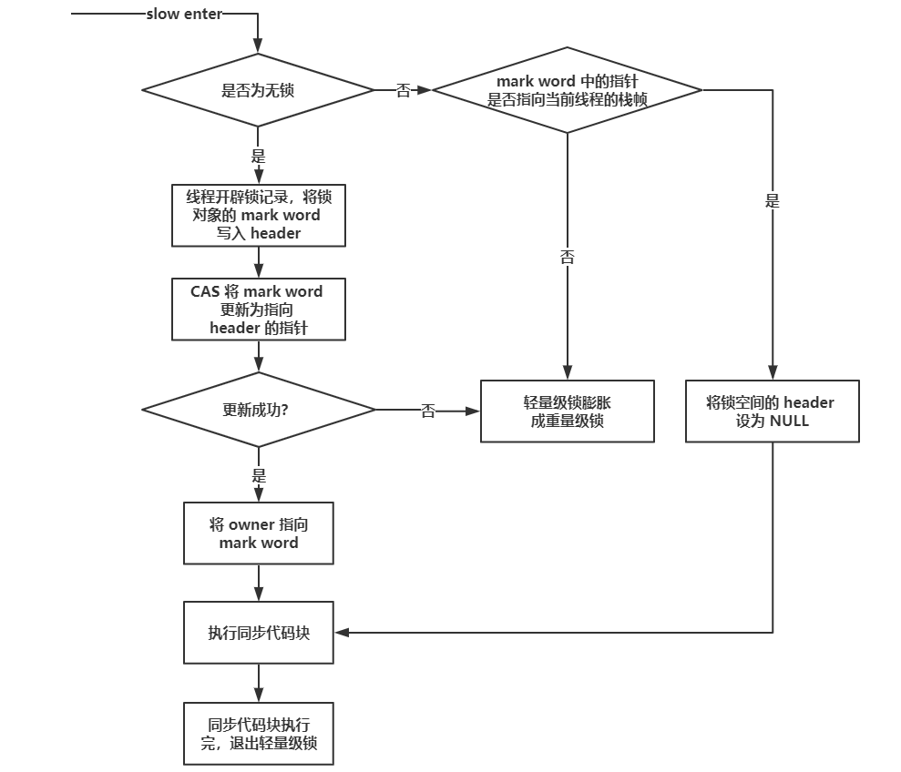
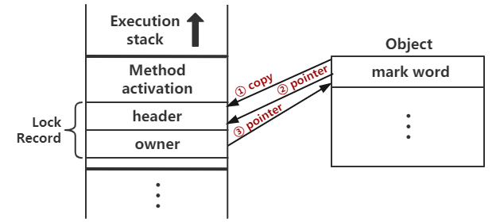
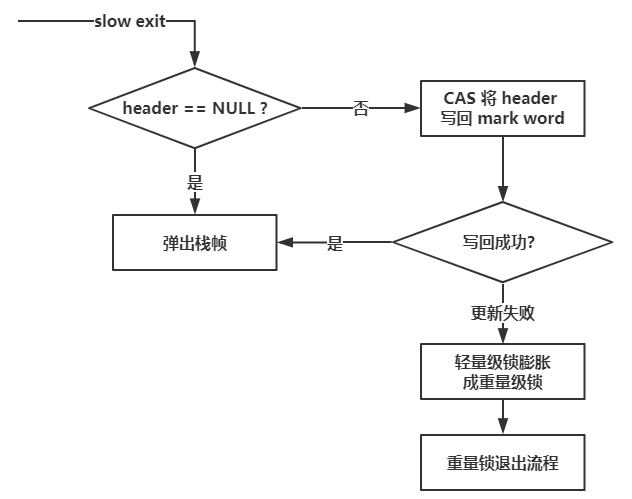
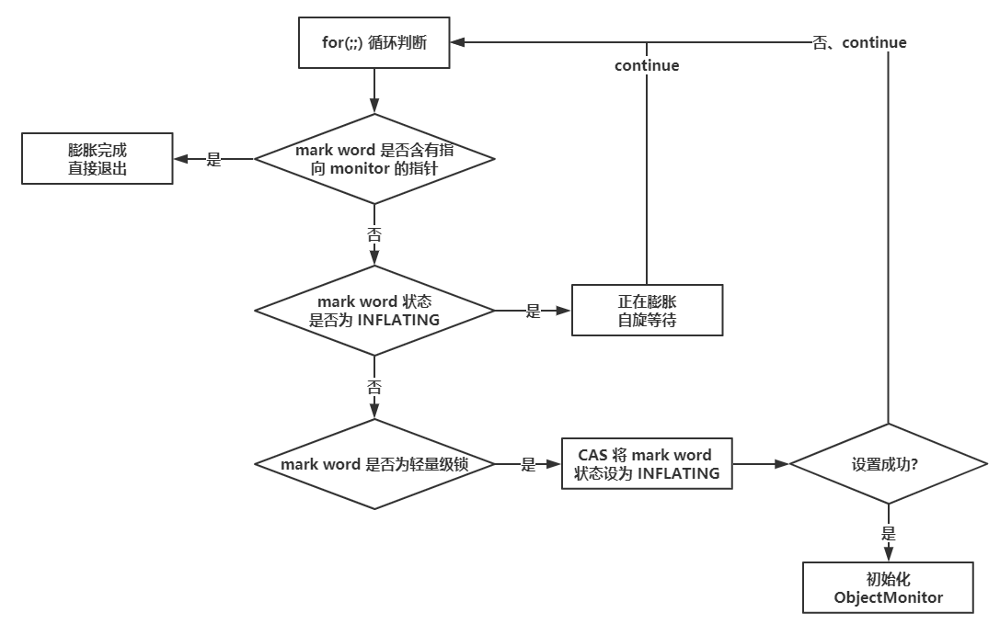
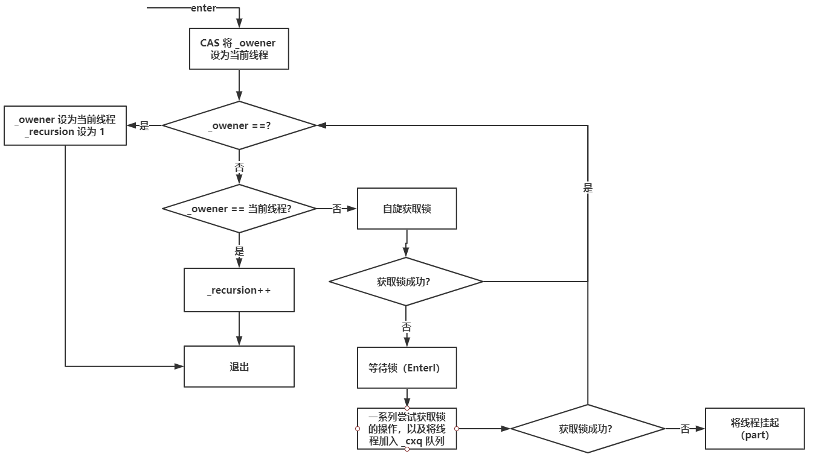
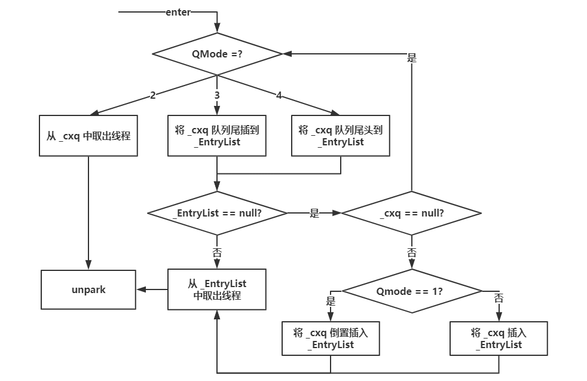

# `synchronized`

在Java中，关键字`synchronized`是最基本的互斥同步手段，它可以保证在同一个时刻，只有一个线程可以执行某个方法或者某个代码块（主要是对方法或者代码块中存在共享数据的操作）。

同时我们还应该注意到`synchronized`另外一个重要的作用，`synchronized`可保证一个线程的变化（主要是共享数据的变化）被其他线程所看到（保证可见性，完全可以替代`volatile`功能），这点确实也是很重要的。

## `synchronized`的主要作用

- 确保线程互斥的访问同步代码
- 保证共享变量的修改能够及时可见
- 有效解决重排序问题。

从语法上讲，`synchronized`总共有三种用法：

- 修饰实例方法：对实例方法的实例加锁，进入同步代码前要获得当前实例的锁。
- 修饰静态方法：对声明方法的类的`Class`对象加锁，进入同步代码前要获得当前类对象的锁。
- 修饰代码块：对指定加锁对象加锁，进入同步代码库前要获得给定对象的锁。

## `synchronized`底层语义原理

Java虚拟机中的同步（Synchronization）基于进入和退出管程/监视器（Monitor）对象实现，无论是显式同步(有明确的`monitorenter`和`monitorexit`指令，即同步代码块）还是隐式同步都是如此。

在Java语言中，同步用的最多的地方可能是被`synchronized`修饰的同步方法。同步方法并不是由`monitorenter`和`monitorexit`指令来实现同步的，而是由方法调用指令读取运行时常量池中方法的`ACC_SYNCHRONIZED`标志来隐式实现的。

### 回顾对象的MarkWord



详见JVM笔记中的《HotSpot虚拟机对象探秘》篇。

### 内置锁（`ObjectMonitor`）

通常所说的对象的内置锁，是对象头Mark Word中的重量级锁指针指向的monitor对象。每个对象都存在着一个monitor与之关联，对象与其monitor之间的关系有存在多种实现方式。如monitor可以与对象一起创建销毁或当线程试图获取对象锁时自动生成，但当一个monitor被某个线程持有后，它便处于锁定状态。`synchronized`通过内置锁来进行同步的。

在Java虚拟机 (HotSpot) 中，monitor是由`ObjectMonitor`实现的，其主要数据结构如下（位于HotSpot虚拟机源码ObjectMonitor.hpp文件，C++实现的）

```java
// src:openjdk\hotspot\src\share\vm\runtime\ObjectMonitor.hpp
ObjectMonitor() {
    _header       = NULL;
    _count        = 0;
    _waiters      = 0,
    _recursions   = 0;      // 线程的重入次数
    _object       = NULL;
    _owner        = NULL;   // 标识拥有该monitor的线程
    _WaitSet      = NULL;   // wait状态的线程组成的双向循环链表，_WaitSet是第一个节点
    _WaitSetLock  = 0 ;
    _Responsible  = NULL ;
    _succ         = NULL ;
    _cxq          = NULL ;
    FreeNext      = NULL ;
    _EntryList    = NULL ;  // block状态的线程组成的双向循环链表，_EntryList是第一个结点
    _SpinFreq     = 0 ;
    _SpinClock    = 0 ;
    OwnerIsThread = 0 ;
}
```

`ObjectMonitor`中有两个队列:`_WaitSet`和`_EntryList`，用来保存`ObjectWaiter`对象列表（每个等待锁的线程都会被封装成`ObjectWaiter`对象），`_owner`指向持有`ObjectMonitor`对象的线程。

`ObjectMonitor`队列之间的关系转换可以用下图表示：



### `Object.wait/notify/notifyAll`

由上图可知，调用`wait`方法时，会将对应的线程加入到`_WaitList`尾部，并且释放monitor，而`notify/notifyAll`则是根据相关策略放置在`_cxq`或`_EntrySet`中，准备再次获取monitor。

### 同步块底层原理

**代码块的同步是显示的**，即显示地在字节码中使用 `monitorenter` 和 `monitorexit` 指令实现同步控制。

```java
public class Demo {

    public static void main(String[] args) {
        int i = 0;
        synchronized (Demo.class){
            i++;
        }
    }
}
```

反编译之后：

```class
/* 省略其他 */
public static void main(java.lang.String[]);
    descriptor: ([Ljava/lang/String;)V
    flags: ACC_PUBLIC, ACC_STATIC
    Code:
      stack=2, locals=4, args_size=1
         0: iconst_0
         1: istore_1
         2: ldc           #2                  // class com/hkllyx/advance/concurrency/jmm/VolatileDemo2
         4: dup
         5: astore_2
         6: monitorenter                      // 同步块开始
         7: iinc          1, 1
        10: aload_2
        11: monitorexit                       // 同步块结束
        12: goto          20
        15: astore_3
        16: aload_2
        17: monitorexit                       // 异常处理时保证释放monitor
        18: aload_3
        19: athrow
        20: return
        /* 省略其他 */
```

- 我们主要关注字上面的6~11行。从字节码中可知同步语句块的实现使用的是`monitorenter`和`monitorexit`指令。其中`monitorenter`指令指向同步代码块的开始位置，`monitorexit`指令则指明同步代码块的结束位置。
- 值得注意的是编译器将会确保无论方法通过何种方式完成，方法中调用过的每条`monitorenter` 指令都有执行其对应`monitorexit`指令，而无论这个方法是正常结束还是异常结束。为了保证在方法异常完成时`monitorenter`和`monitorexit`指令依然可以正确配对执行，编译器会自动产生一个异常处理器，这个异常处理器声明可处理所有的异常，它的目的就是用来执行`monitorexit`指令。从字节码中第17行也可以看出多了一个`monitorexit`指令，它就是异常结束时被执行的释放monitor的指令。

底层C++源码分析

```c++
void ATTR ObjectMonitor::enter(TRAPS) {
  Thread * const Self = THREAD ;
  void * cur ;
  // 通过CAS操作尝试把monitor的_owner字段设置为当前线程
  cur = Atomic::cmpxchg_ptr (Self, &_owner, NULL) ;
  // 获取锁失败
  if (cur == NULL) {
     assert (_recursions == 0   , "invariant") ;
     assert (_owner      == Self, "invariant") ;
     return ;
  }

  // 如果之前的_owner指向该线程，那么该线程是重入
  if (cur == Self) {
     _recursions++ ;
     return ;
  }

  //如果当前线程是第一次进入该monitor
  if (Self->is_lock_owned ((address)cur)) {
    assert (_recursions == 0, "internal state error");
    // _recursions设为1
    _recursions = 1 ;
    // 将_owener设为当前线程
    _owner = Self ;
    OwnerIsThread = 1 ;
    return ;
  }

  /* 此处省略锁的自旋优化等操作，后续分析 */
}
```

- 如果monitor的进入数为0，则该线程进入monitor，然后将进入数设置为1，该线程为monitor的owner。
- 如果线程已经占有该monitor，只是重新进入，则进入monitor的进入数加1.
- 如果其他线程已经占用了monitor，则该线程进入阻塞状态，直到monitor的进入数为0，再重新尝试获取monitor的所有权

### 同步方法底层原理

**方法级的同步是隐式**，即无需通过字节码指令来控制的，它实现在方法调用和返回操作之中。JVM可以从方法常量池中的方法表结构（method_info Structure）中的`ACC_SYNCHRONIZED`访问标志区分一个方法是否同步方法。

当方法调用时，调用指令将会检查方法的`ACC_SYNCHRONIZED`访问标志是否被设置，如果设置了，执行线程将先持有monitor，然后再执行方法，最后再方法完成（无论是正常完成还是非正常完成）时释放monitor。在方法执行期间，执行线程持有了monitor，其他任何线程都无法再获得同一个monitor。如果一个同步方法执行期间抛出了异常，并且在方法内部无法处理此异常，那这个同步方法所持有的monitor将在异常抛到同步方法之外时自动释放。下面我们看看字节码层面如何实现：

源码：

```java
public class SyncDemo {
    int i = 0;

    public static void main(String[] args) {
        SyncDemo demo = new SyncDemo();
        demo.increase();
    }

    public`synchronized`void increase() {
        i++;
    }
}
```

部分反编译后代码：

```class
public`synchronized`void increase();
    descriptor: ()V
    flags: ACC_PUBLIC, ACC_SYNCHRONIZED
    Code:
      stack=3, locals=1, args_size=1
         0: aload_0
         1: dup
         2: getfield      #2                  // Field i:I
         5: iconst_1
         6: iadd
         7: putfield      #2                  // Field i:I
        10: return
```

可见`synchronized`修饰方法时没有使用`monitorenter`和`monitorexit`指令显式地获取monitor，而是通过在方法的访问标志中添加了一个`ACC_SYNCHRONIZED`，JVM通过该访问标志来辨别一个方法是否声明为同步方法，从而执行相应的同步调用。这便是`synchronized`锁在同步代码块和同步方法上实现的基本原理。

## JVM对`synchronized`的优化

在Java早期版本中，`synchronized`属于重量级锁，效率低下，因为monitor是依赖于底层的操作系统的**Mutex Lock**（互斥锁）来实现的，而操作系统实现线程之间的切换时需要从用户态转换到内核态，这个状态之间的转换需要相对比较长的时间，时间成本相对较高，这也是为什么早期的`synchronized`效率低的原因。

庆幸的是在Java 6之后Java官方从JVM层面对`synchronized`进行了较大优化，所以现在的`synchronized`锁效率也优化得很不错了，Java 6之后，为了减少获得锁和释放锁所带来的性能消耗，引入了轻量级锁和偏向锁，接下来我们将简单了解一下Java官方在JVM层面对`synchronized`锁的优化。

锁的状态总共有四种，无锁状态、偏向锁、轻量级锁和重量级锁。随着锁的竞争，锁可以从偏向锁升级到轻量级锁，再升级的重量级锁，但是锁的升级是单向的，也就是说只能从低到高升级，不会出现锁的降级。


### 无锁状态

要保证线程安全，并不是一定就要进行同步，两者没有因果关系。同步只是保障共享数据争用时的正确性的手段，如果一个方法本来就不涉及共享数据，那它自然就无须任何同步措施去保证正确性，因此会有一些代码天生就是线程安全的，现在介绍其中的两类：

#### 可重入代码（Reentrant Code）

这种代码也叫纯代码（Pure Code），可以在代码执行的任何时刻中断它，转而去执行另外一段代码（包括递归调用它本身），而在控制权返回后，原来的程序不会出现任何错误。相对线程安全来说，可重入性是更基本的特性，它可以保证线程安全，即所有的可重入的代码都是线程安全的，但是并非所有的线程安全的代码都是可重入的。

可重入代码有一些共同的特征：例如不依赖存储在堆上的数据和公用的系统资源、用到的状态量都由参数中传入、不调用非可重入的方法等。我们可以通过一个简单一些的原则来判断代码是否具备可重入性：如果一个方法，它的返回结果是可以预测的，**只要输入了相同的数据，就都能返回相同的结果**，那它就满足可重入性的要求，当然也就是线程安全的。

#### 线程本地存储（Thread Local Storage）

如果一段代码中所需要的数据必须与其他代码共享，那就看看这些共享数据的代码是否能保证在同一个线程中执行？如果能保证，我们就可以把共享数据的可见范围限制在同一个线程之内，这样，无须同步也能保证线程之间不出现数据争用的问题。

Java语言中，如果一个变量要被多线程访问，可以使用`volatile`关键字声明它为“易变的”；如果一个变量要被某个线程独享，可以通过`java.lang.ThreadLocal`类来实现线程本地存储的功能。

每一个线程的`Thread`对象中都有一个`ThreadLocalMap`对象，这个对象存储了一组以`ThreadLocal.threadLocalHashCode`为键，以本地线程变量为值的键值值对，`ThreadLocal`对象就是当前线程的`ThreadLocalMap`的访问入口，每一个`ThreadLocal`对象都包含了一个独一无二的`threadLocalHashCode`值，使用这个值就可以在线程键值值对中找回对应的本地线程变量。

### 偏向锁

在大多数情况下，锁不仅不存在多线程竞争，而且总是由同一线程多次获得，为了减少数据在无竞争情况下的性能损耗，让线程获得锁的代价更低而引入了偏向锁。

偏向锁的核心思想就是锁会偏向第一个获取它的线程，如果在接下来的执行过程中没有其它的线程获取该锁，则持有偏向锁的线程永远不需要同步（再次请求锁）。

#### 偏向锁的获取

```c++
//偏向锁入口
void ObjectSynchronizer::fast_enter(Handle obj, BasicLock* lock, bool attempt_rebias, TRAPS) {
 // UseBiasedLocking判断是否开启了偏向锁
if (UseBiasedLocking) {
    if (!SafepointSynchronize::is_at_safepoint()) {
      // 尝试获取偏向锁
      BiasedLocking::Condition cond = BiasedLocking::revoke_and_rebias(obj, attempt_rebias, THREAD);
      // 如果获取成功，直接返回
      if (cond == BiasedLocking::BIAS_REVOKED_AND_REBIASED) {
        return;
      }
    } else {
      assert(!attempt_rebias, "can not rebias toward VM thread");
      // 在安全点撤销偏向
      BiasedLocking::revoke_at_safepoint(obj);
    }
}
// 如果不能获取偏向锁，就获取轻量级锁
slow_enter(obj, lock, THREAD) ;
}
```

获取偏向锁的`revoke_and_rebias`方法流程图表示：



当开启了偏向锁时，新建对象的Mark Word默认是是无锁可偏向的，当一个线程对其加锁时，先检查其是否符合无锁且可偏向条件。

如果是，则判断Mark Word中线程id是否是null。如果是null，则说明是对象的锁时第一次被获取，所以直接CAS将其线程id设为获取锁的线程。

如果不为null，则检验该线程id是否指向自己，如果是则说明当前线程重入偏向锁，无需进行任何操作就可以执行同步代码块。

如果不是，则说明出现了偏向锁的竞争，此时偏向锁需要被撤销。

#### 偏向锁的撤销



偏向锁只有遇到其他线程尝试竞争偏向锁时，持有偏向锁的线程才会释放锁，线程不会主动去释放偏向锁。偏向锁的撤销，需要等待全局安全点（在这个时间点上没有字节码正在执行），它会首先暂停拥有偏向锁的线程，判断锁对象是否处于被锁定状态，撤销偏向锁后恢复到未锁定（标志位为“01”）或轻量级锁（标志位为“00”）的状态。

#### 偏向锁总结

对于没有锁竞争的场合，偏向锁有很好的优化效果，毕竟极有可能连续多次是同一个线程申请相同的锁。但是对于锁竞争比较激烈的场合，偏向锁就失效了，因为这样场合极有可能每次申请锁的线程都是不相同的，因此这种场合下不应该使用偏向锁，否则会得不偿失。需要注意的是，偏向锁失败后，并不会立即膨胀为重量级锁，而是先升级为轻量级锁。

JVM参数设置：

- 偏向锁默认在应用程序启动几秒钟之后才激活，可以通过设置`-XX:BiasedLockingStartupDelay=0`来关闭延迟。
- 可以通过设置`-XX:-UseBiasedLocking=false`来关闭偏向锁，程序默认会进入轻量级锁状态。

### 轻量级锁

倘若偏向锁失败，虚拟机并不会立即升级为重量级锁，它还会尝试使用一种称为轻量级锁的优化手段（Java 6之后加入的），此时Mark Word的结构也变为轻量级锁的结构。

#### 轻量级锁的获取

```c++
// 轻量级锁入口
void ObjectSynchronizer::slow_enter(Handle obj, BasicLock* lock, TRAPS) {
  markOop mark = obj->mark();  // 获取Mark Word
  assert(!mark->has_bias_pattern(), "should not see bias pattern here");
  // 是否无锁不可偏向，末尾三位标志为001
  if (mark->is_neutral()) {
    // 在线程的栈帧中新增一个锁空间，并将Mark Word复制到其的header中
    lock->set_displaced_header(mark);
    // 使用CAS尝试将Mark Word的内容更新为指向锁空间header的指针
    if (mark == (markOop) Atomic::cmpxchg_ptr(lock, obj()->mark_addr(), mark)) {
      TEVENT (slow_enter: release stacklock) ;
      return ;
    }
    // Fall through to inflate() ...

  // 如果Mark Word已经指向本地栈帧，表示线程重入轻量级锁
  } else if (mark->has_locker() && THREAD->is_lock_owned((address)mark->locker())) {
    assert(lock != mark->locker(), "must not re-lock the same lock");
    assert(lock != (BasicLock*)obj->mark(), "don't relock with same BasicLock");
    // header设置为NULL
    lock->set_displaced_header(NULL);
    return;
  }
  lock->set_displace

  d_header(markOopDesc::unused_mark());
  // 轻量级锁膨胀，膨胀完成之后尝试获取重量级锁
  ObjectSynchronizer::inflate(THREAD, obj())->enter(THREAD);
}
```



线程的锁记录和对象Mark Word数据的交互



在代码进入同步块的时候，如果此同步对象没有被锁定（锁标志位为“01”状态），JVM首先将在当前线程的栈帧中建立一个名为锁记录（Lock Record）的空间，用于存储锁对象目前的Mark Word的拷贝（官方把这份拷贝加了一个Displaced前缀，即Displaced Mark Word）。

将对象头中的MarkWord复制到栈桢中的锁记录中之后，JVM将尝试使用CAS将对象头中Mark Word替换为指向该线程虚拟机栈中锁记录的指针。如果被锁定则检查Mark Word是否指向当前线程的栈帧，如果是则表示当前线程重入锁，所以讲其锁记录设为NULL。如果不是则表示有锁竞争，轻量级锁会膨胀称为重量级锁。

在执行完同步代码块之后，线程会使用CAS尝试将Mark Word恢复。

#### 轻量级锁的释放

```c++
void ObjectSynchronizer::fast_exit(oop object, BasicLock* lock, TRAPS) {
  assert(!object->mark()->has_bias_pattern(), "should not see bias pattern here");
  // 获取锁记录的header
  markOop dhw = lock->displaced_header();
  markOop mark ;
  // 如果header为NULL，说明这是线程重入的栈帧，直接返回，不用回写。
  if (dhw == NULL) {
     mark = object->mark() ;
     assert (!mark->is_neutral(), "invariant") ;
     if (mark->has_locker() && mark != markOopDesc::INFLATING()) {
        assert(THREAD->is_lock_owned((address)mark->locker()), "invariant") ;
     }
     if (mark->has_monitor()) {
        ObjectMonitor * m = mark->monitor() ;
     }
     return ;
  }

  // 如果Mark Word
  mark = object->mark() ;
  if (mark == (markOop) lock) {
     assert (dhw->is_neutral(), "invariant") ;
     // CAS将Mark Word内容写回
     if ((markOop) Atomic::cmpxchg_ptr (dhw, object->mark_addr(), mark) == mark) {
        TEVENT (fast_exit: release stacklock) ;
        return;
     }
  }
  // CAS操作失败，轻量级锁膨胀。
  ObjectSynchronizer::inflate(THREAD, object)->exit (THREAD) ;
}
```



#### 轻量级锁膨胀

```c++
ObjectMonitor * ATTR ObjectSynchronizer::inflate (Thread * Self, oop object) {
  assert (Universe::verify_in_progress() ||
          !SafepointSynchronize::is_at_safepoint(), "invariant") ;
  // 为后面的continue操作提供自旋
  for (;;) {
      const markOop mark = object->mark() ; // 获得Mark Word
      assert (!mark->has_bias_pattern(), "invariant") ;

      //Mark Word可能有以下几种状态:
      // *  Inflated(膨胀完成)     - just return
      // *  Stack-locked(轻量级锁) - coerce it to inflated
      // *  INFLATING(膨胀中)     - busy wait for conversion to complete
      // *  Neutral(无锁)        - aggressively inflate the object.
      // *  BIASED(偏向锁)       - Illegal.  We should never see this

      // 判断是否是重量级锁
      if (mark->has_monitor()) {
          ObjectMonitor * inf = mark->monitor() ;
          assert (inf->header()->is_neutral(), "invariant");
          assert (inf->object() == object, "invariant") ;
          assert (ObjectSynchronizer::verify_objmon_isinpool(inf), "monitor is invalid");
          // Mark->has_monitor() 为true，说明已经是重量级锁了，膨胀过程已经完成，返回
          return inf ;
      }
      // 如果正在膨胀
      if (mark == markOopDesc::INFLATING()) {
         TEVENT (Inflate: spin while INFLATING) ;
         ReadStableMark(object) ;
         //自旋等待膨胀完成
         continue ;
      }

      // 如果当前是轻量级锁
      if (mark->has_locker()) {
          //返回一个对象的内置ObjectMonitor对象
          ObjectMonitor * m = omAlloc (Self) ;
          m->Recycle();
          m->_Responsible  = NULL ;
          m->OwnerIsThread = 0 ;
          m->_recursions   = 0 ;
          // Knob_SpinLimit为自旋获取重量级锁的次数
          m->_SpinDuration = ObjectMonitor::Knob_SpinLimit ;
          // CAS操作标识Mark Word正在膨胀
          markOop cmp = (markOop) Atomic::cmpxchg_ptr (markOopDesc::INFLATING(), object->mark_addr(), mark) ;
          if (cmp != mark) {
             omRelease (Self, m, true) ;
             // 如果上述CAS操作失败，自旋等待膨胀完成
             continue ;
          }
          m->set_header(dmw) ;
          //设置ObjectMonitor的 _owner为拥有对象轻量级锁的线程，而不是当前正在inflate的线程。
          m->set_owner(mark->locker());
          m->set_object(object);
          /* 省略部分代码 */
          return m ;
      }
  }
}
```



**为什么在撤销轻量级锁的时候会有失败的可能？**
假设thread1拥有了轻量级锁，Mark Word指向thread1栈帧，thread2请求锁的时候，就会膨胀初始化`ObjectMonitor`对象，将Mark Word更新为指向`ObjectMonitor`的指针，那么在thread1退出的时候，CAS操作会失败，因为Mark Word不再指向thread1的栈帧，这个时候thread1自旋等待`infalte`完毕，执行重量级锁的退出操作。

#### 轻量级锁总结

轻量级锁能提升程序同步性能的依据是“对于绝大部分的锁，在整个同步周期内都是不存在竞争的”，这是一个经验数据。如果没有竞争，轻量级锁使用CAS操作避免了使用互斥量的开销，但如果存在锁竞争，除了互斥量的开销外，还额外发生了CAS操作，因此在有竞争的情况下，轻量级锁会比传统的重量级锁更慢。

### 重量级锁

#### 重量级锁的获取

获取方法：

```c++
void ATTR ObjectMonitor::enter(TRAPS) {
  Thread * const Self = THREAD ;
  void * cur ;
  cur = Atomic::cmpxchg_ptr (Self, &_owner, NULL) ;
  if (cur == NULL) {
     assert (_recursions == 0   , "invariant") ;
     assert (_owner      == Self, "invariant") ;
     return ;
  }
  if (cur == Self) {
     _recursions ++ ;
     return ;
  }

  if (Self->is_lock_owned ((address)cur)) {
    assert (_recursions == 0, "internal state error");
    _recursions = 1 ;
    // Commute owner from a thread-specific on-stack BasicLockObject address to
    // a full-fledged "Thread *".
    _owner = Self ;
    OwnerIsThread = 1 ;
    return ;
  }
  /* 上述部分在前面已经分析过，不再累述 */

  Self->_Stalled = intptr_t(this) ;
  // TrySpin是一个自旋获取锁的操作
  if (Knob_SpinEarly && TrySpin (Self) > 0) {
     Self->_Stalled = 0 ;
     return ;
  }
  /* 省略部分代码 */

  // CAS将count加1
  Atomic::inc_ptr(&_count);
  EventJavaMonitorEnter event;

  // 改变Java线程的状态阻塞获取monitor
  { // Change java thread status to indicate blocked on monitor enter.
    /* 省略部分代码 */
    for (;;) {
      jt->set_suspend_equivalent();

      EnterI (THREAD) ;

      if (!ExitSuspendEquivalent(jt)) break ;
      // 将 _recursions设为0
      _recursions = 0 ;
      _succ = NULL ;
      exit (false, Self) ;

      jt->java_suspend_self();
    }
    Self->set_current_pending_monitor(NULL);
  }
  // CAS将count减1
  Atomic::dec_ptr(&_count);
  /* 省略部分代码 */
}
```

`EnterI`方法：

```c++
void ATTR ObjectMonitor::EnterI (TRAPS) {
    Thread * Self = THREAD ;
    if (TryLock (Self) > 0) {
        //这下不自旋了，只是TryLock一下尝试获取锁，获取成功就返回
        return ;
    }

    DeferredInitialize () ;
    // 此处又有自旋获取锁的操作
    if (TrySpin (Self) > 0) {
        return ;
    }
    // 到此，自旋终于全失败了，要入队挂起了
    ObjectWaiter node(Self) ; // 将Thread封装成ObjectWaiter结点
    Self->_ParkEvent->reset() ;
    node._prev   = (ObjectWaiter *) 0xBAD ;
    node.TState  = ObjectWaiter::TS_CXQ ;
    ObjectWaiter * nxt ;
    // 循环，保证将node插入队列
    for (;;) {
        // 将node插入到_cxq队列的首部
        node._next = nxt = _cxq ;
        // CAS修改_cxq指向node
        if (Atomic::cmpxchg_ptr (&node, &_cxq, nxt) == nxt) break ;
        // 再次TryLock一下，真的是不想挂起线程！
        if (TryLock (Self) > 0) {
            return ;
        }
    }
    /* 省略部分代码 */

    for (;;) {
        if (TryLock (Self) > 0) break ; // 临死之前，我再TryLock下

        if ((SyncFlags & 2) && _Responsible == NULL) {
           Atomic::cmpxchg_ptr (Self, &_Responsible, NULL) ;
        }
        if (_Responsible == Self || (SyncFlags & 1)) {
            /* 省略部分代码 */
        } else {
            TEVENT (Inflated enter - park UNTIMED) ;
            Self->_ParkEvent->park() ; // 终于挂起了
        }

        if (TryLock(Self) > 0) break ;
        /* 省略部分代码 */
    }
}
```

`TryLock`方法

```c++
int ObjectMonitor::TryLock (Thread * Self) {
   for (;;) {
      void * own = _owner ;
      if (own != NULL) return 0 ;// 如果有线程还拥有着重量级锁，退出
      // CAS操作将 _owner修改为当前线程
      if (Atomic::cmpxchg_ptr (Self, &_owner, NULL) == NULL) {
         return 1 ;
      }
      // CAS更新失败
      if (true) return -1 ;
   }
}
```



#### 重量级锁的释放



### 自旋锁

上述多种锁都是用到了自旋锁。

#### 自旋锁的理念

假设持有锁的线程能在很短时间内释放锁资源，那么那些等待竞争锁的线程就不需要做内核态和用户态之间的切换进入阻塞挂起状态，它们只需要等一等（自旋），等持有锁的线程释放锁后即可立即获取锁，这样就避免用户线程和内核的切换的消耗。

自旋锁尽可能的减少线程的阻塞，这对于锁的竞争不激烈，且占用锁时间非常短的代码块来说性能能大幅度的提升，因为自旋的消耗会小于线程阻塞挂起再唤醒的操作（导致线程发生两次上下文切换）的消耗。

#### 自旋时间阈值

但是线程自旋是需要消耗CPU的（CPU执行循环，做无用功），如果一直获取不到锁，那线程也不能一直占用CPU自旋做无用功，所以需要设定一个自旋等待的最大时间。如果持有锁的线程执行的时间超过自旋等待的最大时间扔没有释放锁，就会导致其它争用锁的线程在最大等待时间内还是获取不到锁，这时争用线程会停止自旋进入阻塞状态。

但是如果锁的竞争激烈，或者持有锁的线程需要长时间占用锁执行同步块，这时候就不适合使用自旋锁了，因为自旋锁在获取锁前一直都是占用CPU做无用功，同时有大量线程在竞争一个锁，会导致获取锁的时间很长，线程自旋的消耗大于线程阻塞挂起操作的消耗，其它需要CPU的线程又不能获取到CPU，造成CPU的浪费。所以这种情况下我们要关闭自旋锁；

自旋锁的目的是为了占着CPU的资源不释放，等到获取到锁立即进行处理。但是如何去选择自旋的执行时间呢？如果自旋执行时间太长，会有大量的线程处于自旋状态占用CPU资源，进而会影响整体系统的性能。因此自旋的周期选的额外重要！JVM对于自旋周期的选择，在jdk1.5中是固定的，在1.6引入了适应性自旋锁，适应性自旋锁意味着自旋的时间不在是固定的了，而是由前一次在同一个锁上的自旋时间以及锁的拥有者的状态来决定，基本认为一个线程上下文切换的时间是最佳的一个时间，同时JVM还针对当前CPU的负荷情况做了较多的优化

自旋锁JVM参数：

- `-XX:+UseSpinning`开启自旋
- `-XX:PreBlockSpin=10`在JDK1.6中设置自旋次数，JDK1.7后，去掉此参数，由jvm控制

### 锁消除

锁消除是指JVM JIT编译器在运行时，对一些代码上要求同步，但是被检测到不可能存在共享数据竞争的锁进行消除。锁消除的主要判定依据来源于逃逸分析的数据支持，如果判断到一段代码中，在堆上的所有数据都不会逃逸出去被其他线程访问到，那就可以把它们当做栈上数据对待，认为它们是线程私有的，同步加锁自然就无须进行。

```java
public String concat(String s1, String s2, String s3) {
    return s1 + s2 + s3;
}
```

由于`String`是一个不可变的类，对字符串的连接操作总是通过生成新的`String`对象来进行的，因此Javac编译器会对`String`连接做自动优化。在JDK1.5之前，会转化为`StringBuffer`对象的连续`append()`操作，在JDK1.5及以后的版本中，会转化为`StringBuilder`对象的连续`append()`操作。

```java
public String concat(String s1, String s2, String s3) {
    StringBuffer sb = new StringBuffer();
    sb.append(s1);
    sb.append(s2);
    sb.append(s3);
}
```

每个`StringBuffer.append()`方法中都有一个同步块，锁就是sb对象。虚拟机观察变量sb，很快就会发现它的动态作用域被限制在`concatString()`方法的内部。也就是sb的所有引用永远不会“逃逸”到`concatString()`方法之外，其他线程无法访问到它，所以这里虽然有锁，但是可以被安全地消除掉，在即时编译之后，这段代码就会忽略掉所有的同步而直接执行了。

### 锁粗化

原则上，我们在编写代码的时候，总是推荐将同步块的作用范围限制得尽量小——只在共享数据的实际作用域中才进行同步，这样是为了使得需要同步的操作数量尽可能变小，如果存在锁竞争，那等待锁的线程也能尽快地拿到锁。

大部分情况下，上面的原则都是正确的，但是如果一系列的连续操作都对同一个对象反复加锁和解锁，甚至加锁操作是出现在循环体中的，那即使没有线程竞争，频繁地进行互斥同步操作也会导致不必要的性能损耗。

例如上面锁消除中连续的`append()`方法就属于这类情况。如果虚拟机探测到有这样一串零碎的操作都对同一个对象加锁，将会把加锁同步的范围扩展（粗化）到整个操作序列的外部，这样只需要加锁一次就可以了。例如上诉代码，就是扩展到第一个`append()`操作之前直至最后一个`append()`操作之后。

### 总结

引入偏向锁的目的：在只有单线程执行情况下，尽量减少不必要的轻量级锁执行路径，轻量级锁的获取及释放依赖多次CAS原子指令，而偏向锁只依赖一次CAS原子指令置换Thread ID，之后只要判断线程ID为当前线程即可，偏向锁使用了一种等到竞争出现才释放锁的机制，消除偏向锁的开销还是蛮大的。如果同步资源或代码一直都是多线程访问的，那么消除偏向锁这一步骤对你来说就是多余的，可以通过`-XX:-UseBiasedLocking=false`来关闭。需要注意的是Java15开始，偏向锁被废除了。

引入轻量级锁的目的：在多线程交替执行同步块的情况下，尽量避免重量级锁引起的性能消耗（用户态和核心态转换），但是如果多个线程在同一时刻进入临界区，会导致轻量级锁膨胀升级重量级锁，所以轻量级锁的出现并非是要替代重量级锁。

重入：对于不同级别的锁都有重入策略

- 偏向锁:单线程独占，重入只用检查Thread Id等于该线程；
- 轻量级锁：重入将栈帧中lock record的header设置为null，重入退出，只用弹出栈帧，直到最后一个栈帧退出才需要CAS写回数据释放锁；
- 重量级锁：重入`_recursions++`，重入退出`_recursions--`，`_recursions = 0`时释放锁

|    锁    | 优点                                                                   | 缺点                                           | 适用场景                           |
| :------: | :--------------------------------------------------------------------- | :--------------------------------------------- | :--------------------------------- |
|  偏向锁  | 加锁和解锁不需要二外消耗，和执行非同步代码块相比相差仅存在纳秒级的差距 | 如果线程间存在竞争，会带来额外消耗             | 适用于只有一个线程访问同步块的场景 |
| 轻量级锁 | 竞争的线程不会阻塞，提高了相应速度                                     | 如果始终得不到竞争线程，使用自旋会消耗较多CPU | 追求响应速度，同步块执行速度快     |
| 重量级锁 | 线程竞争不使用自旋，不会消耗CPU                                       | 线程阻塞，响应速度慢                           | 之前吞吐量，同步块执行速度较慢     |


[从jvm源码看`synchronized`](https://www.cnblogs.com/kundeg/p/8422557.html)
[JVM源码分析之`synchronized`实现](https://www.jianshu.com/p/c5058b6fe8e5)
[深入理解Java并发之`synchronized`实现原理](https://blog.csdn.net/javazejian/article/details/72828483)
