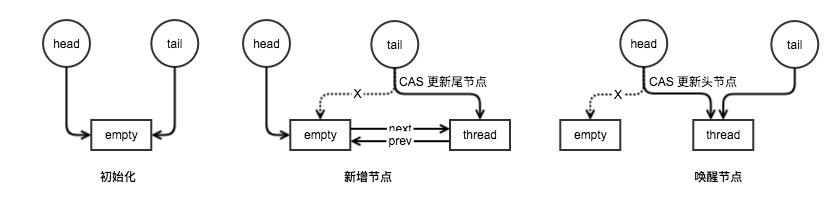

# 同步器框架AQS

AQS的全称为`AbstractQueuedSynchronizer`，这个类位于`java.util.concurrent.locks`包下。

AQS提供了一个用于实现依赖先进先出（FIFO）等待队列的阻塞锁和相关同步器的框架，这些同步器依赖一个单个原子的`int`值表示同步状态。AQS的子类必须定义修改同步状态的`protected`方法，并且定义这个获取和是否这个类的含义。给定这些方法后，该类的其他方法可以执行全部的排队和阻塞机制。子类也可以维护其他状态字段，可以使用`getState()`、`setState(int)`、`compareAndSetState(int, int)`方法操纵表示状态的`int`值，但是必须原子性地更新状态值以保证同步。

应该将AQS的子类定义为同步器类的**非`public`内部帮助类（内部嵌套类）**，同步器类可用它们来实现其封闭类的同步属性。AQS没有实现任何同步接口。而是定义了诸如`acquireInterruptibly(int)`之类的一些方法，在适当的时候可以通过具体的锁和相关同步器来调用它们，以实现其公共方法。

AQS默认支持独占模式和共享模式：

- 独占模式（Exclusive Mode）：同一时刻最多只有一个线程获取同步状态，处于该模式下，其他线程试图获取该锁将无法获取成功。
- 共享模式（Shared Mode）：同一时刻会有多个线程获取共享同步状态，处于该模式下，其他线程试图获取该锁可能（但不是一定）会获取成功。

AQS并不“了解”模式的不同，除了机械地意识到当在共享模式下成功获取某一锁时，如果下一个等待线程存在，那么该线程也必须确定自己是否可以成功获取该锁。处于不同模式下的等待线程可以共享相同的FIFO队列。通常，实现子类只支持其中一种模式，但两种模式都可以在（例如`ReadWriteLock`）中发挥作用。只支持一种模式的子类不必重写不支持的另一种模式的方法。

AQS提供了一个实现了`java.util.concurrent.locks.Condition`接口的嵌套类——`ConditionObject`。这个类为支持独占模式的AQS子类提供管程式的`await`/`signal`/`signalAll`操作。支持独占模式的AQS子类的子类提供了

- `isHeldExclusively()`方法用于判断一个同步器对象是否是被当前线程独占。
- `release(int)`方法使用电当前`getState()`返回值可以完全释放同步器对象。
- `acquire(int)`方法可以在给定保存的状态值下，将此对象最终恢复为它以前获取的状态。

如果AQS子类中不支持独占模式，则不应该使用`ConditionObject`类。当然，`ConditionObject`的行为当然取决于其同步器实现的语义。

AQS为内部的队列提供了检查、检测和监视方法，还为`Condition`对象提供了类似方法。可以根据需要将这些方法其导出到基于AQS实现的同步机制。

AQS的序列化只存储维护状态的基础原子整数，因此已序列化的对象拥有空的线程队列。需要可序列化的典型子类将定义一个`readObject()`方法，该方法在反序列化时将此对象恢复到某个已知初始状态。

使用AQS能简单且高效地构造出应用广泛的大量的同步器，比如`ReentrantLock`、`CounDownLatch`、`Semaphore`，其他的诸如`ReentrantReadWriteLock`、`SynchronousQueue`、`FutureTask`等等皆是基于AQS的。此外，我们自己也能利用AQS非常轻松容易地构造出符合我们自己需求的同步器。

## 使用AQS

为了将此类用作同步器的基础，需要适当地重新定义以下方法，这些方法通过使用`getState()`、`setState(int)`、`compareAndSetState(int, int)`方法来检查、修改同步状态来实现：

- `tryAcquire(int)`
- `tryRelease(int)`
- `tryAcquireShared(int)`
- `tryReleaseShared(int)`
- `isHeldExclusively()`

默认情况下，每个方法都抛出`UnsupportedOperationException`。这些方法的实现在内部必须是线程安全的，通常应该很短并且不被阻塞。定义这些方法是使用此AQS的唯一支持的方式。其他所有方法都被声明为`final`，因为它们无法是各不相同的。

此外也可以使用AQS父接口`AbstractOwnableSynchronizer`中的方法，该接口的方法用于get/set拥有独占锁的线程。鼓励使用这两个方法，用于监视和检查是哪个线程用于锁。

即使AQS基于一个FIFO队列，也无法强行实施FIFO的获取策略，**独占同步的核心**如下：

```java
// Acquire
while (!tryAcquire(arg)) {
    // 如果线程未入队，则入队
    // 可能会阻塞当前线程
}

// Release
if (tryRelease(arg)) {
    // 解锁队列中的第一个线程
}
```

共享模式与此类似，但可能涉及级联信号。

因为检查线程的获取状况是在入队之前执行的，所以新线程可能闯入（barge）其他被阻塞的和已入队的线程之前获取锁。不过如果需要，可以通过定义`tryAcquire()`、`tryAcquireShared()`来禁用闯入，这两个方法内部调用一个或多个检查方法。因此可以提供一个公平的FIFO获取顺序。例如，大部分公平同步器都定义`tryAcquire()`在`hasQueuedPredecessors()`（一个专门设计用于公平同步器的方法）返回`true`的时候返回`false`。

通常，严格的FIFO锁定在`getFirstQueuedThread()`没有返回当前线程的时候`tryAcquire()`立即返回`false`；更好的但非严格公平的版本在`hasQueuedThreads()`返回`true`并且`getFirstQueuedThread()`不为`null`并且不是当前线程才返回`false`。

对于默认为闯入（也称为greedy、renouncement和convoy-avoidance）策略的同步器，吞吐量和可伸缩性通常是最高的。尽管无法保证这是公平的或是无偏向的，但允许更早加入队列的线程先于更迟加入队列的线程再次争用资源，并且相对于传入的线程，每个参与再争用的线程都有平等的成功机会。

此外，尽管从一般意义上说，获取并非“自旋”，它们可以在阻塞之前对用其他计算所使用的`tryAcquire()`执行多次调用。在只保持独占同步时，这为自旋提供了最大的好处，但不是这种情况时，也不会带来较大的负担。如果需要这样做，那么可以使用“快速路径”检查来先行调用`acquire()`方法，以这种方式扩充这一点，如果可能不需要争用同步器，则只能通过预先检查`hasContended()`、`hasQueuedThreads()`来确认这一点。

通过特殊化其同步器的使用范围，AQS为部分同步化提供了一个有效且可伸缩的基础，同步器可以依赖于`int`型的`state`、`acquire()`和`release()`入参，以及一个内部的FIFO等待队列。这些还不够的时候，可以使用atomic类、自己的定制`Queue`类和`LockSupport`阻塞支持，从更低级别构建同步器。

## 核心思想

AQS核心思想是：如果被请求的共享资源空闲，则将当前请求资源的线程设置为有效的工作线程，并且将共享资源设置为锁定状态。如果被请求的共享资源被占用，那么就需要一套线程阻塞等待以及被唤醒时锁分配的机制，这个机制AQS是用CLH队列锁实现的，即将暂时获取不到锁的线程加入到队列中。

## 设计与实现

在AQS的使用中已经说明，AQS的核心便是Acquire和Release操作。为了实现上述者两个操作，需要完成以下三个功能：

- 同步状态的原子性管理
- 线程的阻塞与唤醒
- 排队机制

### 同步状态

AQS类通过使用单个`int`类型来保存同步状态，并提供了`getState()`、`setState(int)`、`compareAndSetState(int, int)`三个方法来读取和更新状态，并且此同步状态通过关键字`volatile`修饰，保证了多线程环境下的可见性，更新同步状态是由CAS实现的，当多个线程同时对某个资源进行CAS操作的时候，只能有一个线程操作成功，但并不会阻塞其他线程，其他线程会收到操作失败的信号，CAS是一个轻量级的乐观锁。CAS的底层通过`Unsafe`类实现的，利用处理器提供的`CMPXCHG`指令实现其原子性，使得仅当同步器状态为一个期望值的时候，才会被原子的更新成目标值，相比`synchronized`不会导致过多的上下文切换切换和挂起线程。在`java.util.concurrent`包中，大量地使用CAS来实现原子性。

### 线程的阻塞与唤醒

`LockSupport`类是一个非常方便的线程阻塞工具类，它可以在线程任意位置让线程阻塞。和`Thread.suspend()`相比，它弥补了由于`resume()`在前发生，导致线程无法继续执行的情况。和`Object.wait()`相比，它**不需要先获得某个对象的锁，也不会抛出`InterruptedException`异常**。`LockSupport.park()`方法阻塞当前线程，这是因为`LockSupport`类使用类似信号量的机制，它为每一个线程准备了一个许可，如果许可可用，那么`park()`会立即返回，并且消费这个许可（设置许可不可用），就会阻塞，而`unpark()`则使得一个许可变为可用（但是和信号量不同的是，许可不可累加可用，你不可能拥有超过一个许可，它永远只有一个）。

### 排队机制

同步队列AQS整个框架的关键都是如何管理被阻塞线程的队列，在AQS中，运用到了CLH锁的思想，CLH锁被用于自旋锁，可以确保没有饥饿感，提供先到先得的公平服务，CLH锁是基于列表的可伸缩，高性能，公平和自旋锁，应用程序线程仅在局部变量上旋转，它不断轮询前驱状态，如果发现预释放锁定结束旋转。

AQS同步队列是一个FIFO队列，在此同步队列中，一个节点表示一个线程，它保存着线程的引用、状态、前驱节点、后继节点。同步队列通过两个节点tail和head来存取，初始化时，tail、head初始化为一个空节点，线程要加入到同步队列中，通过CAS原子地拼接为新的tail节点，线程要退出队列，只需设置head节点指向当前线程节点。



同步队列的优点在于**其出队和入队的操作都是无锁的、快速的**。为了将CLH锁队列用于阻塞同步器，该同步队列需要做些额外的修改以提供一种高效的方式定位某个节点的后继节点，在自旋锁中，一个节点只需改变其状态，下一次自旋中其后继节点就能注意到这个改变。但是在阻塞式同步器中，一个节点需要显示地唤醒其后继节点。同步队列包含一个next链接到它的后继节点。第二个对CLH锁队列主要的修改是将每个节点都有的状态字段用于控制阻塞而非自旋。

此外`ConditionObject`也拥有一对表示第一个等待结点和最后一个结点，它们也维护了一个等待队列。

## AQS的嵌套类`Node`

表示等待队列中的结点。

等待队列是一个"CLH"锁队列的变体。CLH锁队列通常用于自旋锁。不使用它们来阻塞同步器，而是使用一些相同的基本策略保存它们的结点的前驱的
> CLH(Craig,Landin,and Hagersten)队列是一个虚拟的双向队列（虚拟的双向队列即不存在队列实例，仅存在结点之间的关联关系）。

### 等待状态（waitStatus）

每一个`Node`都有一个等待状态。等待状态共有5类：

- **CANCELLED**：由于超时或中断，此节点被取消。节点永远不会离开这个状态。特别的是，一个节点被取消的线程再也不会阻塞。
- **SIGNAL**：此节点的后继节点已经或很快将通过`park`被阻塞，因此当前节点在释放或取消时必须`unpark`其后继节点。为了避免竞争，`acquire()`方法必须首先表明它们需要一个信号然后重试原子获取，如果失败，则阻塞。
- **CONDITION**：此节点当前位于condition队列中，表示正在等待。此节点不会被用作sync队列节点，直至被转移（转移时状态将被设置为`0`，这个`0`值没有含义，只是为了简化机制）。
- **PROPAGATE**：一个节点的`releaseShare()`操作应该被传播到其他的结点。这个状态在`doReleaseShared()`中且只能能对head结点设置，目的是保证即使其他操作接入传播也能继续进行。
- **0**：不是上面的任一个。

### 重要属性

```java
static final class Node {
    /** 表示节点正在共享模式中等待的标记 */
    static final Node SHARED = new Node();
    /** 表示节点正在独占模式中等待的标记 */
    static final Node EXCLUSIVE = null;

    /** 上述的五个等待状态，省略 */

    /**
     * 等待状态，一般sync结点为0，condition结点为CONDITION。
     * 通过CAS更新，也可能只是volatile写。
     */
    volatile int waitStatus;

    /**
     * 链接到当前结点用于检测等待状态的前驱结点，在入队时赋值，只有在出队后设为null。
     * 当然，当前驱节点被取消时，我们在寻找一个未被取消的前驱节点时，这个前驱节点总是存在的，因为head不可能被取消：
     * 一个节点只有在成功获取后才能成为head，而被取消的线程永远不可能成功获取，并且一个结点只能取消它自己。
     */
    volatile Node prev;

    /**
     * 连接到当前节点release后需要unpark的后继结点。在入队时分配，在前驱结点需要时调整，在出队时设为null。
     * 入队操作只有在有在附件之后才会对前驱结点的next赋值，所以一个结点的next为null时不能表示他是队列的最后一个结点，需要从tail向前查看才能确定。
     * 一个被取消的结点next指向它自己。
     */
    volatile Node next;

    /** 结点保存的线程。初始化时赋值，使用完设为null */
    volatile Thread thread;

    /** 链接到condition列队中的下一结点，或者为特殊的SHARED。
     * 因为condition列队只会在独占模式下产生，所以只需要一个指向下一个等待结点的链接，
     * 且需要在字段中指明其特殊状态（CONDITION）。
     * 这些结点可以被转移到sync列队重新获取锁。
     */
    Node nextWaiter;
```

## 嵌套类`ConditionObject`

`Condition`接口的实现类，为基于AQS的`Lock`接口的实现类提供服务。

此类的方法文档描述了一些机制，但没有从`Lock`和`Condition`用户的角度描述行为规范。此类的发行版本通常必须和描述condition语义的文档一起提供，这些语义依赖于相关`AbstractQueuedSynchronizer`的那些语义。

此类是可序列化的，但所有字段都是瞬态的，所以已序列化的条件没有等待者。

### 方法

- `await()`：实现可中断的条件等待。
- `await(long, TimeUnit)`：实现定时的条件等待
- `awaitUninterruptibly()`：实现不可中断的条件等待
- `awaitUtil(Date)`：实现绝对定时的条件等待
- `signal()`：将等待时间最长的线程（如果存在）从此条件的等待队列移动到等待锁的等待队列。
- `signalAll()`：将此条件的等待队列中的所有线程移动到等待锁的等待队列。

## 基于AQS的同步器

### `Semaphore`

一个计数信号量。从概念上讲，信号量维护了一个许可集。如有必要，在许可可用前会阻塞每一个`acquire()`，然后再获取该许可。每个`release()`增加一个许可，从而可能释放一个被阻塞的获取者。但是，`Semaphore`没有使用真正的许可对象，只是对可用许可的计数，并采取相应的行动。`Semaphore`通常用于限制可以访问某些资源（物理或逻辑的）的线程数目。

获得一项前，每个线程必须从信号量获取许可，从而保证可以使用该项。该线程结束后，将项返回到池中并将许可返回到该信号量，从而允许其他线程获取该项。注意，调用`acquire()`时无法保持同步锁，因为这会阻止将项返回到池中。信号量封装所需的同步，以限制对池的访问，这同维持该池本身一致性所需的同步是分开的。

如果将信号量初始化为`1`，使得它在使用时最多只有一个可用的许可，从而可用作一个互斥锁。这通常也称为`Binary Semaphore`，因为它只能有两种状态：一个可用的许可，或零个可用的许可。按此方式使用时，其具有某种属性（与很多`Lock`实现不同），即可以由线程释放“锁”，而不是由所有者（因为信号量没有所有权的概念）。在某些专门的上下文（如死锁恢复）中这会很有用。

此类的构造方法可选地接受一个公平参数。当设置为`false`时，此类不对线程获取许可的顺序做任何保证。特别地，闯入是允许的，也就是说可以在已经等待的线程前为调用`acquire()`的线程分配一个许可，从逻辑上说，就是新线程将自己置于等待线程队列的头部。当公平设置为`true`时，信号量保证对于任何调用获取方法的线程而言，都按照处理它们调用这些方法的顺序（即先进先出；FIFO）来选择线程、获得许可。注意，FIFO排序必然应用到这些方法内的指定内部执行点。所以，可能某个线程先于另一个线程调用了`acquire()`，但是却在该线程之后到达排序点，并且从方法返回时也类似。还要注意，非同步的`tryAcquire`方法不使用公平设置，而是使用任意可用的许可。

此类还提供便捷的方法来同时获取和释放多个许可。不管需要注意，在未将公平设置为`true`时使用这些方法会增加不确定延期的风险。

通常，应该将用于控制资源访问的信号量初始化为公平的，以确保所有线程都可访问资源。为其他的种类的同步控制使用信号量时，非公平排序的吞吐量优势通常要比公平考虑更为重要。

**内存一致性效果**：线程中调用“释放”方法（比如`release()`）之前的操作happen-before另一线程中紧跟在成功的“获取”方法（比如`acquire()`）之后的操作。

### `CountDownLatch`

一个同步辅助类，在完成**一组**正在其他线程中执行的操作之前，它允许一个或多个线程一直等待。

用给定的计数初始化`CountDownLatch`。在调用了`countDown()`方法将计数减到零之前，`await()`方法会一直受阻塞。之后，会释放所有等待的线程，`await()`的所有后续调用都将立即返回。这种现象只出现一次——计数无法被重置。如果需要重置计数，可以使用`CyclicBarrier`。

`CountDownLatch`是一个通用同步工具，它有很多用途。将计数`1`初始化的`CountDownLatch`用作一个简单的开/关锁存器或入口：在通过调用`countDown()`的线程打开入口前，所有调用`await()`的线程都一直在入口处等待。用`N`初始化的`CountDownLatch`可以使一个线程在`N`个线程完成某项操作之前一直等待，或者使其在某项操作完成`N`次之前一直等待。

`CountDownLatch`的一个有用特性是，它不要求调用`countDown()`方法的线程等到计数到达零时才继续，而在所有线程都能通过之前，它只是阻止任何线程继续通过一个`await()`。

#### 三种典型用法

某一线程在开始运行前等待`N`个线程执行完毕。将`CountDownLatch`的计数器初始化为`N`，每当一个任务线程执行完毕，就调用`countDown()`方法将计数器减`1`，当计数器的值变为`0`时，在`CountDownLatch`上`await()`的线程就会被唤醒。一个典型应用场景就是启动一个服务时，主线程需要等待多个组件加载完毕，之后再继续执行。

实现多个线程开始执行任务的最大并行性。**注意是并行性，不是并发**，强调的是多个线程在某一时刻同时开始执行。类似于赛跑，将多个线程放到起点，等待发令枪响，然后同时开跑。做法是初始化一个共享的`CountDownLatch`对象，将其计数器初始化为马的数量，多匹马（线程）在开跑（执行任务）前首先调用`await()`等待，当发令枪响（主线程调用`countDown()`，计数器变为`0`时），多匹马同时开始赛跑（线程同时被唤醒）。

死锁检测：一个非常方便的使用场景是，你可以使用`N`个线程访问共享资源，在每次测试阶段的线程数目是不同的，并尝试产生死锁。

### `CyclicBarrier`

一个同步辅助类，它允许一组线程互相等待，直到到达某个公共屏障点（common barrier point）。在涉及一组固定大小的线程的程序中，这些线程必须不时地互相等待。`CyclicBarrier`很有用。因为该barrier在释放等待线程后可以重用，所以称它为循环的barrier。

`CyclicBarrier`支持一个可选的`Runnable`命令，在一组线程中的最后一个线程到达之后（但在释放所有线程之前），该命令只在每个屏障点运行一次。若在继续所有参与线程之前更新共享状态，此屏障操作很有用。

如果屏障操作在执行时不依赖于正挂起的线程，则线程组中的任何线程在获得释放时都能执行该操作。为方便此操作，每次调用`await()`都将返回能到达屏障处的线程的索引。然后，您可以选择哪个线程应该执行屏障操作，例如：

```java
if (barrier.await() == 0) {
    // log the completion of this iteration
}
```

对于失败的同步尝试，`CyclicBarrier`使用了一种要么全部要么全不（all-or-none）的破坏模式：如果因为中断、失败或者超时等原因，导致线程过早地离开了屏障点，那么在该屏障点等待的其他所有线程也将通过`BrokenBarrierException`（如果它们几乎同时被中断，则用`InterruptedException`）以异常的方式离开。

内存一致性效果：线程中调用`await()`之前的操作happen-before那些是屏障操作的一部份的操作，后者依次happen-before紧跟在从另一个线程中对应`await()`成功返回的操作。

### `ReentrantLock`

```java
public class ReentrantLock implements Lock, java.io.Serializable
```

一个可重入的互斥锁，它具有与使用`synchronized`方法和语句所访问的隐式监视器锁相同的一些基本行为和语义，但功能更强大。`ReentrantLock`将由最近成功获得锁，并且还没有释放该锁的线程所拥有。当锁没有被另一个线程所拥有时，调用`lock()`的线程将成功获取该锁并返回。如果当前线程已经拥有该锁，此方法将立即返回。可以使用`isHeldByCurrentThread()`和`getHoldCount()`方法来检查此情况是否发生。

总是建议`lock`与try-finally连用：

```java
class X {
    private final ReentrantLock lock = new ReentrantLock();
    // ...

    public void m() {
        lock.lock();  // 阻塞，知道获取锁
        try {
            // ...
        } finally {
            lock.unlock();// 无论方法执行中是否出现异常，在finally中释放锁
        }
    }
}
```

除了实现`Lock`接口，此类还定义了`isLocked()`和`getLockQueueLength()`方法，以及一些相关的`protected`访问方法，这些方法对检测和监视可能很有用。

该类的序列化与内置锁的行为方式相同：一个反序列化的锁处于解除锁定状态，不管它被序列化时的状态是怎样的。

此锁最多支持同一个线程发起的`2147483648`个递归锁。试图超过此限制会导致由锁方法抛出的`Error`。

#### 公平锁

此类的构造方法接受一个可选的公平参数。当设置为`true`时，在多个线程的争用下，这些锁倾向于将访问权授予等待时间最长的线程。否则此锁将无法保证任何特定访问顺序。与采用默认设置（使用不公平锁）相比，使用公平锁的程序在许多线程访问时表现为很低的总体吞吐量（即速度很慢，常常极其慢），但是在获得锁和保证锁分配的均衡性时差异较小。不过要注意的是，**公平锁不能保证线程调度的公平性**。因此，使用公平锁的众多线程中的一员可能获得多倍的成功机会，这种情况发生在其他活动线程没有被处理并且目前并未持有锁时。还要注意的是，**未指定超时时间的`tryLock()`方法并没有使用公平设置**。因为即使其他线程正在等待，只要该锁是可用的，此方法就可以获得成功。

#### `Lock`与`synchronized`的区别

`synchronized`方法或语句的使用提供了对与每个对象相关的隐式监视器锁的访问，但却强制所有锁获取和释放均要出现在一个块结构中：当获取了多个锁时，它们必须以相反的顺序释放，且必须在与所有锁被获取时相同的词法范围内释放所有锁。

虽然`synchronized`方法和语句的范围机制使得使用监视器锁编程方便了很多，而且还帮助避免了很多涉及到锁的常见编程错误，但有时也需要以更为灵活的方式使用锁。例如，某些遍历并发访问的数据结果的算法要求使用"hand-over-hand"或"chain locking"：获取节点A的锁，然后再获取节点B的锁，然后释放A并获取C，然后释放B并获取D，依此类推。**Lock接口的实现允许锁在不同的作用范围内获取和释放，并允许以任何顺序获取和释放多个锁**，从而支持使用这种技术。

### `ReentrantReadWriteLock`

```java
public class ReentrantReadWriteLock
             implements ReadWriteLock, java.io.Serializable
```

支持与`ReentrantLock`类似语义的`ReadWriteLock`实现。

此类行为的序列化方式与内置锁的相同：反序列化的锁处于解除锁状态，无论序列化该锁时其状态如何。

此锁最多支持`65535`个线程写入锁和`65535`个读取锁。试图超出这些限制将导致锁方法抛出`Error`。

#### 支持的属性

获取顺序：此类不会将读取者优先或写入者优先强加给锁访问的排序。但是，它确实支持可选的公平策略。

非公平模式（默认）：当非公平地（默认）构造时，未指定进入读写锁的顺序，受到reentrancy约束的限制。连续竞争的非公平锁可能无限期地推迟一个或多个reader或writer线程，但吞吐量通常要高于公平锁。

公平模式：当公平地构造线程时，线程利用一个**近似**到达顺序的策略来争夺进入。当释放当前保持的锁时，可以为等待时间最长的单个writer线程分配写入锁，如果有一组等待时间大于所有正在等待的writer线程 的reader线程，将为该组分配写入锁。如果保持写入锁，或者有一个等待的writer线程，则试图获得公平读取锁（非重入地）的线程将会阻塞。直到当前最旧的等待writer线程已获得并释放了写入锁之后，该线程才会获得读取锁。当然，如果等待writer放弃其等待，而保留一个或更多reader线程为队列中带有写入锁自由的时间最长的waiter，则将为那些reader分配读取锁。试图获得公平写入锁的（非重入地）的线程将会阻塞，除非读取锁和写入锁都自由（这意味着没有等待线程）。（注意，非阻塞的读写锁的`tryLock()`方法都不会遵守此公平设置，并将获得锁（如果可能），不考虑等待线程）。

重入：此锁允许reader和writer按照`ReentrantLock`的样式重新获取读取锁或写入锁。在写入线程保持的所有写入锁都已经释放后，才允许重入reader使用它们。此外，**writer可以获取读取锁，但反过来则不成立**。在其他应用程序中，当在调用或回调那些在读取锁状态下执行读取操作的方法期间保持写入锁时，重入很有用。如果reader试图获取写入锁，那么将永远不会获得成功。

锁降级：重入还允许从写入锁降级为读取锁，但是，从读取锁升级到写入锁是不可能的。锁降级实现方式：**先获取写入锁，然后获取读取锁，最后释放写入锁**。

锁获取的中断：读取锁和写入锁都支持锁获取期间的中断。

`Condition`支持：写入锁提供了一个`Condition`实现，对于写入锁来说，该实现的行为与`ReentrantLock.newCondition()`提供的`Condition`实现对`ReentrantLock`所做的行为相同。当然，此`Condition`只能用于写入锁。**读取锁不支持Condition**，`readLock().newCondition()`会抛出`UnsupportedOperationException`。

监测：此类支持一些确定是保持锁还是争用锁的方法。这些方法设计用于监视系统状态，而不是同步控制。

#### 读写锁与互斥锁的区别

与互斥锁相比，**读-写锁允许对共享数据进行更高级别的并发访问**。虽然一次只有一个线程（writer线程）可以修改共享数据，但在许多情况下，任何数量的线程可以同时读取共享数据（reader线程），读-写锁利用了这一点。从理论上讲，与互斥锁相比，使用读-写锁所允许的并发性增强将带来更大的性能提高。在实践中，**只有在多处理器上并且只在访问模式适用于共享数据时，才能完全实现并发性增强**。

与互斥锁相比，使用读-写锁能否提升性能则取决于读写操作期间读取数据相对于修改数据的频率，以及数据的争用——即在同一时间试图对该数据执行读取或写入操作的线程数。例如，某个最初用数据填充并且之后不经常对其进行修改的collection，因为经常对其进行搜索（比如搜索某种目录），所以这样的collection是使用读-写锁的理想候选者。但是，如果数据更新变得频繁，数据在大部分时间都被独占锁，这时，就算存在并发性增强，也是微不足道的。更进一步地说，如果读取操作所用时间太短，则读-写锁实现（它本身就比互斥锁复杂）的开销将成为主要的执行成本，在许多读-写锁实现仍然通过一小段代码将所有线程序列化时更是如此。最终，只有通过分析和测量，才能确定应用程序是否适合使用读-写锁。

#### 用法

展示了如何利用重入来执行升级缓存后的锁降级（为简单起见，省略了异常处理）：

```java
class CachedData {
    Object data;
    volatile boolean cacheValid;
    ReentrantReadWriteLock rwl = new ReentrantReadWriteLock();

    void processCachedData() {
        rwl.readLock().lock();
        if (!cacheValid) {
           // 获取写锁之前必须释放读锁
           rwl.readLock().unlock();
           rwl.writeLock().lock();
           // 再次确认状态，因为别的线程可能先于当前线程已经获取了写锁并修改了状态
           if (!cacheValid) {
             data = ...
             cacheValid = true;
           }
           // 降级锁
           rwl.readLock().lock();
           rwl.writeLock().unlock(); // 释放写锁，但仍保持者读锁
        }

        use(data);
        rwl.readLock().unlock();
    }
}
```

在使用某些种类的collection时，可以使用`ReentrantReadWriteLock`来提高并发性。通常，在预期collection很大，**读取者线程访问它的次数多于写入者线程**，并且entail操作的开销高于同步开销时，这很值得一试。例如，以下是一个使用TreeMap的类，预期它很大，并且能被同时访问。

```java
class RWDictionary {
    private final Map<String, Data> m = new TreeMap<String, Data>();
    private final ReentrantReadWriteLock rwl = new ReentrantReadWriteLock();
    private final Lock r = rwl.readLock();
    private final Lock w = rwl.writeLock();

    public Data get(String key) {
        // 读取数据使用读锁
        r.lock();
        try { return m.get(key); }
        finally { r.unlock(); }
    }

    public String[] allKeys() {
        // 读取数据使用读锁
        r.lock();
        try { return m.keySet().toArray(); }
        finally { r.unlock(); }
    }

    public Data put(String key, Data value) {
        // 插入数据使用写锁
        w.lock();
        try { return m.put(key, value); }
        finally { w.unlock(); }
    }

    public void clear() {
        // 删除数据使用写锁
        w.lock();
        try { m.clear(); }
        finally { w.unlock(); }
    }
```

## 阅读

[The j.u.c Synchronizer Framework中文翻译版](http://ifeve.com/aqs/)
