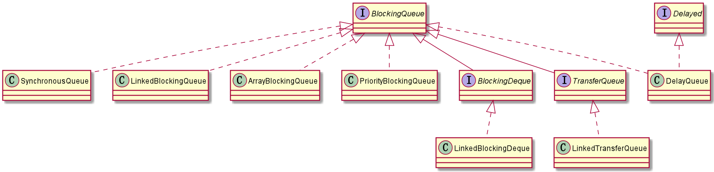
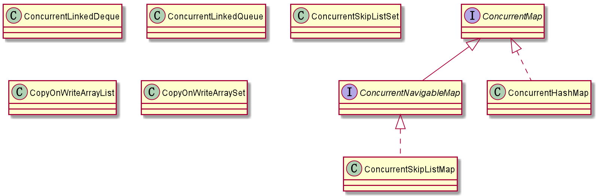

# 线程之间的数据交换

## Piped IO

- `PipedInputStram` & `PipedOutputStream`
- `PipedReader` & `PipedWriter`

详见IO部分。

在线程A中开启Piped输出流，线程B开启Piped输入流，然后连接两个流形成通信管道，A就可以向B输出数据。

需要注意的是，如果一个线程同意创建了Piped的输入输出流并形成管道，也就是一个线程自己同自己发送信息，这可能或造成死锁。这是因为Piped输出流调用`write()`输出数据会调用Piped输入流的`recieve()`方法将数据传输给输入流，而输入流调用`read()`读取数据，这两个方法都是`synchronized`修饰的，也就是输入输出流会竞争输入流的monitor。

```java
public void write(int c)  throws IOException {
    // sink就是绑定的PipedReader
    if (sink == null) {
        throw new IOException("Pipe not connected");
    }
    // 调用PipedReader的recieve方法
    sink.receive(c);
}

// synchronized修饰
synchronized void receive(int c) throws IOException {、
    if (!connected) {
        throw new IOException("Pipe not connected");
    } else if (closedByWriter || closedByReader) {
        throw new IOException("Pipe closed");
    } else if (readSide != null && !readSide.isAlive()) {
        throw new IOException("Read end dead");
    }

    // 写方是当前线程。这个方法是在输出流write时调用的
    writeSide = Thread.currentThread();
    // in和out是PipedReader中Buffer的存取位置。
    // in == out表示reader和writer在竞争一个位置
    while (in == out) {
        if ((readSide != null) && !readSide.isAlive()) {
            throw new IOException("Pipe broken");
        }
        /* 将所有等待中reader唤醒 */
        notifyAll();
        try {
            // writer休眠1秒，等待reader把in改变
            wait(1000);
        } catch (InterruptedException ex) {
            throw new java.io.InterruptedIOException();
        }
    }
    // in < 0，表示buffer中没有数据可读，in、out置为开始位置0
    if (in < 0) {
        in = 0;
        out = 0;
    }
    // 将资源存入Buffer，然后in + 1
    buffer[in++] = (char) c;
    // 如果in超出Buffer大小，则从Buffer的开始位置重新开始
    if (in >= buffer.length) {
        in = 0;
    }
}

public synchronized int read() throws IOException {
    if (!connected) {
        throw new IOException("Pipe not connected");
    } else if (closedByReader) {
        throw new IOException("Pipe closed");
    } else if (writeSide != null && !writeSide.isAlive() && !closedByWriter && (in < 0)) {
        throw new IOException("Write end dead");
    }

    // 读取方为当前线程。
    readSide = Thread.currentThread();
    int trials = 2;
    // in < 0，表示还没有内容可读
    while (in < 0) {
        if (closedByWriter) {
            /* closed by writer, return EOF */
            return -1;
        }
        if ((writeSide != null) && (!writeSide.isAlive()) && (--trials < 0)) {
            throw new IOException("Pipe broken");
        }
        /* 可能有writer在等待，唤醒它们 */
        notifyAll();
        try {
            // reader等待1秒
            wait(1000);
        } catch (InterruptedException ex) {
            throw new java.io.InterruptedIOException();
        }
    }
    // 保存返回值，out +1
    int ret = buffer[out++];
    // 如果out超出Buffer容量，从头开始
    if (out >= buffer.length) {
        out = 0;
    }
    // in == out表示没有内容可读，将in置为 -1
    if (in == out) {
        /* now empty */
        in = -1;
    }
    return ret;
}
```

## `Exchanger`

可以在对中对元素进行配对和交换的线程的同步点。每个线程将一些`Entry`和对象呈现给`exchange()`方法，与伙伴线程进行匹配，并且在返回时接收其伙伴的对象。`Exchanger`可能被视为`SynchronousQueue`的双向形式。`Exchanger`可能在应用程序（比如遗传算法和管道设计）中很有用。

内存一致性效果：对于通过`Exchanger`成功交换对象的每对线程，每个线程中在`exchange()`之前的操作happen-before从另一线程中相应的`exchange()`返回的后续操作。

```java
// 不指定Timeout进行交换
@SuppressWarnings("unchecked")
public V exchange(V x) throws InterruptedException {
    Object v;
    // NULL_Item = new Object()
    Object item = (x == null) ? NULL_ITEM : x; // translate null args
    if ((arena != null ||
         (v = slotExchange(item, false, 0L)) == null) &&
        ((Thread.interrupted() || // disambiguates null return
          (v = arenaExchange(item, false, 0L)) == null)))
        throw new InterruptedException();
    return (v == NULL_ITEM) ? null : (V)v;
}
```

## `BlockingQueue`



支持两个附加操作的`Queue`，这两个操作是：

- 获取元素时等待队列变为非空
- 存储元素时等待空间变得可用

`BlockingQueue`方法以四种形式出现，对于不能立即满足但可能在将来某一时刻可以满足的操作，这四种形式的处理方式不同：

- 第一种是抛出一个异常，
- 第二种是返回一个特殊值（`null`或`false`，具体取决于操作），
- 第三种是在操作可以成功前，无限期地阻塞当前线程，
- 第四种是在放弃前只在给定的最大时间限制内阻塞。

下表中总结了这些方法：

|       | 抛出异常  |  特殊值  |  阻塞  |         超时         |
| :---: | :-------: | :------: | :----: | :------------------: |
| 插入  |  add(e)   | offer(e) | put(e) | offer(e, time, unit) |
| 移除  | remove()  |  poll()  | take() |   poll(time, unit)   |
| 检查  | element() |  peek()  | 不可用 |        不可用        |

**BlockingQueue不接受null元素**。试图`add()`、`put()`或`offer()`一个`null`元素时，某些实现会抛出`NullPointerException`。`null`被用作指示`poll()`操作失败的警戒值。

`BlockingQueue`可以是限定容量的。它在任意给定时间都可以有一个`remainingCapacity`，超出此容量，便无法无阻塞`put()`附加元素。没有任何内部容量约束的`BlockingQueue`总是报告`Integer.MAX_VALUE`的剩余容量。

`BlockingQueue`实现主要用于生产者-使用者队列，但它另外还支持`Collection`接口。因此，举例来说，使用`remove(x)`从队列中移除任意一个元素是有可能的。然而，这种操作通常不会有效执行，只能有计划地偶尔使用，比如在取消排队信息时。

**BlockingQueue实现是线程安全的**。所有排队方法都可以使用内部锁或其他形式的并发控制来自动达到它们的目的。然而，`Collection`批量操作（`addAll()`、`containsAll()`、`retainAll()` 和 `removeAll()`）没有必要原子性执行，除非在实现中特别说明。因此，举例来说，在只添加了c中的一些元素后，`addAll(c)`有可能失败（抛出一个异常）。

`BlockingQueue`实质上不支持使用任何一种“close”或“shutdown”操作来指示不再添加任何项。这种功能的需求和使用有依赖于实现的倾向。例如，一种常用的策略是：对于生产者，插入特殊的end-of-stream或poison对象，并根据使用者获取这些对象的时间来对它们进行解释。

内存一致性效果：当存在其他并发collection时，将对象放入`BlockingQueue`之前的线程中的操作happen-before随后通过另一线程从`BlockingQueue`中访问或移除该元素的操作。

此接口是Java Collections Frame的成员。

### `SynchronousQueue`

- 每个插入操作必须等待另一个线程的对应移除操作，反之亦然。同步队列没有任何内部容量，甚至连一个队列的容量都没有。
- 不能在同步队列上进行`peek()`，因为仅在试图要移除元素时，该元素才存在；
- 除非另一个线程试图移除某个元素，否则也不能（使用任何方法）插入元素；
- 也不能迭代队列，因为其中没有元素可用于迭代。
- 队列的头是尝试添加到队列中的首个已排队插入线程的元素；如果没有这样的已排队线程，则没有可用于移除的元素并且`poll()`将会返回`null`。
- 对于其他`Collection`方法（例如`contains()`），`SynchronousQueue`作为一个空`Collection`。
- 此队列不允许`null`元素。

同步队列类似于CSP和Ada中使用的rendezvous信道。它非常适合于传递性设计，在这种设计中，在一个线程中运行的对象要将某些信息、事件或任务传递给在另一个线程中运行的对象，它就必须与该对象同步。

对于正在等待的生产者和使用者线程而言，此类支持可选的公平排序策略。默认情况下不保证这种排序。但是，使用公平设置为`true`所构造的队列可保证线程以FIFO的顺序进行访问。

此类及其迭代器实现`Collection`和`Iterator`接口的所有可选方法。

此类是Java Collections Framework的成员。

### `ArrayBlockingQueue`

一个由数组支持的有界阻塞队列。

- 此队列按FIFO（先进先出）原则对元素进行排序。
- 队列的头部是在队列中存在时间最长的元素。队列的尾部是在队列中存在时间最短的元素。
- 新元素插入到队列的尾部，队列获取操作则是从队列头部开始获得元素。

这是一个典型的“有界缓存区”，固定大小的数组在其中保持生产者插入的元素和使用者提取的元素。一旦创建了这样的缓存区，就不能再增加其容量。试图向已满队列中放入元素会导致操作受阻塞；试图从空队列中提取元素将导致类似阻塞。

此类支持对等待的生产者线程和使用者线程进行排序的可选公平策略。默认情况下，不保证是这种排序。然而，通过将公平性(fairness)设置为`true`而构造的队列允许按照FIFO顺序访问线程。公平性通常会降低吞吐量，但也减少了可变性和避免了“不平衡性”。

此类及其迭代器实现了`Collection`和`Iterator`接口的所有可选方法。

此类是Java Collections Framework的成员。

```java
public class ArrayBlockingQueue<E> extends AbstractQueue<E>
        implements BlockingQueue<E>, java.io.Serializable {
    /** 队列中保存的元素 */
    final Object[] items;

    /** 取元素的索引 */
    int takeIndex;

    /** 下一个放入操作的索引 */
    int putIndex;

    /** 队列中元素的个数 */
    int count;

    /** 所以访问操作的的锁 */
    final ReentrantLock lock;

    /** 取元素的Condition，当队列满时使用 */
    private final Condition notEmpty;

    /** 放入元素的Condition，当元素个数为0时使用 */
    private final Condition notFull;

    ...
}
```

#### `put()`

```java
public void put(E e) throws InterruptedException {
    // 检查e是否为null，如果是，抛出NPE
    checkNotNull(e);
    // 加锁
    final ReentrantLock lock = this.lock;
    lock.lockInterruptibly();
    try {
        // 如果队列中的元素数量等于内部数组的长度，说明队列已满，等待
        while (count == items.length)
            notFull.await();
        // 将元素入队
        enqueue(e);
    } finally {
        // 解锁
        lock.unlock();
    }
}

private void enqueue(E x) {
    // assert lock.getHoldCount() == 1;
    // assert items[putIndex] == null;
    final Object[] items = this.items;
    // 将元素放入内部数组
    items[putIndex] = x;
    // 如果下一个放入操作操作数组长度，则从数组开头重新使用
    if (++putIndex == items.length)
        putIndex = 0;
    // 元素个数 +1
    count++;
    // 唤醒可能正在等待的读取操作
    notEmpty.signal();
}
```

#### `take()`

```java
public E take() throws InterruptedException {
    // 加锁
    final ReentrantLock lock = this.lock;
    lock.lockInterruptibly();
    try {
        // 如果元素个数为0，等待
        while (count == 0)
            notEmpty.await();
        // 出队
        return dequeue();
    } finally {
        // 解锁
        lock.unlock();
    }
}

private E dequeue() {
    // assert lock.getHoldCount() == 1;
    // assert items[takeIndex] != null;
    final Object[] items = this.items;
    @SuppressWarnings("unchecked")
    // 找到目标元素
    E x = (E) items[takeIndex];
    // 将数组中元素置为null，表示不存在。
    items[takeIndex] = null;
    // 如果takeIndex超出容量，从头开始读
    if (++takeIndex == items.length)
        takeIndex = 0;
    // 元素个税 -1
    count--;
    if (itrs != null)
        itrs.elementDequeued(); // 调整Iterator
    // 唤醒肯正在等待的存储操作
    notFull.signal();
    return x;
}
```

### `LinkedBlockingQueue`

一个基于已链接节点的、范围任意的`BlockingQueue`。

- 此队列按FIFO（先进先出）排序元素。
- 队列的头部是在队列中时间最长的元素。队列的尾部是在队列中时间最短的元素。
- 新元素插入到队列的尾部，并且队列获取操作会获得位于队列头部的元素。
- 链接队列的吞吐量通常要高于基于数组的队列，但是在大多数并发应用程序中，其可预知的性能要低。

可选的容量范围构造方法参数作为防止队列过度扩展的一种方法。如果未指定容量，则它等于`Integer.MAX_VALUE`。除非插入节点会使队列超出容量，否则每次插入后会动态地创建链接节点。

此类及其迭代器实现`Collection`和`Iterator`接口的所有可选方法。

此类是Java Collections Framework的成员。

```java
public class LinkedBlockingQueue<E> extends AbstractQueue<E>
        implements BlockingQueue<E>, java.io.Serializable {

    static class Node<E> {
        E item;

        /**
         * One of:
         * - the real successor Node
         * - this Node, meaning the successor is head.next
         * - null, meaning there is no successor (this is the last node)
         */
        Node<E> next;

        Node(E x) { item = x; }
    }

    /** 容量，如果未指定，就是Integer.MAX_VALUE */
    private final int capacity;

    /** 元素数量 */
    private final AtomicInteger count = new AtomicInteger();

    /** 头部元素head.item = null */
    transient Node<E> head;

    /** 尾部元素last.next = null */
    private transient Node<E> last;

    /** 取元素的锁 */
    private final ReentrantLock takeLock = new ReentrantLock();

    /** 用于取元素的等待 */
    private final Condition notEmpty = takeLock.newCondition();

    /** 存元素的锁 */
    private final ReentrantLock putLock = new ReentrantLock();

    /** 用于存元素的等待*/
    private final Condition notFull = putLock.newCondition();

    ...
```

#### `put()`

```java
public void put(E e) throws InterruptedException {
    // e不能为null
    if (e == null) throw new NullPointerException();
    // Note: convention in all put/take/etc is to preset local var
    // holding count negative to indicate failure unless set.
    int c = -1;
    // 包装
    Node<E> node = new Node<E>(e);
    // 获取存元素的锁
    final ReentrantLock putLock = this.putLock;
    // 获取元素数量
    final AtomicInteger count = this.count;
    // 加锁
    putLock.lockInterruptibly();
    try {
        // 如果队列元素数量已达容量，等待
        while (count.get() == capacity) {
            notFull.await();
        }
        enqueue(node);
        // 元素个数 +1，且用c保存原元素个数
        c = count.getAndIncrement();
        // 如果增加后的元素个数仍小于容量
        // 唤醒可能正在等待的其他存储元素操作
        if (c + 1 < capacity)
            notFull.signal();
    } finally {
        // 解锁
        putLock.unlock();
    }
    // 如果原容量为0，可能有正在等待的读取操作，唤醒它们
    if (c == 0)
        signalNotEmpty();
}

private void enqueue(Node<E> node) {
    // assert putLock.isHeldByCurrentThread();
    // assert last.next == null;
    last = last.next = node;
}
```

#### `take()`

```java
public E take() throws InterruptedException {
    E x;
    int c = -1;
    final AtomicInteger count = this.count;
    // 加锁
    final ReentrantLock takeLock = this.takeLock;
    takeLock.lockInterruptibly();
    try {
        // 如果元素个数为0，等待
        while (count.get() == 0) {
            notEmpty.await();
        }
        // 出队第一个元素
        x = dequeue();
        // 元素个数 -1，且用c保存原值
        c = count.getAndDecrement();
        // 如果原值 > 1，则表示出队后至少还有一个元素
        // 唤醒其他可能正在等待的读取操作
        if (c > 1)
            notEmpty.signal();
    } finally {
        // 解锁
        takeLock.unlock();
    }
    // 如果原元素个数为容量，则表示可能有存储操作在等待，唤醒它们
    if (c == capacity)
        signalNotFull();
    return x;
}

private E dequeue() {
    // assert takeLock.isHeldByCurrentThread();
    // assert head.item == null;
    // 出队第一元素
    Node<E> h = head;
    Node<E> first = h.next;
    h.next = h; // help GC
    head = first;
    E x = first.item;
    first.item = null;
    return x;
}
```

### `PriorityBlockingQueue`

一个无界阻塞队列，它使用与类`PriorityQueue`相同的顺序规则，并且提供了阻塞获取操作。虽然此队列逻辑上是无界的，但是资源被耗尽时试图执行`add()`操作也将失败（导致`OutOfMemoryError`）。此类不允许使用`null`元素。依赖自然顺序的优先级队列也不允许插入不可比较的对象（这样做会导致抛出`ClassCastException`）。

此类及其迭代器可以实现`Collection和Iterator`接口的所有可选方法。`iterator()`方法中提供的迭代器并不保证以特定的顺序遍历`PriorityBlockingQueue`的元素。如果需要有序地进行遍历，则应考虑使用`Arrays.sort(pq.toArray())`。此外，可以使用方法`drainTo()`按优先级顺序移除全部或部分元素，并将它们放在另一个`Collection`中。

在此类上进行的操作**不保证具有同等优先级的元素的顺序**。如果需要实施某一排序，那么可以定义自定义类或者比较器，比较器可使用修改键断开主优先级值之间的联系。

```java
public class PriorityBlockingQueue<E> extends AbstractQueue<E>
    implements BlockingQueue<E>, java.io.Serializable {
    ...

    /** 默认容量 */
    private static final int DEFAULT_INITIAL_CAPACITY = 11;

    /** 最大数组长度 */
    private static final int MAX_ARRAY_SIZE = Integer.MAX_VALUE - 8;

    /** 使用二叉平衡堆表示：queue[n] 的子结点为queue[2*n+1] 和queue[2*(n+1)]。
     * 如果队列不为空，最小值的元素位于queue[0]。
     */
    private transient Object[] queue;

    /** 保存的元素数量 */
    private transient int size;

    /** 比较器，不指定时为null */
    private transient Comparator<? super E> comparator;

    /** 所以操作共用的锁 */
    private final ReentrantLock lock;

    /** 读取是队列为空使用 */
    private final Condition notEmpty;

    /** CAS自旋锁尝试次数 */
    private transient volatile int allocationSpinLock;

    /**
     * A plain PriorityQueue used only for serialization,
     * to maintain compatibility with previous versions
     * of this class. Non-null only during serialization/deserialization.
     */
    private PriorityQueue<E> q;

    ...
}
```

#### `put()`

```java
public void put(E e) {
    offer(e); // never need to block
}

public boolean offer(E e) {
    if (e == null)
        throw new NullPointerException();
    // 加锁
    final ReentrantLock lock = this.lock;
    lock.lock();
    int n, cap;
    Object[] array;
    // 若存放的元素数量超出数组长度，扩容
    while ((n = size) >= (cap = (array = queue).length))
        tryGrow(array, cap);
    try {
        Comparator<? super E> cmp = comparator;
        // 插入元素并调整
        if (cmp == null)
            siftUpComparable(n, e, array);
        else
            siftUpUsingComparator(n, e, array, cmp);
        // 元素数量 +1
        size = n + 1;
        // 唤醒可能正在等待的读取操作
        notEmpty.signal();
    } finally {
        // 解锁
        lock.unlock();
    }
    return true;
}

// 插入时维护最大堆
private static <T> void siftUpComparable(int k, T x, Object[] array) {
    Comparable<? super T> key = (Comparable<? super T>) x;
    while (k > 0) {
        int parent = (k - 1) >>> 1;
        Object e = array[parent];
        if (key.compareTo((T) e) >= 0)
            break;
        array[k] = e;
        k = parent;
    }
    array[k] = key;
}
```

#### `take()`

```java
public E take() throws InterruptedException {
    // 加锁
    final ReentrantLock lock = this.lock;
    lock.lockInterruptibly();
    E result;
    try {
        // 如果没有元素则等待
        while ( (result = dequeue()) == null)
            notEmpty.await();
    } finally {
        // 解锁
        lock.unlock();
    }
    // 返回结果
    return result;
}

private E dequeue() {
    int n = size - 1;
    if (n < 0)
        return null;
    else {
        Object[] array = queue;
        E result = (E) array[0];
        E x = (E) array[n];
        array[n] = null;
        Comparator<? super E> cmp = comparator;
        if (cmp == null)
            siftDownComparable(0, x, array, n);
        else
            siftDownUsingComparator(0, x, array, n, cmp);
        size = n;
        return result;
    }
}
```

### `DelayQueue`

`Delayed`元素的一个无界阻塞队列。

- 只有在延迟期满时才能从中提取元素。
- 该队列的头部是延迟期满后保存时间最长的Delayed元素。如果延迟都还没有期满，则队列没有头部，并且`poll()`将返回`null`。
- 当一个元素的`getDelay(TimeUnit.NANOSECONDS)`方法返回一个小于等于`0`的值时，将发生到期。
- 即使使用`take()`或`poll()`也无法移除未到期的元素，也不会将这些元素作为正常元素对待。例如，`size()`方法同时返回到期和未到期元素的计数。
- 此队列不允许使用`null`元素。

此类及其迭代器实现了`Collection`和`Iterator`接口的所有可选方法。

此类是Java Collections Framework的成员。

```java
public class DelayQueue<E extends Delayed> extends AbstractQueue<E>
    implements BlockingQueue<E> {

    /** 所有访问操作需要获取的锁 */
    private final transient ReentrantLock lock = new ReentrantLock();
    /** 使用优先级队列保存元素 */
    private final PriorityQueue<E> q = new PriorityQueue<E>();

    /**
     * 指定为等待队列头部元素的线程，是Leader-Follower模式的变体，目的是减少不必要的等待时间。
     * 当一个线程成为leader，它只要等待下一个延时结束，而其他线程则无限地等待。
     * 当leader被poll/take等操作移除时它必须唤醒一些其他线程，除非其他线程在此期间成为领导者。
     * 每当队列头部元素被一个更早过期的元素替代，leader变通过设为null变成无效，
     * 并且一些正在等待的线程（不一定是当前leader线程）被唤醒
     * 所以等待中的线程在等待时必须做好获取和失去leader资格的准备。
     */
    private Thread leader = null;

    /** 用于唤醒一个新可用的队列头部元素，或者一个可能成为leader的线程 */
    private final Condition available = lock.newCondition();
    ...
}
```

#### `put()`

```java
public boolean offer(E e, long timeout, TimeUnit unit) {
    return offer(e);
}

public boolean offer(E e) {
    // 加锁
    final ReentrantLock lock = this.lock;
    lock.lock();
    try {
        // 向内部优先级队列添加元素
        q.offer(e);
        // 如果内部队列头部元素时新增元素，则将leader设为无效，并唤醒等待中的线程
        if (q.peek() == e) {
            leader = null;
            available.signal();
        }
        return true;
    } finally {
        // 解锁
        lock.unlock();
    }
}
```

#### `take()`

```java
public E take() throws InterruptedException {
    // 获取锁
    final ReentrantLock lock = this.lock;
    lock.lockInterruptibly();
    try {
        // 循环等待延时到期
        for (;;) {
            // 查看队列头部元素，如果为null，说明队列为空，等待
            E first = q.peek();
            if (first == null)
                available.await();
            else {
                // 查看头部元素还需要等待多久
                long delay = first.getDelay(NANOSECONDS);
                // 如果小于0则不需要等待，出队
                if (delay <= 0)
                    return q.poll();
                // 将头部元素设为null，等待是无效保存此引用
                first = null; // don't retain ref while waiting
                // 将leader设为无效，唤醒等待的线程
                if (leader != null)
                    available.await();
                // 如果leader本来就是无效的
                else {
                    // 将leader设为当前线程
                    Thread thisThread = Thread.currentThread();
                    leader = thisThread;
                    try {
                        // 等待头部元素出队还需要等待的时间
                        available.awaitNanos(delay);
                    } finally {
                        // 如果leader为当前线程，因为当前线程在等待，所以将其设为无效，唤醒其他线程
                        if (leader == thisThread)
                            leader = null;
                    }
                }
            }
        }
    } finally {
        // 如果leader无效，且队列中没有元素，唤醒正在等待的锁
        if (leader == null && q.peek() != null)
            available.signal();
        // 解锁
        lock.unlock();
    }
}
```

## 线程安全的容器



### `CopyOnWriteArrayList`

`ArrayList`的一个线程安全的变体，其中所有可变操作（`add()`、`set()`等等）都是通过对底层数组进行一次新的复制来实现的。

这一般需要很大的开销，但是**当遍历操作的数量大大超过可变操作的数量时，这种方法可能比其他替代方法更有效**。在不能或不想进行同步遍历，但又需要从并发线程中排除冲突时，它也很有用。“快照”风格的迭代器方法在创建迭代器时使用了对数组状态的引用。此数组在迭代器的生存期内不会更改，因此不可能发生冲突，并且迭代器保证不会抛出`ConcurrentModificationException`。**创建迭代器以后，迭代器就不会反映列表的添加、移除或者更改。在迭代器上进行的元素更改操作`remove()`不受支持**。这些方法将抛出`UnsupportedOperationException`。

允许使用所有元素，包括`null`。

内存一致性效果：当存在其他并发`Collection`时，将对象放入`CopyOnWriteArrayList`之前的线程中的操作happen-before随后通过另一线程从`CopyOnWriteArrayList`中访问或移除该元素的操作。

此类是Java Collections Framework的成员。

### `CopyOnWriteArraySet`

对其所有操作使用内部`CopyOnWriteArrayList`的`Set`。因此，它共享以下相同的基本属性：

- 它最适合于具有以下特征的应用程序：set大小通常保持很小，只读操作远多于可变操作，需要在遍历期间防止线程间的冲突。
- 它是线程安全的。
- 因为通常需要复制整个基础数组，所以可变操作（`add()`、`set()`和`remove()`等等）的开销很大。
- 迭代器不支持可变`remove()`操作。
- 使用迭代器进行遍历的速度很快，并且不会与其他线程发生冲突。在构造迭代器时，迭代器依赖于不变的数组快照。

### `ConcurrentHashMap`

支持获取的完全并发和更新的所期望可调整并发的哈希表。此类遵守与`HashTable`相同的功能规范，并且包括对应于`HashTable`的每个方法的方法版本。不过，尽管所有操作都是线程安全的，但检索（retrieval，也就是查看、获取）操作不必也不支持以某种方式锁定整个表。此类在程序中可以与`HashTable`进行相互操作，依赖的是其线程安全而与同步细节无关。

检索操作（包括`get()`）通常不会受阻塞，因此可能与更新操作（包括`put()`和`remove()`）交迭。**检索会影响最近完成的更新操作的结果**。对于一些聚合操作，比如`putAll()`和`clear()`，并发获取可能只影响某些条目的插入和移除。类似地，在创建迭代器/枚举时或自此之后，`Iterators`和`Enumerations`返回在某一时间点上影响哈希表状态的元素。它们不会抛出`ConcurrentModificationException`。不过，**迭代器被设计成每次仅由一个线程使用**。请记住，**聚合状态方法（包括`size()`，`isEmpty()`和`containsValue()`）的结果通常仅在映射未在其他线程中进行并发更新时才有用**。 否则，这些方法的结果反映了瞬态的结果可能足以用于监视或估计目的，但并不适用于程序控制。

哈希表的大小在冲突较多的时候回自动扩容。

此类及其视图和迭代器实现了`Map`和`Iterator`接口的所有可选方法。

此类与`HashTable`相似，但与`HashMap`不同，它不允许将`null`用作键或值。

此类是Java Collections Framework的成员。

### `ConcurrentLinkedQueue`

一个基于链接节点的无界线程安全队列。此队列按照FIFO（先进先出）原则对元素进行排序。队列的头部 是队列中时间最长的元素。队列的尾部 是队列中时间最短的元素。新的元素插入到队列的尾部，队列获取操作从队列头部获得元素。当多个线程共享访问一个公共collection时，`ConcurrentLinkedQueue`是一个恰当的选择。此队列不允许使用null元素。

此实现采用了有效的“无等待(wait-free)”算法，该算法基于Maged M. Michael和Michael L. Scott合著的Simple, Fast, and Practical Non-Blocking and Blocking Concurrent Queue Algorithms中描述的算法。

需要小心的是，与大多数`Collection`不同，`size()`方法不是一个固定时间操作。由于这些队列的异步特性，**确定当前元素的数量需要遍历这些元素**。

此类及其迭代器实现了`Collection`和`Iterator`接口的所有可选方法。

内存一致性效果：当存在其他并发`Collection`时，将对象放入`ConcurrentLinkedQueue`之前的线程中的操作happen-before随后通过另一线程从`ConcurrentLinkedQueue`访问或移除该元素的操作。

此类是Java Collections Framework的成员。
