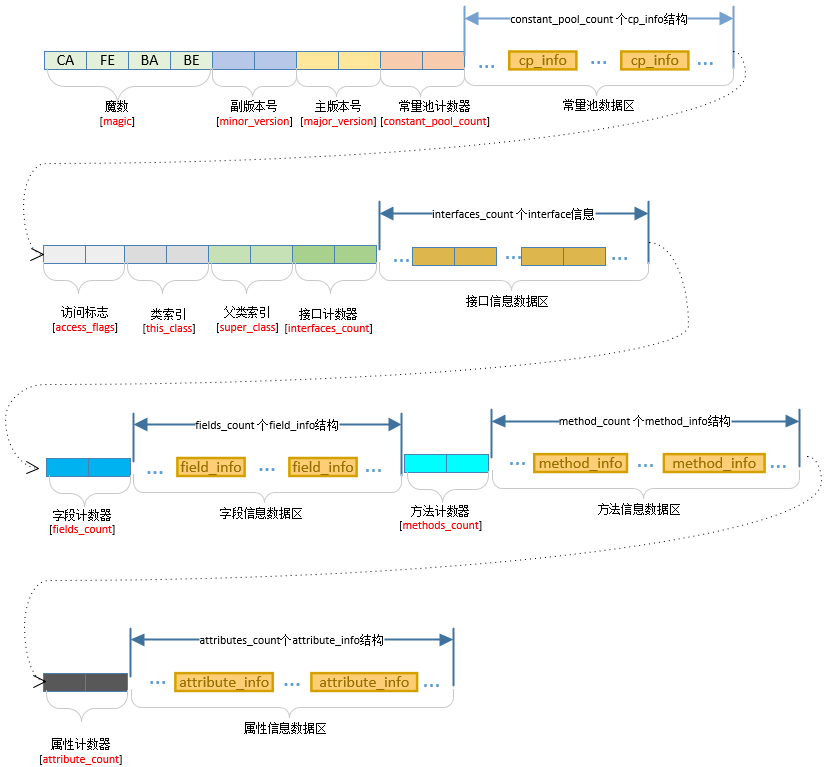

# 类文件结构

## JVM的“无关性”

谈论JVM的无关性，主要有以下两个：

- 平台无关性：任何操作系统都能运行Java代码
- 语言无关性：JVM能运行除Java以外的其他代码

### 平台无关性

Java的平台无关性指的就是使用Java编写的程序能够不做任何改变的运行于多个平台。

#### Java如何支持平台无关性

1. 最主要的是Java平台本身。Java平台扮演Java程序和所在的硬件与操作系统之间的缓冲角色。这样Java程序只需要与Java平台打交道，而不用管具体的操作系统。
2. Java语言保证了基本数据类型的值域和行为都是由语言自己定义的。通过保证基本数据类型在所有平台的一致性，Java语言为平台无关性提供强有力的支持。在C/C++中，基本数据类是由它的占位宽度决定的，占位宽度由所在平台决定的，不同平台编译同一个C++程序会出现不同的行为。
3. Java class文件。Java程序最终会被编译成二进制class文件。class文件可以在任何平台创建，也可以被任何平台的Java虚拟机装载运行。它的格式有着严格的定义，是平台无关的。
4. 可伸缩性。Sun通过改变API的方式得到三个基础API集合，表现为Java平台不同的伸缩性：J2EE, J2SE, J2ME。

#### 影响Java平台无关性的因素

1. Java平台的部署。运行Java程序之前，必须要部署好Java平台。
2. Java平台的版本。Sun公司提供了不同的API集合，有标准版，扩展版等等。此外API本身也面临着改动，一些API被认为是过期的，一些API甚至不向下兼容，因此我们需要选择合适的Java平台版本支持程序开发。
3. 本地方法。当编写一个平台独立的Java程序时候，最重要的原则是：**不要直接或间接调用不属于Java API的本地方法**。调用Java API以外的本地方法使得程序平台相关。一般而言，本地方法在三种情况适用：使用底层主机平台的特性，而Java API无法访问；为了访问老系统或者使用现有的库，但是这个系统或库不是Java编写的；为了加快程序性能，将时间敏感代码用本地方法实现。因此当必须使用本地方法，而且支持多种平台运行，必须将本地方法移植到所有需要的平台上。因此编写平台独立的Java程序做主要的目的就是完全禁止本地方法，通过Java API和主机交互。
4. 非标准运行时库。所谓平台无关性，一种解释是你调用的方法是否在任何地方都已经实现。本地方法顾名思义，就是只是在本地实现了，所以无法保证平台无关。而Java API在如windows, Solaris等操作系统上的实现上使用了本地方法访问主机，即保证了平台无关。
5. 对虚拟机的依赖。虚拟机可以由不同开发商开发，但是必须满足如下两条原则：**不要依赖及时终结（finalization）保证程序的正确性**，因为特定程序中对象可能在不同的时间被垃圾收集；**不要依赖线程的优先级来保证程序的正确性**。因为一些虚拟机可以实现优先级高线程优先运行，一些虚拟机不能保证这一点。
6. 对用户界面依赖，AWT库提供基本的用户界面，这些组件被映射成每个平台上的本地组件，而Swing库为用户提供更高级的组件，但并没有被映射为本地组件。

#### 实现平台无关的7大步骤

1. 选择程序运行的主机和设备集合（目标宿主机）
2. 在目标宿主机中选择Java平台版本
3. 对于每个目标宿主机，选择程序将要运行的Java平台实现（目标运行时环境）
4. 编写程序，调用Java API标准运行库（不调用本地方法，或者专门开发商专门调用本地方法的库）
5. 编写程序，不依赖于垃圾收集器收集垃圾时间，不依赖线程的优先级
6. 努力设计用户界面，在所有的目标宿主机都能正常工作
7. 在所有目标运行时环境和所有目标宿主机进行测试

[浅谈Java平台无关性](http://www.voidcn.com/article/p-kmxuniqf-vb.html)

### 语言无关性

JVM只认识.class文件，它不关心是何种语言生成了.class文件，只要.class文件符合JVM的规范就能运行。 目前已经有JRuby、JPython、Scala等语言能够在JVM上运行。它们有各自的语法规则，不过它们的编译器都能将各自的源码编译成符合JVM规范的.class文件，从而能够借助JVM运行它们。

Java语言中的各种变量、关键字和运算符号的语义最终都是由多条字节码命令组合而成的，因此字节码命令所能提供的语义描述能力肯定会比Java语言本身更加强大。因此，有一些Java语言本身无法有效支持的语言特性，不代表字节码本身无法有效支持。

## Class文件结构

Class文件是二进制文件，它的内容具有严格的规范，文件中没有任何空格，全都是连续的0/1。Class文件中的所有内容被分为两种类型：无符号数、表。

- 无符号数：无符号数表示Class文件中的值，这些值没有任何类型，但有不同的长度。u1、u2、u4、u8分别代表1/2/4/8字节的无符号数。
- 表：由多个无符号数或者其他表作为数据项构成的符合数据类型。

根据Java虚拟机规范，类文件由单个class文件结构组成。Class文件具体由以下内容构成

```class
ClassFile {
    u4             magic;                                // 魔数
    u2             minor_version;                        // 次版本信息
    u2             major_version;                        // 主版本信息
    u2             constant_pool_count;                  // 常量池计数
    cp_info        constant_pool[constant_pool_count-1]; // 常量池
    u2             access_flags;                         // 类访问标志
    u2             this_class;                           // 类索引
    u2             super_class;                          // 父类索引
    u2             interfaces_count;                     // 接口索引集合计数
    u2             interfaces[interfaces_count];         // 接口索引集合
    u2             fields_count;                         // 字段表集合计数
    field_info     fields[fields_count];                 // 字段表集合
    u2             methods_count;                        // 方法表集合计数
    method_info    methods[methods_count];               // 方法表集合
    u2             attributes_count;                     // 属性表集合计数
    attribute_info attributes[attributes_count];         // 属性表集合
}
```



### 魔数

每个Class文件的头四个字节（u4）称为魔数（Magic Number），它的唯一作用是确定这个文件是否为一个能被虚拟机接收的Class文件。

魔数相当于文件后缀名，只不过后缀名容易被修改，不安全，因此在Class文件中标识文件类型比较合适。

Class文件的魔数是用16进制表示的`CAFE BABE`，是不是很具有浪漫色彩？

### 版本信息

紧接着魔数的四个字节存储的是Class文件的版本号：第五和第六是次版本号，第七和第八是主版本号。

高版本的Java虚拟机可以执行低版本编译器生成的Class文件，但是低版本的Java虚拟机不能执行高版本编译器生成的Class文件。所以，我们在实际开发的时候要确保开发的的JDK版本和生产环境的JDK版本保持一致。

### 常量池

紧接着主次版本号之后的是常量池，常量池的数量是constant_pool_count - 1（常量池计数器是从1开始计数的，将第0项常量空出来是有特殊考虑的，索引值为0代表“不引用任何一个常量池项”）。

常量池主要存放两大常量：

- 字面量。字面量比较接近于Java语言层面的的常量概念
  - 文本字符串
  - 声明为`final`的常量值等
- 符号引用。符号引用则属于编译原理方面的概念。包括下面三类常量：
  - 类和接口的全限定名
  - 字段的名称和描述符
  - 方法的名称和描述符

#### 常量池的特点

常量池中常量数量不固定，因此常量池开头放置一个u2类型的无符号数，用来存储当前常量池的容量。

常量池的每一项常量都是一个表，表开始的第一位是一个u1类型的标志位（tag），代表当前这个常量属于哪种常量类型。

#### 常量类型

| 常量类型                         | tag  | 描述                   |
| :------------------------------- | :--- | :--------------------- |
| CONSTANT_utf8_info               | 1    | UTF-8编码的字符串      |
| CONSTANT_Integer_info            | 3    | 整型字面量             |
| CONSTANT_Float_info              | 4    | 浮点型字面量           |
| CONSTANT_Long_info               | 5    | 长整型字面量           |
| CONSTANT_Double_info             | 6    | 双精度浮点型字面量     |
| CONSTANT_Class_info              | 7    | 类或接口的符号引用     |
| CONSTANT_String_info             | 8    | 字符串类型字面量       |
| CONSTANT_Fieldref_info           | 9    | 字段的符号引用         |
| CONSTANT_Methodref_info          | 10   | 类中方法的符号引用     |
| CONSTANT_InterfaceMethodref_info | 11   | 接口中方法的符号引用   |
| CONSTANT_NameAndType_info        | 12   | 字段或方法的符号引用   |
| CONSTANT_MethodHandle_info       | 15   | 表示方法句柄           |
| CONSTANT_MethodType_info         | 16   | 标识方法类型           |
| CONSTANT_InvokeDynamic_info      | 18   | 表示一个动态方法调用点 |

举例，若一个常量是CONSTANT_Class_info，它的二维表结构如下：

| 类型 | 名称       | 数量 |
| :--- | :--------- | :--- |
| u1   | tag        | 1    |
| u2   | name_index | 1    |

tag是标志位，用于区分常量类型；
name_index是一个索引值，它指向常量池中一个CONSTANT_Utf8_info类型常量，此常量代表这个类（或接口）的全限定名，这里name_index值若为0x0002，也即是指向了常量池中的第二项常量。

CONSTANT_Utf8_info型常量的结构如下：

| 类型 | 名称   | 数量   |
| :--- | :----- | :----- |
| u1   | tag    | 1      |
| u2   | length | 1      |
| u1   | bytes  | length |
tag是当前常量的类型；length表示这个字符串的长度；bytes是这个字符串的内容（采用缩略的UTF8编码）

### 访问标志

在常量池结束之后，紧接着的两个字节代表访问标志，这个标志用于识别一些类或者接口层次的访问信息，包括：这个Class是类还是接口；是否定义为public类型；是否被abstract/final修饰。

#### 类访问标志

| 标志名         | 值     | 说明                                    |
| :------------- | :----- | :-------------------------------------- |
| ACC_PUBLIC     | 0x0001 | 声明为public，可以被其他包访问         |
| ACC_FINAL      | 0x0010 | 声明为final，不可以被继承              |
| ACC_SUPER      | 0x0020 | 在`invokespecial`指令中特别处理超类方法 |
| ACC_INTERFACE  | 0x0200 | 声明是接口，而不是类                    |
| ACC_ABSTRACT   | 0x0400 | 声明为abstract，不可以实例化           |
| ACC_SYNTHETIC  | 0x1000 | 声明为合成，不出现在源码中              |
| ACC_ANNOTATION | 0x2000 | 声明为注解类型                          |
| ACC_ENUM       | 0x4000 | 声明为枚举类型                          |

### 类索引、父类索引、接口索引集合

类索引用于确定这个类的全限定名。

父类索引用于确定这个类的父类的全限定名，由于Java语言的单继承，所以父类索引只有一个，除了`java.lang.Object`之外，所有的Java类都有父类，因此除了`java.lang.Object`外，所有Java类的父类索引都不为0。

接口索引集合用来描述这个类实现了那些接口，这些被实现的接口将按`implents`（如果这个类本身是接口的话则是`extends`） 后的接口顺序从左到右排列在接口索引集合中。

### 字段表集合

fields_count表示字段的个数。

字段表（field_info）用于描述接口或类中声明的变量。字段包括类级变量以及实例变量，但不包括在方法内部声明的局部变量。字段表由以下内容构成

```class
field_info {
    u2             access_flags;
    u2             name_index;
    u2             descriptor_index;
    u2             attributes_count;
    attribute_info attributes[attributes_count];
}
```

- 访问标志
- 名称索引：对常量池中CONSTANT_Utf8_info类型常量的引用，表示字段的名称；
- 描述符索引: 对常量池中CONSTANT_Utf8_info类型常量的引用，标识字段的描述符，任意两个字段的描述符都不可能相等；
- 属性表

#### 字段访问标志

| 标志名        | 值     | 说明                                               |
| :------------ | :----- | :------------------------------------------------- |
| ACC_PUBLIC    | 0x0001 | 声明为public，可以被其他包访问                    |
| ACC_PRIVATE   | 0x0002 | 声明为private，只能被本类访问                     |
| ACC_PROTECTED | 0x0004 | 声明为protected，只能被本类和子孙类访问           |
| ACC_STATIC    | 0x0008 | 声明为static（静态域）                            |
| ACC_FINAL     | 0x0010 | 声明为final，初始化化后不可再直接赋值             |
| ACC_VOLATILE  | 0x0040 | 声明volatile，不能被缓存（强制从主内存读写）      |
| ACC_TRANSIENT | 0x0080 | 声明transient，不能被持久化类的工具读写（序列化） |
| ACC_SYNTHETIC | 0x1000 | 声明为合成，不能再源码出现                         |
| ACC_ENUM      | 0x4000 | 声明为枚举                                         |

#### 字段类型术语

| 字段类型术语  | 类型      | 说明                                                                         |
| :------------ | :-------- | :--------------------------------------------------------------------------- |
| B             | byte      | signed byte                                                                  |
| S             | short     | signed short                                                                 |
| I             | int       | integer                                                                      |
| J             | long      | long integer                                                                 |
| C             | char      | Unicode character code in the Basic Multilingual Plane, encoded with UTF-116 |
| F             | float     | single-precision float-point value                                           |
| D             | double    | double-precision float-point value                                           |
| Z             | boolean   | true or false                                                                |
| L*ClassName*; | reference | an instance of class ClassName                                               |
| [             | reference | on array dimension                                                           |

多维数组使用多"\["，如：`double\[]\[]\[]`为`\[\[\[D`

### 方法表集合

methods_count表示方法个数。

method_info表示方法表。Class文件存储格式中对方法的描述与对字段的描述几乎采用了完全一致的方式。方法表的结构如同字段表一样，依次包括了访问标志、名称索引、描述符索引、属性表集合几项。方法表由以下内容构成

```class
method_info {
    u2             access_flags;
    u2             name_index;
    u2             descriptor_index;
    u2             attributes_count;
    attribute_info attributes[attributes_count];
}
```

- 访问标志
- 名称索引: 对常量池中CONSTANT_Utf8_info类型常量的引用，表示方法的名称；
- 描述符索引: 对常量池中CONSTANT_Utf8_info类型常量的引用，标识方法的描述符，任意两个方法的描述符都不可能相等；
- 属性表

#### 方法访问标志

| 标志名          | 值     | 说明                                                 |
| :-------------- | :----- | :--------------------------------------------------- |
| ACC_PUBLIC      | 0x0001 | 声明为public，可以被其他包访问                      |
| ACC_PRIVATE     | 0x0002 | 声明为private，只能被本类访问                       |
| ACC_PROTECTED   | 0x0004 | 声明为protected，只能被本类和子孙类访问             |
| ACC_STATIC      | 0x0008 | 声明为static（静态域）                              |
| ACC_FINAL       | 0x0010 | 声明为final，不能被重写（覆盖）                     |
| ACC_SYNCHRONIED | 0x0020 | 声明为synchronized，由监视器（monitor）使用包装调用 |
| ACC_BARIDGE     | 0x0040 | 声明transient，不能被持久化类的工具读写（序列化）   |
| ACC_VARARGS     | 0x0080 | bridge方法，由编译器生成                            |
| ACC_NATIVE      | 0x0100 | 声明为native，方法由Java之外的语言实现            |
| ACC_ABSTRACT    | 0x0400 | 声明为abstract，不能提供实现（方法体）              |
| ACC_STRICT      | 0x0800 | 声明为strictfp，浮点模式为FP-strict                |
| ACC_SYNTHETIC   | 0x1000 | 声明为合成，不能再源码出现                           |

### 属性表集合

attribute_count表示属性的个数。

attitude_info表示属性表。

在Class文件，字段表，方法表中都可以携带自己的属性表集合，以用于描述某些场景专有的信息。与Class文件中其它的数据项目要求的顺序、长度和内容不同，属性表集合的限制稍微宽松一些，不再要求各个属性表具有严格的顺序，并且只要不与已有的属性名重复，任何人实现的编译器都可以向属性表中写入自己定义的属性信息，Java虚拟机运行时会忽略掉它不认识的属性。

[The Java®Virtual Machine Specification·Java SE 8 Edition](https://docs.oracle.com/javase/specs/jvms/se8/html/jvms-4.html#jvms-4.2)
