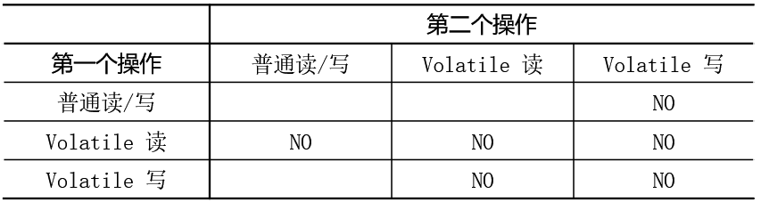

# `volatile` & `final`

## `volatile`

`volatile`表示“易变的”，当一个变量被其修饰时，就表明这个变量可能随时被其他线程修改，所以它“不能”被一个线程的工作内存缓存。

此外`volatile`通过内存屏障可以禁止指令重排，可以保证修饰变量读/写的单个操作的原子性（但不能保证复合操作的原子性）。

### 可见性

内存可见性：线程对共享变量修改的可见性。当一个线程修改了共享变量的值，其他线程能够立刻得知这个修改。

#### `lock`开头的指令

`volatile`使用`lock`前缀的指令禁止线程本地内存缓存，保证不同线程之间的内存可见性。例如：`a`是一个`volatile`的int型变量，一个自增操作（a++）的汇编代码为：

```class
mov    0xc(%rdx),%esi     ;*getfield a
inc    %esi
mov    %esi,0xc(%rdx)
lock addl$0x0,(%rsp)     ;*putfield a
```

最后一条指令就使用了一个`lock`开头。

为了提高处理速度，处理器不直接和内存进行通信，而是先将系统内存的数据读到内部缓存后再进行操作，但操作完不知道何时会写到内存。

如果对声明了`volatile`的变量进行写操作，JVM就会向处理器发送一条`lock`前缀的指令，将这个变量所在缓存行的数据会立即写回到系统内存。但是，就算写回到内存，如果其他处理器缓存的值还是旧的，再执行计算操作就会有问题。所以在多处理器下，为了保证各个处理器的缓存是一致的，就会实现缓存一致性协议，每个处理器通过嗅探在总线上传播的数据（**总线嗅探机制**）来检查自己缓存的值是不是过期了，当处理器发现自己缓存行对应的内存地址中的内容被修改，就会将当前处理器的缓存行设置成无效状态，当处理器对这个数据进行修改操作的时候，会重新从系统内存中把数据读到处理器缓存里。

`lock`前缀的指令在多核处理器下会引发了两件事情：

- 将当前处理器缓存行的数据写回到系统内存。
- 一个处理器的缓存回写到内存会导致其他处理器的缓存无效。在多核处理器系统中进行操作的时候，IA-32和Intel 64处理器能嗅探其他处理器访问系统内存和它们的内部缓存，处理器使用嗅探技术保证它的内部缓存、系统内存和其他处理器的缓存的数据在总线上保持一致。

理解`volatile`特性的一个好方法是把对`volatile`变量的单个读/写，看成是使用同一个锁对这些单个读/写操作做了同步。从内存语义的角度来说，`volatile`的写-读与锁的释放-获取有相同的内存效果：

- `volatile`写和锁的释放有相同的内存语义。若该`volatile`变量正在被写，则该变量的锁已经被当前线程获取，其他线程不可获取。只有当写完之后才能释放，其他线程才能获取该变量。
- `volatile`读与锁的获取有相同的内存语义。若该`volatile`变量正在被写，则该对象的锁未释放，读取无法完成。

这使得`volatile`变量的写-读可以实现线程之间的通信。

#### `volatile`内存语义

`volatile`写的内存语义：当写一个`volatile`变量时，JMM会把该线程对应的本地内存中的共享变量值刷新到主内存

`volatile`读的内存语义：当读一个`volatile`变量时，JMM会把该线程对应的本地内存置为无效。线程接下来将从主内存中读取共享变量。

#### `volatile`保证可见性示例

```java
public class VolatileDemo1 {
    boolean isInterrupted = false;

    public void interrupt() {
        System.out.println("Interrupt task!");
        isInterrupted = true;
    }

    public void run() {
        System.out.println("Task started.");
        while (!isInterrupted) {
            // do something...
        }
        System.out.println("Task finished.");
    }

    public static void main(String[] args) throws InterruptedException {
        VolatileDemo1 demo = new VolatileDemo1();
        new Thread(() -> demo.run()).start();
        // 停顿一段时间，保证前面这个线程先运行。
        Thread.sleep(200);
        new Thread(() -> demo.interrupt()).start();
    }
}
```

这段代码是很典型的一段代码，很多人在中断线程时可能都会采用这种标记办法。但是事实上，这段代码会完全运行正确么？即一定会将线程中断么？

答案是：不一定，也许在大多数时候，这个代码能够把线程中断，但是也有可能会导致无法中断线程（虽然这个可能性很小，但是只要一旦发生这种情况就会造成死循环了）。

原因：当线程2更改了`isInterrupted`变量的值之后，但是还没来得及写入主存当中，线程2转去做其他事情了，那么线程1由于不知道线程2对`isInterrupted`变量的更改，因此还会一直循环下去。

使用`volatile`后：

```java
// 共享变量
volatile boolean isInterrupted = false;
...
```

- 使用`volatile`关键字会强制将修改的值立即写入主存。所以`isInterrupted`值在线程2中的更新被刷新到主存中，主存的`isInterrupted`值为`true`。
- 使用`volatile`关键字后，当线程2进行修改时，会导致线程1的工作内存中缓存变量`isInterrupted`的缓存行无效（反映到硬件层的话，就是CPU的缓存中对应的缓存行无效（I））。
- 由于线程1的工作内存中缓存变量`isInterrupted`的缓存行无效，所以线程1再次读取变量`isInterrupted`的值时会去主存读取。此时读取到的值为`true`，所以线程1可以从`while`循环中退出。

### 禁止重排序

`volatile`关键字本身就包含了禁止指令重排序的语义，JMM针对编译器制定`volatile`重排序规则表：



- 当第二个操作是`volatile`写时，不管第一个操作是什么，都不能重排序。这个规则确保`volatile`写之前的操作不会被编译器重排序到`volatile`写之后。
- 当第一个操作是`volatile`读时，不管第二个操作是什么，都不能重排序。这个规则确保`volatile`读之后的操作不会被编译器重排序到`volatile`读之前。
- 当第一个操作是`volatile`写，第二个操作是`volatile`读时，不能重排序

为了实现`volatile`的内存语义，编译器在生成字节码时，会在指令序列中插入内存屏障来禁止特定类型的处理器重排序。

下面是基于保守策略的JMM内存屏障插入策略：

- 在每个`volatile`写操作的前面插入一个`StoreStore`屏障。
- 在每个`volatile`写操作的后面插入一个`StoreLoad`屏障。
- 在每个`volatile`读操作的后面插入一个`LoadLoad`屏障。
- 在每个`volatile`读操作的后面插入一个`LoadStore`屏障。

从编译器重排序规则和处理器内存屏障插入策略来看，只要`volatile`变量与普通变量之间的重排序可能会破坏`volatile`的内存语义（内存可见性），这种重排序就会被编译器重排序规则和处理器内存屏障插入策略禁止。

#### 禁止重排序示例

```java
public class VolatileDemo3 {
    static int x, y;

    public static void main(String[] args) throws InterruptedException {
        Map<String, Integer> map = new HashMap<>(2);
        for (int i = 0; i < 10000000; i++) {
            x = 0;
            y = 0;
            map.clear();
            Thread t1 = new Thread(() -> {
                int a = y;// 1
                x = 1;// 2
                map.put("a", a);
            });
            Thread t2 = new Thread(() -> {
                int b = x;// 3
                x = 1;// 4
                map.put("b", b);
            });
            t1.start();
            t2.start();
            t1.join();
            t2.join();
            String s = "a = " + map.get("a") + ", b = " + map.get("b");
        }
    }
}
```

分析字符串s可能出现的情形：

- 1 -> 2 -> 3 -> 4: a = 0, b = 1
- 3 -> 4 -> 1 -> 2: a = 1, b = 0
- 1 -> 3 -> 4 -> 2: a = 0, b = 0
- 3 -> 1 -> 2 -> 4: a = 0, b = 0

字符串s可能出现 "a = 1, b = 1" 的情形吗？答案是可能。因为1和2之间、3和4之间不存在数据依赖，所以可能会发生重排序的情形。
加入1，2发生重排序：

- 2 -> 1 -> 3 -> 4: a = 0, b = 1
- 3 -> 4 -> 2 -> 1: a = 1, b = 0
- 3 -> 2 -> 1 -> 4: a = 1, b = 0
- 2 -> 3 -> 4 -> 1: **a = 1, b = 1**

`x`，`y`加入`volatile`关键字就可以禁止这种情形：在1、3（`volatile`读）之前加入`LoadLoad`屏障，在之后加入`LoadStore`屏障。在2、4（`volatile`写）之前加入`StoreStore`屏障，在之后加入`StoreLoad`屏障。这样就可以静止重排序

#### 原子性

对任意单个`volatile`变量的读/写具有原子性。

但类似于`volatile++`这种复合操作不具有原子性，因为本质上`volatile++`是读、写两次操作。

#### 不能保证复合操作的原子性

```java
public class VolatileDemo2 {
    volatile int a = 0;

    public void increase() {
        a++;
    }

    public static void main(String[] args) {
        VolatileDemo2 demo = new VolatileDemo2();

        int c = Thread.activeCount();

        for (int i = 0; i < 10; i++) {
            new Thread(() -> {
                for (int j = 0; j < 1000; j++) {
                    demo.increase();
                }
            }).start();
        }

        // 保证自定义线程执行完成
        while (Thread.activeCount() > c) {
            Thread.yield();
        }
        // 期望值为10 * 1000 = 10000
        System.out.println("a = " + demo.a);
    }
}
```

上面的程序输出结果往往是小于预期值的。下面分析原因。

一个`volatile`的int类型数据自增操作：`a++`，其实要分成3步：

1. 读取`volatile`变量值到local；
2. 增加变量的值；
3. 把local的值写回，让其它的线程可见。

这3步的jvm指令为：

```class
mov    0xc(%rdx),%esi     ;*getfield a // Load，获取a的值
inc    %esi                            // Increment，自增运算
mov    %esi,0xc(%rdx)                  // Store，存值
lock addl$0x0,(%rsp)     ;*putfield a // StoreLoad Barrier，内存屏障
```

最后一步是内存屏障，而`volatile`的作用就是加上这个内存屏障，保证增加后的值及时刷新到内存当中，使这个自增操作其他线程可见。

但是，**从Load到Store这几步是不安全的**，如果其他的CPU在这几步执行期间修改了a的值当前CPU并不会知道，所以StoreLoad Barrier将当前缓存刷新到内存时，其他CPU再继续的时候自己缓存的a就失效了，就得重新从内存中读取a，而之前进行的操作也就丢失了。

## `final`

如果一个类包含`final`字段，且在构造函数中初始化，那么正确的构造一个对象后，`final`字段被设置后对于其它线程是可见的。这里所说的正确构造对象，意思是在对象的构造过程中，不允许对该对象进行引用，不然的话，可能存在其它线程在对象还没构造完成时就对该对象进行访问，造成不必要的麻烦。

[深入理解Java内存模型（六）——final](https://www.infoq.cn/article/java-memory-model-6/)
