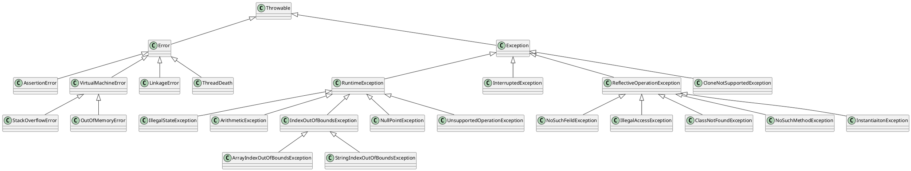

# 异常

## 错误处理

在理想状态下，用户输人数据的格式永远都是正确的，选择打开的文件也一定存在，并
且永远不会出现bug。

如果一个用户在运行程序期间，由于程序的错误或一些外部环境的影响造成用户数据的丢失，用户就有可能不再使用这个程序了，为了避免这类事情的发生，至少应该做到以下几点：

- 向用户通告错误；
- 保存所有的工作结果；
- 允许用户以妥善的形式退出程序。

在Java中，如果程序运行期间出现了一个错误，程序应该：

- 返回到一种安全状态，并能够让用户执行一些其他的命令；
- 或者允许用户保存所有操作的结果，并以妥善的方式终止程序

## Java异常体系


所有的异常跟错误都继承自`java.lang.Throwable`类，也就是说所有的异常都是一个对象。

### 常见异常概览



异常大范围上可以分为两类

- `Error`
- `Exception`

### `Error`

是指程序无法处理的错误，表示应用程序运行时出现的重大错误。例如：JVM运行时出现的`OutOfMemoryError`以及Socket编程时出现的端口占用等程序无法处理的错误。

Error是不受检查的。

### `Exception`

通常情况下是可以被程序处理的，并且在程序中应该尽可能的去处理这些异常。

`Exception`分为两大类：

#### 运行时异常（`RuntimeException`）

- 运行时异常是不检查异常，程序中可以不处理。
- 这些异常一般是由程序逻辑错误引起的，程序应该从逻辑角度尽可能避免这类异常的发生。

#### 非运行时异常

- 运行时异常之外的异常。
- 非运行时异常都是检查异常，必须进行处理的异常，如果不处理，程序就不能编译通过。
- 所以也可以叫编译时异常。
- 主要有`IOException`，`SQLException`，`CloneNotSupportedException`，`ReflectiveOperationException`等。

## 异常处理机制

### 抛出异常

#### 异常情形（exception condition）

- 它是指阻止当前方法或作用域继续执行的问题。
- 其次把异常情形和普通问题相区分，普通问题是指在当前环境下能得到足够的信息，总能处理这个错误。
- 对于异常情形，程序已经无法继续下去了，因为在当前环境下无法获得必要的信息来解决问题，你所能做的就是从当前环境中跳出，并把问题提交给上一级环境，这就是抛出异常时所发生的事情。

抛出异常后，会有几件事随之发生。

1. 首先，是像创建普通的Java对象一样将使用`new`在堆上创建一个异常对象；
2. 然后，当前的执行路径（已经无法继续下去了）被终止，并且从当前环境中弹出对异常对象的引用。
3. 此时，异常处理机制接管程序，并开始寻找一个恰当的地方继续执行程序，这个恰当的地方就是异常处理程序或者异常处理器，它的任务是将程序从错误状态中恢复，以使程序要么换一种方式运行，要么继续运行下去。

```java
if (obj == null) {
    throw new NullPointerException();
}
```

### 捕获异常

异常捕获的步骤

1. 在方法抛出异常之后，运行时系统将转为寻找合适的异常处理器（exception handler）。
2. 潜在的异常处理器是异常发生时依次存留在调用栈中的方法的集合。
3. 当异常处理器所能处理的异常类型与方法抛出的异常类型相符时，即为合适的异常处理器。
4. 运行时系统从发生异常的方法开始，依次回查调用栈中的方法，直至找到含有合适异常处理器的方法并执行。
5. 当运行时系统遍历调用栈而未找到合适的异常处理器，则运行时系统终止。同时，意味着Java程序的终止。

对于运行时异常、错误和检查异常，Java技术所要求的异常处理方式有所不同。

- 由于运行时异常及其子类的不可查性，为了更合理、更容易地实现应用程序，Java规定，运行时异常将由Java运行时系统自动抛出，允许应用程序忽略运行时异常。
- 对于方法运行中可能出现的`Error`，当运行方法不欲捕捉时，Java允许该方法不做任何抛出声明。因为，大多数`Error`异常属于永远不能被允许发生的状况，也属于合理的应用程序不该捕捉的异常。
- 对于所有的检查异常，Java规定：一个方法必须捕捉，或者声明抛出方法之外。也就是说，当一个方法选择不捕捉检查异常时，它必须声明将抛出异常。

## 异常处理语法

### `throws`

```java
void fun() throws Exception1, Exception2 {
    //code that might generate exceptions
}
```

如果一个方法可以导致一个异常但不处理它

- 它必须指定这种行为以使方法的调用者可以保护它们自己而不发生异常。
- 要做到这点，我们可以在方法声明中包含一个`throws`子句。
- 一个`throws`子句列举了一个方法可能引发的所有异常类型。
- 这对于除了Error或运行时异常及它们子类以外类型的所有异常是必要的。
- 一个方法可以引发的所有其他类型的异常必须在`throws`子句中声明，否则会导致编译错误。

`throws`抛出异常的规则

- 如果是不受检查异常（unchecked exception），即`Error`、`RuntimeException`或它们的子类，那么可以不使用`throws`关键字来声明要抛出的异常，编译仍能顺利通过，但在运行时会被系统抛出。
- 必须声明方法可抛出的任何检查异常（checked exception）。即如果一个方法可能出现受可查异常，要么用`try-catch`语句捕获，要么用`throws`子句声明将它抛出，否则会导致编译错误
- 仅当抛出了异常，该方法的调用者才必须处理或者重新抛出该异常。当方法的调用者无力处理该异常的时候，应该继续抛出，而不是囫囵吞枣。
- 调用方法必须遵循任何可查异常的处理和声明规则。若覆盖一个方法，则不能声明与覆盖方法不同的异常。声明的任何异常必须是被覆盖方法所声明异常的同类或子类（子类覆盖的方法能抛出的异常必须是对应父类方法能抛出的异常本身或是子类）。

### `try-catch`

```java
try {
    //code that might generate exceptions
} catch (Exception e) {
    //the code of handling exception
}
```

监控区域（guarded region）是一段可能产生异常的代码，并且后面跟着处理这些异常的代码。因而可知，上述`try-catch`所描述的即是监控区域

- 关键词`try`后的一对大括号将一块可能发生异常的代码包起来，即为监控区域。
- Java方法在运行过程中发生了异常，则创建异常对象。将异常抛出监控区域之外，由Java运行时系统负责寻找匹配的`catch`子句来捕获异常。
- 若有一个`catch`语句匹配到了，则执行该`catch`块中的异常处理代码，就不再尝试匹配别的`catch`块了。
- 匹配的原则是：如果抛出的异常对象属于`catch`子句的异常类，或者属于该异常类的子类，则认为生成的异常对象与`catch`块捕获的异常类型相匹配。

#### 多重`catch`语句

```java
try {
    //code that might generate exceptions
} catch (Exception1 e) {
    //the code of handling exception1
} catch (Exception2 e) {
    //the code of handling exception2
} catch (Exception3 e) {
    //the code of handling exception3
}
```

- 很多情况下，由单个的代码段可能引起多个异常。
- 处理这种情况，我们需要定义两个或者更多的`catch`子句，每个子句捕获一种类型的异常。
- 当异常被引发时，每个`catch`子句被依次检查，第一个匹配异常类型的子句执行，当一个`catch`子句执行以后，其他的子句将被屏蔽。

Java通过异常类描述异常类型。

- 对于有多个catch子句的异常程序而言，应该尽量将捕获底层异常类的`catch`子句放在前面，同时尽量将捕获相对高层的异常类的`catch`子句放在后面。
- 否则，捕获底层异常类的catch子句将可能会被屏蔽。
- 例如：`RuntimeException`异常类包括运行时各种常见的异常，`ArithmeticException`类和`ArrayIndexOutOfBoundsException`类都是它的子类。因此，`RuntimeException`异常类的`catch`子句应该放在最后面，否则可能会屏蔽其后的特定异常处理或引起编译错误。

#### 嵌套`try`语句

```java
try {
    try {
        //code that might generate exceptions
    } catch (Exception1 e) {
        //the code of handling exception1
    }
} catch (Exception2 e) {
    //the code of handling exception1
}
```

`try`语句可以被嵌套。

- 也就是说，一个`try`语句可以在另一个`try`块的内部。
- 每次进入`try`语句，异常的前后关系都会被推入堆栈。
- 如果一个内部的`try`语句不含特殊异常的`catch`处理程序，堆栈将弹出，下一个`try`语句的`catch`处理程序将检查是否与之匹配。
- 这个过程将继续直到一个`catch`语句被匹配成功，或者是直到所有的嵌套`try`语句被检查完毕。
- 如果没有`catch`语句匹配，Java运行时系统将处理这个异常。

当有方法调用时，`try`语句的嵌套可以很隐蔽的发生。

- 例如，可以将对方法的调用放在一个`try`块中。
- 在该方法的内部，有另一个`try`语句。
- 在这种情况下，方法内部的`try`仍然是嵌套在外部调用该方法的`try`块中的。

### `finally`

#### `finally`的作用

- 当异常发生时，通常方法的执行将做一个陡峭的非线性的转向，它甚至会过早的导致方法返回。
- 例如，如果一个方法打开了一个文件并关闭，然后退出，你不希望关闭文件的代码被异常处理机制旁路。`finally`关键字为处理这种意外而设计。

#### `finally`执行规则

- `finally`代码块在`try-catch`块完成之后，另一个`try-catch`出现之前执行。
- `finally`块无论有没有异常抛出都会执行。
- 如果抛出异常，即使没有`catch`子句匹配，`finally`也会执行。
- 一个方法将从一个`try-catch`块返回到调用程序的任何时候，经过一个未捕获的异常或者是一个明确的返回语句，`finally`子句在方法返回之前仍将执行。
- 这在关闭文件句柄和释放任何在方法开始时被分配的其他资源是很有用。

#### `finally`和`try`

- `finally`子句是可选项，可以有也可以无
- 但是每个`try`语句至少需要一个`catch`或者`finally`子句。
- 对于`try-finally`语句
  - 如果`try`没有被执行，`finally`语句也不会执行，这说明：相应的`try`语句要被执行是`finally`语句被执行的必要条件。
  - 如果在`try`块中有`System.exit(0);`这样终止JVM的语句。JVM停止了，程序也就结束了，`finally`语句自然也不会被执行。这说明：相应的`try`语句要被执行是`finally`语句被执行的不充分条件。
  - 综上：相应的`try`语句要被执行是`finally`语句被执行的必要不充分条件。

#### `finally`和`return`的执行顺序

- `finally`语句在`return`语句执行之后，但是`return`返回（结束当前栈）之前执行的。

    ```java
    public static void main(String[] args) {
        System.out.println("方法返回：" + test2());
    }

    static String test1() {
        try {
            System.out.println("try block");
            return doReturn("try");
        } finally {
            System.out.println("finally block");
        }
        return doReturn("outer");
    }

    static String doReturn(String blockName) {
        String ret = blockName + " block return";
        System.out.println("执行return：" + ret);
        return ret;
    }

    /**!Output
     * try block
     * 执行return：try block return
     * finally block
     * 方法返回：try block return
     */
    ```

- `finally`块中的`return`语句会覆盖`try`块中的`return`返回。

    ```java
    public static void main(String[] args) {
        System.out.println("方法返回：" + test2());
    }

    static String test2() {
        try {
            System.out.println("try block");
            return doReturn("try");
        } finally {
            System.out.println("finally block");
            return doReturn("finally");
        }
        // 当前语句不可达，若不注释掉编译出错
        //return doReturn("outer");
    }

    /**!Output
     * try block
     * 执行return：try block return
     * finally block
     * 执行return：finally block return
     * 方法返回：finally block return
     */
    ```

- 如果`finally`语句中没有`return`语句覆盖返回值，那么原来的返回值可能因为`finally`里的修改而改变。
  - 返回结果不变的情形（返回的值就是对象本身）

    ```java
    public static void main(String[] args) {
        System.out.println("方法返回：" + test3());
    }

    static String test3() {
        String ret;
        try {
            System.out.println("try block");
            ret = doReturn("try");
            return ret;
        } finally {
            System.out.println("finally block");
            ret = "finally block change";
        }
        return doReturn("outer");
    }

    /**!Output
     * try block
     * 执行的return：try block return
     * finally block
     * 方法返回：try block return
     */
    ```

  - 结果改变的情形（返回的值是一个队对象的引用）

    ```java
    public static void main(String[] args) {
        System.out.println("方法返回：" + Arrays.toString(test4()));
    }

    static String[] test4() {
        String[] ret = new String[1];
        try {
            System.out.println("try block");
            ret[0] = doReturn("try");
            return ret;
        } finally {
            System.out.println("finally block");
            ret[0] = "finally block change";
        }
        return new String[]{doReturn("outer")};
    }

    /**!Output
     * try block
     * 执行的return：try block return
     * finally block
     * 方法返回：[finally block change]
     */
    ```

- `try`块里的`return`语句在异常的情况下不会被执行，这样具体返回哪个看情况。

    ```java
    public static void main(String[] args) {
        System.out.println("方法返回：" + test5());
    }

    static String test5() {
        try {
            System.out.println("try block");
            throw new RuntimeException("try block exception");
        } catch (Exception e) {
            System.out.println("catch block");
        } finally {
            System.out.println("finally block");
        }
        return doReturn("outer");
    }

    /**!Output
     * try block
     * catch block
     * finally block
     * 执行的return：outer block return
     * 方法返回：outer block return
     */
    ```

- 当发生异常后，`catch`中的`return`执行情况与未发生异常时`try`中`return`的执行情况完全一样。

    ```java
    public static void main(String[] args) {
        System.out.println("方法返回：" + test6());
    }

    static String test6() {
        try {
            System.out.println("try block");
            throw new RuntimeException("try block exception");
        } catch (Exception e) {
            System.out.println("catch block");
            return doReturn("catch");
        } finally {
            System.out.println("finally block");
        }
        //return doReturn("outer");
    }

    /**!Output
     * try block
     * catch block
     * 执行的return：catch block return
     * finally block
     * 方法返回：catch block return
     */
    ```

[Java`finally`语句到底是在`return`之前还是之后执行？](https://www.cnblogs.com/lanxuezaipiao/p/3440471.html)

### 异常链

异常链顾名思义就是将异常发生的原因一个传一个串起来，即把底层的异常信息传给上层，这样逐层抛出。
Java API文档中给出了一个简单的模型：

```java
try {
    lowLevelOp();// 低等级操作
} catch (LowLevelException le) { // 捕获低等级异常
    // 抛出一个高级别异常，并注明该高等级异常由当前低等级异常造成
    throw (HighLevelException) new HighLevelException().initCause(le);
}
```

- 当程序捕获到了一个底层异常，在处理部分选择了继续抛出一个更高级别的新异常给此方法的调用者。
- 这样异常的原因就会逐层传递。
- 位于高层的异常递归调用`getCause`方法，就可以遍历各层的异常原因。

这就是Java异常链的原理。异常链的实际应用很少，发生异常时候逐层上抛不是个好注意，上层拿到这些异常又能奈之何？而且异常逐层上抛会消耗大量资源，因为要保存一个完整的异常链信息.

### 自定义异常

使用Java内置的异常类可以描述在编程时出现的大部分异常情况。除此之外，用户还可以自定义异常。用户自定义异常类，只需继承`Exception`或其子类即可。

在程序中使用自定义异常类，大体可分为以下几个步骤:

1. 创建自定义异常类。
2. 在方法中通过`throw`关键字抛出异常对象。
3. 如果在当前抛出异常的方法中处理异常，可以使用`try-catch`语句捕获并处理；否则在方法的声明处通过`throws`关键字指明要抛出给方法调用者的异常，继续进行下一步操作。
4. 在出现异常方法的调用者中捕获并处理异常。

```java
public class MyException extends Exception {
    private int detail;

    public MyException (int detail) {
        this.detail = detail;
    }
    public String toString(){
        return "MyException ["+ detail + "]";
    }
}
```

[Java入门之异常处理](https://www.tianmaying.com/tutorial/Java-Exception)

## 断言

### 为什么需要断言

假设确信某个属性符合要求，并且代码的执行依赖于这个属性。例如：

```java
double y = Math.sqrt(x) ;
```

我们确信，这里的`x`是一个非负数值。原因是：是另外一个计算的结果，而这个结果不可能是负值；或者`x`是一个方法的参数，而这个方法要求它的调用者只能提供一个正整数。

然而，还是希望进行检查，以避免让“不是一个正数”的数值参与计算操作。当然，也可以抛出一个异常：

```java
if (x < 0) {
    throw new IllegalArgumentException("x < 0");
}
```

但是这段代码会一直保留在程序中，即使测试完毕也不会自动地删除。如果在程序中含有大量的这种检查，程序运行起来会相当慢。

### `assert`

断言机制允许在测试期间向代码中插入一些检査语句。当代码发布时，这些插人的检测语句将会被自动地移走。

Java语言引人了关键字`assert`。这个关键字有两种形式：

```java
assert condition;
assert condition: expression;
```

这两种形式都会对条件进行检测，如果结果为`false`，则抛出一`AssertionError`异常。在第二种形式中，表达式将被传人`AssertionError`的构造器，并转换成一个消息字符串。

### 开启断言

在默认情况下，断言被禁用。可以在运行程序时用`-enableassertions`或`-ea`项启用

```shell
java -enableassertions [Class|package]
java -ea:[Class|package]
```

用选项`-disableassertions`或`-da`禁用断言

```shell
java -disableassertions [Class|package]
java -da:[Class|package]
```

启用或禁用断言时不必重新编译程序。

- 启用或禁用断言是类加载器（class loader）的功能。
- 当断言被禁用时，类加载器将跳过断言代码，因此，不会降低程序运行的速度。

### 使用断言时应注意的事

在Java语言中，给出了3种处理系统错误的机制：

1. 抛出一个异常
2. 使用断言
3. 日志

使用断言应该注意的事

- 断言失败是致命的、不可恢复的错误（Error）。
- 断言检查只用于开发和测阶段（这种做法有时候被戏称为“在靠近海岸时穿上救生衣，但在海中央时就把救生衣抛掉吧”）。

[《Java核心技术·卷1》机械工业出版社](about:blank)
