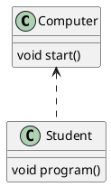
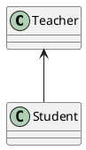
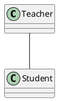
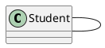
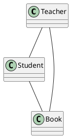
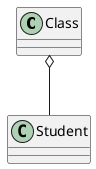
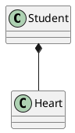
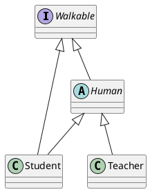

# 面向对象

## 面向对象原则

### 单一职责原则（Single Responsibility Principle）

> There should never be more than one reason for a class to change。
> 应该有且仅有一个原因引起类的变更。简单点说，一个类，最好只负责一件事，只有一个引起它变化的原因。

可以降低类的复杂度，一个类只负责一项职责，其逻辑肯定要比负责多项职责简单的多；提高类的可读性，提高系统的可维护性；变更引起的风险降低，变更是必然的，如果单一职责原则遵守的好，当修改一个功能时，可以显著降低对其他功能的影响。需要说明的一点是单一职责原则不只是面向对象编程思想所特有的，只要是模块化的程序设计，都适用单一职责原则。

### 开闭原则（Open Close Principle）

> Software entities (classes, modules, functions) should be open for extension but closed for modification。
> 对扩展开放，对修改关闭。

开放封闭原则主要体现在对扩展开放、对修改封闭，意味着有新的需求或变化时，可以对现有代码进行扩展，以适应新的情况。软件需求总是变化的，世界上没有一个软件的是不变的，因此对软件设计人员来说，必须在不需要对原有系统进行修改的情况下，实现灵活的系统扩展。

### 里氏替换原则（Liskov Substitution Principle）

> LetΦ(x) be a property provable about objects x of type T. ThenΦ(y) should be true for objects y of type S where S is a subtype of T.
> 设Φ(x)是关于类型为T的对象x的一个可证明的性质，那么Φ(y)对于T的子类型S的对象y应该也是成立的。简单得说，基类存在的地方，是可以用子类替换的。

里氏替换原则告诉我们，在软件中将一个基类对象替换成它的子类对象，程序将不会产生任何错误和异常，反过来则不成立，如果一个软件实体使用的是一个子类对象的话，那么它不一定能够使用基类对象代替。里氏替换原则是实现开闭原则的重要方式之一，由于使用基类对象的地方都可以使用子类对象，因此在程序中尽量使用基类类型来对对象进行定义，而在运行时再确定其子类类型，用子类对象来替换父类对象。

### 接口隔离原则（Interface Segregation Principle）

> Clients should not be forced to depend upon interfaces that they don't use; The dependency of one class to another one should depend on the smallest possible interface。
> 其一是不应该强行要求客户端依赖于它们不用的接口；其二是类之间的依赖应该建立在最小的接口上面。简单点说，客户端需要什么功能，就提供什么接口，对于客户端不需要的接口不应该强行要求其依赖；类之间的依赖应该建立在最小的接口上面，这里最小的粒度取决于单一职责原则的划分。

提供尽可能小的单独接口，而不要提供大的总接口。暴露行为让后面的实现类知道的越少越好。依赖几个专用的接口要比依赖一个综合的接口更灵活。接口是设计时对外部设定的约定，通过分散定义多个接口，可以预防外来变更的扩散，提高系统的灵活性和可维护性。

### 依赖倒置原则（Dependence Inversion Principle）

> High level modules should not depend upon low level modules. Both should depend upon abstractions. Abstractions should not depend upon details. Details should depend upon abstractions。
> 高层模块不应该依赖低层模块，两者都应该依赖其抽象；抽象不应该依赖细节，细节应该依赖抽象。

高层模块包含一个应用程序中重要的策略选择和业务模块，如果高层模块依赖于低层模块，那么低层模块的改动就会直接影响到高层模块，从而迫使高层模块也需要改动。

### 组合/聚合复用原则（Composite/Aggregate Reuse Principle CARP）

> Try to use object composition instead of inheritance to achieve the purpose of reuse.
> 尽量使用合成/聚合达到复用，尽量少用继承。原则： 一个类中有另一个类的对象。

组合/聚合复用原则可以使系统更加灵活，类与类之间的耦合度降低，一个类的变化对其他类造成的影响相对较少，因此一般首选使用组合/聚合来实现复用；其次才考虑继承，在使用继承时，需要严格遵循里氏代换原则，有效使用继承会有助于对问题的理解，降低复杂度，而滥用继承反而会增加系统构建和维护的难度以及系统的复杂度，因此需要慎重使用继承复用

### 迪米特法则（Law Of Demeter）

> 又叫最少知识原则，一个软件实体应当尽可能少的与其他实体发生相互作用。

一个对象对另一个对象知道的越少越好，即一个软件实体应当尽可能少的与其他实体发生相互作用，在一个类里能少用多少其他类就少用多少，尤其是局部变量的依赖类，能省略尽量省略。同时如果两个类不必彼此直接通信，那么这两个类就不应当发生直接的相互作用。如果其中一个类需要调用另一个类的某一方法的话，可以通过第三者转发这个调用。

## JAVA面向对象三大特征

### 封装

封装从字面上来理解就是包装的意思，专业点就是信息隐藏，是指利用抽象数据类型将数据和基于数据的操作封装在一起，使其构成一个不可分割的独立实体，数据被保护在抽象数据类型的内部，尽可能地隐藏内部的细节，只保留一些对外接口使之与外部发生联系。

系统的其他对象只能通过包裹在数据外面的已经授权的操作来与这个封装的对象进行交流和交互。也就是说用户是无需知道对象内部的细节，但可以通过该对象对外的提供的接口来访问该对象。

#### 使用封装的好处

- 减少耦合：可以独立地开发、测试、优化、使用、理解和修改
- 减轻维护的负担：可以更容易被程序员理解，并且在调试的时候可以不影响其他模块
- 有效地调节性能：可以通过剖析来确定哪些模块影响了系统的性能
- 提高软件的可重用性
- 降低了构建大型系统的风险：即使整个系统不可用，但是这些独立的模块却有可能是可用的

### 继承

是使用已存在的类的定义作为基础建立新类的技术，新类的定义可以增加新的数据或新的功能，也可以用父类的功能，但不能选择性地继承父类。通过使用继承我们能够非常方便地复用以前的代码，能够大大的提高开发的效率。

继承所描述的是“**is-A**”的关系，如果有两个对象A和B，若可以描述为“A是B”，则可以表示A继承B，其中B是被继承者称之为父类或者超类，A是继承者称之为子类或者派生类。

实际上继承者是被继承者的特殊化，它除了拥有被继承者的特性外，还拥有自己独有得特性。例如猫有抓老鼠、爬树等其他动物没有的特性。同时在继承关系中，继承者完全可以替换被继承者，反之则不可以，例如我们可以说猫是动物，但不能说动物是猫就是这个道理，其实对于这个我们将其称之为“**向上转型**”。

继承定义了类如何相互关联，共享特性。对于若干个相同或者相识的类，我们可以抽象出他们共有的行为或者属相并将其定义成一个父类或者超类，然后用这些类继承该父类，他们不仅可以拥有父类的属性、方法还可以定义自己独有的属性或者方法。

#### 关键

- 子类**拥有**父类对象所有的属性和方法（包括私有属性和私有方法），但是父类中的私有属性和方法子类是无法访问，只是拥有。
- 子类可以拥有自己属性和方法，即子类可以对父类进行扩展。
- 子类可以用自己的方式实现父类的方法。

#### 程序设计结构

- 构造方法。对于继承而言，子类会默认调用父类的构造方法，但是如果没有默认的父类构造器，子类必须要显示的指定父类的构造器（super），而且必须是在子类构造器中做的第一件事（第一行代码）。
- protected。private访问修饰符，对于封装而言，是最好的选择，但这个只是基于理想的世界，有时候我们需要这样的需求：我们需要将某些事物尽可能地对这个世界隐藏，但是仍然允许子类的成员来访问它们。这个时候就需要使用到protected。
- 向上转型。在上面的继承中我们谈到继承是is-A的相互关系。猫继承与动物，所以我们可以说猫是动物，或者说猫是动物的一种。这样将猫看做动物就是向上转型。

#### 谨慎封装

- 父类变，子类就必须变。
- 继承破坏了封装，对于父类而言，它的实现细节对与子类来说都是透明的。
- 继承是一种强耦合关系。

### 多态

指程序中定义的引用变量所指向的具体类型和通过该引用变量发出的方法调用在编程时并不确定，而是在程序运行期间才确定，即**一个引用变量倒底会指向哪个类的实例对象，该引用变量发出的方法调用到底是哪个类中实现的方法，必须在由程序运行期间才能决定**。

因为在程序运行时才能确定具体的类，就可以在不修改源程序代码的情况下，让引用变量绑定到各种不同的类实现上，从而导致该引用调用的具体方法随之改变。即**不修改程序代码就可以改变程序运行时所绑定的具体代码，让程序可以选择多个运行状态**，这就是多态性。

#### 多态分为编译时多态和运行时多态

- 编译时多态是静态的，主要是指方法的**重载（Overload）**，它是根据参数列表的不同来区分不同的函数，通过编辑之后会变成两个不同的函数，在运行时谈不上多态。
- 运行时多态是动态的，它是通过动态绑定来实现的，也就是我们所说的多态性。子类对父类中某些方法进行**重写/覆盖（Override）**，子类对象调用这些方法时就会调用相关子类重写的方法。

#### 在Java中有两种形式可以实现多态

- 继承类（多个子类对同一方法的重写）
- 实现接口（实现接口并重写接口中同一方法）。

对于Java而言，它多态的实现机制遵循一个原则：当父类对象引用变量引用子类对象时，被引用对象的类型而不是引用变量的类型决定了调用谁的成员方法，但是这个被调用的方法必须是在父类中定义过的，也就是说被子类重写的方法。

#### 多态注意事项

- 指向子类的父类引用由于向上转型了，它只能访问父类中拥有的方法和属性，而对于子类中存在而父类中不存在的方法，该引用是不能使用的，尽管是重载该方法。
- 若子类重写写了父类中的某些方法，在子类对象调用这些方法的时候，必定是使用子类中定义的这些方法（动态连接/动态调用）。

[面向对象编程三大特性------封装、继承、多态](https://blog.csdn.net/jianyuerensheng/article/details/51602015)

## 关系及类图

### 依赖（Dependency）

依赖关系是五种关系中耦合最小的一种关系。学生在学习生活中经常使用电脑，于是对电脑产生了依赖。

### 关联（Association）

类之间的关系比依赖要强。学生与老师是关联的，学生可以不用电脑，但是学生不能没有老师。

#### 单向关联

#### 双向关联

#### 自身关联

#### 多维关联

#### 依赖和关联对比

相同：关联暗示了依赖，二者都用来表示无法用聚合和组合表示的关系。

区别：

- 发生**依赖关系**的两个类都不会增加属性。其中的一个类作为另一个类的方法的参数或者返回值，或者是某个方法的变量而已。发生**关联关系**的两个类，类A成为类B的属性，而属性是一种更为紧密的耦合，更为长久的持有关系。
- 从关系的生命周期来看，依赖关系是仅当类的方法被调用时而产生，伴随着方法的结束而结束。关联关系当类实例化的时候产生，当类对象销毁的时候关系结束。**相比依赖，关联关系的生存期更长**。

### 聚合（Aggregation）

表示整体由部分组成，但是整体和部分不是强依赖的，整体不存在了部分还是会存在。班级不存在了，学生还是会存在。

### 组合（Composition）

组合又叫复合，用来表示个体与组成部分之间的关联关系。

和聚合不同，组合中整体和部分是强依赖的，整体不存在了部分也不存在了。

#### 聚合与组合的对比

- 聚合关系没有组合紧密。
学生不会因为班级的解散而无法存在，聚合关系的类具有不同的生命周期；而学生如果没有心脏将无法存活，组合关系的类具有相同的生命周期。
- 信息的封装性不同。
  - 在聚合关系中，客户端可以同时了解Classes类和Student类，因为他们是独立的。
  - 在组合关系中，客户端只认识Student类，根本不知道Heart类的存在，因为心脏类被严密地封装在学生类中。
- 理解聚合与复合的区别，主要在于聚合的成员可独立，复合的成员必须依赖于整体才有意义。

### 泛化（Generalization）

泛化是学术名称，通俗来讲，泛化指的是类与类之间的继承关系和类与接口之间的实现关系。

[认识UML类关系 —— 依赖、关联、聚合、组合、泛化](https://blog.csdn.net/K346K346/article/details/59582926)
