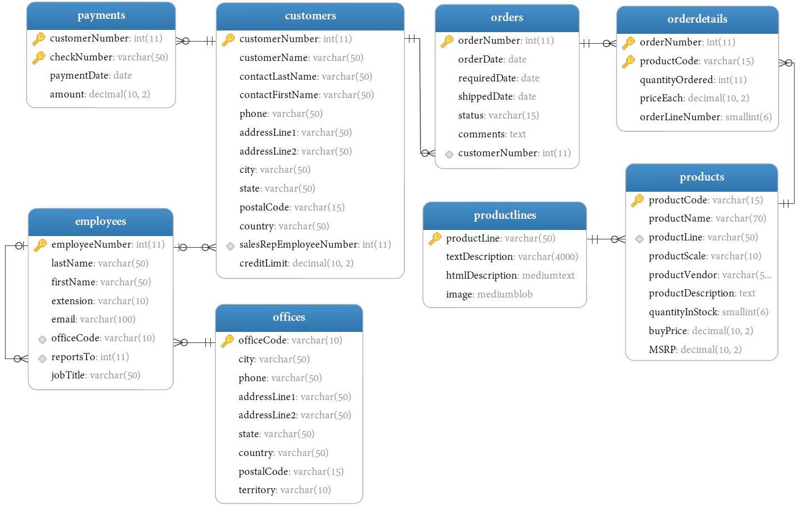

- [MySQL简介](#mysql-简介)
  - [MySQL的优点](#mysql-的优点)
  - [客户机 — 服务器软件](#客户机--服务器软件)
  - [MySQL命令行工具](#mysql-命令行工具)
    - [mysql](#mysql)
    - [mysqldump](#mysqldump)
- [使用MySQL](#使用-mysql)
  - [连接](#连接)
  - [选择数据库（USE）](#选择数据库use)
  - [了解数据库和表（SHOW）](#了解数据库和表show)
- [数据准备](#数据准备)

# MySQL简介

MySQL是一种DBMS，即它是一种数据库软件。

## MySQL的优点

- 成本：MySQL是开放源代码的，一般可以免费使用（甚至可以免费修改）。
- 性能：MySQL执行很快（非常快）。
- 可信赖：某些非常重要和声望很高的公司、站点使用MySQL，这些公司和站点都用MySQL来处理自己的重要数据。
- 简单：MySQL很容易安装和使用。

## 客户机 — 服务器软件

DBMS可分为两类：
- 基于共享文件系统的DBMS
    - 包括诸如Microsoft Access和FileMaker
    - 用于桌面用途，通常不用于高端或更关键的应用
- 基于客户机 — 服务器的DBMS
    - MySQL、Oracle以及Microsoft SQL Server等数据库是基于客户机 — 服务器的数据库。
    - 客户机 — 服务器应用分为两个不同的部分。
        - 服务器部分：是负责所有数据访问和处理的一个软件。这个软件运行在称为数据库服务器的计算机上。与数据文件打交道的只有服务器软件。关于数据、数据添加、删除和数据更新的所有请求都由服务器软件完成。这些请求或更改来自运行客户机软件的计算机。
        - 客户机：是与用户打交道的软件。例如，如果你请求一个按字母顺序列出的产品表，则客户机软件通过网络提交该请求给服务器软件。服务器软件处理这个请求，根据需要过滤、丢弃和排序数据；然后把结果送回到你的客户机软件。

## MySQL命令行工具

### mysql

- 语法：
    ```
    mysql [OPTION] [database]
    ```
- 常用选项：

    | 选项                      | 功能                                |
    | ------------------------- | ----------------------------------- |
    | `-?`, `-I`, `--help`      | 显示帮助信息并退出                  |
    | `-V`, `--version`         | 查看MySQL版本并退出               |
    | `-u`, `--user=name`       | 登入用户名                          |
    | `-p`, `--password[=name]` | 登入用户的密码                      |
    | `-h`, `--host=name`       | 主机名                              |
    | `-P`, `--port=#`          | 连接端口号，设为0时为默认（3306） |
    | `-D`, `--database=name`   | 需要使用的数据库                    |

- 示例：连接MySQL服务器
    ```
    shell> mysql -u root -p -h localhost -P 3306 -D database
    shell> mysql -u root -p test -h localhost -P 3306
    ```

### mysqldump

- 作用：转储MySQL数据库 / 表的结构和内容
- 语法：
    ```
    mysqldump [OPTIONS] database [tables]
    mysqldump [OPTIONS] --databases [OPTIONS] DB1 [DB2 DB3...]
    mysqldump [OPTIONS] --all-databases [OPTIONS]
    ```
- 常用选项：

    | 选项                      | 功能                                |
    | ------------------------- | ----------------------------------- |
    | `-?`, `-I`, `--help`      | 显示帮助信息并退出                  |
    | `-V`, `--version`         | 查看版本并退出                      |
    | `-u`, `--user=name`       | 登入用户名                          |
    | `-p`, `--password[=name]` | 登入用户的密码                      |
    | `-h`, `--host=name`       | 主机名                              |
    | `-P`, `--port=#`          | 连接端口号，设为0时为默认（3306） |
    | `-D`, `--database=name`   | 需要使用的数据库                    |
- 示例：导出一个数据库到db_name.sql文件中
    ```
    shell> mysqldump -u root -p db_name > db_name.sql
    ```

[mysqldump使用方法（MySQL数据库的备份与恢复）](https://www.cnblogs.com/emanlee/p/5410177.html)

# 使用MySQL

## 连接

命令行工具：
```
mysql -u username -p [password]
```

## 选择数据库（USE）

```
USE db_name
```
USE语句并不返回任何结果。依赖于使用的客户机显示某种形式的通知。

## 了解数据库和表（SHOW）

- 获取所有可用的数据库
    ```
    SHOW {DATABASES | SCHEMAS} [LIKE 'pattern' | WHERE expr];
    ```
- 获取一个数据库内的所有表
    ```
    SHOW TABLES;
    ```
- 获取一个表的所以列
    ```
    SHOW [FULL] COLUMNS FROM tb_name [FROM db_name];
    ```
- 获取创建特定数据库或表时的SQL语句
    ```
    SHOW CREATE {DATABASE db_name | TABLE tb_name};
    ```
- 进一步了解 `SHOW`
    ```
    help SHOW
    ```

# 数据准备

- 文件：[mysqldemo.sql](mysqldemo.sql)
- 表

    | 表           | 功能                                                       |
    | ------------ | ---------------------------------------------------------- |
    | customers    | 存储客户的数据                                             |
    | products     | 存储汽车的数据                                             |
    | productLines | 存储产品类别数据                                           |
    | orders       | 存储客户订购的销售订单                                     |
    | orderDetails | 存储每个销售订单的订单产品数据项                           |
    | payments     | 存储客户订单的付款数据信息                                 |
    | employees    | 存储所有员工信息以及组织结构，如：直接上级（谁向谁报告工作） |
    | offices      | 存储销售处数据，类似于各个分公司                           |
- E-R图
    
- 数据导入
    ```
    mysql> source mysqldemo.sql;
    ```