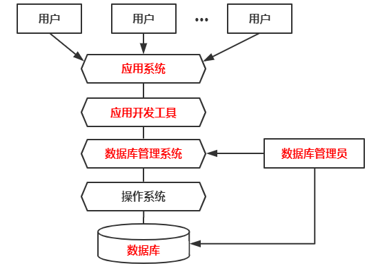
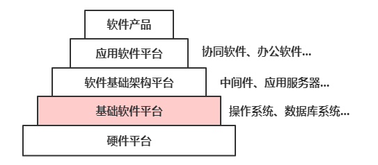
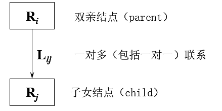
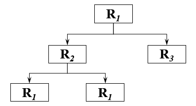
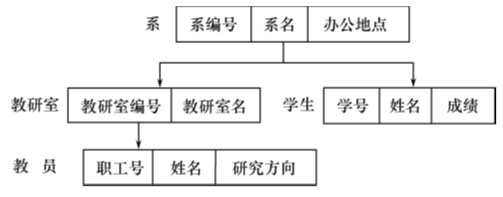
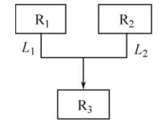
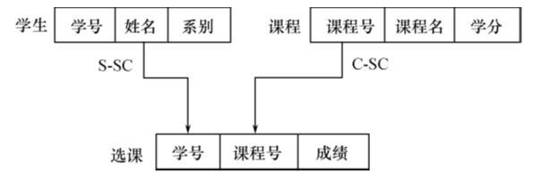
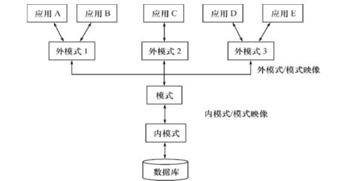

- [数据库系统概论](#数据库系统概论)
    - [数据库的4个基本概念](#数据库的4个基本概念)
        - [数据（Data）](#数据data)
        - [数据库（Database）](#数据库database)
        - [数据库管理系统（DBMS）](#数据库管理系统dbms)
        - [数据库系统（DBS）](#数据库系统dbs)
    - [数据管理技术的产生和发展](#数据管理技术的产生和发展)
    - [数据库系统的特点](#数据库系统的特点)
    - [小结](#小结)
- [数据模型](#数据模型)
    - [两类模型](#两类模型)
        - [概念/信息模型](#概念信息模型)
        - [逻辑模型和物理模型](#逻辑模型和物理模型)
    - [数据模型的三要素](#数据模型的三要素)
        - [数据结构](#数据结构)
        - [数据操作](#数据操作)
        - [数据的完整性约束条件](#数据的完整性约束条件)
    - [常用的数据模型](#常用的数据模型)
        - [层次模型](#层次模型)
        - [网状模型](#网状模型)
        - [关系模型](#关系模型)
- [数据库系统的结构](#数据库系统的结构)
    - [数据库系统的模式（schema）](#数据库系统的模式schema)
    - [数据库系统的三级模式结构](#数据库系统的三级模式结构)
    - [数据库的二级映像功能与数据独立性](#数据库的二级映像功能与数据独立性)
        - [外模式/模式映像](#外模式模式映像)
        - [模式/内模式映像](#模式内模式映像)

# 数据库系统概论

## 数据库的4个基本概念

### 数据（Data）

定义：描述事物的符号记录。是数据库中存储的基本对象。

种类：数字、文字、图形、图像、音频、视频、学生的档案记录等

含义：数据的含义称为数据的语义，数据与其语义是不可分的。例如93是一个数据，其语义可以学生某门课的成绩、默认的体重等。

### 数据库（Database）

定义：
- 顾名思义，是存放数据的仓库，只不过仓库位于计算机存储设备上，且数据按一定的格式存放。
- 严格地讲，数据库是**长期储存**在计算机内、**有组织**的、**可共享**的大量数据的集合。

基本特征：
- 数据按一定的数据模型组织、描述和储存
- 冗余度较小
- 数据独立性较高
- 易扩展
- 可为各种用户共享

三个基本特点：
- 长期储存
- 有组织
- 可共享

### 数据库管理系统（DBMS）

定义：
- 是位于用户与操作系统之间的一层数据管理软件
- 同操作系统意义，是计算机的基础软件，是一个大型复杂的软件系统

功能：
1. 数据定义功能
    - 提供数据定义定义语言（Data Definition Language，DDL）
    - 通过DDL定义数据数据库中的数据对象的组成与结构
2. 数据组织、存储和管理
    - 分类组织、存储和管理各种数据，包括数据字典、用户数据、数据的存取路径等
    - 确定组织数据的文件结构和存取方式
    - 实现数据之间的联系
    - 提供多种存取方法提高存取效率
3. 数据操纵功能
    - 提供数据操纵语言（Data Manipulation Language，DML）
    - 使用DML实现对数据库的基本操作，如插入、查询、修改、删除等
4. 数据库的事务管理和运行管理
    - 数据库在建立、运行和维护时由数据库管理系统统一管理和控制
    - 保证数据的安全性、完整性、多用户对数据的并发使用
    - 发生故障后的系统恢复
5. 数据库的建立和维护功能
    - 数据库初始数据的装载和转换
    - 数据库转储、恢复功能
    - 数据库的重组织
    - 性能监视、分析等
6. 其它功能
    - 数据库管理系统与网络中其它软件系统的通信
    - 数据库管理系统系统之间的数据转换
    - 异构数据库之间的互访和互操作

### 数据库系统（DBS）

组成：
- 数据库
- 数据库管理系统（及其应用开发工具）
- 应用程序
- 数据库管理员（DataBase Administrator，DBA）

定义：有上述组件组成的存储、管理、处理和维护数据的系统

数据库系统在计算机系统中的位置：

注意：在不引起混淆的情况下、人们常把数据库系统简称为数据库。

## 数据管理技术的产生和发展

数据库管理技术的产生：数据库技术是应数据管理任务的需要而产生的。

数据管理：
- 对数据进行分类、组织、编码、存储、检索和维护
- 数据处理的中心问题

数据处理：对各种数据进行收集、存储、加工和传播的一系列活动的总和

数据管理技术的发展历程
- 人工管理阶段（20世纪50年代中之前）
- 文件系统阶段（20世纪50年代末--60年代中）
- 数据库系统阶段（20世纪60年代末--现在）

## 数据库系统的特点

1. 数据结构化
    - 数据的**整体结构化**是数据库的主要特征之一
2. 数据的共享性高，冗余度低且易扩充
    - 数据面向整个系统，可以被多个用户、多个应用共享使用
3. 数据独立性高
    - 物理独立性
    - 逻辑独立性
4. 数据由数据库管理系统统一管理和控制
    - 数据库管理系统提供的数据控制功能
         - 数据的安全性（Security）保护
         - 数据的完整性（Integrity）检查
         - 并发（Concurrency）控制
         - 数据库恢复（Recovery）
     - 应用程序与数据的对应关系（数据库系统阶段）

## 小结

- 数据库是长期存储在计算机内有组织的大量的共享的数据集合。
- 可以供各种用户共享，具有最小冗余度和较高的数据独立性。
- 数据库管理系统在数据库建立、运用和维护时对数据库进行统一控制，以保证数据的完整性、安全性，并在多用户同时使用数据库时进行并发控制，在发生故障后对数据库进行恢复。

# 数据模型

数据模型是对现实世界数据特征的抽象。通俗地讲数据模型就是现实世界的模拟。数据模型应满足三方面要求
- 能比较真实地模拟现实世界
- 容易为人所理解
- 便于在计算机上实现

**数据模型是数据库系统的核心和基础**

客观对象的抽象过程：
- 现实世界中的客观对象抽象为概念模型；（将现实世界抽象为信息世界）
- 把概念模型转换为某一数据库管理系统支持的数据模型。（将信息世界转换为机器世界）

## 两类模型

根据模型应用的不同目的，可以分为两大类，它们分别属于两个不同的层次

### 概念/信息模型

定义：也称信息模型，它是按用户的观点来对数据和信息建模，用于数据库设计。

信息世界中的基本概念：
- 实体（Entity）：客观存在并可相互区别的事物称为实体。可以是具体的人、事、物或抽象的概念。
- 属性（Attribute）：实体所具有的某一特性称为属性。一个实体可以由若干个属性来刻画。
- 码（Key）：唯一标识实体的属性集称为码。
- 实体型（Entity Type）：用实体名及其属性名集合来抽象和刻画同类实体
- 实体集（Entity Set）：同一类型实体的集合
- 联系（Relationship）：现实世界中事物内部以及事物之间的联系在信息世界
中反映为实体（型）内部的联系和实体（型）之间的联系。
    - 实体内部的联系：通常是指组成实体的各属性之间的联系
    - 实体之间的联系：通常是指不同实体集之间的联系，有一对一、一对多、多对多等多种类型

概念模型的表示方法：实体-联系方法（Entity-Relationship Approach）
- 用E-R图来描述现实世界的概念模型
- E-R方法也称为E-R模型

### 逻辑模型和物理模型

逻辑模型
- 包括网状模型、层次模型、关系模型、面向对象数据模型、对象关系数据模型、半结构化数据模型
- 按计算机系统的观点对数据建模，用于DBMS实现。

物理模型：
- 是对数据最底层的抽象，描述数据在系统内部的表示方式和存取方法，在磁盘或磁带上的存储方式和存取方法。

## 数据模型的三要素

### 数据结构

- 描述数据库的组成对象，以及对象之间的联系
- 是对系统静态特征的描述

### 数据操作

对数据库中各种对象（型）的实例（值）允许执行的操作的集合，包括操作及有关的操作规则

数据操作的类型：
- 查询
- 更新（包括插入、删除、修改）

数据模型对操作的定义
- 操作的确切含义
- 操作符号
- 操作规则（如优先级）
- 实现操作的语言
- 数据操作是对系统动态特性的描述

### 数据的完整性约束条件

数据的完整性约束条件：
- 一组完整性规则的集合
- 完整性规则：给定的数据模型中数据及其联系所具有的制约和依存规则
- 用以限定符合数据模型的数据库状态以及状态的变化，以保证数据的正确、有效和相容

数据模型对完整性约束条件的定义：
- 反映和规定必须遵守的基本的通用的完整性约束条件。
- 提供定义完整性约束条件的机制，以反映具体应用所涉及的数据必须遵守的特定的语义约束条件。

## 常用的数据模型

**基本层次联系**：指两个记录以及他们之间的一对多（包括一对一）的联系。
  
- $R_i$位于联系$L_{ij}$的起点，称为双亲结点（parent）
- $R_j$位于联系$L_{ij}$的终点，称为子女结点（child、）

**主要逻辑数据模型**：
- 结构化模型
    - 层次模型（Hierarchical Model）
    - 网状模型（Network Model）
- 关系模型（Relational Model)）
- 面向对象数据模型（Object Oriented Data Model）
- 对象关系数据模型（Object Relational Data Model）
- 半结构化数据模型（Semistruture Data Model）

### 层次模型

层次模型是数据库系统中最早出现的数据模型，代表：IMS数据库管理系统

**数据结构**：
- 层次模型用**树形结构**来表示各类实体以及实体间的联系
- 要求
    - 有且只有一个结点没有双亲结点，这个结点称为根结点
    - 根以外的其它结点有且只有一个双亲结点

**术语**：
- 根结点：没有双亲结点的结点。有且只有一个
- 双亲结点
- 兄弟结点（twin、sibling）：同一双亲结点的
- 叶结点：没有子女结点的结点

**图示与实例**：
- 图示：
  
- 示例：
  

**特点**：
- 结点的双亲是唯一的
- 只能直接处理一对多的实体联系
- 每个记录类型可以定义一个排序字段，也称为码字段
- 任何记录值只有按其路径查看时，才能显出它的全部意义
- 没有一个子女记录值能够脱离双亲记录值而独立存在

**操纵与完整性约束**：
- 操纵
    - 查询
    - 插入
    - 删除
    - 更新
- 完整性约束条件：
    - 无相应的双亲结点值就不能插入子女结点值
    - 如果删除双亲结点值，则相应的子女结点值也被同时删除
    - 更新操作时，应更新所有相应记录，以保证数据的一致性

**优缺点**：
- 优点
    - 层次模型的数据结构比较简单清晰
    - 查询效率高，性能优于关系模型，不低于网状模型
    - 层次数据模型提供了良好的完整性支持
- 缺点
    - 结点之间的多对多联系表示不自然
    - 对插入和删除操作的限制多，应用程序的编写比较复杂
    - 查询子女结点必须通过双亲结点
    - 层次命令趋于程序化

### 网状模型

网状数据库系统采用网状模型作为数据的组织方式，代表：DBTG系统

**数据结构**：
- 允许一个以上的结点无双亲
- 一个结点可以有多于一个的双亲

**表示方法（与层次数据模型相同）**：
- 实体型：用记录类型描述每个结点表示一个记录类型（实体）
- 属性：用字段描述每个记录类型可包含若干个字段
- 联系：用结点之间的连线表示记录类型（实体）之间的一对多的父子联系

**多对多联系在网状模型中的表示**：
- 用网状模型间接表示多对多联系
- 方法：将多对多联系直接分解成一对多联系

**图示与实例**：
- 图示：
  
- 示例：
  

**网状模型与层次模型的区别**：
- 网状模型允许多个结点没有双亲结点
- 网状模型允许结点有多个双亲结点
- 网状模型允许两个结点之间有多种联系（复合联系）
- 网状模型可以更直接地描述现实世界
- 层次模型实际上是网状模型的一个特例

**操纵与完整性约束**：
- 网状数据库系统（如DBTG）对数据操纵加了一些限制，提供了一定的完整性约束
码：唯一标识记录的数据项的集合
- 一个联系中双亲记录与子女记录之间是一对多联系
- 支持双亲记录和子女记录之间某些约束条件

**优缺点**：
- 优点
    - 能够更为直接地描述现实世界，如一个结点可以有多个双亲
    - 具有良好的性能，存取效率较高
- 缺点
    - 结构比较复杂，而且随着应用环境的扩大，数据库的结构就变得越来越复杂，不利于最终用户掌握
    - DDL、DML语言复杂，用户不容易使用
    - 记录之间联系是通过存取路径实现的，用户必须了解系统结构的细节

### 关系模型

关系数据库系统采用关系模型作为数据的组织方式。

**数据结构**：
- 在用户观点下，关系模型中数据的逻辑结构是一张二维表，它由行和列组成。
- 关系必须是规范化的，满足一定的规范条件（第一、第二范式等）

**术语**：
- 关系（Relation）：一个关系对应通常说的一张表
- 元组（Tuple）：表中的一行即为一个元组
- 属性（Attribute）：表中的一列即为一个属性，给每一个属性起一个名称即属性名
- 主码（Key）：也称码键，表中的某个属性组，它可以唯一确定一个元组
- 域（Domain）：是一组具有相同数据类型的值的集合。属性的取值范围来自某个域。如：人的年龄一般在0 ~ 120之间。
- 分量：元组中的一个属性值。
- 关系模式：对关系的描述。表示方法：关系名（属性名1, 属性名2, ..., 属性n）

**操纵与完整性约束**：
- 操纵：
    - 数据操作是集合操作，操作对象和操作结果都是关系：查询、插入、删除、更新
    - 存取路径对用户隐蔽，用户只要指出“干什么”，不必详细说明“怎么干”
- 完整性约束条件：
    - 实体完整性
    - 参照完整性
    - 用户定义的完整性

**优缺点**：
- 优点
    - 建立在严格的数学概念的基础上
    - 概念单一
    - 实体和各类联系都用关系来表示
    - 对数据的检索结果也是关系
    - 关系模型的存取路径对用户透明
    - 具有更高的数据独立性，更好的安全保密性
    - 简化了程序员的工作和数据库开发建立的工作
- 缺点
    - 存取路径对用户透明，查询效率往往不如格式化数据模型
    - 为提高性能，必须对用户的查询请求进行优化，增加了开发数据库管理系统的难度

# 数据库系统的结构

## 数据库系统的模式（schema）

**型与值**：
- 型（type）：对某一类数据的结构和属性的说明
- 值（value）：是型的一个具体赋值
- 例如：
    - 学生记录型：（学号，姓名，性别，系别，年龄，籍贯）
    - 学生记录值：（201315130，李明，男，计算机系，19，江苏南京市）

**模式与实例**：
- 模式（schema）：
    - 数据库逻辑结构和特征的描述
    - 是型的描述，不涉及具体值
    - 反映的是数据的结构及其联系
    - 模式是相对稳定的
- 实例（Instance）
    - 模式的一个具体值
    - 反映数据库某一时刻的状态
    - 同一个模式可以有很多实例
    - 实例随数据库中的数据的更新而变动
- 例如：
    - 在学生选课数据库模式：包含学生记录、课程记录和学生选课记录
    - 2013年学生选课数据库实例：包含2013年学校中所有学生的记录、学校开设的所有课程的记录和所有学生选课的记录。该实例不同于2012年的学生选课数据库实例

## 数据库系统的三级模式结构

- 模式（Schema）：也称逻辑模式
    - 是数据库中全体数据的逻辑结构和特征的描述，是所有用户的公共数据视图。
    - 是数据库系统模式结构的中间层，与数据的物理存储细节和硬件环境无关，与具体的应用程序、开发工具及高级程序设计语言无关。
    - 实际上是数据库数据在逻辑上的视图，在一个数据库只有一个模式
- 外模式（External Schema）：也称子模式或用户模式
    - 是数据库用户（包括应用程序员和最终用户）使用的局部数据的逻辑结构和特征的描述，是数据库用户的数据视图，是与某一应用有关的数据的逻辑表示
    - 介于模式与应用之间。外模式通常是模式的子集
    - 一个数据库可以有多个外模式
    - 保证数据库安全性的一个有力措施，每个用户只能看见和访问所对应的外模式中的数据
- 内模式（Internal Schema）：也称存储模式
    - 是数据物理结构和存储方式的描述，是数据在数据库内部的表示方式
    - 一个数据库只有一个内模式

## 数据库的二级映像功能与数据独立性

三级模式是对数据的三个抽象级别，二级映象在数据库管理系统内部实现这三个抽象层次的**联系和转换**
- 外模式/模式映像
- 模式/内模式映像

### 外模式/模式映像

- 模式描述的是数据的全局逻辑结构，外模式描述的是数据的局部逻辑结构
- 同一个模式可以有任意多个外模式
- 每一个外模式，数据库系统都有一个外模式/模式映象，定义外模式与模式之间的对应关系
- 映象定义通常包含在各自外模式的描述中
- 保证数据的逻辑独立性
    - 当模式改变时，数据库管理员对外模式/模式映象作相应改变，使外模式保持不变
    - 应用程序是依据数据的外模式编写的，应用程序不必修改，保证了数据与程序的逻辑独立性，简称数据的逻辑独立性

### 模式/内模式映像

- 模式/内模式映象定义了数据全局逻辑结构与存储结构之间的对应关系。例如，说明逻辑记录和字段在内部是如何表示的
- 数据库中模式/内模式映象是唯一的，该映象定义通常包含在模式描述中
- 保证数据的物理独立性
    - 当数据库的存储结构改变了（例如选用了另一种存储结构），数据库管理员修改模式/内模式映象，使模式保持不变。
    - 应用程序不受影响。保证了数据与程序的物理独立性，简称数据的物理独立性。