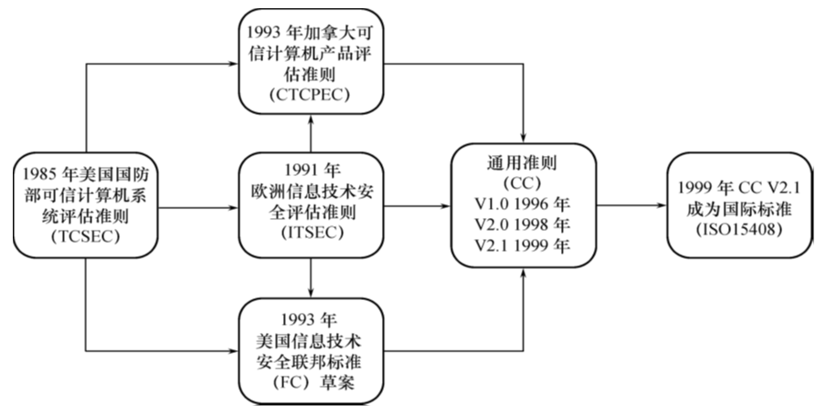
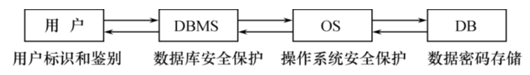
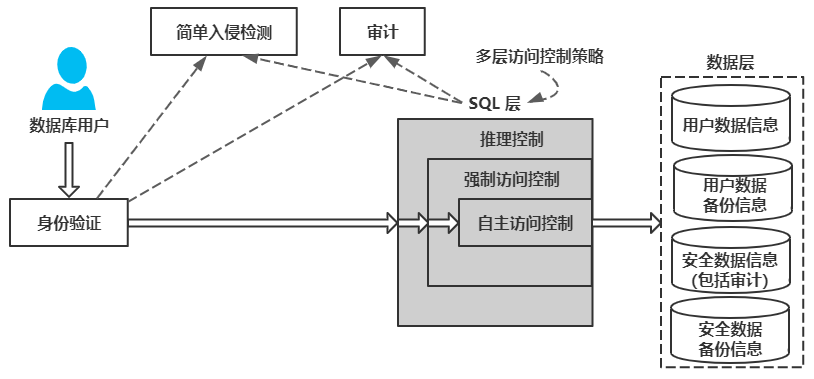
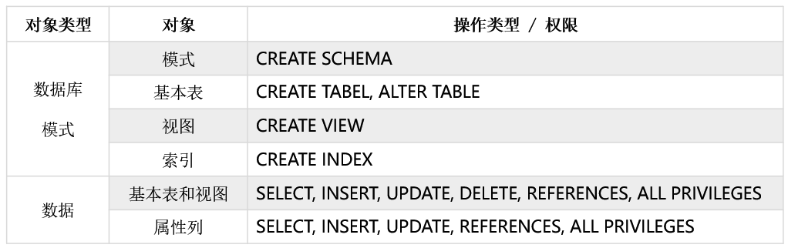
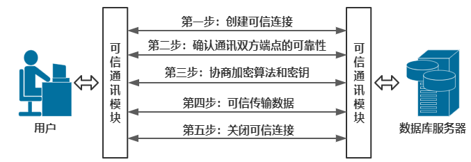

- [安全标准](#安全标准)
    - [TCSEC/TDI标准](#tcsectdi标准)
    - [CC标准](#cc标准)
- [数据库系统安全性的技术和方法](#数据库系统安全性的技术和方法)
    - [数据库安全控制](#数据库安全控制)
        - [用户身份鉴别](#用户身份鉴别)
        - [存取控制](#存取控制)
        - [自主存取控制方法](#自主存取控制方法)
        - [授权：授予与回收](#授权授予与回收)
            - [授予GRANT](#授予grant)
            - [回收REVOKE](#回收revoke)
        - [数据库角色](#数据库角色)
        - [强制存取控制方法](#强制存取控制方法)
    - [视图机制](#视图机制)
    - [审计](#审计)
    - [数据加密](#数据加密)
    - [其他安全性保护](#其他安全性保护)

# 安全标准



## TCSEC/TDI标准

1991年4月美国NCSC（国家计算机安全中心）颁布了《可信计算机系统评估标准关于可信数据库系统的解释》（Trusted Database Interpretation，TDI）
- TDI又称紫皮书。它将TCSEC扩展到数据库管理系统
- TDI中定义了数据库管理系统的设计与实现中需满足和用以进行安全性级别评估的标准

**TCSEC/TDI标准的基本内容**：从四个方面来描述安全性级别划分的指标
- 安全策略
- 责任
- 保证
- 文档

**TCSEC/TDI安全级别划分**：

| 安 全 级 别 | 定 义                                             |
| ----------- | ------------------------------------------------- |
| A1          | 验证设计（Verified Design）                       |
| B3          | 安全域（Security Domains）                        |
| B2          | 结构化保护（Structural Protection）               |
| B1          | 标记安全保护（Labeled Security Protection）       |
| C2          | 受控的存取保护（Controlled Access Protection）    |
| C1          | 自主安全保护（Discretionary Security Protection） |
| D           | 最小保护（Minimal Protection）                    |
- 四组（division）七个等级
    - D
    - C（C1，C2）
    - B（B1，B2，B3）
    - A（A1）
- 按系统可靠或可信程度逐渐增高
- 各安全级别之间具有一种偏序向下兼容的关系，即**较高安全性级别提供的安全保护要包含较低级别的所有保护要求**，同时提供更多或更完善的保护能力
- D级：将一切不符合更高标准的系统均归于D组
    - 典型例子：DOS是安全标准为D的操作系统。DOS在安全性方面几乎没有什么专门的机制来保障
- C1级：非常初级的自主安全保护
    - 能够实现对用户和数据的分离，进行**自主存取控制（DAC）**，保护或限制用户权限的传播
    - 现有的商业系统稍作改进即可满足
- C2级：安全产品的最低档次
    - 提供受控的存取保护，将C1级的DAC进一步细化，以个人身份注册负责，并实施审计和资源隔离
    - 达到C2级的产品在其名称中往往不突出“安全”（Security）这一特色
    - 典型例子：Windows 2000、Oracle 7
- B1级：标记安全保护。“安全”（Security）或“可信的” （Trusted）产品。
    - 对系统的数据加以标记，对标记的主体和客体实施**强制存取控制（MAC）**、审计等安全机制
    - B1级别的产品才被认为是真正意义上的安全产品，满足此级别的产品前一般多冠以“安全”（security）或“可信的”（trusted）字样，作为区别于普通产品的安全产品出售
    - 典型例子
        - 操作系统：惠普公司的HP-UX BLS release 9.09+
        - 数据库：Oracle公司的Trusted Oracle 7、Sybase公司的Secure SQL Server version 11.0.6
- B2级：结构化保护
    - 建立形式化的安全策略模型并对系统内的所有主体和客体实施DAC和MAC
- B3级：安全域
    - 该级的TCB必须满足访问监控器的要求，审计跟踪能力更强，并提供系统恢复过程
- A1级：验证设计
    - 即提供B3级保护的同时给出系统的形式化设计说明和验证以确信各安全保护真正实现。

## CC标准

- 提出国际公认的表述信息技术安全性的结构
- 把信息产品的安全要求分为
    - 安全功能要求
    - 安全保证要求

**CC文本组成**
- 简介和一般模型：有关术语、基本概念和一般模型以及与评估有关的一些框架
- 安全功能要求：列出了一系列类、子类和组件
- 安全保证要求：列出了一系列保证类、子类和组件
- 提出了评估保证级（Evaluation Assurance Level，EAL），从EAL1至EAL7共分为七级

**CC评估保证级（EAL）划分**

| 评估保证级 | 定 义                                                                   | TCSEC安全级别（近似相当） |
| ---------- | ----------------------------------------------------------------------- | ------------------------- |
| EAL1       | 功能测试（functionally tested）                                         |                           |
| EAL2       | 结构测试（structurally tested）                                         | C1                        |
| EAL3       | 系统地测试和检查（methodically tested and checked）                     | C2                        |
| EAL4       | 系统地设计、测试和复查（methodically designed，tested，and reviewed） | B1                        |
| EAL5       | 半形式化设计和测试（semiformally designed and tested）                  | B2                        |
| EAL6       | 半形式化验证的设计和测试（semiformally verified design and tested）     | B3                        |
| EAL7       | 形式化验证的设计和测试（formally verified design and tested）           | A1                        |

# 数据库系统安全性的技术和方法

非法使用数据库的情况:
- 编写合法程序绕过数据库管理系统及其授权机制
- 直接或编写应用程序执行非授权操作
- 通过多次合法查询数据库从中推导出一些保密数据

计算机系统中，安全措施是一级一级层层设置

- **系统**根据用户标识鉴定用户身份，合法用户才准许进入计算机系统
- **数据库管理系统**还要进行存取控制，只允许用户执行合法操作
- **操作系统**有自己的保护措施
- 数据以密码形式存储到**数据库**中

**数据库管理系统安全性控制模型**：

- 首先，数据库管理系统对提出SQL访问请求的数据库用户进行身份鉴别，防止不可信用户使用系统。
- 然后，在SQL处理层进行自主存取控制和强制存取控制，进一步可以进行推理控制。
- 还可以对用户访问行为和系统关键操作进行审计，对异常用户行为进行简单入侵检测。

**实现数据库系统安全性的技术和方法**:
- 用户身份鉴别
- 存取控制技术：自主存取控制和强制存取控制
- 视图技术
- 审计技术
- 数据加密存储和加密传输


## 数据库安全控制

### 用户身份鉴别

用户身份鉴别（Identification & Authentication）：系统提供的最外层安全保护措施

用户标识：由用户名和用户标识号组成（用户标识号在系统整个生命周期内唯一）

用户身份鉴别的方法
- 静态口令鉴别
- 动态口令鉴别
- 生物特征鉴别
- 智能卡鉴别

### 存取控制

**存取控制机制组成**：用户权限定义和合法权检查机制一起组成了数据库管理系统的存取控制子系统
- 定义用户权限，并将用户权限登记到数据字典中
    - 用户对某一数据对象的操作权力称为**权限**
    - DBMS提供适当的语言来定义用户权限，存放在数据字典中，称做**安全规则或授权规则**
- 合法权限检查
    - 用户发出存取数据库操作请求
    - DBMS查找数据字典，进行合法权限检查

**常用存取控制方法**：
- 自主存取控制（Discretionary Access Control，简称DAC）
    - C2级
    - 用户对不同的数据对象有不同的存取权限
    - 不同的用户对同一对象也有不同的权限
    - 用户还可将其拥有的存取权限转授给其他用户
- 强制存取控制（Mandatory Access Control，简称MAC）
    - B1级
    - 每一个数据对象被标以一定的密级
    - 每一个用户也被授予某一个级别的许可证
    - 对于任意一个对象，只有具有合法许可证的用户才可以存取

### 自主存取控制方法

- 通过SQL的`GRANT`语句和`REVOKE`语句实现
- 用户权限组成
    - 数据对象
    - 操作类型
- 定义用户存取权限：定义用户可以在哪些数据库对象上进行哪些类型的操作
- **定义存取权限称为授权**

**关系数据库系统中存取控制对象**:


### 授权：授予与回收

#### 授予GRANT

```
GRANT <权限> [, <权限>]...
    ON <对象类型> <对象名> [, <对象类型> <对象名>]...
    TO <用户> [, <用户>]...
    [WITH GRANT OPTION];
```
> - 将对指定操作对象的指定操作权限授予指定的用户
>     - 发出GRANT：
>         - 数据库管理员
>         - 数据库对象创建者（即属主Owner）
>         - 拥有该权限的用户
>     - 按受权限的用户
>         - 一个或多个具体用户
>         - PUBLIC（即全体用户）
> - WITH GRANT OPTION子句:
>     - 指定：可以再授予，可以传播（U1授权给U2，U2也可以授权给U3）
>     - 没有指定：不能传播（U2不可以授权）
> - 不允许循环授权：（U2不能反过来授权给U1）

#### 回收REVOKE

```
REVOKE <权限> [, <权限>]...
    ON <对象类型> <对象名> [, <对象类型> <对象名>]...
    FROM <用户> [, <用户>]...[CASCADE | RESTRICT];
```
> - 授予的权限可以由数据库管理员或其他授权者用REVOKE语句收回

### 数据库角色

数据库角色：被命名的一组与数据库操作相关的权限（权限组）
    - 角色是权限的集合
    - 可以为一组具有相同权限的用户创建一个角色
    - 简化授权的过程

1. 创建
    ```
    CREATE ROLE <角色名>
    ```
2. 给角色授权
    ```
    GRANT <权限> [, <权限>]...
        ON <对象类型> <对象名> [, <对象类型> <对象名>]...
        TO <角色> [, <角色>]...
    ```
3. 将角色授予其他的角色或用户
    ```
    GRANT <角色>[,<角色>]...
        TO <角色> [, <用户>]...
        [WITH ADMIN OPTION]
    ```
    > - 该语句把角色授予某用户，或授予另一个角色
    > - 授予者是角色的创建者或拥有在这个角色上的ADMIN OPTION
    > - 指定了WITH ADMIN OPTION则获得某种权限的角色或用户还可以把这种权限授予其他角色
4. 角色权限的收回
    ```
    REVOKE <权限> [, <权限>]...
        ON <对象类型> <对象名>
        FROM <角色> [, <角色>]...
    ```
    > - 用户可以回收角色的权限，从而修改角色拥有的权限
    > - REVOKE执行者是角色的创建者或拥有在这个（些）角色上的ADMIN OPTION

### 强制存取控制方法

**自主存取控制缺点**：可能存在数据的“无意泄露”
- 原因：这种机制仅仅通过对数据的存取权限来进行安全控制，而数据本身并无安全性标记
- 解决：对系统控制下的所有主客体实施强制存取控制策略

**强制存取控制（MAC）**
- 保证更高程度的安全性
- 用户不能直接感知或进行控制
- 适用于对数据有严格而固定密级分类的部门
    - 军事部门
    - 政府部门

**主体和客体**：在强制存取控制中，数据库管理系统所管理的全部实体被分为主体和客体两大类：
- 主体是系统中的活动实体：数据库管理系统所管理的实际用户，代表用户的各进程
- 客体是系统中的被动实体，受主体操纵：文件、基本表、索引、视图

**敏感度标记（Label）**
- 对于主体和客体，DBMS为它们每个实例（值）指派一个敏感度标记（Label）
- 敏感度标记分成若干级别
    - 绝密（Top Secret，TS）
    - 机密（Secret，S）
    - 可信（Confidential，C）
    - 公开（Public，P）
- TS$\geq$S$\geq$C$\geq$P
- 主体的敏感度标记称为许可证级别（Clearance Level）
- 客体的敏感度标记称为密级（Classification Level）

**强制存取控制规则**：
- 读：仅当主体的许可证级别$\geq$客体的密级时，该主体才能读取相应的客体
- 写：仅当主体的许可证级别$\leq$客体的密级时，该主体才能写相应的客体

强制存取控制（MAC）是对数据本身进行密级标记，无论数据如何复制，标记与数据是一个不可分的整体，只有符合密级标记要求的用户才可以操纵数据。

**DAC + MAC安全检查**：
- 实现强制存取控制时要首先实现自主存取控制
- 原因：较高安全性级别提供的安全保护要包含较低级别的所有保护
- 自主存取控制与强制存取控制共同构成数据库管理系统的安全机制
- SQL语法分析 & 语义检测$\Longrightarrow$安全检查（DAC检查$\Longrightarrow$MAC检查）$\Longrightarrow$继续语义检查

## 视图机制

- 把要保密的数据对无权存取这些数据的用户隐藏起来，对数据提供一定程度的安全保护
- 间接地实现支持存取谓词的用户权限定义

## 审计

- 启用一个专用的审计日志（Audit Log），将用户对数据库的所有操作记录在上面
- 审计员利用审计日志，监控数据库中的各种行为，找出非法存取数据的人、时
间和内容
- C2以上安全级别的DBMS必须具有审计功能
- 审计功能的可选性：审计很费时间和空间，DBA可以根据应用对安全性的要求，灵活地打开或关闭审计功能。审计功能主要用于安全性要求较高的部门

## 数据加密

- 数据加密：防止数据库中数据在存储和传输中失密的有效手段
- 加密的基本思想：根据一定的算法将原始数据—明文（Plain text）变换为不可直接识别的格式 —— 密文（Cipher text）
- 加密方法：存储加密、传输加密

**存储加密**
- 透明存储加密
    - 内核级加密保护方式，对用户完全透明
    - **内核级加密方法: 性能较好，安全完备性较高**
    - 将数据在写到磁盘时对数据进行加密，授权用户读取数据时再对其进行解密
    - 数据库的应用程序不需要做任何修改，只需在创建表语句中说明需加密的字段即可
- 非透明存储加密
    - 通过多个加密函数实现

**传输加密**
- 链路加密
    - 在链路层进行加密
    - 传输信息由报头和报文两部分组成
    - **报文和报头均加密**
- 端到端加密
    - 在发送端加密，接收端解密
    - **只加密报文不加密报头**
    - 所需密码设备数量相对较少，容易被非法监听者发现并从中获取敏感信息



**基于安全套接层协议SSL传输方案的实现思路**：
1. 确认通信双方端点的可靠性
    - 采用基于数字证书的服务器和客户端认证方式
    - 通信时均首先向对方提供己方证书，然后使用本地的CA信任列表和证书撤销列表对接收到的对方证书进行验证
2. 协商加密算法和密钥
    - 确认双方端点的可靠性后，通信双方协商本次会话的加密算法与密钥
3. 可信数据传输
    - 业务数据在被发送之前将被用某一组特定的密钥进行加密和消息摘要计算，以密文形式在网络上传输
    - 当业务数据被接收的时候，需用相同一组特定的密钥进行解密和摘要计算

## 其他安全性保护

- 推理控制
    - 处理强制存取控制未解决的问题
    - 避免用户利用能够访问的数据推知更高密级的数据
    - 常用方法
        - 基于函数依赖的推理控制
        - 基于敏感关联的推理控制
- 隐蔽信道
    - 处理强制存取控制未解决的问题
- 数据隐私保护
    - 描述个人控制其不愿他人知道或他人不便知道的个人数据的能力
    - 范围很广：数据收集、数据存储、数据处理和数据发布等各个阶段