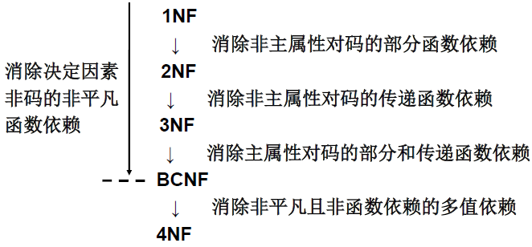

- [概述](#概述)
  - [关系模式](#关系模式)
  - [数据依赖](#数据依赖)
  - [关系模式可能存在的问题](#关系模式可能存在的问题)
- [规范化](#规范化)
  - [函数依赖](#函数依赖)
    - [平凡函数依赖与非平凡函数依赖](#平凡函数依赖与非平凡函数依赖)
    - [完全函数依赖与部分函数依赖](#完全函数依赖与部分函数依赖)
    - [传递函数依赖](#传递函数依赖)
  - [码](#码)
  - [范式](#范式)
    - [规范化](#规范化-1)
    - [1NF](#1nf)
    - [2NF](#2nf)
    - [3NF](#3nf)
    - [BCNF](#bcnf)
    - [多值依赖](#多值依赖)
    - [4NF](#4nf)
  - [规范化小结](#规范化小结)
- [数据依赖的公理系统](#数据依赖的公理系统)

# 概述

## 关系模式

关系模式由五部分组成，是一个五元组： R(U, D, DOM, F)
- 关系名 R 是符号化的元组语义
- U 为一组属性
- D 为属性组 U 中的属性所来自的域
- DOM 为属性到域的映射
- F 为属性组 U 上的一组数据依赖

由于 D、DOM 与模式设计关系不大，因此在本章中把关系模式看作一个三元组：R<U, F>
- 当且仅当 U 上的一个关系 r 满足 F 时，r 称为关系模式 R<U, F> 的一个关系
- 作为二维表，关系要符合一个最基本的条件：**每个分量必须是不可分开的数据项**
- 满足了这个条件的关系模式就属于**第一范式（1NF）**

## 数据依赖

定义：
- 是一个关系内部属性与属性之间的一种约束关系
- 通过属性间值的相等与否体现出来的数据间相互联系
- 是现实世界属性间相互联系的抽象
- 是数据内在的性质
- 是语义的体现

主要类型
- **函数依赖**（Functional Dependency，简记为 FD）
    > - 函数依赖普遍存在于现实生活中
    > - 示例：Student(Sno, Sname, Sdept)
    >>    - 一个学号只对应一个学生，一个学生只在一个系中学习“学号”值确定后，学生的姓名及所在系的值就被唯一确定。
    >>    - Sname = f(Sno)，dept = f(Sno)
    >>    - 即 Sno 函数决定 Sname，Sno 函数决定 Sdept
    >>    - 记作：Sno \rightarrow Sname，Sno \rightarrow Sdept
- **多值依赖**（Multi-Valued Dependency，简记为 MVD）

## 关系模式可能存在的问题

关系模式：Student<U, F>
- U = {Sno, Sdept, Mname, Cno, Grade}
    - 学生号, 所在系, 系主任名, 课程号, 成绩
- F = {Sno $\rightarrow$ Sdept, Sdept $\rightarrow$ Mname, (Sno, Cno) $\rightarrow$ Grade}
    - 一个系有若干学生， 但一个学生只属于一个系；
    - 一个系只有一名（正职）负责人；
    - 一个学生可以选修多门课程，每门课程有若干学生选修；
    - 每个学生学习每一门课程有一个成绩。

存在的问题
- 数据冗余
    - 浪费大量的存储空间
    - 每一个系主任的姓名重复出现，重复次数与该系所有学生的所有课程成绩出现次数相同
- 更新异常（Update Anomalies）
    - 数据冗余，更新数据时，维护数据完整性代价大
    - 某系更换系主任后，必须修改与该系学生有关的每一个元组
- 插入异常（Insertion Anomalies）
    - 如果一个系刚成立，尚无学生，则无法把这个系及其系主任的信息存入数据库
- 删除异常（Deletion Anomalies）
    - 如果某个系的学生全部毕业了， 则在删除该系学生信息的同时，把这个系及其系主任的信息也丢掉了

分析
- Student 关系模式不是一个好的模式。
- **一个“好”的模式应当不会发生插入异常、删除异常和更新异常，数据冗余应尽可能少。**
- 原因：由存在于模式中的某些数据依赖引起的。
- 解决方法：用规范化理论改造关系模式来消除其中不合适的数据依赖
    - 把这个单一的模式分成三个关系模式：
        - 学生表：S(Sno, Sdept, Sno $\rightarrow$ Sdept)
        - 学生成绩表：SC(Sno, Cno, Grade, (Sno,Cno) $\rightarrow$ Grade)
        - 系表：DEPT(Sdept, Mname, Sdept $\rightarrow$ Mname)
    - 这三个模式都不会发生插入异常、删除异常的问题，数据的冗余也得到了控制。

# 规范化

## 函数依赖

- 定义：设 R(U) 是一个属性集 U 上的关系模式，X 和 Y 是 U 的子集，若对于 R(U) 的任意一个可能的关系 r，r 中不可能存在两个元组在 X 上的属性值相等而在 Y 上的属性值不等，则称“**X 函数确定 Y**”或“**Y 函数依赖于 X**”，**记作 X $\rightarrow$ Y**，X 称为这个函数依赖的**决定因素**（Determinant）
    > 也就是说 X $\rightarrow$ Y 的情况下，Y 的值随 X 的值改变而改变，即 Y = F(X)
    > - 两个元组 $(X_1, Y_1)$，$(X_2, Y_2)$
    >     - $X_1 = X_2 \Longrightarrow Y_1 = Y_2$
    >     - $Y_1 \ne Y_2 \Longrightarrow X_1 \ne X_2$
    > - 都是单向推导，因为 F(X) 可以类似一元二次方程
- 函数依赖是语义范畴的概念，只能根据数据的语义来确定一个函数依赖
    > 例如 name $\rightarrow$ age 这个函数依赖只有在不允许有年龄不同而名字相同的人的条件下成立。
    > 如果存在年龄不同而名字相同的人群，则此依赖失效。
- 注意：函数依赖不是指关系模式 R 的某个或某些关系实例满足的约束条件，而是指 R 的所有关系实例均要满足的约束条件
- 相关记号：
    - 如果 X $\rightarrow$ Y，且 Y $\rightarrow$ X，记作 X $\leftarrow\rightarrow$ Y
    - 如果 X 不函数依赖 Y，记作 X $\not\rightarrow$ Y

### 平凡函数依赖与非平凡函数依赖

- 平凡函数依赖：X $\rightarrow Y$, 且 $Y \subseteq X$（Y 是 X 的子集，相当于 Y $\rightarrow$ Y）
- 非平凡函数依赖：$X \rightarrow Y$, 且 $Y \not\subseteq X$（Y 不是 X 的子集）
- 对于任一关系模式，**平凡函数依赖都是必然成立的**，它不反映新的语义。若不特别声明， 我们总是讨论非平凡函数依赖

### 完全函数依赖与部分函数依赖

- 完全函数依赖（Full functional dependency）：在 R(U) 中，如果 X $\rightarrow$ Y，并且对于 X 的任何一个真子集 X', 都有 X' $\not\rightarrow$ Y, 则称 Y 对 X 完全函数依赖，记作 X $\overset{F}{\longrightarrow}$ Y
- 部分函数依赖（Partial functional dependency）：若 X $\rightarrow$ Y，但 Y 不完全函数依赖于 X，则称 Y 对 X 部分函数依赖，记作 X $\overset{P}{\longrightarrow}$ Y

### 传递函数依赖

- 定义：在 R(U) 中，如果 X $\rightarrow$ Y(Y $\not\subseteq$ X)，Y $\not\rightarrow$ X，Y $\rightarrow$ Z(Z $\not\subseteq$ Y), 则称 Z 对 X 传递函数依赖(transitive functional dependency)。记为：X $\overset{传递}{\longrightarrow}$ Z。
- 注意: 如果 X $\leftarrow\rightarrow$ Y，则 Z 直接依赖于 X，而不是传递函数依赖。

## 码

- **码**：本质上是属性或属性的组合，即属性集
- **候选码**：设 K 为 R<U, F> 中的属性或属性组合。若 K $\rightarrow$ U，则 K 称为 R 的一个候选码(Candidate Key)。也就是说可以通过**候选码可以决定一个元组的所以属性或属性组**
    - **主属性**：包含在任何一个候选码中的属性，称为主属性（Prime attribute）
    - **非主属性**：不包含在任何码中的属性称为非主属性（Nonprime attribute）或非码属性（Non-key attribute）
- **超码**：如果 U 部分函数依赖于 K ，即 K $\overset{P}{\longrightarrow}$ U，则 K 称为超码（Surpkey）。候选码是最小的超码，即 K 的任意一个真子集都不是候选码。
- **主码**：若关系模式 R 有多个候选码，则选定其中的一个做为主码(Primary key)。
- **全码**：整个属性组是码，称为全码（All-key）
- **外部码**：关系模式 R 中属性或属性组 X 并非 R 的码，但 X 是另一个关系模式的码，则称 X 是 R 的外部码（Foreign key）也称外码。
- **主码与外部码一起提供了表示关系间联系的手段**

## 范式

- 范式是符合某一种级别的关系模式的集合。
- 关系数据库中的关系必须满足一定的要求。满足不同程度要求的为不同范式。
- 范式的种类：
    - 第一范式(1NF)
    - 第二范式(2NF)
    - 第三范式(3NF)
    - BC 范式(BCNF)
    - 第四范式(4NF)
    - 第五范式(5NF)
- 各种范式之间存在联系：1NF $\supset$ 2NF $\supset$ 3NF $\supset$ BCNF $\supset$ 4NF $\supset$ 5NF
- 某一关系模式 R 为第 n 范式，可简记为 R $\in$ nNF

### 规范化

一个低一级范式的关系模式，通过模式分解（schema decomposition）可以转换为若干个高一级范式的关系模式的集合，这种过程就叫规范化（normalization）

### 1NF

若一个关系模式 R 的每个属性都是是不可分开的，则 R $\in$ 1NF
> - 比如 “姓名” 可以分为 “姓” 和 “名” 时，包含该分量的关系模式就是不符合 1NF

### 2NF

若关系模式 R $\in$ 1NF，并且每一个非主属性都完全函数依赖于任何一个候选码，则 R $\in$ 2NF
> - S-L-C(Sno, Sdept, Sloc, Cno, Grade)， Sloc 为学生的住处，并且每个系的学生住在同一个地方。
>     - S-L-C 的码为 (Sno, Cno)
>     - 候选码有：Sno，(Sno, Cno)
>     - 函数依赖有：
>         - (Sno, Cno) $\overset{F}{\longrightarrow}$ Grade
>         - Sno $\rightarrow$ Sdept，(Sno, Cno) $\overset{P}{\longrightarrow}$ Sdept
>         - Sno $\rightarrow$ Sloc，(Sno, Cno) $\overset{P}{\longrightarrow}$ Sloc
>         - Sdept $\rightarrow $Sloc
> - 非主属性 Sdept、Sloc 并不完全依赖于码，S-L-C $\notin$ 2NF
> - 一个关系模式不属于 2NF，会产生以下问题
>     - 插入异常
>     - 删除异常
>     - 修改复杂
> - 解决方法：用投影分解把关系模式 S-L-C 分解成两个关系模式，依据非主属性完全依赖的码不同分解
>     - S-C(Sno, Cno, Grade)
>     - S-L(Sno, Sdept, Sloc)

### 3NF

设关系模式 R<U, F> $\in$ 1NF，若 R 中不存在这样的码 X、属性组 Y 及非主属性 Z(Z $\not\supseteq$ Y), 使得 X $\rightarrow$ Y，Y $\rightarrow$ Z 成立，Y $\not\rightarrow$ X不成立，则称 R $\in$ 3NF。
> - 非主属性（Z）直接函数依赖码（X），不能存在传递函数依赖的情况
> - 2NF 中分解后的表
>     - S-C 没有传递依赖依赖，S-C $\in$ 3NF
>     - S-L 存在传递依赖依赖
>         - Sno $\rightarrow$ Sdept(Ssept $\not\rightarrow Sno$)、Sdept $\rightarrow$ Sloc，所以 Sno $\overset{传递}{\longrightarrow}$ Sloc
>         - 解决的办法是将 S-L 分解成 S-D(Sno, Sdept) 和 D-L(Sdept, Sloc)

### BCNF

设关系模式 R<U, F> $\in$ 1NF，若 X $\rightarrow$ Y 且 Y $\subseteq$ X时 X 必含有码，则 R $\rightarrow$ BCNF。
> - 换言之，在关系模式 R<U, F> 中，如果每一个决定属性集都包含候选码，则 R $\rightarrow$ BCNF。
> - BCNF（Boyce Codd Normal Form）由 Boyce 和 Codd 提出，比 3NF 更进了一步。通常认为 BCNF 是**修正的第三范式**，有时也称为**扩充的第三范式**。
> - BCNF 的关系模式所具有的性质
>     - 所有非主属性都完全函数依赖于每个候选码
>     - 所有主属性都完全函数依赖于每个不包含它的候选码
>     - 没有任何属性完全函数依赖于非码的任何一组属性
> - 如果一个关系数据库中的所有关系模式都属于 BCNF，那么在函数依赖范畴内，它已实现了模式的彻底分解，达到了最高的规范化程度，消除了插入异常和删除异常。
> - 示例：
>>    - 关系模式 STJ(S, T, J)中，S 表示学生，T 表示教师，J 表示课程。
>>    - 要求每一教师只教一门课。每门课有若干教师，某一学生选定某门课，就对应一个固定的教师
>>    - (S, T) $\rightarrow$ J，(S, J) $\rightarrow$ T，T $\rightarrow$ J
>>    - 因为没有任何非主属性对码传递依赖或部分依赖，STJ $\in$ 3NF。
>>    - 因为 T 是决定因素，而 T 不包含码，所以 STJ $\notin$ BCNF。
>>    - 对于不是 BCNF 的关系模式，仍然存在不合适的地方。非 BCNF 的关系模式也可以通过分解成为 BCNF。例如 STJ 可分解为 ST(S, T) 与 TJ(T, J)，它们都是 BCNF

3NF 和 BCNF 是在函数依赖的条件下对模式分解所能达到的分离程度的测度。
- 一个模式中的关系模式如果都属于 BCNF，那么在函数依赖范畴内，它已实现了彻底的分离，已消除了插入和删除的异常。
- 3NF 的“不彻底”性表现在可能存在**主属性对码的部分依赖和传递依赖**。

### 多值依赖

设 R(U) 是属性集 U 上的一个关系模式。X, Y, Z 是 U 的子集，并且 Z = U - X - Y。关系模式 R(U) 中多值依赖 X $\rightarrow\rightarrow$ Y 成立，当且仅当对 R(U) 的任一关系 r，给定的一对 (x, z) 值，有一组 Y 的值，这组值仅仅决定于 x 值而与 z 值无关。
> - 示例：
>>    - 关系模式 Teaching(C, T, B) 来表示课程 C、教师 T 和参考书 B 之间的关系
>>    - 一门课程由多个教师讲授，他们使用相同的一套参考书。每个教员可以讲授多门课程，每种参考书可以供多门课程使用
>>    - Teaching 具有唯一候选码 (C, T, B)，即全码。Teaching $\in$ BCNF
>>    - 对于 C 的每一个值，T 有一组值与之对应，而不论 B 取何值。因此T多值依赖于C，即 C $\rightarrow\rightarrow$ T。同理，C $\rightarrow\rightarrow$ B
>>    - 存在的问题：
>>        - 数据冗余度大：有多少名任课教师，参考书就要存储多少次。
>>        - 增加操作复杂：当某一课程增加一名任课教师时，该课程有多少本参照书，就必须插入多少个元组。
>>        - 删除操作复杂：某一门课要去掉一本参考书，该课程有多少名教师，就必须删除多少个元组。
>>        - 修改操作复杂：某一门课要修改一本参考书，该课程有多少名教师，就必须修改多少个元组。

**等价定义**：在 R(U) 的任一关系 r 中，如果存在元组 t，s 使得 t[X] = s[X]，那么就必然存在元组w，v $\in$ r，（w，v 可以与 s，t相同）, 使得 w[X]= v[X] = t[X] = s[X]，而 w[Y] = t[Y]，w[Z] = s[Z]，v[Y] = s[Y]，v[Z] = t[Z]（即交换 s，t 元组的 Y 值所得的两个新元组必在 r 中则 Y 多值依赖于 X，记为X $\rightarrow\rightarrow$ Y。这里 X，Y 是 U 的子集，Z = U - X - Y。

**平凡多值依赖和非平凡的多值依赖**：若X $\rightarrow\rightarrow$ Y，而 Z = $\empty$，则称 X $\rightarrow\rightarrow$ Y 为平凡的多值依赖，否则称为非平凡的多值依赖。

**多值依赖的性质**：
- 多值依赖具有对称性。即若 X $\rightarrow\rightarrow$ Y，则 X $\rightarrow\rightarrow$ Z，其中 Z = U - X - Y
- 多值依赖具有传递性。即若 X $\rightarrow\rightarrow$ Y，Y $\rightarrow\rightarrow$ Z，则 X $\rightarrow\rightarrow$ Z - Y。
- 函数依赖是多值依赖的特殊情况。即若 X $\rightarrow$ Y，则 X  $\rightarrow\rightarrow$  Y。
- 若 X $\rightarrow\rightarrow$ Y，X $\rightarrow\rightarrow$ Z，则 X $\rightarrow\rightarrow$ YZ。
- 若 X $\rightarrow\rightarrow$ Y，X $\rightarrow\rightarrow$ Z，则 X $\rightarrow\rightarrow$ Y $\cap$ Z。
- 若 X $\rightarrow\rightarrow$ Y，X $\rightarrow\rightarrow$ Z，则 X $\rightarrow\rightarrow$ Y - Z，X $\rightarrow\rightarrow$ Z - Y。

**多值依赖与函数依赖的区别**：
- 多值依赖的有效性与属性集的范围有关
    - 函数依赖 X $\rightarrow$ Y 的有效性仅决定于 X、Y 这两个属性集的值
    >    - 只要在 R(U) 的任何一个关系r中，元组在 X 和 Y 上的值满足函数依赖的定义，则函数依赖 X $\rightarrow$ Y 在任何属性集 W(XY $\subseteq$ W $\subseteq$ U)上成立。
    - 多值依赖的定义中不仅涉及属性组 X 和 Y，而且涉及 U 中其余属性 Z。
    >    - 若 X $\rightarrow\rightarrow$ Y 在 U 上成立，则在 W（XY $\subseteq$ W $\subseteq$ U）上一定成立；反之则不然，即 X $\rightarrow\rightarrow$ Y 在 W上成立，在 U 上并不一定成立。
    >    - 一般地，在 R(U) 上若有X $\rightarrow\rightarrow$ Y在 W(W $\subseteq$ U) 上成立，则称 X $\rightarrow\rightarrow$ Y 为 R(U) 的嵌入型多值依赖。
- 若函数依赖 X $\rightarrow$ Y在 R(U) 上成立，则对于任何 Y' $\subset$ Y 均有 X $\rightarrow$ Y' 成立。多值依赖 X $\rightarrow\rightarrow$ Y若在 R(U) 上成立，不能断言对于任何 Y' $\subset$ Y 有 X $\rightarrow\rightarrow$ Y' 成立。

### 4NF

关系模式 R<U, F> $\in$ 1NF，如果对于 R 的每个非平凡多值依赖 X $\rightarrow\rightarrow$ Y(Y $\not\subseteq$ X)，X 都含有码，则 R<U, F> $\in$ 4NF。
> - 4NF 就是限制关系模式的属性之间不允许有非平凡且非函数依赖的多值依赖。4NF 所允许的非平凡多值依赖实际上是函数依赖
> - 示例：对于多值依赖中示例的 Teaching(C, T, B) 来说，可以划分为 CT(C, T) 和 CB(C, B)

## 规范化小结

- 在关系数据库中，对关系模式的基本要求是满足第一范式。
- 规范化程度过低的关系不一定能够很好地描述现实世界
    - 可能存在插入异常、删除异常、修改复杂、数据冗余等问题
    - 解决方法就是对其进行规范化，转换成高级范式。
- 一个低一级范式的关系模式，通过模式分解可以转换为若干个高一级范式的关系模式集合，这种过程就叫关系模式的规范化。关系数据库的规范化理论是数据库逻辑设计的工具。
- 规范化的基本思想
    - 是逐步消除数据依赖中不合适的部分，使模式中的各关系模式达到某种程度的“分离”。
    - 即采用“一事一地”的模式设计原则
    - 让一个关系描述一个概念、一个实体或者实体间的一种联系。
    - 若多于一个概念就把它“分离”出去。
    - 因此规范化实质上是概念的单一化。
- 规范化步骤 
- 不能说规范化程度越高的关系模式就越好
    - 必须对现实世界的实际情况和用户应用需求作进一步分析，确定一个合适的、能够反映现实世界的模式。
    - 上面的规范化步骤可以在其中任何一步终止。

# 数据依赖的公理系统

对于满足一组函数依赖F的关系模式 R<U, F>，其任何一个关系 r，若函数依赖 X $\rightarrow$ Y 都成立（即 r 中任意两元组 t、s，若 t[X] = s[X]，则 t[Y] = s[Y]），则称 F **逻辑蕴涵** X $\rightarrow$ Y。