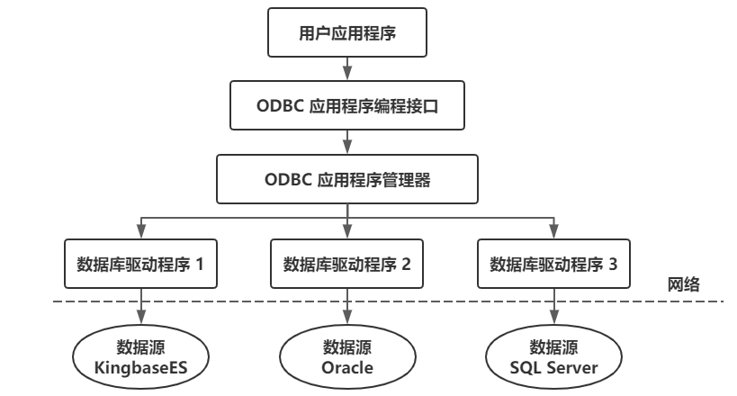
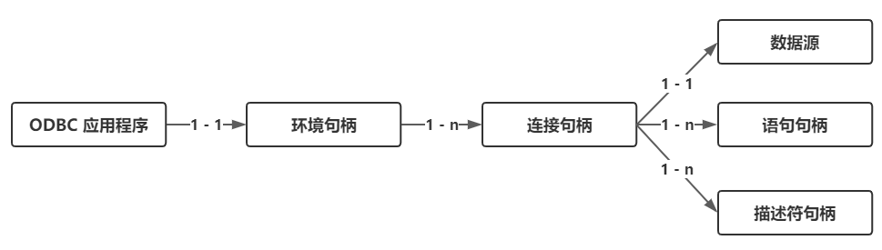
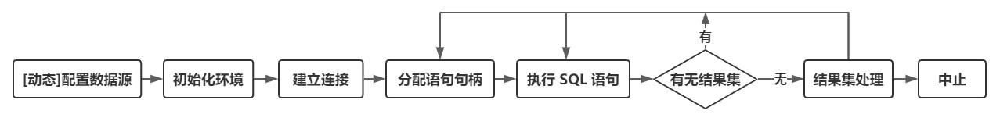

- [过程化 SQL](#过程化-sql)
  - [过程化 SQL 的块结构](#过程化-sql-的块结构)
  - [变量和常量的定义](#变量和常量的定义)
  - [流程控制](#流程控制)
- [存储过程和函数](#存储过程和函数)
  - [存储过程](#存储过程)
    - [定义](#定义)
    - [执行](#执行)
    - [重命名](#重命名)
    - [删除](#删除)
  - [函数](#函数)
    - [定义](#定义-1)
    - [执行](#执行-1)
    - [修改](#修改)
  - [过程化 SQL 中的游标](#过程化-sql-中的游标)
- [ODBC 编程](#odbc-编程)
  - [ODBC 工作原理概述](#odbc-工作原理概述)
    - [应用程序](#应用程序)
    - [驱动程序管理器](#驱动程序管理器)
    - [数据库驱动程序](#数据库驱动程序)
    - [数据源](#数据源)
  - [ODBC API 基础](#odbc-api-基础)
    - [函数概述](#函数概述)
    - [句柄及其属性](#句柄及其属性)
    - [数据类型](#数据类型)
  - [ODBC 的工作流程](#odbc-的工作流程)
- [OLE DB](#ole-db)
- [JDBC 编程](#jdbc-编程)

# 过程化 SQL

基本的 SQL 是**高度非过程化**的语言。嵌入式 SQL 将 SQL 语句嵌入程序设计语言，借助高级语言的控制功能实现过程化。

过程化 SQL 是对 SQL 的扩展，使其增加了过程化语句功能。
- 过程化 SQL 程序的基本结构是块。
- 所有的过程化 SQL 程序都是由块组成的。
- 这些块之间可以互相嵌套，每个块完成一个逻辑操作。

## 过程化 SQL 的块结构

过程化 SQL 块的基本结构
1. 定义部分
    ```
    DECLARE <变量 | 常量 | 游标 | 异常等>
    ```
    - 定义的变量、常量等只能在该基本块中使用
    - 当基本块执行结束时，定义就不再存在
2. 执行部分
    ```
    BEGIN
        <SQL 语句 | 过程化 SQL 的流程控制语句>
    EXCEPTION
        <异常处理部分>
    END；
    ```

## 变量和常量的定义

1. 变量
    ```
    <变量名> <数据类型> [[NOT NULL] [:=] <初值表达式>]
    ```
2. 常量
    ```
    <常量名> <数据类型> CONSTANT := <常量表达式>
    ```
    - 常量必须要给一个值，并且该值在存在期间或常量的作用域内不能改变。
    - 如果试图修改它，过程化 SQL 将返回一个异常
3. 赋值语句
    ```
    <变量名称> := <表达式>
    ```

## 流程控制

1. 条件控制语句
    - IF-THEN
        ```
        IF condition THEN
            Sequence_of_statements;
        END IF;
        ```
    - IF-THEN-ELSE
        ```
        IF condition THEN
            Sequence_of_statements1;
        ELSE
            Sequence_of_statements2;
        END IF;
        ```
    - 在 THEN 和 ELSE 子句中还可以再包含 IF 语句，即 IF 语句可以嵌套
2. 循环控制语句
    - 简单的循环语句 LOOP
        ```
        LOOP
            Sequence_of_statements;
        END LOOP;
        ```
        多数数据库服务器的过程化 SQL 都提供 EXIT、BREAK 或 LEAVE 等循环结束语句，保证 LOOP 语句块能够结束
    - WHILE-LOOP
        ```
        WHILE condition LOOP
            Sequence_of_statements;
        END LOOP;
        ```
    - FOR-LOOP
        ```
        FOR count IN [REVERSE] lower_bound ... upper_bound LOOP
            Sequence_of_statements;
        END LOOP;
        ```
        当不加 REVERSE 时：count 初始时设为下界 lower_bound，然后检查是否符合 count < upper_bound，如果符合，则执行循环体，然后将 count = count + 1
3. 错误处理
    - 如果过程化 SQL 在执行时出现异常，则应该让程序在产生异常的语句处停下来，根据异常的类型去执行异常处理语句
    - SQL 标准对数据库服务器提供什么样的异常处理做出了建议，要求过程化 SQL 管理器提供完善的异常处理机制

# 存储过程和函数

过程化 SQL 块类型
- 命名块：编译后保存在数据库中，可以被反复调用，运行速度较快
- 匿名块：每次执行时都要进行编译，它不能被存储到数据库中，也不能在其他过程化 SQL 块中调用

过程和函数是命名块，它们被编译后保存在数据库中，称为持久性存储模块（Persistent Stored Module，PSM），可以被反复调用，运行速度较快。SQL2003 标准支持 SQL/PSM。

## 存储过程

存储过程：由过程化 SQL 语句书写的过程，经编译和优化后存储在数据库服务器中，使用时只要调用即可。

存储过程的优点：
- 运行效率高
    > 由于存储过程不像解释执行的 SQL 语句那样在提出操作请求时才进行语法分析和优化工作，因而运行效率高，它提供了在服务器端快速执行 SQL 语句的有效途径。
- 降低了客户机和服务器之间的通信量
    > 客户机上的应用程序只要通过网络向服务器发出调用存储过程的名字和参数，就可以让关系数据库管理系统执行其中的多条 SQL 语句并进行数据处理。只有最终的处理结果才返回客户端。
- 方便实施企业规则
    > 可以把企业规则的运算程序写成存储过程放入数据库服务器中，由关系数据库管理系统管理，既有利于集中控制，又能够方便地进行维护。当企业规则发生变化时只要修改存储过程即可，无须修改其他应用程序。

### 定义

```
CREATE OR REPLACE PROCEDURE
    <过程名>([参数 1, 参数 2,...])
    AS <过程化 SQL 块>；
```
> - 过程名：数据库服务器合法的对象标识
> - 参数列表：用名字来标识调用时给出的参数值，必须指定值的数据类型。参数也可以定义输入数、输出参数或输入/输出参数，默认为输入参数
> - 过程体：是一个<过程化SQL块>，包括声明部分和可执行语句部分
> - 示例：
>> 利用存储过程来实现从账户 1 转指定数额的款项到账户 2 中
>> ```
>> /* 定义存储过程 TRANSFER，其参数为（转入账户， 转出账户， 转账额度） */
>> CREATE OR REPLACE PROCEDURE
>>     TRANSFER(inAccount INT, outAccount INT, amount FLOAT)
>> AS
>> /* 定义变量 */
>> DECLARE
>>     totalDepositOut FLOAT;
>>     totalDepositIn FLOAT;
>>     inAccountNnm INT;
>> BEGIN
>>     /* 检查转出账户是否存在以及转出账户存款是否足够 */
>>     SELECT total INTO totalDepositOut FROM accout HERE account_num =outAccount;
>>     IF totalDepositOut IS NULL THEN /* 如果转出账户不存在或账户中没有存款 */
>>         ROLLBACK;
>>         RETURN;
>>     END IF;
>>     IF totalDepositOut < amount THEN /* 如果转出账户不存在或账户中没有存款 */
>>         ROLLBACK;
>>         RETURN;
>>     END IF;
>>     /* 检查转入账户是否存在 */
>>     SELECT account_num INTO inAccountNum FROM account WHERE account_num = inAccount;
>>     IF inAccount IS NULL THEN
>>         ROLLBACK;
>>         RETURN;
>>     ENDIF;
>>     /* 修改转出账户余额以及转入账户金额 */
>>     UPDATE account SET total = total - amount WHERE account_num = outAccount;
>>     UPDATE account SET total = total + amount WHERE account_num = inAccount;
>>     /* 提交转账事务 */
>>     COMMIT;
>> END;
>> ```

### 执行

```
{CALL | PERFORM} PROCEDURE <过程名>([参数 1, 参数 2,...])；
```
> - 使用 CALL 或者 PERFORM 等方式激活存储过程的执行
> - 在过程化 SQL 中，数据库服务器支持在过程体中调用其他存储过程

### 重命名

```
ALTER PROCEDURE <旧过程名> RENAME TO <新过程名>;
```

### 删除

```
DROP PROCEDURE <过程名>()；
```

## 函数

函数和存储过程的异同
- 同：都是持久性存储模块
- 异：函数必须指定返回的类型

### 定义

```
CREATE OR REPLACE FUNCTION
    <函数名>([参数 1, 参数 2,...])
    RETURNS <类型>
    AS <过程化 SQL 块>;
```

### 执行

```
{CALL | SELECT} <函数名>([参数 1, 参数 2,...]);
```

### 修改

- 重命名
    ```
    ALTER FUNCTION <过程名 1> RENAME TO <过程名 2>;
    ```
- 重新编译
    ```
    ALTER FUNCTION <过程名> COMPILE;
    ```

## 过程化 SQL 中的游标

- 和嵌入式 SQL 一样，在过程化 SQL 中如果 SELECT 语句只返回一条记录，可以将该结果存放到变量中。
- 当查询返回多条记录时，就要使用游标对结果集进行处理。
- 一个游标与一个 SQL 语句相关联。在存储过程中可以定义
    - 普通游标
    - REFCURSOR 类型游标
    - 带参数的游标 等
- 示例
    ```
    CREATE OR REPLACE PROCEDURE proc_cursor() AS
    DECLARE
        cno CHAR(3);
        cname CHAR(8);
        /* 声明带参数游标 mycursor，能检索 leader 表中具有参数 leaderNo 的记录 */
        CURSOR mycursor(leaderNo CHAR(3)) FOR
            SELECT lno, lname FROM leader WHERE lno = leaderNo;
    BEGIN
        /* 使用参数 L01 打开游标，并获取 lno = 'L01' 的游标元组 */
        OPEN mycursor('L01');
        FETCH mycursor INTO cno, cname;
        /* 将游标元组插入临时表中 */
        INSERT INTO temp(lno, lname) VALUES(cno, cname);
        /* 使用参数 L02 重新打开游标... */
        OPEN mycursor('L02');
        FETCH mycursor INTO cno, cname;
        INSERT INTO temp(lno, lname) VALUES(cno, cname);
    END;
    ```

# ODBC 编程

ODBC 产生的原因
- 由于不同的数据库管理系统的存在，在某个关系数据库管理系统下编写的应用程序就不能在另一个关系数据库管理系统下运行
- 许多应用程序需要共享多个部门的数据资源，访问不同的关系数据库管理系统

ODBC
- 是微软公司开放服务体系（Windows Open Services Architecture，WOSA）中有关数据库的一个组成部分
- 提供了一组访问数据库的应用程序编程接口（Application Programming Interface，API ）

ODBC 约束力
- 规范应用开发
- 规范关系数据库管理系统应用接口

ODBC 优点：
- 移植性好
- 能同时访问不同的数据库
- 共享多个数据资源

## ODBC 工作原理概述

ODBC 应用系统的体系结构
1. 用户应用程序
2. ODBC 驱动程序管理器（Driver Manager）
3. 数据库驱动程序（Driver）
4. 数据源（Data Source）



### 应用程序

- 请求连接数据库
- 向数据源发送 SQL 语句
- 为 SQL 语句执行结果分配存储空间，定义所读取的数据格式
- 获取数据库操作结果或处理错误
- 进行数据处理并向用户提交处理结果
- 请求事务的提交和回滚操作
- 断开与数据源的连接

### 驱动程序管理器

用来管理各种数据库驱动程序

- 包含在 ODBC32.DLL 中
- 管理应用程序和驱动程序之间的通信
- 建立、配置或删除数据源，并查看系统当前所安装的数据库 ODBC 驱动程序
- 主要功能：
    - 装载 ODBC 驱动程序
    - 选择和连接正确的驱动程序
    - 管理数据源
    - 检查 ODBC 调用参数的合法性
    - 记录 ODBC 函数的调用等

### 数据库驱动程序

- ODBC 通过驱动程序来提供应用系统与数据库平台的独立性
- ODBC 应用程序不能直接存取数据库
    - 其各种操作请求由驱动程序管理器提交给某个关系数据库管理系统的 ODBC 驱动程序
    - 通过调用驱动程序所支持的函数来存取数据库
    - 数据库的操作结果也通过驱动程序返回给应用程序
    - 如果应用程序要操纵不同的数据库，就要动态地链接到不同的驱动程序上
- ODBC驱动程序类型
    - 单束
        - 数据源和应用程序在同一台机器上
        - 驱动程序直接完成对数据文件的I/O操作
        - 驱动程序相当于数据管理器
    - 多束
        - 支持客户机 — 服务器、客户机 — 应用服务器 / 数据库服务器等网络环境下的数据访问
        - 由驱动程序完成数据库访问请求的提交和结果集接收
        - 应用程序使用驱动程序提供的结果集管理接口操纵执行后的结果数据

### 数据源

是最终用户需要访问的数据，包含了数据库位置和数据库类型等信息，是一种数据连接的抽象

- 数据源对最终用户是透明的
    - ODBC 给每个被访问的数据源指定唯一的数据源名（Data Source Name，简称 DSN），并映射到所有必要的、用来存取数据的低层软件
    - 在连接中，用数据源名来代表**用户名**、**服务器名**、**所连接的数据库名等**
    - 最终用户无须知道数据库管理系统或其他数据管理软件、网络以及有关ODBC驱动程序的细节

## ODBC API 基础

ODBC 应用程序编程接口的一致性
- API 一致性：包含核心级、扩展 1 级、扩展 2 级
- 语法一致性：包含最低限度 SQL 语法级、核心 SQL 语法级、扩展 SQL 语法级


### 函数概述

ODBC 3.0 标准提供了 76 个函数接口
- 分配和释放环境句柄、连接句柄、语句句柄
- 连接函数（SQLDriverconnect 等）
- 与信息相关的函数（SQLGetinfo、SQLGetFuction 等）
- 事务处理函数（如 SQLEndTran）
- 执行相关函数（SQLExecdirect、SQLExecute 等）
- 编目函数，ODBC 3.0 提供了 11 个编目函数，如 SQLTables、SQLColumn 等。应用程序可以通过对编目函数的调用来获取数据字典的信息，如权限、表结构等

ODBC 不同版本上的函数和函数使用是有差异的，读者必须注意使用的版本

### 句柄及其属性

- 句柄是 32 位整数值，代表一个指针
- ODBC 3.0 中句柄分类
    - 环境句柄
    - 连接句柄
    - 语句句柄
    - 描述符句柄
- 应用程序句柄之间的关系
    
    - 每个 ODBC 应用程序需要建立一个 ODBC 环境，分配一个环境句柄，存取数据的全局性背景，如环境状态、当前环境状态诊断、当前在环境上分配的连接句柄等
    - 一个环境句柄可以建立多个连接句柄，每一个连接句柄实现与一个数据源之间的连接
    - 在一个连接中可以建立多个语句句柄，它不只是一个 SQL 语句，还包括 SQL 语句产生的结果集以及相关的信息等
    - 在 ODBC 3.0 中又提出了描述符句柄的概念，它是描述 SQL 语句的参数、结果集列的元数据集合

### 数据类型

- ODBC 数据类型
    - SQL 数据类型：用于数据源
    - C 数据类型：用于应用程序的 C 代码
- 应用程序可以通过 SQLGetTypeInfo 来获取不同的驱动程序对于数据类型的支持情况
- SQL 数据类型和 C 数据类型之间的转换规则

  |              | SQL 数据类型                                 | C 数据类型                                     |
  | ------------ | -------------------------------------------- | ---------------------------------------------- |
  | SQL 数据类型 | 数据源之间转换                               | 应用程序变量传送到语句参数（SQLBindparameter） |
  | C 数据类型   | 从结果集列中返回到应用程序变量（SQLBindcol） | 应用程序变量之间转换                           |

## ODBC 的工作流程



1. 配置数据源
    - 第一种方法：运行数据源管理工具来进行配置
    - 第二种方法：使用 Driver Manager 提供的 ConfigDsn 函数来增加、修改或删除数据源
2. 初始化环境
    - 应用程序调用 SQLAllocHandle 分配环境句柄
    - SQLSetEnvAttr 设置参数
3. 建立连接
    - 应用程序调用 SQLAllocHandle 分配连接句柄，通过 SQLConnect、SQLDriverConnect 或SQLBrowseConnect 与数据源连接
    - SQLConnect 连接函数的输入参数为：
        - 配置好的数据源名称
        - 用户 ID
        - 口令
4. 分配语句句柄
    - 处理任何 SQL 语句之前，应用程序还需要首先分配一个语句句柄
    - 语句句柄含有具体的 SQL 语句以及输出的结果集等信息
    - 应用程序还可以通过 SQLtStmtAttr 来设置语句属性（也可以使用默认值）
5. 执行 SQL 语句
    - 两种方式
        - 预处理（SQLPrepare、SQLExecute适用于语句的多次执行）
        - 直接执行（SQLExecdirect）
    - 如果 SQL 语句含有参数，应用程序为每个参数调用 SQLBindParameter，并把它们绑定至应用程序变量
    - 应用程序可以直接通过改变应用程序缓冲区的内容从而在程序中动态改变 SQL 语句的具体执行
    - 应用程序根据语句类型进行的处理
        - 有结果集的语句（select 或是编目函数），则进行结果集处理
        - 没有结果集的函数，可以直接利用本语句句柄继续执行新的语句或是获取行计数（本次执行所影响的行数）之后继续执行
    - 在插入数据时，采用了预编译的方式，首先通过 SQLPrepare 来预处理 SQL 语句，然后将每一列绑定到用户缓冲区
6. 结果集处理
    - 应用程序可以通过 SQLNumResultCols 来获取结果集中的列数
    - 通过 SQLDescribeCol 或是 SQLColAttrbute 函数来获取结果集每一列的名称、数据类型、精度和范围
7. 中止处理
    - 释放句柄
    - 断开数据库连接

# OLE DB

- 对象链接与嵌入数据库（Object Linking and Embedding Database, OLE DB），也是微软提出的数据库连接访问标准
- OLE DB 是基于组件对象模型（Component Object Model）来访问各种数据源的 ActiveX 的通用接口，它提供访问数据的一种统一手段，而不管存储数据时使用的方法如何。
- 与 ODBC 和 JDBC 类似，OLE DB 支持的数据源可以是数据库，也可以是文本文件、Excel 表格、ISAM 等各种不同格式的数据存储。
- OLE DB 可以在不同的数据源中进行转换。
- 客户端的开发人员利用 OLE DB 进行数据访问时，不必关心大量不同数据库的访问协议。

# JDBC 编程

- JDBC 是 Java 的开发者 Sun 制定的 Java 数据库连接技术的简称，为 DBMS 提供支持无缝连接应用的技术。
- JDBC 在应用程序中的作用和ODBC类似，是 Java 实现数据库访问的应用程序编程接口，它是建立在 X/Open SQLCLI 基础上的。
- JDBC 是面向对象的接口标准，一般由具体的数据库厂商提供。
- 它的主要功能是管理存放在数据库中的数据，通过对象定义了一系列与数据库系统进行交互的类和接口。
- 通过接口对象，应用程序可以完成与数据库的连接、执行 SQL 语句、从数据库中获取结果、获取状态及错误信息、终止事务和连接等。
- JDBC 与 ODBC 类似，它为 Java 程序提供统一、无缝地操作各种数据库的接口。因为实际应用中常常无法确定用户想访问什么类型的数据库，程序员使用 JDBC 编程时可以不关心它要操作的数据库是哪个厂家的产品，从而提高了软件的通用性。只要系统上安装了正确的驱动程序，JDBC 应用程序就可以访问其相关的数据库。