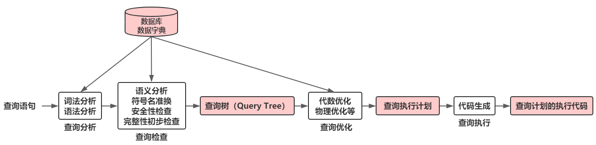

- [关系数据库系统的查询处理](#关系数据库系统的查询处理)
    - [查询处理步骤](#查询处理步骤)
        - [查询分析](#查询分析)
        - [查询检查](#查询检查)
        - [查询优化](#查询优化)
        - [查询执行](#查询执行)
    - [实现查询操作的算法](#实现查询操作的算法)
        - [选择操作的实现](#选择操作的实现)
        - [连接操作的实现](#连接操作的实现)
- [关系数据库系统的查询优化](#关系数据库系统的查询优化)
- [代数优化](#代数优化)
    - [关系代数表达式等价变换规则](#关系代数表达式等价变换规则)
    - [查询树的启发式优化](#查询树的启发式优化)
- [物理优化](#物理优化)
    - [基于启发式规则的存取路径选择优化](#基于启发式规则的存取路径选择优化)
        - [选择操作的启发式规则](#选择操作的启发式规则)
        - [连接操作的启发式规则](#连接操作的启发式规则)
    - [基于代价的优化](#基于代价的优化)
- [查询计划的执行](#查询计划的执行)

# 关系数据库系统的查询处理

关系数据库管理系统查询处理阶段：

## 查询处理步骤

### 查询分析

查询分析的任务：对查询语句进行扫描、词法分析和语法分析
- 词法分析：从查询语句中识别出正确的语言符号
- 语法分析：进行语法检查

### 查询检查

- 查询检查的任务
    - 合法权检查
    - 视图转换
    - 安全性检查
    - 完整性初步检查
- 根据数据字典中有关的模式定义检查语句中的数据库对象，如关系名、属性名是否存在和有效
- 如果是对视图的操作，则要用视图消解方法把对视图的操作转换成对基本表的操作
- 根据数据字典中的用户权限和完整性约束定义对用户的存取权限进行检查
- 检查通过后把SQL查询语句转换成内部表示，即等价的关系代数表达式。
- 关系数据库管理系统一般都用查询树，也称为语法分析树来表示扩展的关系代数表达式

### 查询优化

- 查询优化：选择一个高效执行的查询处理策略
- 查询优化分类
    - 代数优化/逻辑优化：指关系代数表达式的优化
    - 物理优化：指存取路径和底层操作算法的选择
- 查询优化的选择依据
    - 基于规则（rule based）
    - 基于代价（cost based）
    - 基于语义（semantic based）

### 查询执行

- 依据优化器得到的执行策略生成查询执行计划
- 代码生成器（code generator）生成执行查询计划的代码
- 两种执行方法
    - 自顶向下
    - 自底向上

## 实现查询操作的算法

### 选择操作的实现

选择操作典型实现方法：
- 全表扫描方法 (Table Scan)
    - 对查询的基本表顺序扫描，逐一检查每个元组是否满足选择条件，把满足条件的元组作为结果输出
    - 适合小表，不适合大表
- 索引扫描方法 (Index Scan)
    - 适合于选择条件中的属性上有索引（例如B+ 树索引或Hash索引）
    - 通过索引先找到满足条件的元组主码或元组指针，再通过元组指针直接在查询的基本表中找到元组

### 连接操作的实现

连接操作是查询处理中最耗时的操作之一。以自然连接为例。

- 嵌套循环算法（nested loop join）
    1. 对外层循环（表1）的每一个元组，检索内层循环中（表2）的每一个元组
    2. 检查这两个元组在连接属性上是否相等
    3. 如果满足连接条件，则串接后作为结果输出，直到外层循环表中的元组处理完为止
- 排序 - 合并算法（sort-merge join或merge join）
    1.  如果连接的表没有排好序，先对连接的表按连接属性升序（也可以降序）排序
    2.  取表1中第一个连接属性，依次扫描表2中具有相同连接属性的元组
    3.  当扫描到连接属性大于表二连接属性的第一个表2元组时，返回表1扫描它的下一个元组，再扫描表2中具有相同连接的元组，把它们连接起来
    4.  重复上述步骤直到表1扫描完
- 索引连接（index join）算法
    1. 在表2上已经建立连接属性的索引。
    2. 对表1中每一个元组，由连接属性值通过表2的索引查找相应的表2元组。
    3. 把这些表2元组和表1元组连接起来
    4. 循环执行第2、3步，直到表1中的元组处理完为止
- Hash Join算法
    1. 把连接属性作为hash码，用同一个hash函数把表1和表2中的元组散列到hash表中。
    2. 划分阶段（building phase, 也称为partitioning phase）
        - 对包含较少元组的表（加入是表1）进行一遍处理
        - 把它的元组按hash函数分散到hash表的桶中
    3. 试探阶段（probing phase,也称为连接阶段join phase）
        - 对另一个表（表2）进行一遍处理
        - 把表2的元组也按同一个hash函数（hash码是连接属性）进行散列
        - 把表2元组与桶中来自表1的并与之相匹配的元组连接起来
   - hash join算法前提：假设两个表中较小的表在第一阶段后可以完全放入内存的hash桶中

# 关系数据库系统的查询优化

- 查询优化在关系数据库系统中有着非常重要的地位
- 关系查询优化是影响关系数据库管理系统性能的关键因素
- 由于关系表达式的语义级别很高，使关系系统可以从关系表达式中分析查询语义，提供了执行查询优化的可能性

关系数据库管理系统通过某种代价模型计算出各种查询执行策略的执行代价，然后选取代价最小的执行方案
- 集中式数据库
    - 执行开销主要包括
        - 磁盘存取块数（I/O代价）
        - 处理机时间（CPU代价）
        - 查询的内存开销
    - I/O代价是最主要的
- 分布式数据库
    - 总代价 = I/O代价 + CPU代价 + 内存代价 ＋ 通信代价

示例：

# 代数优化

- 代数优化策略：通过对关系代数表达式的等价变换来提高查询效率
- 关系代数表达式的等价：指用相同的关系代替两个表达式中相应的关系所得到的结果是相同的，两个关系表达式$E_1$和$E_2$是等价的，可记为$E_1 \equiv E_2$

## 关系代数表达式等价变换规则

1. 连接、笛卡尔积交换律：
    - $E_1 \times E_2 \equiv E_2 \times E_1$
    - $E_1 \Join E_2 \equiv E_2 \Join E_1$
    - $E_1 {\Join \atop F} E_2 {\Join \atop F} E_2 \times E_1$
2. 连接、笛卡尔积的结合律：
    - $(E_1 \times E_2) \times E_3 \equiv E_1 \times (E_2 \times E_3)$
    - $(E_1 \Join E_2) \Join E_3 \equiv E_1 \Join (E_2 \Join E_3)$
    - $(E_1 {\Join \atop F_1} E_2) {\Join \atop F_2} E_3 \equiv E_1 {\Join \atop F_1} (E_2 {\Join \atop F_2} E_3)$
3. 投影的串接定律：
    - $\pi_{A_1, A_2, \dotso, A_n}(\pi_{B_1, B_2, \dotso, B_m(E))} \equiv \pi_{A_1, A_2, \dotso, A_n}(E)$
        >$\{A_1, A_2, \dotso, A_n\}$构成$\{B_1, B_2, \dotso, B_m\}$的子集
4. 选择的串接定律：
    - $\sigma_{F_1}(\sigma_{F_2}(E)) \equiv \sigma_{F_1 \land F_2}(E)$
        > 选择的串接律说明选择条件可以合并，这样一次就可检查全部条件
5. 选择与投影操作的交换律：
    - $\sigma_F(\pi_{(A_1, A_2, \dotso, A_n)}(E)) \equiv \pi_{(A_1, A_2, \dotso, A_n)}(\sigma_F(E))$
        > 选择条件$F$只涉及属性$\{A_1, A_2, \dotso, A_n\}$
    - $\pi_{(A_1, A_2, \dotso, A_n)}(\sigma_F(E)) \equiv \pi_{(A_1, A_2, \dotso, A_n)}(\sigma_F(\pi_{A_1, A_2, \dotso, A_n, B_1, B_2, \dotso, B_m}(E)))$
        > 若$F$中有不属于$A_1, A_2, \dotso, A_n$的属性$B_1, B_2, \dotso, B_m$
6. 选择与笛卡尔积的交换律：
    - $\sigma_F(E_1 \times E_2) \equiv \sigma_F(E_1) \times E_2$
        > 如果$F$中涉及的属性都是$E_1$中的属性
    - $\sigma_F(E_1 \times E_2) \equiv \sigma_{F_1}(E_1) \times \sigma_{F_2}(E_2)$
        > 如果$F = F_1 \land F_2$，并且$F_1$只涉及$E_1$中的属性，$F_2$只涉及$E_2$中的属性，则由上面的等价变换规则1，4，6可推出
    - $\sigma_F(E_1 \times E_2) \equiv \sigma_{F_1}(E_1) \times \sigma_{F_2}(E_2)$
    - $\sigma_F(E_1 \times E_2) \equiv \sigma_{F_2}(\sigma_{F_2}(E_1) \times E_2)$
        > 若$F_1$只涉及$E_1$中的属性，$F_2$涉及$E_1$和$E_2$两者的属性，它使部分选择在笛卡尔积前先做
7. 选择与并的分配律：
    - $\sigma_F(E_1 \cup E_2) \equiv \sigma_F(E_1) \cup \sigma_F(E_2)$
        >$E_1$和$E_2$有相同的属性及属性名
8. 选择与差运算的分配律：
    - $\sigma_F(E_1 - E_2) \equiv \sigma_F(E_1) - \sigma_F(E_2))$
        >$E_1$和$E_2$有相同的属性及属性名
9.  选择对自然连接的分配律：
     - $\sigma_F(E_1 \Join E_2) \equiv \sigma_F(E_1) \Join \sigma_F(E_2))$
        >$F$只涉及$E_1$和$E_2$的公共属性
10. 投影与笛卡尔积的分配律：
     - $\pi_{A_1, A_2, \dotso, A_n, B_1, B_2, \dotso, B_m}(E_1 \times E_2) \equiv \pi_{A_1, A_2, \dotso, A_n}(E_1) \times \pi_{B_1, B_2, \dotso, B_m}(E_2)$
        >$A_1, A_2, \dotso, A_n$是$E_1$的属性，$B_1, B_2, \dotso, B_m$是$E_2$的属性
11. 投影与并的分配律：
     - $\pi_{A_1, A_2, \dotso, A_n}(E_1 \cup E_2) \equiv \pi_{A_1, A_2, \dotso, A_n}(E_1) \cup \pi_{A_1, A_2, \dotso, A_n}(E_2)$
        >$E_1$和$E_2$有相同的属性及属性名

## 查询树的启发式优化

典型的启发式规则
1. 选择运算应尽可能先做
    > 在优化策略中这是最重要、最基本的一条。
2. 把投影运算和选择运算同时进行
    > 如有若干投影和选择运算，并且它们都对同一个关系操作，则可以在扫描此关系的同时完成所有的这些运算以避免重复扫描关系。
3. 把投影同其前或其后的双目运算结合起来，没有必要为了去掉某些字段而扫描一遍关系。
4. 把某些选择同在它前面要执行的笛卡尔积结合起来成为一个连接运算，连接特别是等值连接运算要比同样关系上的笛卡尔积省很多时间。
5. 找出公共子表达式
    - 如果这种重复出现的子表达式的结果不是很大的关系
    - 并且从外存中读入这个关系比计算该子表达式的时间少得多
    - 则先计算一次公共子表达式并把结果写入中间文件是合算的。
    - 当查询的是视图时，定义视图的表达式就是公共子表达式的情况

# 物理优化

- 代数优化改变查询语句中操作的次序和组合，不涉及底层的存取路径
- 对于一个查询语句有许多存取方案，它们的执行效率不同， 仅仅进行代数优化是不够的
- 物理优化就是要选择高效合理的操作算法或存取路径，求得优化的查询计划

物理优化方法
- 基于规则的启发式优化
    > 启发式规则是指那些在大多数情况下都适用，但不是在每种情况下都是适用的规则。
- 基于代价估算的优化
    > 优化器估算不同执行策略的代价，并选出具有最小代价的执行计划。
- 两者结合的优化方法：
    > 常常先使用启发式规则，选取若干较优的候选方案，减少代价估算的工作量;
    > 然后分别计算这些候选方案的执行代价，较快地选出最终的优化方案

## 基于启发式规则的存取路径选择优化

### 选择操作的启发式规则

对于小关系，使用全表顺序扫描，即使选择列上有索引.对于大关系，启发式规则有：
- 对于选择条件是“主码 = 值”的查询
    > 查询结果最多是一个元组，可以选择主码索引，一般的关系数据库管理系统会自动建立主码索引
- 对于选择条件是“非主属性 = 值”的查询，并且选择列上有索引
    > 要估算查询结果的元组数目。如果比例较小（< 10%）可以使用索引扫描方法，否则还是使用全表顺序扫描
- 对于选择条件是属性上的非等值查询或者范围查询，并且选择列上有索引
    > 要估算查询结果的元组数目。如果比例较小（< 10%）可以使用索引扫描方法，否则还是使用全表顺序扫描
- 对于用AND连接的合取选择条件
    > - 如果有涉及这些属性的组合索引，优先采用组合索引扫描方法
    > - 如果某些属性上有一般的索引，可以用索引扫描方法：
    >     - 通过分别查找满足每个条件的指针，求指针的交集
    >     - 通过索引查找满足部分条件的元组，然后在扫描这些元组时判断是否满足剩余条件
    > - 其他情况：使用全表顺序扫描
- 对于用OR连接的析取选择条件
    > 一般使用全表顺序扫描

### 连接操作的启发式规则

- 如果2个表都已经按照连接属性排序
    > 选用排序 - 合并算法
- 如果一个表在连接属性上有索引
    > 选用索引连接算法
- 如果上面2个规则都不适用，其中一个表较小
    > 选用Hash join算法
- 可以选用嵌套循环方法，并选择其中较小的表，确切地讲是占用的块数（b）较少的表，作为外表（b） 。
    > 理由：
    > - 设连接表$R$与$S$分别占用的块数为$B_R$与$B_S$，连接操作使用的内存缓冲区块数为$K$，分配$K - 1$块给外表
    > - 如果$R$为外表，则嵌套循环法存取的块数为$B_R + \frac{B_R B_S}{K - 1}$，显然应该选块数小的表作为外表

## 基于代价的优化

# 查询计划的执行