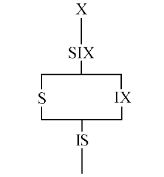

- [多事务执行方式](#多事务执行方式)
- [并发一致性问题](#并发一致性问题)
  - [丢失修改](#丢失修改)
  - [不可重复读](#不可重复读)
  - [读“脏”数据](#读脏数据)
  - [幻影读](#幻影读)
- [并发控制机制的任务](#并发控制机制的任务)
- [并发控制的主要技术](#并发控制的主要技术)
- [封锁](#封锁)
  - [排它锁](#排它锁)
  - [共享锁](#共享锁)
  - [封锁协议](#封锁协议)
    - [一级封锁协议](#一级封锁协议)
    - [二级封锁协议](#二级封锁协议)
    - [三级封锁协议](#三级封锁协议)
  - [活锁和死锁](#活锁和死锁)
    - [活锁](#活锁)
    - [死锁](#死锁)
      - [死锁的预防](#死锁的预防)
      - [死锁的诊断与解除](#死锁的诊断与解除)
  - [并发调度的可串行性](#并发调度的可串行性)
    - [可串行化调度](#可串行化调度)
    - [冲突可串行化调度](#冲突可串行化调度)
  - [两段锁协议](#两段锁协议)
  - [封锁的粒度](#封锁的粒度)
    - [多粒度封锁](#多粒度封锁)
    - [意向锁](#意向锁)
- [其他并发控制机制](#其他并发控制机制)

# 多事务执行方式

- 事务串行执行
    - 每个时刻只有一个事务运行，其他事务必须等到这个事务结束以后方能运行
    - 不能充分利用系统资源，发挥数据库共享资源的特点
- 交叉并发方式（Interleaved Concurrency）
    - 在单处理机系统中，事务的并行执行是这些并行事务的并行操作轮流交叉运行
    - 单处理机系统中的并行事务并没有真正地并行运行，但能够减少处理机的空闲时间，提高系统的效率
- 同时并发方式（simultaneous concurrency）
    - 多处理机系统中，每个处理机可以运行一个事务，多个处理机可以同时运行多个事务，实现多个事务真正的并行运行
    - 最理想的并发方式，但受制于硬件环境
    - 更复杂的并发方式机制

本章讨论的数据库系统并发控制技术是以单处理机系统为基础的

# 并发一致性问题

事务并发带来的问题
- 会产生多个事务同时存取同一数据的情况
- 可能会存取和存储不正确的数据，破坏事务隔离性和数据库的一致性

并发一致性问题
- 丢失修改（Lost Update）
- 不可重复读（Non-repeatable Read）
- 读“脏”数据（Dirty Read）
- 幻影读（Phantom Read）

记号
- R(x)：读数据 x
- W(x)：写数据 x

## 丢失修改

两个事务 $T_1$ 和 $T_2$ 读入同一数据并修改， $T_2$ 的提交结果破坏了 $T_1$ 提交的结果，导致 $T_1$ 的修改被丢失。

| $T_1$                | $T_2$                |
| -------------------- | -------------------- |
| R(A) = 16            |                      |
|                      | R(A) = 16            |
| A $\leftarrow$ A - 1 |                      |
| W(A) = 15            |                      |
|                      | A $\leftarrow$ A - 1 |

## 不可重复读

事务 $T_1$ 读取数据后，事务 $T_2$ 执行更新操作，使 $T_1$ 无法再现前一次读取结果。

不可重复读包括三种情况：
- 事务 $T_1$ 读取某一数据后，事务 $T_2$ 对其做了修改，当事务 $T_1$ 再次读该数据时，得到与前一次不同的值

    | $T_1$                  | $T_2$                |
    | ---------------------- | -------------------- |
    | R(A) = 50              |                      |
    | R(B) = 100             |                      |
    | 求和 = 150             |                      |
    |                        | R(B) = 100           |
    |                        | B $\leftarrow$ B * 2 |
    |                        | W(B) = 200           |
    | R(A) = 50              |                      |
    | R(B) = 200             |                      |
    | 求和 = 250（验算不对） |                      |
- 事务 $T_1$ 按一定条件从数据库中读取了某些数据记录后，事务 $T_2$ 删除了其中部分记录，当 $T_1$ 再次按相同条件读取数据时，发现某些记录神秘地消失了。
- 事务 $T_1$ 按一定条件从数据库中读取某些数据记录后，事务 $T_2$ 插入了一些记录，当 $T_1$ 再次按相同条件读取数据时，发现多了一些记录。
后两种不可重复读有时也称为**幻影现象**（Phantom Row）

## 读“脏”数据

事务 $T_1$ 修改某一数据，并将其写回磁盘，事务 $T_2$ 读取同一数据后，$T_1$ 由于某种原因被撤销，这时 $T_1$ 已修改过的数据恢复原值，$T_2$ 读到的数据就与数据库中的数据不一致，$T_2$ 读到的数据就为“脏”数据，即不正确的数据

| $T_1$                    | $T_2$      |
| ------------------------ | ---------- |
| R(C) = 100               |            |
| C $\leftarrow$ C * 2     |            |
| W(C) = 200               |            |
|                          | R(C) = 200 |
| ROLLBACK（C 恢复为 100） |            |

## 幻影读

事务 $T_1$ 按一定条件从数据库中读取某些数据记录后，事务 $T_2$ 插入了一些记录，当 $T_1$ 再次按相同条件读取数据时，发现多了一些记录。

| $T_1$                           | $T_2$      |
| ------------------------------- | ---------- |
| R(COUNT(D)) = 100               |            |
|                                 | 插入一条 D |
| R(COUNT(D)) = 101（计数不一致） |            |

# 并发控制机制的任务

事务是并发控制的基本单位
- 对并发操作进行正确调度
- 保证事务的隔离性
- 保证数据库的一致性

# 并发控制的主要技术

- 封锁(Locking)
- 时间戳(Timestamp)
- 乐观控制法
- 多版本并发控制(MVCC)

# 封锁

- 封锁就是事务 T 在对某个数据对象（例如表、记录等）操作之前，先向系统发出请求，对其加锁
- 加锁后事务 T 就对该数据对象有了一定的控制，在事务 T 释放它的锁之前，其它的事务不能更新此数据对象。
- 封锁是实现并发控制的一个非常重要的技术
- 一个事务对某个数据对象加锁后究竟拥有什么样的控制由封锁的类型决定。
- 基本封锁类型
    - 排它锁（Exclusive Locks，简记为 X 锁）
    - 共享锁（Share Locks，简记为 S 锁）
- 锁的兼容关系如下：

    |       | S        | X        |
    | ----- | -------- | -------- |
    | **S** | $\surd$  | $\times$ |
    | **X** | $\times$ | $\times$ |

## 排它锁

- 排它锁又称为写锁
- 若事务 T 对数据对象 A 加上 X 锁，则只允许T读取和修改 A，其它任何事务都不能再对 A 加任何类型的锁，直到 T 释放 A 上的锁
- 保证其他事务在 T 释放 A 上的锁之前不能再读取和修改 A

## 共享锁

- 共享锁又称为读锁
- 若事务 T 对数据对象 A 加上 S 锁，则事务 T 可以读 A 但不能修改 A，其它事务只能再对 A 加 S 锁，而不能加 X 锁，直到 T 释放 A 上的 S 锁
- 保证其他事务可以读 A，但在 T 释放 A 上的 S 锁之前不能对 A 做任何修改

## 封锁协议

- 在运用 X 锁和 S 锁对数据对象加锁时，需要约定一些规则，这些规则为封锁协议（Locking Protocol）。
    - 何时申请 X 锁或 S 锁
    - 持锁时间
    - 何时释放
- 对封锁方式规定不同的规则，就形成了各种不同的封锁协议，它们分别在不同的程度上为并发操作的正确调度提供一定的保证。
- 三级封锁协议
    - 一级封锁协议
    - 二级封锁协议
    - 三级封锁协议
- 三级协议的主要区别
    - 什么操作需要申请封锁以及何时释放锁（即持锁时间）
    - 不同的封锁协议使事务达到的一致性级别不同：封锁协议级别越高，一致性程度越高

|              | 何时释放 X 锁 | 何时释放 S 锁 | 一致性保证                         |
| ------------ | ------------- | ------------- | ---------------------------------- |
| 一级封锁协议 | 事务结束      | 无            | 不丢失修改                         |
| 二级封锁协议 | 事务结束      | 读操作结束    | 不丢失修改、不读“脏”数据           |
| 三级封锁协议 | 事务结束      | 事务结束      | 不丢失修改、不读“脏”数据、可重复读 |

### 一级封锁协议

事务 T 在修改数据 R 之前必须先对其加 X 锁，直到事务结束才释放。
- 正常结束（COMMIT）
- 非正常结束（ROLLBACK）
- 一级封锁协议可防止**丢失修改**，并保证事务 T 是可恢复的。
- 在一级封锁协议中，如果仅仅是读数据不对其进行修改，是不需要加锁的，所以它不能保证可重复读和不读“脏”数据。

| $T_1$                | $T_2$                |
| -------------------- | -------------------- |
| Xlock A              |                      |
| R(A) = 16            |                      |
|                      | Xlock A              |
| A $\leftarrow$ A - 1 | 等待                 |
| W(A) = 15            | 等待                 |
| COMMIT               | 等待                 |
| Unlock A             | 等待                 |
|                      | 获取 Xlock A         |
|                      | Xlock A              |
|                      | R(A) = 15            |
|                      | A $\leftarrow$ A - 1 |
|                      | W(A) = 14            |
|                      | COMMIT               |
|                      | Unlock A             |

### 二级封锁协议

一级封锁协议加上事务 T 在读取数据 R 之前必须先对其加 S 锁，读完后即可释放 S 锁。
- 二级封锁协议可以防止**丢失修改**和**读“脏”数据**。
- 在二级封锁协议中，由于读完数据后即可释放 S 锁，所以它不能保证可重复读。

| $T_1$                    | $T_2$        |
| ------------------------ | ------------ |
| Xlock C                  |              |
| R(C) = 100               |              |
| C $\leftarrow$ C * 2     |              |
| W(C) = 200               |              |
|                          | Slock C      |
| ROLLBACK（C 恢复为 100） | 等待         |
| Unlock C                 | 等待         |
|                          | 获得 Slock C |
|                          | R(C) = 100   |
|                          | COMMIT       |
|                          | Unlock C     |

### 三级封锁协议

一级封锁协议加上事务 T 在读取数据 R 之前必须先对其加 S 锁，直到事务结束才释放。
- 三级封锁协议可防止**丢失修改**、**读脏数据**和**不可重复读**。

| $T_1$      | $T_2$                |
| ---------- | -------------------- |
| Slock A    |                      |
| Slock B    |                      |
| R(A) = 50  |                      |
| R(B) = 100 |                      |
| 求和 = 150 |                      |
|            | Xlock B              |
| R(A) = 50  | 等待                 |
| R(B) = 100 | 等待                 |
| 求和 = 150 | 等待                 |
| COMMIT     | 等待                 |
| Unlock A   | 等待                 |
| Unlock B   | 等待                 |
|            | 获得 Xlock B         |
|            | R(B) = 100           |
|            | B $\leftarrow$ B * 2 |
|            | W(B) = 200           |
|            | COMMIT               |
|            | Unlock B             |

## 活锁和死锁

封锁技术可以有效地解决并行操作的一致性问题，但也带来一些新的问题
- 死锁
- 活锁

### 活锁

情形描述：
1. $T_1$ 封锁了数据 $R$
2. $T_2$ 又请求封锁 $R$，于是 $T_2$ 等待。
3. $T_3$ 也请求封锁 $R$，当 $T_1$ 释放了 $R$ 上的封锁之后系统首先批准了 $T_3$ 的请求，$T_2$ 仍然等待。
4. $T_4$ 又请求封锁 $R$，当 $T_3$ 释放了 $R$ 上的封锁之后系统又批准了 $T_4$ 的请求……
5. $T_2$ 有可能永远等待，这就是活锁

避免活锁：采用先来先服务的策略
- 当多个事务请求封锁同一数据对象时
- 按请求封锁的先后次序对这些事务排队
- 该数据对象上的锁一旦释放，首先批准申请队列中第一个事务获得锁

### 死锁

情形描述：
1. $T_1$ 封锁了数据 $R_1$
2. $T_2$ 封锁了数据 $R_2$
3. $T_1$ 又请求封锁 $R_2$，因 $T_2$ 已封锁了 $R_2$，于是 $T_1$ 等待 $T_2$ 释放 $R_2$ 上的锁
4. 接着 $T_2$ 又申请封锁 $R_1$，因 $T_1$ 已封锁了 $R_1$，$T_2$ 也只能等待 $T_1$ 释放 $R_1$ 上的锁
5. 这样 $T_1$ 在等待 $T_2$，而 $T_2$ 又在等待 $T_1$，$T_1$ 和 $T_2$ 两个事务永远不能结束，形成死锁

两类方法
1. 死锁的预防
    - 产生死锁的原因是两个或多个事务都已封锁了一些数据对象，然后又都请求对已为其他事务封锁的数据对象加锁，从而出现死等待。
2. 死锁的诊断与解除

#### 死锁的预防

1. 一次封锁法
    - 要求每个事务必须一次将所有要使用的数据全部加锁，否则就不能继续执行
    - 存在的问题：
        - 降低系统并发度
        - 难于事先精确确定封锁对象
            > 数据库中数据是不断变化的，原来不要求封锁的数据，在执行过程中可能会变成封锁对象，所以很难事先精确地确定每个事务所要封锁的数据对象；
            > 解决办法是将事务在执行过程中可能要封锁的数据对象全部加锁，这就进一步降低了并发度。
2. 顺序封锁法
    - 顺序封锁法是预先对数据对象规定一个封锁顺序，所有事务都按这个顺序实行封锁。
    - 顺序封锁法存在的问题
        - 维护成本
            > 数据库系统中封锁的数据对象极多，并且随数据的插入、删除等操作而不断地变化，要维护这样的资源的封锁顺序非常困难，成本很高。
        - 难以实现
            > 事务的封锁请求可以随着事务的执行而动态地决定，很难事先确定每一个事务要封锁哪些对象，因此也就很难按规定的顺序去施加封锁

结论：
- 在操作系统中广为采用的预防死锁的策略并不太适合数据库的特点
- 数据库管理系统在解决死锁的问题上更普遍采用的是诊断并解除死锁的方法

#### 死锁的诊断与解除

1. 超时法
    - 如果一个事务的等待时间超过了规定的时限，就认为发生了死锁
    - 优点：实现简单
    - 缺点:
        - 有可能误判死锁
        - 时限若设置得太长，死锁发生后不能及时发现
2. 等待图法
    - 用事务等待图动态反映所有事务的等待情况
    - 事务等待图是一个有向图 G = (T，U)
        - T 为结点的集合，每个结点表示正运行的事务
        - U 为边的集合，每条边表示事务等待的情况
        - 若 $T_1$ 等待 $T_2$，则 $T_1$，$T_2$ 之间划一条有向边，从 $T_1$ 指向 $T_2$
    - 并发控制子系统周期性地（比如每隔数秒）生成事务等待图，检测事务。如果发现图中存在回路，则表示系统中出现了死锁。
    - 解除死锁：选择一个处理死锁代价最小的事务，将其撤消，释放此事务持有的所有的锁，使其它事务能继续运行下去

## 并发调度的可串行性

数据库管理系统对并发事务不同的调度可能会产生不同的结果，显然，串行调度是正确的，执行结果等价于串行调度的调度也是正确的，这一类调度称为可串行化调度

### 可串行化调度

- 可串行化（serializable）调度：多个事务的并发执行是正确的，当且仅当其结果与按某一次序串行地执行这些事务时的结果相同，称这种调度策略为可串行化调度。
- 可串行性（serializability）是并发事务正确调度的准则。按这个准则规定，一个给定的并发调度，当且仅当它是可串行化的，才认为是正确调度。

示例：现在有两个事务，分别包含下列操作：
- 事务 $T_1$：读 B；A = B + 1；写回 A
- 事务 $T_2$：读 A；B = A + 1；写回 B

现给出对这两个事务不同的调度策略：假设初始时 A = B = 2
- 串行调度，正确的调度

  | $T_1$         | $T_2$         |
  | ------------- | ------------- |
  | Slock B       |               |
  | X = R(B) = 2  |               |
  | Unlock B      |               |
  | Xlock A       |               |
  | A = X + 1 = 3 |               |
  | W(A)          |               |
  | Unlock A      |               |
  |               | Slock A       |
  |               | Y = R(A) = 3  |
  |               | Unlock A      |
  |               | Xlock B       |
  |               | B = Y + 1 = 4 |
  |               | W(B)          |
  |               | Unlock B      |
- 串行调度，正确的调度

  | $T_1$         | $T_2$         |
  | ------------- | ------------- |
  |               | Slock A       |
  |               | Y = R(A) = 2  |
  |               | Unlock A      |
  |               | Xlock B       |
  |               | B = Y + 1 = 3 |
  |               | W(B)          |
  |               | Unlock B      |
  | Slock B       |               |
  | X = R(B) = 3  |               |
  | Unlock B      |               |
  | Xlock A       |               |
  | A = X + 1 = 4 |               |
  | W(A)          |               |
  | Unlock A      |               |
- 不可串行化调度，错误的调度

  | $T_1$         | $T_2$         |
  | ------------- | ------------- |
  | Slock B       |               |
  | X = R(B) = 2  |               |
  |               | Slock A       |
  |               | Y = R(A) = 2  |
  | Unlock B      |               |
  |               | Unlock A      |
  | Xlock A       |               |
  | A = X + 1 = 3 |               |
  | W(A)          |               |
  |               | Xlock B       |
  |               | B = Y + 1 = 3 |
  |               | W(B)          |
  | Unlock A      |               |
  |               | Unlock B      |
- 串行调度，正确的调度

  | $T_1$         | $T_2$         |
  | ------------- | ------------- |
  | Slock B       |               |
  | X = R(B) = 2  |               |
  | Unlock B      |               |
  | Xlock A       |               |
  |               | Slock A       |
  | A = X + 1 = 3 | 等待          |
  | W(A)          | 等待          |
  | Unlock A      | 等待          |
  |               | Y = R(A) = 3  |
  |               | Unlock A      |
  |               | Xlock B       |
  |               | B = Y + 1 = 4 |
  |               | W(B)          |
  |               | Unlock B      |

### 冲突可串行化调度

- 冲突可串行化：一个比可串行化更严格的条件，商用系统中的调度器采用
- 冲突操作：是指不同的事务对同一数据的读写操作和写写操作：
    - $R_i(x)$ 与 $W_j(x)$ 事务 $T_i$ 读 $x$，$T_j$ 写 $x$，其中 $i \not = j$
    - $W_i(x)$ 与 $W_j(x)$ 事务 $T_i$ 写 $x$，$T_j$ 写 $x$，其中 $i \not = j$
    - 其他操作是不冲突操作
- 不能交换（Swap）的动作:
    - 同一事务的两个操作
    - 不同事务的冲突操作
- 冲突可串行化调度：一个调度 Sc 在保证冲突操作的次序不变的情况下，通过交换两个事务不冲突操作的次序得到另一个调度 Sc'，如果 Sc' 是串行的，称调度 Sc 是冲突可串行化的调度
- 冲突可串行化调度是可串行化调度的充分不必要条件

## 两段锁协议

- 数据库管理系统普遍采用两段锁协议的方法实现并发调度的可串行性，从而保证调度的正确性
- 两段锁协议：指所有事务必须分两个阶段对数据项加锁和解锁
    - 在对任何数据进行读、写操作之前，事务首先要获得对该数据的封锁
    - 在释放一个封锁之后，事务不再申请和获得任何其他封锁
- “两段”锁的含义：事务分为两个阶段
    - 第一阶段是获得封锁，也称为扩展阶段。事务可以申请获得任何数据项上的任何类型的锁，但是不能释放任何锁
    - 第二阶段是释放封锁，也称为收缩阶段。事务可以释放任何数据项上的任何类型的锁，但是不能再申请任何锁
- 事务遵守两段锁协议是可串行化调度的充分不必要条件。
    - 若并发事务都遵守两段锁协议，则对这些事务的任何并发调度策略都是可串行化的
    - 若并发事务的一个调度是可串行化的，不一定所有事务都符合两段锁协议
- 两段锁协议与防止死锁的一次封锁法
    - 一次封锁法要求每个事务必须一次将所有要使用的数据全部加锁，否则就不能继续执行，因此一次封锁法遵守两段锁协议
    - 但是两段锁协议并不要求事务必须一次将所有要使用的数据全部加锁，因此遵守两段锁协议的事务可能发生死锁

## 封锁的粒度

- 封锁粒度：封锁对象的大小称为封锁粒度(Granularity)
- 封锁的对象:逻辑单元，物理单元
- 例：在关系数据库中，封锁对象：
    - 逻辑单元: 属性值、属性值的集合、元组、关系、索引项、整个索引、整个数据库等
    - 物理单元：页（数据页或索引页）、物理记录等
- 封锁粒度与系统的并发度和并发控制的开销密切相关。
    - 封锁的粒度越大，数据库所能够封锁的数据单元就越少，并发度就越小，系统开销也越小；
    - 封锁的粒度越小，并发度较高，但系统开销也就越大
- 多粒度封锁(Multiple Granularity Locking)：在一个系统中同时支持多种封锁粒度供不同的事务选择
- 选择封锁粒度：同时考虑封锁开销和并发度两个因素, 适当选择封锁粒度
    - 需要处理多个关系的大量元组的用户事务：以数据库为封锁单位
    - 需要处理大量元组的用户事务：以关系为封锁单元
    - 只处理少量元组的用户事务：以元组为封锁单位

### 多粒度封锁

- 多粒度树
    - 以树形结构来表示多级封锁粒度
    - 根结点是整个数据库，表示最大的数据粒度
    - 叶结点表示最小的数据粒度
    - 例：三级粒度树。根结点为数据库，数据库的子结点为关系，关系的子结点为元组。
      
- 允许多粒度树中的每个结点被独立地加锁
- 对一个结点加锁意味着这个结点的所有后裔结点也被加以同样类型的锁
- 在多粒度封锁中一个数据对象可能以两种方式封锁：显式封锁和隐式封锁
    - 显式封锁：直接加到数据对象上的封锁
    - 隐式封锁：是该数据对象没有独立加锁，是由于其上级结点加锁而使该数据对象加上了锁
    - 显式封锁和隐式封锁的效果是一样的
- 系统检查封锁冲突时
    - 不仅要检查显式封锁，还要检查隐式封锁
    - 例如：事务 T 要对关系 R 加 X 锁：系统必须搜索其上级结点数据库、关系 R，还要搜索 R 的下级结点，即 R 中的每一个元组。如果其中某一个数据对象已经加了不相容锁，则 T 必须等待
- 对某个数据对象加锁，系统要检查
    - 该数据对象：有无显式封锁与之冲突
    - 所有上级结点：检查本事务的显式封锁是否与该数据对象上的隐式封锁冲突：(由上级结点已加的封锁造成的）
    - 所有下级结点：看上面的显式封锁是否与本事务的隐式封锁（将加到下级结点的封锁）冲突

### 意向锁

- 引进意向锁（intention lock）目的：提高对某个数据对象加锁时系统的检查效率
- 如果对一个结点加意向锁，则说明该结点的下层结点正在被加锁
- 对任一结点加基本锁，必须先对它的上层结点加意向锁
- 例如：对任一元组加锁时，必须先对它所在的数据库和关系加意向锁
- 常用意向锁：
    - 意向共享锁(Intent Share Lock，简称 IS 锁)
        > 如果对一个数据对象加 IS 锁，表示它的后裔结点拟（意向）加 S 锁
        > 例如：事务 T 要对 R 中某个元组加 S 锁，则要首先对关系 R 和数据库加 IS 锁
    - 意向排它锁(Intent Exclusive Lock，简称 IX 锁)
        > 如果对一个数据对象加 IX 锁，表示它的后裔结点拟（意向）加 X 锁
        > 例如：事务 T 要对 R 中某个元组加 X 锁，则要首先对关系 R 和数据库加 IX 锁
    - 共享意向排它锁(Share Intent Exclusive Lock，简称 SIX 锁)
        > 如果对一个数据对象加 SIX 锁，表示对它加 S 锁，再加 IX 锁，即 SIX = S + IX
        > 例如：事务 T 要读关系 R 的整个表（所以要对该关系加 S 锁），同时会更新个别元组（所以要对该关系加 IX 锁），则要首先对关系 R 和数据库加 SIX 锁
- 意向锁的相容矩阵

  |         | S        | X        | IS       | IX       | SIX      |
  | ------- | -------- | -------- | -------- | -------- | -------- |
  | **S**   | $\surd$  | $\times$ | $\surd$  | $\times$ | $\times$ |
  | **X**   | $\times$ | $\times$ | $\times$ | $\times$ | $\times$ |
  | **IS**  | $\surd$  | $\times$ | $\surd$  | $\surd$  | $\surd$  |
  | **IX**  | $\times$ | $\times$ | $\surd$  | $\surd$  | $\times$ |
  | **SIX** | $\times$ | $\times$ | $\surd$  | $\times$ | $\times$ |
- 锁的强度
    - 锁的强度是指它对其他锁的排斥程度
    - 一个事务在申请封锁时以强锁代替弱锁是安全的，反之则不然
    
- 次序
    - 申请封锁时应该按自上而下的次序进行
    - 释放封锁时则应该按自下而上的次序进行
- 优点
    - 提高了系统的并发度
    - 减少了加锁和解锁的开销
    - 在实际的数据库管理系统产品中得到广泛应用

# 其他并发控制机制

- 时间戳方法
    - 时间戳方法给每一个事务盖上一个时标，即事务开始执行的时间。
    - 每个事务具有唯一的时间戳，并按照这个时间戳来解决事务的冲突操作。
    - 如果发生冲突操作，就回滚具有较早时间截的事务，以保证其他事务的正常执行，被回滚的事务被赋予新的时间戳并从头开始执行。
- 乐观控制法
    - 乐观控制法认为事务执行时很少发生冲突，因此不对事务进行特殊的管制，而是让它自由执行，事务提交前再进行正确性检查。
    - 如果检查后发现该事务执行中出现过冲突并影响了可串行性，则拒绝提交并回滚该事务。
    - 乐观控制法又被称为验证方法（certifier）。
- 多版本并发控制
    - 多版本并发控制（MultiVersion Concurrency Control，MVCC）是指在数据库中通过维护数据对象的多个版本信息来实现高效并发控制的一种策略。