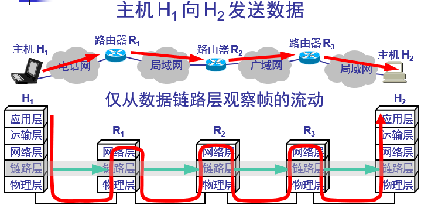
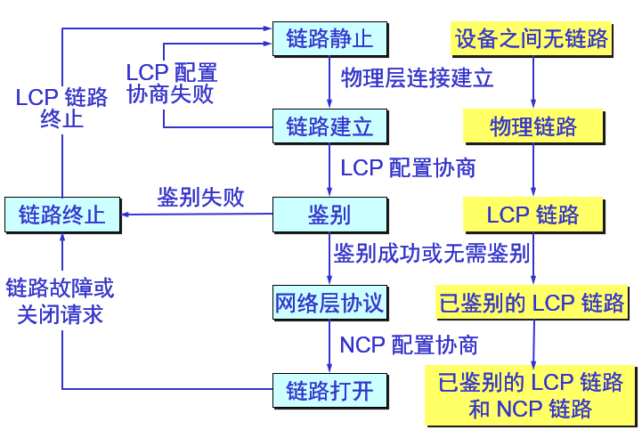
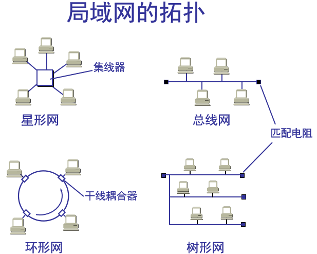
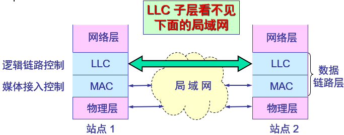
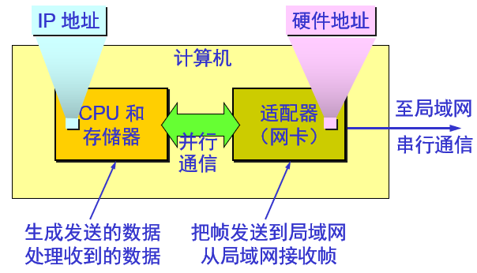
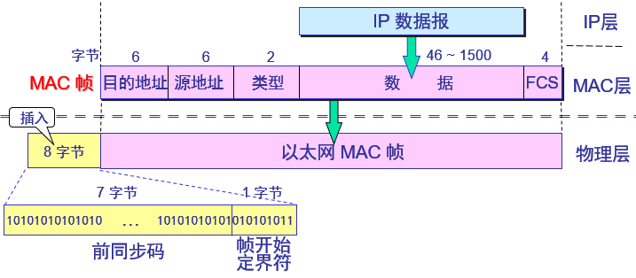
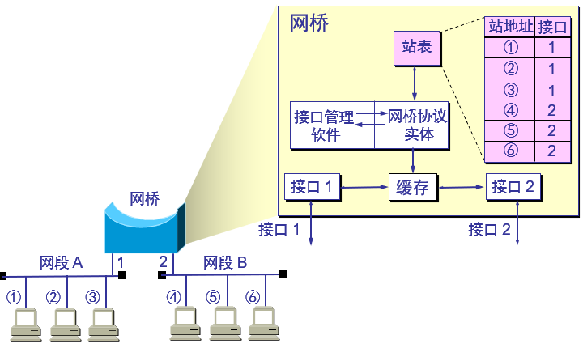
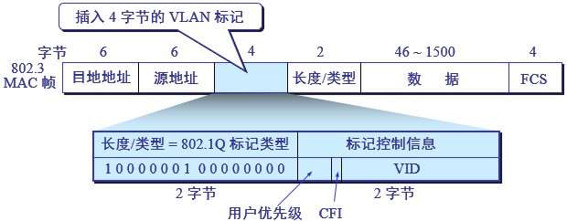

- [数据链路层使用的信道的主要两种类型](#数据链路层使用的信道的主要两种类型)
- [数据链路层的简单模型](#数据链路层的简单模型)
- [链路和数据链路](#链路和数据链路)
- [三个基本问题](#三个基本问题)
  - [封装成帧](#封装成帧)
  - [透明传输](#透明传输)
  - [差错控制](#差错控制)
- [点对点协议 PPP](#点对点协议-ppp)
  - [PPP协议应满足的需求](#ppp协议应满足的需求)
  - [PPP 协议不需要的功能](#ppp-协议不需要的功能)
  - [PPP 协议有三个组成部分](#ppp-协议有三个组成部分)
  - [PPP 协议的帧格式](#ppp-协议的帧格式)
  - [透明传输问题](#透明传输问题)
  - [不提供使用序号和确认的可靠传输](#不提供使用序号和确认的可靠传输)
  - [PPP 协议的工作状态](#ppp-协议的工作状态)
- [使用广播信道的数据链路层](#使用广播信道的数据链路层)
  - [局域网的数据链路层](#局域网的数据链路层)
  - [媒体共享技术](#媒体共享技术)
  - [以太网的两个标准](#以太网的两个标准)
  - [数据链路层的两个子层](#数据链路层的两个子层)
  - [适配器的作用](#适配器的作用)
  - [CSMA/CD 协议](#csmacd-协议)
    - [载波监听](#载波监听)
    - [多点接入](#多点接入)
    - [碰撞检测](#碰撞检测)
    - [重要特性](#重要特性)
    - [争用期](#争用期)
    - [二进制指数类型退避算法 (truncated binary exponential type)](#二进制指数类型退避算法-truncated-binary-exponential-type)
    - [争用期的长度](#争用期的长度)
    - [最短有效帧长](#最短有效帧长)
    - [强化碰撞](#强化碰撞)
  - [使用集线器的星形拓扑](#使用集线器的星形拓扑)
  - [以太网的信道利用率](#以太网的信道利用率)
  - [以太网的 MAC 层](#以太网的-mac-层)
    - [MAC 层的硬件地址](#mac-层的硬件地址)
    - [MAC 帧格式](#mac-帧格式)
    - [无效的 MAC 帧](#无效的-mac-帧)
    - [帧间最小间隔](#帧间最小间隔)
  - [扩展局域网](#扩展局域网)
    - [在物理层扩展局域网](#在物理层扩展局域网)
    - [在数据链路层扩展局域网](#在数据链路层扩展局域网)
      - [使用网桥的好处](#使用网桥的好处)
      - [使用网桥的缺点](#使用网桥的缺点)
      - [集线器和网桥的区别](#集线器和网桥的区别)
    - [多接口网桥——以太网交换机](#多接口网桥以太网交换机)
      - [交换机的特点](#交换机的特点)
      - [利用以太网交换机可以很方便地实现虚拟局域网](#利用以太网交换机可以很方便地实现虚拟局域网)
  - [高速以太网](#高速以太网)
    - [100BASE-T 以太网](#100base-t-以太网)
    - [吉比特以太网](#吉比特以太网)
    - [10 吉比特以太网](#10-吉比特以太网)

# 数据链路层使用的信道的主要两种类型

- **点对点信道**：使用一对一的点对点通信方式。
- **广播信道**：使用一对多的广播通信方式，因此过程比较复杂。广播信道上连接的主机很多，因此必须使用专用的共享信道协议来协调这些主机的数据发

# 数据链路层的简单模型

# 链路和数据链路

- 链路(link)：
    - 是一条无源的点到点的物理线路段，中间没有任何其他的交换结点。
    - 一条链路只是一条通路的一个组成部分。
- 数据链路(data link)：
    - 除了物理线路外，还必须有通信协议来控制这些数据的传输。
    - 若把实现这些协议的硬件和软件加到链路上，就构成了数据链路。
    - 现在最常用的方法是使用适配器（即网卡）来实现这些协议的硬件和软件。
    - 一般的适配器都包括了数据链路层和物理层这两层的功能。

# 三个基本问题

## 封装成帧

- 封装成帧(framing)就是在一段数据的前后分别添加首部和尾部，然后就构成了一个帧。确定帧的界限。
- 首部和尾部的一个重要作用就是进行**帧定界**。

## 透明传输

- 发送端的数据链路层在数据中出现控制字符“SOH”(帧开始符)或“EOT”(帧结束符)的前面插入一个转义字符 "ESC"(其十六进制编码是 "1B")。
- 字节填充(byte stuffing)或字符填充(character stuffing)——接收端的数据链路层在将数据送往网络层之前删除插入的转义字符。
- 如果转义字符也出现数据当中，那么应在转义字符前面插入一个转义字符。当接收端收到连续的两个转义字符时，就删除其中前面的一个。

## 差错控制

- 在传输过程中可能会产生比特差错：1 可能会变成 0 而 0 也可能变成 1。
- 在一段时间内，传输错误的比特占所传输比特总数的比率称为误码率 BER (Bit Error Rate)。误码率与信噪比有很大的关系。
- 为了保证数据传输的可靠性，在计算机网络传输数据时，必须采用各种差错检测措施。
- 循环冗余检验(CRC)：在数据链路层传送的帧中，广泛使用了循环冗余检验 CRC 的检错技术。
- 帧检验序列 FCS：在数据后面添加上的冗余码称为帧检验序列 FCS (Frame Check Sequence)。
- 循环冗余检验 CRC 和帧检验序列 FCS 并不等同。
    - CRC 是一种常用的检错方法，而 FCS 是添加在数据后面的冗余码。
    - FCS 可以用 CRC 这种方法得出，但 CRC 并非用来获得 FCS 的唯一方法。
- 注意：
    - 仅用循环冗余检验 CRC 差错检测技术只能做到无差错接受(accept)。
    - “无差错接受”是指：“凡是接受的帧（即不包括丢弃的帧），我们都能以非常接近于 1 的概率认为这些帧在传输过程中没有产生差错”。也就是说：“凡是接收端数据链路层接受的帧都没有传输差错”（有差错的帧就丢弃而不接受）。
    - 要做到“可靠传输”（即发送什么就收到什么）就必须再加上确认和重传机制。

# 点对点协议 PPP

- 现在全世界使用得最多的数据链路层协议是点对点协议 PPP (Point-to-Point Protocol)。
- 用户使用拨号电话线接入因特网时，一般都是使用 PPP 协议。

## PPP协议应满足的需求

- 简单——这是首要的要求
- 封装成帧
- 透明性
- 差错检测
- 多种网络层协议
- 多种类型链路
- 检测连接状态
- 最大传送单元
- 网络层地址协商
- 数据压缩协商

## PPP 协议不需要的功能

- 纠错
- 流量控制
- 序号
- 多点线路
- 半双工或单工链路

## PPP 协议有三个组成部分

- 一个将IP数据报封装到串行链路的方法。
- **链路控制协议** LCP (Link Control Protocol)。
- **网络控制协议** NCP (Network Control Protocol)。

## PPP 协议的帧格式

- 标志字段 F = 0x7E
- 地址字段 A 只置为 0xFF。地址字段实际上并不起作用。
- 控制字段 C 通常置为 0x03。
- PPP 有一个 2 个字节的协议字段。
    - 当协议字段为 0x0021 时，PPP 帧的信息字段就是IP 数据报。
    - 若为 0xC021, 则信息字段是 PPP 链路控制数据。
    - 若为 0x8021，则表示这是网络控制数据。
- PPP 是面向字节的，所有的 PPP 帧的长度都是整数字节。

## 透明传输问题

当 PPP 用在同步传输链路时，协议规定采用硬件来完成**比特填充**（和 HDLC 的做法一样）。
- **零比特填充**
    - PPP 协议用在 SONET/SDH 链路时，是使用同步传输（一连串的比特连续传送）。这时 PPP 协议采用零比特填充方法来实现透明传输。
    - 在发送端，只要发现有 5 个连续 1，则立即填入一个 0。接收端对帧中的比特流进行扫描。每当发现 5 个连续1时，就把这 5 个连续 1 后的一个 0 删除，
- 当 PPP 用在异步传输时，就使用一种特殊的**字符填充法**。
    - 将信息字段中出现的每一个 0x7E 字节转变成为 2 字节序列(0x7D, 0x5E)。
    - 若信息字段中出现一个 0x7D 的字节, 则将其转变成为 2 字节序列(0x7D, 0x5D)。
    - 若信息字段中出现 ASCII 码的控制字符（即数值小于 0x20 的字符），则在该字符前面要加入一个 0x7D 字节，同时将该字符的编码加以改变。

## 不提供使用序号和确认的可靠传输

- 在数据链路层出现差错的概率不大时，使用比较简单的 PPP 协议较为合理。
- 在因特网环境下，PPP 的信息字段放入的数据是 IP 数据报。数据链路层的可靠传输并不能够保证网络层的传输也是可靠的。
- 帧检验序列 FCS 字段可保证无差错接受。

## PPP 协议的工作状态

- 当用户拨号接入 ISP 时，路由器的调制解调器对拨号做出确认，并建立一条物理连接。
- PC 机向路由器发送一系列的 LCP 分组（封装成多个 PPP 帧）。
- 这些分组及其响应选择一些 PPP 参数，和进行网络层配置，NCP 给新接入的 PC机分配一个临时的 IP 地址，使 PC 机成为因特网上的一个主机。
- 通信完毕时，NCP 释放网络层连接，收回原来分配出去的 IP 地址。接着，LCP 释放数据链路层连接。最后释放的是物理层的连接。
    

# 使用广播信道的数据链路层

## 局域网的数据链路层

- 局域网最主要的特点是：网络为一个单位所拥有，且地理范围和站点数目均有限。
- 局域网具有如下的一些主要优点：
    - 具有广播功能，从一个站点可很方便地访问全网。局域网上的主机可共享连接在局域网上的各种硬件和软件资源。
    - 便于系统的扩展和逐渐地演变，各设备的位置可灵活调整和改变。
    - 提高了系统的可靠性、可用性和残存性。

## 媒体共享技术

- 静态划分信道
    - 频分复用
    - 时分复用
    - 波分复用
    - 码分复用
- 动态媒体接入控制（多点接入）
    - 随机接入
    - 受控接入 ，如多点线路探询(polling)，或轮询。

## 以太网的两个标准

- DIX Ethernet V2 是世界上第一个局域网产品（以太网）的规约。
- IEEE 的 802.3 标准。
- DIX Ethernet V2 标准与 IEEE 的 802.3 标准只有很小的差别，因此可以将 802.3 局域网简称为“以太网”。
- 严格说来，“以太网”应当是指符合 DIX Ethernet V2 标准的局域网

## 数据链路层的两个子层

- 为了使数据链路层能更好地适应多种局域网标准，802 委员会就将局域网的数据链路层拆成两个子层：
    - **逻辑链路控制** LLC (Logical Link Control)子层
    - **媒体接入控制** MAC (Medium Access Control)子层。
- 与接入到传输媒体有关的内容都放在 MAC子层，而 LLC 子层则与传输媒体无关，不管采用何种协议的局域网对 LLC 子层来说都是透明的
    
- 一般不考虑 LLC 子层
    - 由于 TCP/IP 体系经常使用的局域网是 DIX Ethernet V2 而不是 802.3 标准中的几种局域网，因此现在 802 委员会制定的逻辑链路控制子层 LLC（即 802.2 标准）的作用已经不大了。
    - 很多厂商生产的适配器上就仅装有 MAC 协议而没有 LLC 协议。

## 适配器的作用

- 网络接口板又称为通信适配器(adapter)或网络接口卡 NIC (Network Interface Card)，或“网卡”。
- 适配器的重要功能：
    - 进行串行/并行转换。
    - 对数据进行缓存。
    - 在计算机的操作系统安装设备驱动程序。
    - 实现以太网协议。
- 计算机通过适配器和局域网进行通信
    

## CSMA/CD 协议

CSMA/CD 表示 Carrier Sense Multiple Access with Collision Detection。

### 载波监听

- “载波监听”是指每一个站在发送数据之前先要检测一下总线上是否有其他计算机在发送数据，如果有，则暂时不要发送数据，以免发生碰撞。
- 总线上并没有什么“载波”。因此，“载波监听”就是用电子技术检测总线上有没有其他计算机发送的数据信号。

### 多点接入

“多点接入”表示许多计算机以多点接入的方式连接在一根总线上。

### 碰撞检测

- “碰撞检测”就是计算机边发送数据边检测信道上的信号电压大小。当几个站同时在总线上发送数据时，总线上的信号电压摆动值将会增大（互相叠加）。
- 当一个站检测到的信号电压摆动值超过一定的门限值时，就认为总线上至少有两个站同时在发送数据，表明产生了碰撞。
- 所谓“碰撞”就是发生了冲突。因此“碰撞检测”也称为“冲突检测”。
- 在发生碰撞时，总线上传输的信号产生了严重的失真，无法从中恢复出有用的信息来。
- 每一个正在发送数据的站，一旦发现总线上出现了碰撞，就要立即停止发送，免得继续浪费网络资源，然后等待一段随机时间后再次发送。

### 重要特性

- 使用 CSMA/CD 协议的以太网不能进行全双工通信而只能进行双向交替通信（半双工通信）。
- 每个站在发送数据之后的一小段时间内，存在着遭遇碰撞的可能性。
- 这种发送的不确定性使整个以太网的平均通信量远小于以太网的最高数据率。

### 争用期

- 最先发送数据帧的站，在发送数据帧后至多经过时间 2$\tau$ （两倍的端到端往返时延）就可知道发送的数据帧是否遭受了碰撞。
- 以太网的端到端往返时延 2$\tau$  称为争用期，或碰撞窗口。
- 经过争用期这段时间还没有检测到碰撞，才能肯定这次发送不会发生碰撞。
- **注：电磁波在1km电缆的传播时延约为$5 \mu$s**

### 二进制指数类型退避算法 (truncated binary exponential type)

- 发生碰撞的站在停止发送数据后，要推迟（退避）一个随机时间才能再发送数据。
- 确定基本退避时间，一般是取为争用期 2$\tau$。
- 定义重传次数 k (k < 10)，即 $k = Min[重传次数, 10]$
- 从整数集合$[0,1,…, (2^k - 1)]$中随机地取出一个数记为 r。重传所需的时延就是 r 倍的基本退避时间($r \times 2\tau$)。
- 当重传达 16 次仍不能成功时即丢弃该帧，并向高层报告。

### 争用期的长度

- 以太网取 51.2$\mu$s 为争用期的长度。
- 对于 10 Mb/s 以太网，在争用期内可发送512 bit，即 64 字节。
- 以太网在发送数据时，若前**64字节**没有发生冲突，则后续的数据就不会发生冲突。

### 最短有效帧长

- 如果发生冲突，就一定是在发送的前 64 字节之内。
- 由于一检测到冲突就立即中止发送，这时已经发送出去的数据一定小于 64 字节。
- 以太网规定了最短有效帧长为 64 字节，凡长度小于 64 字节的帧都是由于冲突而异常中止的无效帧。

### 强化碰撞

- 当发送数据的站一旦发现发生了碰撞时：
- 立即停止发送数据；
- 再继续发送若干比特的人为干扰信号(jamming signal)，以便让所有用户都知道现在已经发生了碰撞。

## 使用集线器的星形拓扑

传统以太网最初是使用粗同轴电缆，后来演进到使用比较便宜的细同轴电缆，最后发展为使用更便宜和更灵活的双绞线。
这种以太网采用星形拓扑，在星形的中心则增加了一种可靠性非常高的设备，叫做集线器(hub)
- **10BASE-T** 以太网在局域网中的统治地位
    - 10BASE-T 的通信距离稍短，每个站到集线器的距离不超过 **100 m**。
    - 这种 **10 Mb/s** 速率的无屏蔽双绞线星形网的出现，既降低了成本，又提高了可靠性。
    - 10BASE-T 双绞线以太网的出现，是局域网发展史上的一个非常重要的里程碑，它为以太网在局域网中的统治地位奠定了牢固的基础。
- 集线器
    - 集线器是使用电子器件来模拟实际电缆线的工作，因此整个系统仍然像一个传统的以太网那样运行。
    - 使用集线器的以太网在逻辑上仍是一个总线网，各工作站使用的还是 CSMA/CD 协议，并共享逻辑上的总线。
    - 集线器很像一个多接口的转发器，工作在物理层(一层设备)。

## 以太网的信道利用率

- 帧长为 $L$ (bit)，数据发送速率为 $C$ (b/s)，因而帧的发送时间为 $T_0 = \frac{L}{C}$ (s)。
- 一个帧从开始发送，经可能发生的碰撞后，将再重传数次，到发送成功且信道转为空闲(即再经过时间 $\tau$ 使得信道上无信号在传播)时为止，是发送一帧所需的平均时间。
    
- 要提高以太网的信道利用率，就必须减小 $\tau$ 与 $T_0$ 之比。在以太网中定义了参数 $a$，$a = \frac{\tau}{T_0}$
    - $a \to 0$ 表示一发生碰撞就立即可以检测出来，并立即停止发送，因而信道利用率很高。
    - $a$ 越大，表明争用期所占的比例增大，每发生一次碰撞就浪费许多信道资源，使得信道利用率明显降低。
-  对以太网参数的要求
    - 当数据率一定时，以太网的连线的长度受到限制，否则 $\tau$ 的数值会太大。
    - 以太网的帧长不能太短，否则 $T_0$ 的值会太小，使 a 值太大
- 信道利用率的最大值 $S_{max}$
    - 在理想化的情况下，以太网上的各站发送数据都不会产生碰撞（这显然已经不是 CSMA/CD，而是需要使用一种特殊的调度方法），即总线一旦空闲就有某一个站立即发送数据。
    - 发送一帧占用线路的时间是 $T_0 + \tau$，而帧本身的发送时间是 $T_0$，$S_{max} = \frac{T_0}{T_0 + \tau} = \frac{1}{1 + a}$

## 以太网的 MAC 层

### MAC 层的硬件地址

- 在局域网中，硬件地址又称为物理地址，或 MAC 地址。
- 802 标准所说的“地址”严格地讲应当是每一个站的“名字”或标识符。
- 48位MAC地址
    - IEEE 的注册管理机构 RA 负责向厂家分配地址字段的前三个字节(即高位 24 位)。
    - 地址字段中的后三个字节(即低位 24 位)由厂家自行指派，称为扩展标识符，必须保证生产出的适配器没有重复地址。
    - 一个地址块可以生成224个不同的地址。这种 48 位地址称为 MAC-48，它的通用名称是EUI-48。
    - “MAC地址”实际上就是适配器地址或适配器标识符EUI-48。
- 适配器检查 MAC 地址
    - 适配器从网络上每收到一个 MAC 帧就首先用硬件检查 MAC 帧中的 MAC 地址.
        - 如果是发往本站的帧则收下，然后再进行其他的处理。
        - 否则就将此帧丢弃，不再进行其他的处理。
    - “发往本站的帧”包括以下三种帧：
        - 单播(unicast)帧（一对一）
        - 广播(broadcast)帧（一对全体）
        - 多播(multicast)帧（一对多）

### MAC 帧格式

- 常用的以太网MAC帧格式有两种标准 ：
    - DIX Ethernet V2标准
    - IEEE的802.3标准
- 最常用的MAC帧是**以太网V2**的格式。

- MAC帧在IP数据报的基础上新增了 **$18$** 个字节，有效的MAC帧长度为 **$64$ ~ $1518$** 字节
- 为了达到比特同步，在传输媒体上实际传送的要比 MAC 帧还多 8 个字节
    - 第一个字段共7个字节，是前同步码，用来迅速实现MAC帧的比特同步。
    - 第二个字段是帧开始定界符，表示后面的信息就是MAC帧。
- FCS：当传输媒体的误码率为 $1 \times 10^{-8}$ 时，MAC 子层可使未检测到的差错小于 $1 \times 10^{-14}$。
- 当数据字段的长度小于 46 字节时，应在数据字段的后面加入整数字节的填充字段，以保证以太网的 MAC 帧长不小于 64 字节。

### 无效的 MAC 帧

- 数据字段的长度与长度字段的值不一致；
- 帧的长度不是整数个字节；
- 用收到的帧检验序列 FCS 查出有差错；
- 数据字段的长度不在 46 ~ 1500 字节之间。
- 有效的 MAC 帧长度为 64 ~ 1518 字节之间。
- 对于检查出的无效 MAC 帧就简单地丢弃。以太网不负责重传丢弃的帧。

### 帧间最小间隔

- 帧间最小间隔为 $9.6 \mu$s，相当于 $96$ bit 的发送时间。
- 一个站在检测到总线开始空闲后，还要等待 $9.6 \mu$s 才能再次发送数据。
- 这样做是为了使刚刚收到数据帧的站的接收缓存来得及清理，做好接收下一帧的准备。

## 扩展局域网

### 在物理层扩展局域网

- 用集线器扩展局域网
- 优点
   - 使原来属于不同碰撞域的局域网上的计算机能够进行跨碰撞域的通信。
   - 扩大了局域网覆盖的地理范围。
- 缺点
   - 碰撞域增大了，但总的吞吐量并未提高。
   - 如果不同的碰撞域使用不同的数据率，那么就不能用集线器将它们互连起来。

### 在数据链路层扩展局域网

在数据链路层扩展局域网是使用网桥。
    
- 网桥工作在数据链路层，它根据 MAC 帧的目的地址对收到的帧进行转发。
- 网桥具有过滤帧的功能。当网桥收到一个帧时，并不是向所有的接口转发此帧，而是先检查此帧的目的 MAC 地址，然后再确定将该帧转发到哪一个接口

#### 使用网桥的好处

- 过滤通信量，使各网段成为隔离开的碰撞域
- 扩大了物理范围。
- 提高了可靠性。
- 可互连不同物理层、不同 MAC 子层和不同速率（如10 Mb/s 和 100 Mb/s 以太网）的局域网

#### 使用网桥的缺点

- 存储转发增加了时延。
- 在MAC 子层并没有流量控制功能。
- 具有不同 MAC 子层的网段桥接在一起时时延更大。
- 网桥只适合于用户数不太多(不超过几百个)和通信量不太大的局域网，否则有时还会因传播过多的广播信息而产生网络拥塞。这就是所谓的广播风暴。
- 网桥的自学习算法和转发帧
    -  网桥收到一帧后先进行自学习。查找转发表中与收到帧的源地址有无相匹配的项目。如没有，就在转发表中增加一个项目（源地址、进入的接口和时间）。如有，则把原有的项目进行更新。
    - 转发帧。查找转发表中与收到帧的目的地址有无相匹配的项目。
        - 如没有，则通过所有其他接口（但进入网桥的接口除外）按进行转发。
        - 如有，则按转发表中给出的接口进行转发。
        - 若转发表中给出的接口就是该帧进入网桥的接口，则应丢弃这个帧（因为这时不需要经过网桥进行转发）。

#### 集线器和网桥的区别

- 集线器在转发帧时，不对传输媒体进行检测。
- 网桥在转发帧之前必须执行 CSMA/CD 算法。若在发送过程中出现碰撞，就必须停止发送和进行退避。

### 多接口网桥——以太网交换机

#### 交换机的特点

- 以太网交换机的每个接口都直接与主机相连，并且一般都工作在全双工方式。
- 交换机能同时连通许多对的接口，使每一对相互通信的主机都能像独占通信媒体那样，进行无碰撞地传输数据。
- 以太网交换机由于使用了专用的交换结构芯片，其交换速率就较高。
- 独占传输媒体的带宽
    - 对于普通 10 Mb/s 的共享式以太网，若共有 N 个用户，则每个用户占有的平均带宽只有总带宽(10 Mb/s)的 N 分之一。
    - 使用以太网交换机时，虽然在每个接口到主机的带宽还是 10 Mb/s，但由于一个用户在通信时是独占而不是和其他网络用户共享传输媒体的带宽，因此对于拥有 N 对接口的交换机的总容量为 N10 Mb/s。这正是交换机的最大优点。

#### 利用以太网交换机可以很方便地实现虚拟局域网

- 虚拟局域网 VLAN 是由一些局域网网段构成的与物理位置无关的逻辑组。
    - 这些网段具有某些共同的需求。
    - 每一个 VLAN 的帧都有一个明确的标识符，指明发送这个帧的工作站是属于哪一个 VLAN。
- 虚拟局域网其实只是局域网给用户提供的一种服务，而并不是一种新型局域网。
- 虚拟局域网使用的以太网帧格式
    

## 高速以太网

### 100BASE-T 以太网

- 速率达到或超过 100 Mb/s 的以太网称为高速以太网。100BASE-T 以太网又称为快速以太网(Fast Ethernet)。
- 可在全双工方式下工作而无冲突发生。因此，不使用 CSMA/CD 协议。
- MAC 帧格式仍然是 802.3 标准规定的。
- 保持最短帧长不变，但将一个网段的最大电缆长度减小到 100 m。
- 帧间时间间隔从原来的 $9.6 \mu$s 改为现在的 $0.96 \mu$s。
- 三种不同的物理层标准
    - 100BASE-TX：使用 2 对 UTP 5 类线或屏蔽双绞线 STP。
    - 100BASE-FX：使用 2 对光纤。
    - 100BASE-T4：使用 4 对 UTP 3 类线或 5 类线。

### 吉比特以太网

- 允许在 1 Gb/s 下全双工和半双工两种方式工作。
- 使用 802.3 协议规定的帧格式。
- 在半双工方式下使用 CSMA/CD 协议（全双工方式不需要使用 CSMA/CD 协议）。
- 与 10BASE-T 和 100BASE-T 技术向后兼容。
- 物理层：
    - 1000BASE-X：基于光纤通道的物理层：
    - 1000BASE-SX：SX表示短波长
    - 1000BASE-LX：LX表示长波长
    - 1000BASE-CX：CX表示铜线
    - 1000BASE-T：使用 4对 5 类线 UTP

### 10 吉比特以太网

- 与 10 Mb/s，100 Mb/s 和 1 Gb/s 以太网的帧格式完全相同。
- 保留了 802.3 标准规定的以太网最小和最大帧长，便于升级。
- 不再使用铜线而只使用光纤作为传输媒体。
- 只工作在全双工方式，因此没有争用问题，也不使用 CSMA/CD 协议。