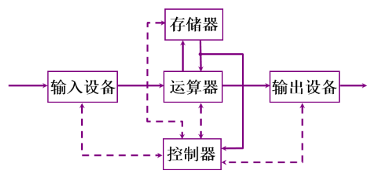
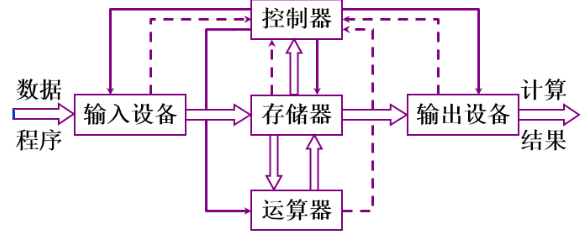
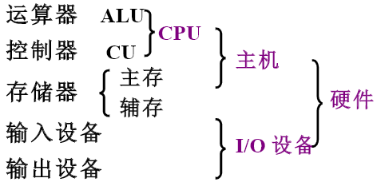
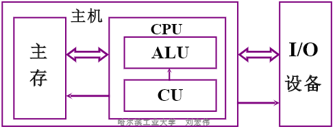
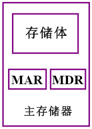
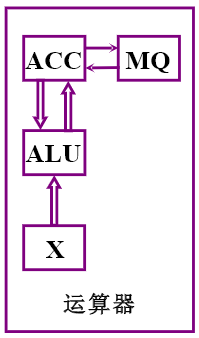
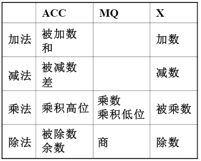
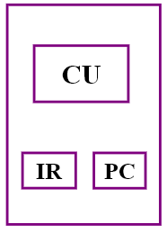
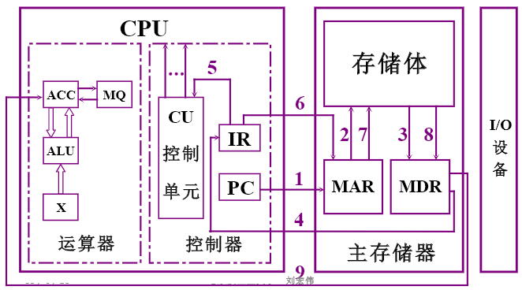
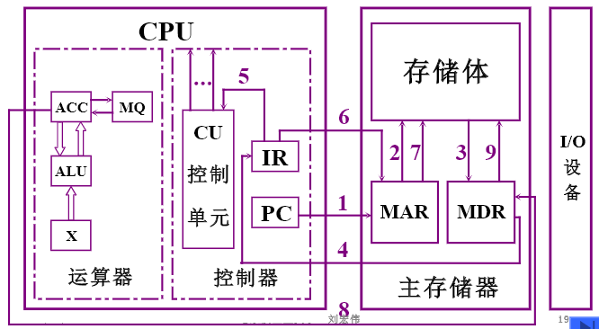

- [名词术语](#名词术语)
- [计算机系统的层次结构](#计算机系统的层次结构)
- [计算机体系结构和计算机组成](#计算机体系结构和计算机组成)
- [冯·诺依曼计算机的特点](#冯诺依曼计算机的特点)
- [计算机硬件框图](#计算机硬件框图)
  - [冯·诺依曼计算机硬件框图](#冯诺依曼计算机硬件框图)
  - [以存储器为中心](#以存储器为中心)
  - [现代计算机](#现代计算机)
- [计算机的工作准备](#计算机的工作准备)
  - [上机前的准备](#上机前的准备)
  - [计算机的解题过程](#计算机的解题过程)
    - [存储器](#存储器)
    - [运算器](#运算器)
    - [控制器](#控制器)
    - [主机完成一条指令的过程](#主机完成一条指令的过程)
- [计算机硬件的主要技术指标](#计算机硬件的主要技术指标)
  - [机器字长](#机器字长)
  - [运算速度](#运算速度)
  - [存储容量](#存储容量)

# 名词术语

- 硬件：是指计算机的实体部分，它由看得见摸得着的各种电子元器件，各类光、电、机设备的实物组成，如主机、外部设备等。
- 软件：是看不见摸不着，由人们事先编制的具有各类特殊功能的程序组成。通常把这些程序存储在各类存储介质中，如磁带、磁盘、光盘，甚至纸带等。
    - 系统软件：又称为系统程序，主要用来管理整个计算机系统，监视服务，使系统资源得到合理调度，高效运行。
    - 应用软件：按任务需要编制成的各种程序。

# 计算机系统的层次结构

- 系统复杂性管理的方法
    - 抽象：指高级的模型，和低级的实体相对。对于一个过程或者一件制品的某些细节有目的的隐藏，以便把其他方面、细节或者结构表达得更加清楚。
- 计算机系统的层次结构

    | 软硬件 | 系统或语言    机器 | 说明           |                              |
    | :----- | :----------------- | :------------- | :--------------------------- |
    | 软件   | 高级语言           | 虚拟机器 $M_3$ | 用编译程序翻译成汇编语言程序 |
    |        | 汇编语言           | 虚拟机器 $M_2$ | 用汇编程序翻译成机器语言程序 |
    |        | 操作系统           | 虚拟机器       | 用机器语言解释操作系统       |
    | 硬件   | 机器语言           | 实际机器 $M_1$ | 用微指令解释机器指令         |
    |        | 微指令系统         | 实际机器 $M_0$ | 由硬件直接执行微指令         |

# 计算机体系结构和计算机组成

- 计算机体系结构
    - 程序员所见到的计算机系统的属性概念性的结构与功能特性
    - 如：定义指令系统、数据类型、寻址技术、I/O机理
- 计算机组成
    - 指计算机体系结构的逻辑实现，包含了许多对编写程序来说不需要了解的硬件细节.
    - 如：具体指令的实现

# 冯·诺依曼计算机的特点

- 计算机由五大部件组成
    - 运算器：算术运算、逻辑运算
    - 存储器：存储数据和程序
    - 控制器：指挥程序运行
    - 输入设备：将信息转换成机器能识别的形式
    - 输出设备：将结果转换成人们熟悉的形式
- 指令和数据以同等地位存于存储器，可按地址寻访
- 指令和数据用二进制表示
- 指令由操作码和地址码组成
    - 操作码：指令要做什么操作
    - 地址码：对哪里的数据进行操作
- 存储程序（最重要）
    - 程序要存储在存储器
- 以运算器为中心

# 计算机硬件框图

## 冯·诺依曼计算机硬件框图

## 以存储器为中心

特点：
- 输入的数据可以之间放入存储器
- 存储器的数据可以直接输出
- 控制器指令存储在存储器中（控制器和存储器之间的细实线箭头）

## 现代计算机

- ALU：Arithmetic Logic Unit，算术逻辑单元。由与门和或门构成的算数逻辑单元，主要功能是进行二进制的算术运算，如加减乘(不包括整数除法)。基本上，在所有现代CPU体系结构中，二进制都以补码的形式来表示。
- CU：Control Unit， 控制单元。负责指挥CPU工作。透过该设备的运行来控制其他设备的活动，也被视作有限状态自动机的一种。
- CPU：Central Processing Unit，中央处理器。解释计算机指令以及处理计算机软件中的数据。
- 主存：Main Memory。存放指令和数据，并能由中央处理器（CPU）直接随机存取。（内存）
- 辅存：狭义上是我们平时讲的硬盘。科学地说是外部存储器（需要通过 I/O 系统与之交换数据，又称为辅助存储器）。

# 计算机的工作准备

## 上机前的准备

1. 建立数学模型
2. 确认计算方法
    - $\sin{x} = x - \frac{x^3}{3!} + \frac{x^5}{5!} - \frac{x^7}{7!} + ...$
    - $y_{n + 1} = \frac{1}{2}(y_n + \frac{x}{y_n}), \quad (n = 0, 1, 2, ...)$
3. 编制解题程序

## 计算机的解题过程

### 存储器

主存储器：简称主存或内存。包括存储体、各种逻辑部件及控制电路等。

主存储器的基本组成：

- 存储体 ：存放一串二进制代码
    - 存储体由许多存储单元组成
    - 每个**存储单元**又包含若干个存储元件(或称存储基元、存储元)
    - 每个**存储元件**能寄存一位二进制代码“0”或“1"
    - 一个存储单元可存储一串二进制代码，称这串二进制代码为一个**存储字**
    - 这串二进制代码的位数称为**存储字长**。存储字长可以是8位、16位或32位等。
    - 如果把一个存储体看作一幢大楼
        - 那么每个存储单元可看作大楼中的每个房间
        - 每个存储元件可看作每个房中的一张床位，床位有人相当于”1”，无人相当于”0”。
        - 床位数相当于存储字长。
        - 显然，每个房间都需要有一个房间编号，同样可以赋予每个存储单一个编号，称为存储单元的地址号。
        - 主存的工作方式就是按存储单元的地址号来实现对存储字各位的存(写人)、取(读出)。这种存取方式称为按地址存取方式，即按地址访问存储器(简称访存)。
- MAR：存储器地址寄存器
    - 存放需要存取数据的地址
    - 能反映存储单元的个数：地址由二进制表示，$2^{地址位数}$就是存处单元的个数
- MDR：存储器数据寄存器
    - 存放存取的数据
    - 能反映存储字长：存储数据的大小就是存处字长
- 例：
    - 若：MAR = 4 位，MDR = 8 位。
    - 则：存储器中有 $2^4 = 16$ 个存储单元，存储字长为8位。

### 运算器

运算器的基本组成：

- ALU：算数逻辑单元，运算器的核心
- ACC：累加寄存器
- X：寄存器
- MQ：乘商寄存器

操作过程：
- 数据存放的位置
    

### 控制器

控制器的基本组成：

- CU：控制单元
- IR：指令寄存器，存放当前欲执行的指令，拥有计数功能，存储后计数+1
- PC：程序计数器，保存着当前要执行的指令的地址
- 完成一条指令包含三个步骤
    - 取指令
    - 分析指令
    - 执行指令

### 主机完成一条指令的过程

以取数指令为例：

1. 取指令
    - PC把保存的地址送到MAR
    - MAR再转送到存储体
    - 存储体根据地址取出目标指令并存到MDR
    - MDR把数据送到IR
2. 分析指令
    - IR将指令送到CU，CU对指令进行分析
3. 执行指令
    - 由于是取数指令，IR中数据保存着目标数的地址，所以由IR开始，将地址送到MAR
    - MAR转送至存储体
    - 存储体读根据地址取出目标数据送到MDR
    - MDR把数据送至ACC寄存器。

以存数指令为例

1. 取指令
    - PC把保存的地址送到MAR
    - MAR再转送到存储体
    - 存储体根据地址取出目标指令并存到MDR
    - MDR把数据送到IR
2. 分析指令
    - IR将指令送到CU，CU对指令进行分析
3. 执行指令
    - IR的数据保存存放地址，IR将该地址送到MAR
    - MAR转送至存储体，告知即将有数据存储在该地址
    - ACC把数据送到MDR
    - MDR把数据存储到存储体的目标地址

注意：
- 上述图示只显示了数据流动
- PC在取指令后需要+1，否则会已知执行取数或存数

# 计算机硬件的主要技术指标

## 机器字长

- CPU一次能处理数据的位数，与CPU中的寄存器位数有关
- 32位计算机、64位计算机

## 运算速度

- 主频
    - CPU内核工作的时钟频率
    - 这个多少兆赫就是“CPU的主频”
    - 主频越高，CPU的运算速度就越快
    - 主频不等于处理器一秒钟执行的指令条数，因为一条指令的执行可能需要多个时钟周期。
- 吉普森法：每条指令执行的加权平均时间
    - $T_M = \sum_{i = 1}^n f_i t_i$
    - $f_i$ 为一条会被指令执行的概率
    - $t_i$ 为该指令执行的时间
- MIPS：每秒执行百万条指令
- FLOPS：每秒浮点运算次数
- CPI：执行一条指令所需始终周期数

## 存储容量

主存容量：
- 存储单元个数 $\times$ 存储字长。如：

    | MAR  | MDR  | 容量              |
    | :--- | :--- | :---------------- |
    | 10   | 8    | $1K \times 8位$   |
    | 16   | 32   | $64K \times 32位$ |
- 字节数。如：
    - $2^{13}b = 1 KB$
    - $2^{21}b = 256KB$

辅存容量：字节数。如：80GB