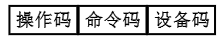
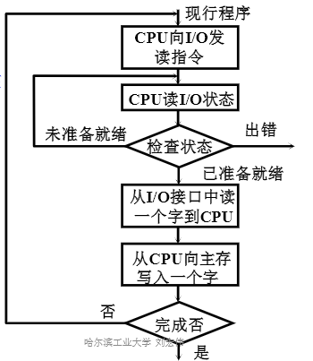
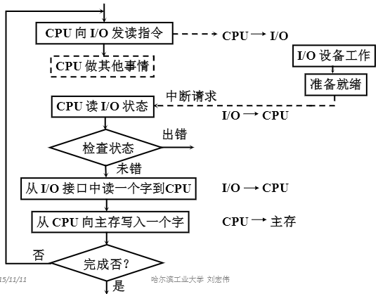
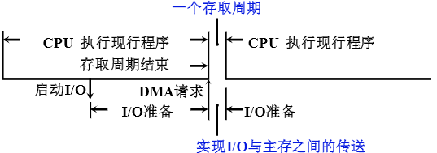
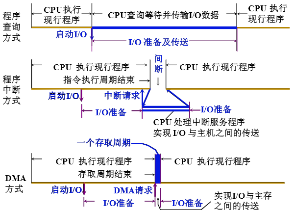
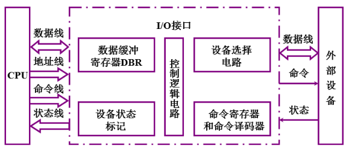
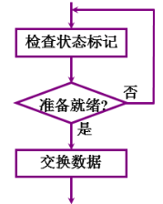
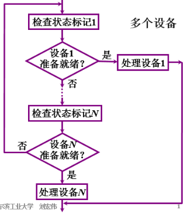
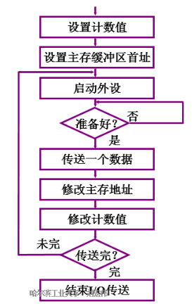
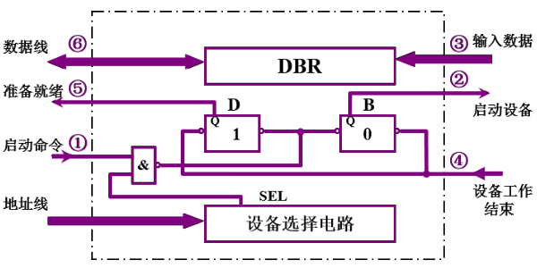

- [概述](#概述)
  - [相关概念](#相关概念)
  - [组成](#组成)
  - [I/O 设备与主机的联系方式](#io-设备与主机的联系方式)
  - [I/O设备与主机信息传送的控制方式](#io设备与主机信息传送的控制方式)
  - [程序查询方式](#程序查询方式)
  - [程序中断方式](#程序中断方式)
  - [DMA 方式](#dma-方式)
  - [效率对比](#效率对比)
- [外部设备](#外部设备)
- [I/O接口](#io接口)
  - [为什么要设置接口](#为什么要设置接口)
  - [接口的功能和组成](#接口的功能和组成)
  - [接口的类型](#接口的类型)
- [程序查询方式](#程序查询方式-1)
- [程序中断方式](#程序中断方式-1)
- [DMA方式](#dma方式)

# 概述

## 相关概念

- 输人输出系统
    - 是除了CPU和存储器两大模块外，计算机硬件系统的第三个关键部分是输人输出模块。
- 通道
    - 是用来负责管理I/O设备以及实现主存与I/O设备之间交换信息的部件
    - 可以视为一种具有特殊功能的处理器。
- 通道指令
    - 是对具有通道的I/O系统专门设置的指令
    - 这类指令一般用以指明参与传送(写人或读取)的数据组在主存中的首地址;
    - 指明需要传送的字节数或所传送数据组的末地址;
    - 指明所选设备的设备码及完成某种操作的命令码。
    - 通道指令又称为通道控制字(Channel Control word , CCW)，它是通道用于执行I/O操作的指令，可以由管理程序存放在主存的任何地方，由通道从主存中取出并执行。

## 组成

- I/O 软件
    - I/O 指令：CPU指令的一部分
    
        - 操作码：特征码，指明对 I/O 进行操作
        - 命令码：操作
        - 设备码：设备的地址
    - 通道指令：通道自身的指令
        - 指出数组的首地址、传输字数、操作命令
- I/O 硬件
    - I/O 接口
    - 设备控制器 通道

## I/O 设备与主机的联系方式

- I/O 设备编址方式
    - 统一编址：用取数、存数指令
    - 不统一编址：有专门的 I/O 指令
- 设备选址
    -用设备选择电路识别是否被选中
- 传送方式
    - 串行
    - 并行
- 联络方式
    - 立即响应
    - 异步工作采用应答信号
    - 同步工作采用同步时标
- I/O 设备与主机的连接方式
    - 辐射式连接
        - 每台设备都配有一套控制线路和一组信号线
        - 不便于增删设备
    - 总线连接
        - 便于增删设备
## I/O设备与主机信息传送的控制方式

## 程序查询方式

## 程序中断方式

- I/O 工作
    - 自身准备： CPU 不查询
    - 与主机交换信息：CPU 暂停现行程序
- CPU 和I/O 部分的并行工作
    - 没有踏步等待现象中断现行程序

## DMA 方式

- 主存和 I/O 之间有一条直接数据通道
- 不中断现行程序
- 周期挪用（周期窃取）
    - CPU 和I/O 并行工作

## 效率对比

# 外部设备

- 主机
    - 中央处理器和主存构成了主机
- 外部设备
    - 除主机外的大部分硬件设备都可称为I/O设备或外部设备，或外围设备，简称外设。
- 人机交互没备
    - 是实现操作者与计算机之间互相交流信息的设备
    - 能将人体五官可识别的信息转换成机器可识别的信息，如键盘、鼠标、手写板、扫描仪、摄像机、语音识别器等。
- 鼠标
    - 是一种手持式的定位设备，由于它拖着一根长线与接口相连，外形有点像老鼠，故取名为鼠标。
- 触摸屏
    - 是一种对物体的接触或靠近能产生反应的定位设备。
- 光笔( Light Pen)
    - 外形与钢笔相似，头部装有一个透镜系统，能把进人的光会聚成一个光点。
- 终端
    - 是由显示器和键盘组成的一套独立完整的 I/O 设备，它可以通过标准接口接到远离主机的地方使用。
- 多媒休
    - 是"Multimedia”的汉译，而"Multimedia”一同是由“Multi”和“Media”两个词构成的复合词，直译即为“多媒体”。

# I/O接口

- 接口
    - 可以看作是两个系统或两个部件之间的交接部分，
    - 它既可以是两种硬设备之间的连接电路，
    - 也可以是两个软件之间的共同逻辑边界。
- 端口
    - 是指接门电路中的一些寄存器，
    - 这些寄存器分别用来存放数据信息、控制信息和状态信息，
    - 相应的端口分别称为数据端口、控制端口和状态端口。

## 为什么要设置接口

- 实现设备的选择
- 实现数据缓冲达到速度匹配
- 实现数据串-并格式转换
- 实现电平转换
- 传送控制命令
- 反映设备的状态（“忙”、“就绪”、“中断请求”）

## 接口的功能和组成

- 总线连接方式的 I/O 接口电路
    - 设备选择线
        - 是用来传送设备码的，它的根数取决于I/O指令中设备码的位数。
        - 如果把设备码看作是地址号，那么设备选择线又可称为地址线。
    - 数据线
        - 是I/O设备与主机之间数据代码的传送线，
        - 其根数一般等于存储字长的位数或字符的位数，
        - 它通常是双向的，也可以是单向的。
    - 命令线
    - 状态线
        - 是将I/O设备的状态向主机报告的信号线。
- 接口的功能和组成
    | 功能               | 组成                   |
    | :----------------- | :--------------------- |
    | 选址功能           | 设备选择电路           |
    | 传送命令的功能     | 命令寄存器、命令译码器 |
    | 传送数据的功能     | 数据缓冲寄存器         |
    | 反映设备状态的功能 | 设备状态标记           |
    - 设备状态标记
        - 完成触发器 D
        - 工作触发器 B
        - 中断请求触发器 INTR
        - 屏蔽触发器MASK
- 接口的基本组成

## 接口的类型

- 按数据传送方式分类
    - 串行接口
    - 并行接口
- 按功能选择的灵活性分类
    - 可编程接口
    - 不可编程接口
- 按通用性分类
    - 通用接口
    - 专用接口
- 按数据传送的控制方式分
    - 中断接口
    - DMA 接口

# 程序查询方式

- 查询流程
    - 单个设备
    
    - 多个设备
    
- 程序流程
    - 先保存寄存器中的值。
    
- 接口电路
    - 以输入为例
    

# 程序中断方式

# DMA方式