- [总线的基本概念及分类](#总线的基本概念及分类)
  - [为什么要使用总线](#为什么要使用总线)
  - [计算机系统的五大部件之间的互连方式](#计算机系统的五大部件之间的互连方式)
  - [总线](#总线)
- [总线上信息的传送](#总线上信息的传送)
  - [串行通信（Serial communication）](#串行通信serial-communication)
  - [并行通信](#并行通信)
  - [串行通信与并行通信的比较](#串行通信与并行通信的比较)
- [总线结构](#总线结构)
  - [单总线结构](#单总线结构)
  - [面向CPU的双总线结构](#面向cpu的双总线结构)
  - [面向存储器的双总线结构](#面向存储器的双总线结构)
- [总线分类](#总线分类)
  - [片内总线](#片内总线)
  - [系统总线](#系统总线)
  - [通信总线](#通信总线)
- [总线特性及性能指标](#总线特性及性能指标)
  - [总线特性](#总线特性)
  - [总线性能指标](#总线性能指标)
  - [总线标准](#总线标准)
- [总线结构](#总线结构-1)
  - [单总线模式](#单总线模式)
  - [双总线结构](#双总线结构)
  - [三总线结构](#三总线结构)
  - [三总线结构的另一形式](#三总线结构的另一形式)
  - [四总线结构](#四总线结构)
- [总线控制](#总线控制)
  - [总线判优控制](#总线判优控制)
    - [链式查询](#链式查询)
    - [计数器定时查询](#计数器定时查询)
    - [独立请求方式](#独立请求方式)
    - [分布式控制](#分布式控制)
  - [总线通信控制](#总线通信控制)
    - [总线传输周期](#总线传输周期)
    - [总线通信方式](#总线通信方式)
      - [同步通信](#同步通信)
      - [异步通信](#异步通信)
      - [半同步通信](#半同步通信)
      - [分离式通信](#分离式通信)
    - [总线数据传输方式（物理层）](#总线数据传输方式物理层)

# 总线的基本概念及分类

## 为什么要使用总线

- 由于现代的计算机中组件的数量可能达到数百个，都互相拉线的话，会占据大量的空间。
- 计算机不容易扩展，如果要增加一个输入设备或者输出设备，需要把该设备和计算机中的其他设备进行连接，很难扩展。

## 计算机系统的五大部件之间的互连方式

- 分散连接：各部件之间使用单独的连线
- 总线连接：将各部件连到一组公共信息传输线上

## 总线

- 是连接多个部件的信息传输线，是**各部件共享的传输介质**。
- Wikipedia：总线（Bus）是指计算机组件间规范化的交换数据（data）的方式，即以一种通用的方式为各组件提供数据传送和控制逻辑。
- 如果说主板（Mother Board）是一座城市，那么总线就像是城市里的公共汽车（bus），能按照固定行车路线，传输来回不停运作的比特（bit）。

# 总线上信息的传送

## 串行通信（Serial communication）

- 是指数据在单条1位宽的传输线上，一位一位地按顺序分时传送。
- 用于长距离通信以及大多数计算机网络

## 并行通信

- 是指数据在多条并行1位宽的传输线上，同时由源传送到目的地。
- 用于短距离通信

## 串行通信与并行通信的比较

- 虽然串行连接单个时钟周期能够传输的数据比并行数据更少，前者传输能力看起来比后者要弱一些，实际的情况却常常是，串行通信可以比并行通信更容易提高通信时钟频率，从而提高数据的传输速率。有以下一些因素允许串行通信具有更高的通信时钟频率：
    - 无需考虑不同信道的时钟脉冲相位差（英语：clock skew）；
    - 串行连接所需的物理介质，例如电缆和光纤，少于并行通信，从而减少占用空间的体积；
    - 串扰的问题可以得到大幅度缓解。
- 在许多情况里，串行通信都凭借其更低廉的部署成本成为更佳的选择，尤其是在远距离传输中。许多集成电路都具有串行通信接口来减少引脚数量，从而节约成本。

# 总线结构

## 单总线结构

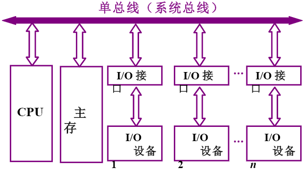
- 缺点：同一时间只能有一对设备进行信息传输

## 面向CPU的双总线结构

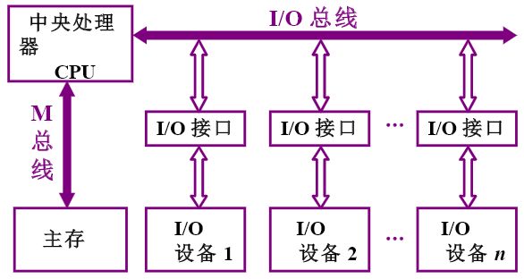
- 缺点：存储器和I/O设备之间没有总线直接相连，当存储器与I/O设备需要进行数据传输时，CPU正在执行的任务也会被打断。

## 面向存储器的双总线结构

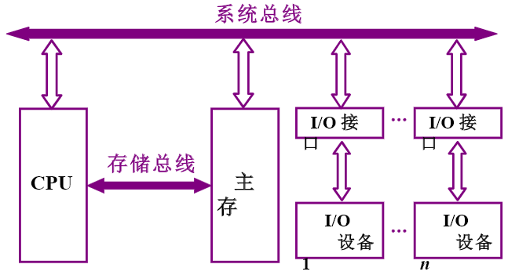
- 缺点：I/O设备与CPU通信，I/O设备与CPU通信不能同时进行

# 总线分类

## 片内总线

- 是指芯片内部的总线
- 如在CPU芯片内部，寄存器与寄存器之间、寄存器与算逻单元ALU之间都由片内总线连接。

## 系统总线

- 是指CPU、主存、I/O设备（通过I/O接口）各大部件之间的信息传输线。
- 由于这些部件通常都安放在主板或各个插件板（插卡）上，故又称板级总线（插卡）或板间总线。
- 数据总线
    - 用来传输各功能部件之问的数据信息
    - 它是双向传输总线，其位数与机器字长、存储字长有关，一般为8位、16位或32位。
- 地址总线
    - 主要用来指出数据总线上的源数据或目的数据在主存单元的地址或I/O设备的地址。
    - 与存储地址、IO地址有关，一般宽度与MAR相等。
    - 即地址信号只能由总线主设备至从设备。地址总线也是三态的，非主设备部件不能驱动地址总线。
- 控制总线
    - 有出：存储器读、存储器写、总线允许、中断确认
    - 有入：中断请求、总线请求
## 通信总线

用于计算机系统之间或计算机系统与其他系统（如控制仪表、移动通信等）之间的通信。

# 总线特性及性能指标

## 总线特性

- 机械特性：尺寸、形状、管脚数及排列顺序
- 电器特性：传输方向 和有效的 电平 范围
- 功能特性：每根传输线的功能（数据、地址、控制）
- 时间特性：信号的时序关系

## 总线性能指标

- 信号线数
    - 即地址总线、数据总线和控制总线三种总线的根数总和
- 总线宽度
    - 数据线的根数
    - 用bit（位）表示
    - 如8位、16位、32位、64位（也即8根、16根、32根、64根数据线）
- 标准传输率
    - 每秒传输的最大字节数（MBps）
    - $总线带宽 = \frac{宽度}{总线周期} = 宽度 \times总线频率$
        - 总线周期不一定等于总线时钟周期
- 时钟同步/异步
    - 总线上的数据与时钟同步工作的总线称为同步总线，与时钟不同步工作的总线称为异步总线。
- 总线复用
    - 为提高总线的利用率，将地址总线和数据总线共用一组物理线
    - 在某一时刻该总线传输地址信号，另一时刻传输数据信号或命令信号。
- 总线控制方式
    - 包括并发工作、自动配置、仲裁方式、逻辑方式、计数方式等
- 负载能力
    - 通常用可连接扩增电路板数来反映总线的负载能力。
    - 由于不同的电路对总线的负载是不同的
    - 即使同一电路在不同的工作频率下，总线的负载也是不同的。
    - 因此，总线负载能力的指标是不太严格的。
- 其他指标
    - 如电源电压是5V还是3.3V
    - 总线能否扩展至64位宽度等

## 总线标准

标准：完成了部件的隔离。部件生产厂商无需知道部件需要干什么，只需要按照标准制造。
    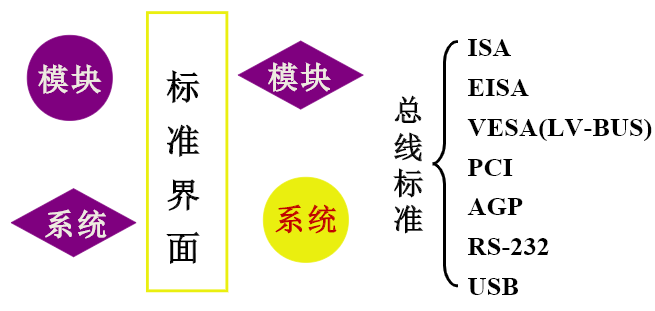
    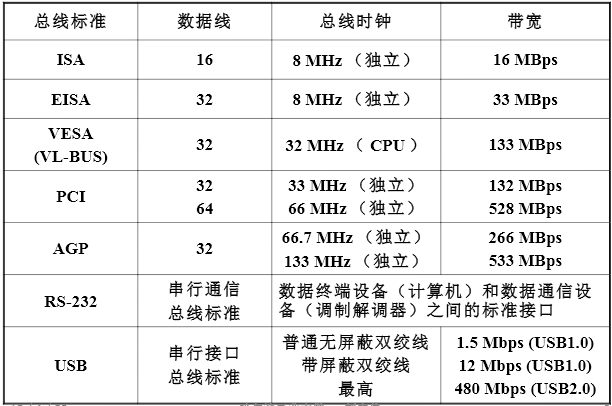

- ISA：Industry Standard Architecture，工业标准体系结构，又称AT总线
- EISA：Extended Industry Standard Architecture，扩展工业标准体系结构
- STD：STD总线于1987年被国际电子电气工程师协会（IEEE）列为标准（IEEE961标准）
    - 主要用于以微处理器为中心的工业控制领域。
- PCI：Peripheral Component Interconnect，外部设备互连总线。
    - 与ISA、EISA均可兼容
    - 支持即插即用、支持多层结构
- AGP：Accelerated Graphics Port，加速图形接口
    - 专为提高视频带宽而设计的总线规范。采用点对点连接，连接控制芯片组和AGP显示卡
    - 因此严格说AGP不能称为总线，而是一种接口标准
- SCSI：Small Computer System Interface，小型计算机系统接口
    - 主要用于光驱、音频设备、扫描仪、打印机以及像硬盘驱动器这样的大容量存储设备等的连接，是一种直接连接外设的并行I/O总线。
- USB：Universal Serial Bus，通用串行总线
    - 是一种连接外围设备的I/O总线，具有即插即用、热拔插等优良特点。

# 总线结构

## 单总线模式

## 双总线结构

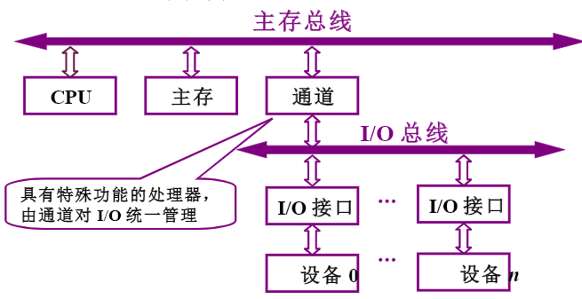

## 三总线结构

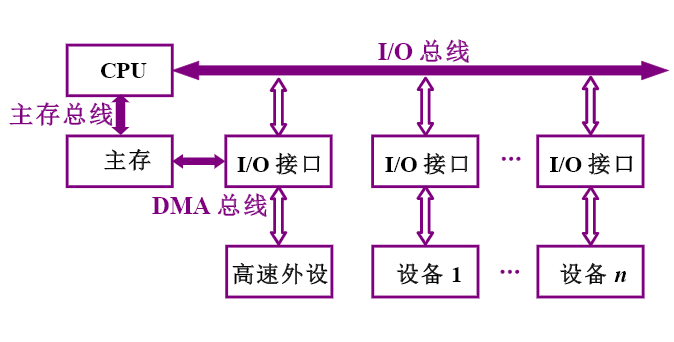
- 增加DMA总线（直接存储器访问），高速IO设备通过DMA与主存直接访问。

## 三总线结构的另一形式

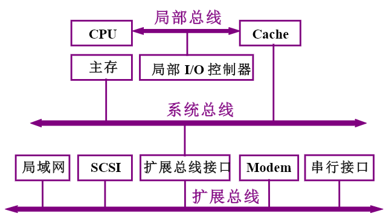
- 由于CPU的快速发展，内存速度远小于CPU的速度，因此增加了Cache，CPU通过Cache与主存打交道，新增了局部总线，用于CPU和Cache之间的信息传输。

## 四总线结构

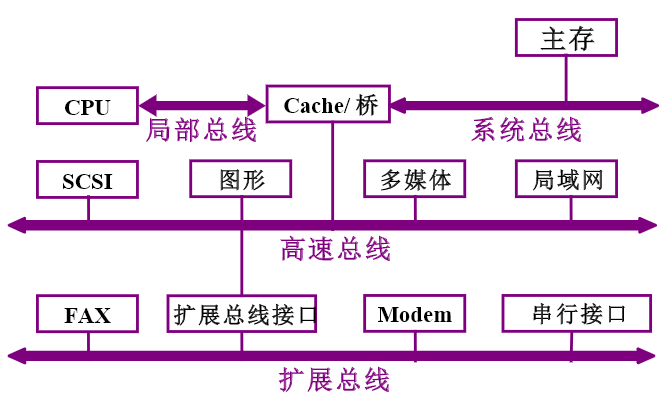
- 增加了高速总线，将高速设备和低速设备分开，提高数据的传输速率。

# 总线控制

## 总线判优控制

- 基本概念
    - 主设备（模块）：对总线有控制权
    - 从设备（模块）：响应从主设备发来的总线命令
- 判优方式
    - 集中式
        - 将控制逻辑集中在一处—总线仲裁器（arbitrator）
        - 链式查询
        - 计数器定时查询
        - 独立请求方式
    - 分布式
        - 将控制逻辑分散在与总线连接的各个部件或设备上，由各个节点竞争使用权（network）

### 链式查询

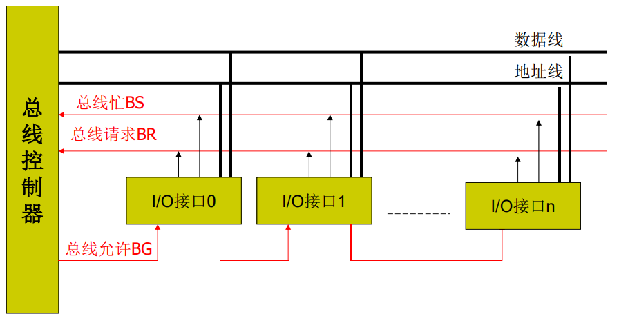
- 流程
    - 所有的I/O接口都接到BR总线上，每当有一个I/O接口要提出使用总线时，会通过BR向总线控制部件发送请求（上图是接口1和接口n发出了请求）
    - 控制部件接收到请求后，由于不知道是谁发出的请求（这里仅知道有接口发出了请求，但不知道是哪一个设备发出的），这里就需要用到BG
    - BG以链式把I/O接口都串在一起，依次查询是哪个接口发出的请求，查询时先经过了接口1，因此接口1获得权限，接着接口1通过BS线设置总线忙。这样接口1就获得了总线的使用权限。
- 主要特点
    - 越靠近控制器的模块，优先级越高
    - 链形优先级存在传播延迟，这种延迟与模块数成正比，所以判优速度较慢，一般只接少量几个模块；
    - 链形结构，一个故障，链失效；
    - 结构较简单，造价较低。

### 计数器定时查询

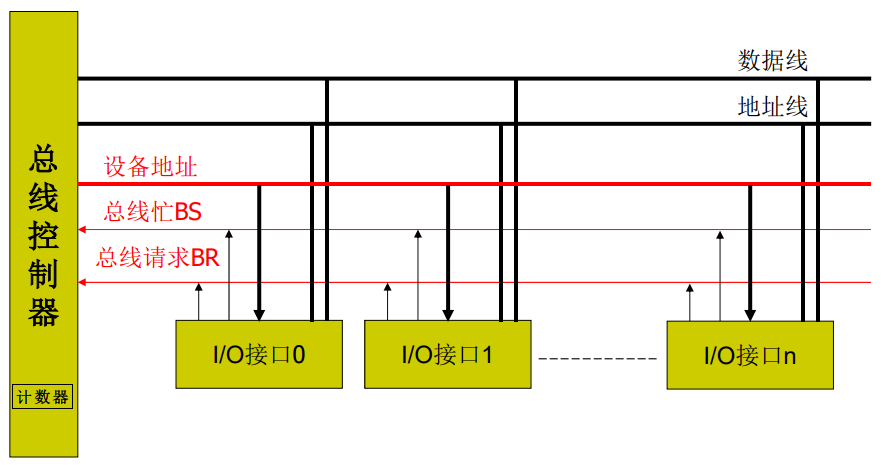
- 特点
    - 与链式查询相比，少了一条BG，多了一条设备地址线，总线控制部件中多了一个计数器
- 流程
    - 假设计数器初始值为0。
    - 当控制部件接收到请求后，通过设备地址线，依次查询初始值对应的接口（由于初始值为0，因此这里先查询接口0）
    - 如果该设备没有发出请求，则计数器加1，继续往后面请求。
- 主要特点
    - 计数方式与优先次序直接相关。
        - 计数可以从“0”开始，此时设备的优先次序是固定的；
        - 计数也可以从终止点开始，即是一种循环方法，此时设备使用总线的优先级相等；
        - 计数的初始值还可由程序设置，故优先次序可以改变。
    - 对电路故障不如链式查询方式敏感，但增加了主控制线（设备地址），控制也较复杂

### 独立请求方式

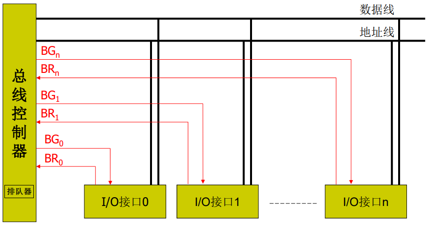
- 特点：
    - 每个接口多了两条BR线和BG线和总线控制部件相连，总线控制部件中有个用来确定优先级的排队器。
- 流程
    - 当有接口需要请求控制权限时，通过BR线发出请求
    - 排队器通过优先级的比对，然后通过BG线授予接口权限。

- 工作原理
    - 每个模块有一组独立的“总线请求”和“总线允许”信号线，每对信号线有其相应的优先级；
    - 控制器中有一个优先级编码器和优先级译码器，用以选择优先级最高的请求，并产生出相应的“总线允许”信号；
    - 当“总线忙”信号有效时，表示有的模块正在使用总线，信号有效时，表示有的模块正在使用总线，因此请求使用总线的模块必须等待；直至“总线忙”信号变为无效时，所有需要使用总线的模块都可以发出“总线请求”信号，总线仲裁器仅向优先级最高的模块发出“总线允许”信号。
- 主要特点
    - 判优速度快，且与模块数无关；
    - 所需“请求线”和“允许线”较多，N个模块需要2N条。

### 分布式控制

将总线控制逻辑分布在连接到总线的各个部件中
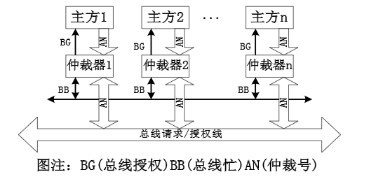

## 总线通信控制

目的：申请分配阶段：解决通信双方协调配合问题

### 总线传输周期

- 主模块申请，总线仲裁决定主模块向从模块
- 寻址阶段：给出地址和命令
- 传数阶段：主模块和从模块交换数据
- 结束阶段：主模块撤消有关信息

### 总线通信方式

同步控制：同步、异步、半同步、分离式

#### 同步通信

- 通信双方由统一时标控制数据传送称为同步通信。
    - 时标通常由CPU的总线控制部件发出，送到总线上的所有部件；
    - 也可以由每个部件各自的时序发生器发出，但是必须有总线控制部件发出的时钟信号对它们进行同步。
- 对于读命令,其传输周期为
    - $T_1$：主模块发地址
    - $T_2$：主模块发读命令
    - $T_3$：从模块提供数据
    - $T_4$：主模块撤销读命令
    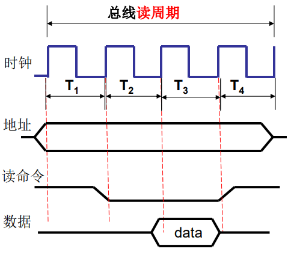
- 对于写命令，其传输周期为
    - $T_1$：主模块发地址
    - $T_2$：主模块提供数据
    - $T_3$：主模块发写命令，从模块必须在规定时间内将数据写入地址总线所指明的单元中
    - $T_4$：主模块撤销写命令和数据等信号
    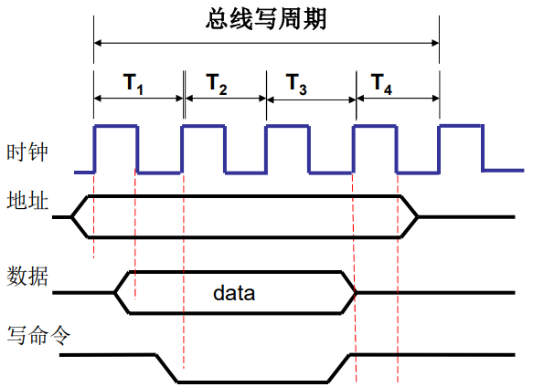

#### 异步通信

- 特点
    - 异步通信方式克服了同步通信的缺点，允许各模块速度的不一致性，给设计者充分的灵活性和选择余地。
    - 异步通信方式没有公共的时钟标准，而是采用应答方式（又称握手方式）：主设备发Request，从设备响应Ack；当然，这就要求主从模块之间要增加两条应答线。
- 异步通信方式分为三种类型
    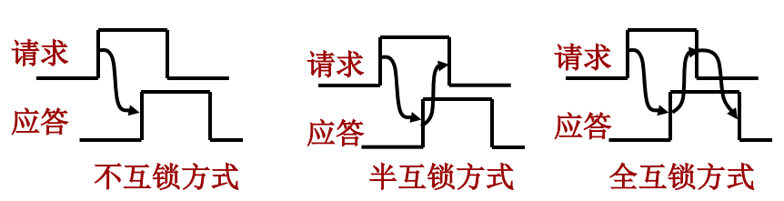
    - 不互锁方式
        - 主设备发Request后，间隔固定时间，认为从设备已经收到；从设备发ACK后，间隔固定时间，认为主设备也收到。
    - 半互锁方式
        - 主设备发Request后，等待ACK；从设备发ACK后，不等待主设备。
    - 全互锁方式
        - 主从设备相互等待ACK

#### 半同步通信

- 特点
    - 半同步通信方式集同步与异步通信之优点，适用于系统工作速度不高，但又包含了许多工作速度差异较大的各类设备的简单系统。
    - 半同步通信控制方式比异步通信简单，可靠性较高。
    - 半同步通信方式的缺点是对系统时钟频率不能要求太高，故从整体上看，系统工作的速度还是不高。
- 以读命令为例，半同步通信时序为
    - $T_1$：主模块发地址
    - $T_2$：主模块发读命令
    - $T_W$：当WAIT信号为低电平时有效，等待，其时间间隔与T统一
    - ……
    - $T_3$：从模块提供数据
    - $T_4$：主模块撤销读命令
    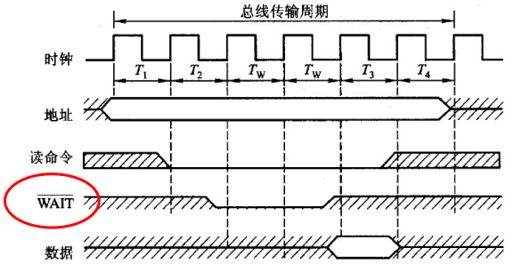

#### 分离式通信

- 在同步通信、异步通信和半同步通信的整个传输过程中，系统总线的使用权完全由占有使用权的主设备以及由它选中的从设备占据
    - 主模块发送地址、命令 —— 总线忙碌
    - 从模块准备数据 —— 总线空闲
    - 从模块向主模块发送数据 —— 总线忙碌
- 基本思想
    - 将一个传输周期（或总线周期）分解为两个子周期。
    - 在第一个子周期中，主模块A获得总线使用权后将命令、地址、A模块的编号等其他信息发到系统总线上，经总线传输后，由有关的从模块B接收下来。
    - 在第二个子周期中，当B模块接收到A模块发来的有关命令信号后，经过一序列内部操作，将A模块所需的数据准备好，然后由B模块申请总线使用权，一旦获准，B模块将A模块的编号、B模块的地址、A模块所需数据等信息送到总线上，供A模块接收。
- 特点
    - 各模块均有权提出总线占用申请。
    - 各模块欲占用总线使用权都必须提出申请。
    - 在得到总线使用权后，主模块在先规定的时间内向对方传送信息，采用同步方式传送，不再等待对方的回答信号。
    - 各模块在准备数据传送的过程中都不占用总线，使总线可接受其他模块的请求。
    - 总线在被占用时都在作有效工作。

### 总线数据传输方式（物理层）

- 单字节传输方式
    - 在一个传输周期内，一般是先给出地址，然后给出数据。在后面传输周期里，不断重复这种先送地址、后送数据的方式进行传输。
- 突发传输方式（burstmode）
    - 在传输大批量地址连续的数据时，除了第一个周期先送首地址、后给出数据外，以后的传输周期内，不需要再送地址（地址自动加一）而直接送数据，从而达到快速传送数据的目的。