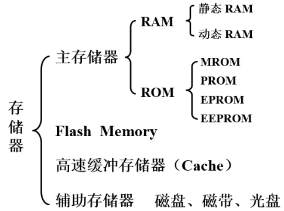
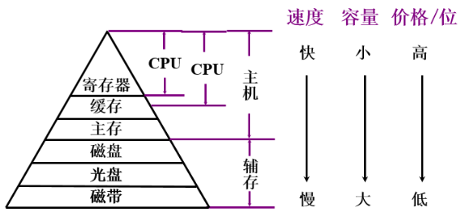
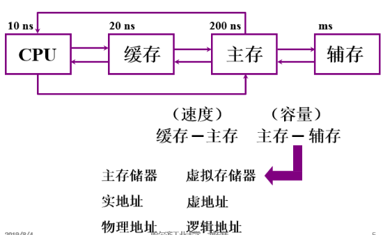
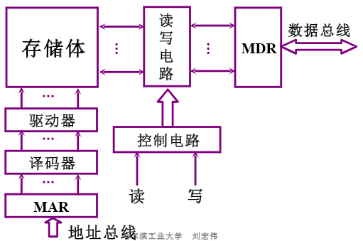

- [概述](#概述)
  - [存储器分类](#存储器分类)
  - [存储器层次结构](#存储器层次结构)
- [主存储器](#主存储器)
  - [概述](#概述-1)
- [高速缓冲存储器](#高速缓冲存储器)
- [辅助存储器](#辅助存储器)

# 概述

存储器：是计算机系统中的记忆设备，用来存放程序和数据。

## 存储器分类

- 按存储介质分类
    - 半导体存储器（易失）
        - 存储元件由半异体器件组成的存储器
        - TTL、MOS
    - 磁表面存储器（非易失）
        - 在金属或塑料基体的表面上涂一层磁性材料作为记录介质
        - 工作时磁层随载磁体高速运转，用磁头在磁层上进行读/写操作
    - 磁芯存储器（非易失）
        - 由硬磁材料做成的环状元件，在磁芯中穿有驱动线（通电流）和读出线
    - 光盘存储器（非易失）
        - 应用激光在记录介质（磁光材料）上进行读/写的存储器，具有非易失性的特点
- 按存取方式分类
    - 存取时间与物理地址无关（随机访问）
        - 随机存储器（RAM）
            - 一种可读/写存储器，其特点是存储器的任何一个存储单元的内容都可以随机存取
            - 存取时问与存储单元的物理位置无关。
        - 只读存储器（ROM）
            - 能对其存储的内容读出，而不能对其重新写人的存储器。
    - 存取时间与物理地址有关（串行访问）
        - 对存储单元进行读/写操作时，需按其物理位置的先后顺序寻找地址
        - 顺序存取存储：磁带
        - 直接存取存储：磁盘
- 按在计算机中的作用分类

## 存储器层次结构

- 存储器三个主要特征的关系

- 缓存-主存、主存、辅存层次

# 主存储器

## 概述

- 主存储器的基本构成

# 高速缓冲存储器

# 辅助存储器