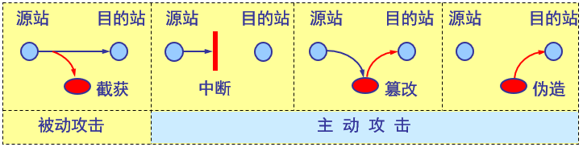
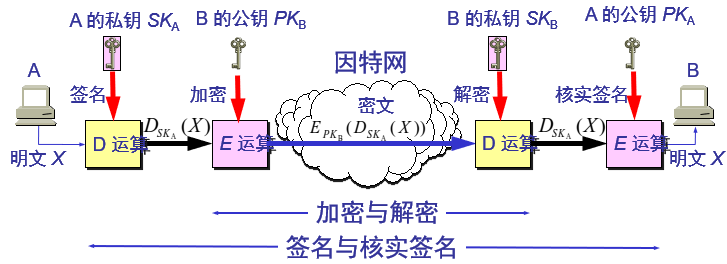
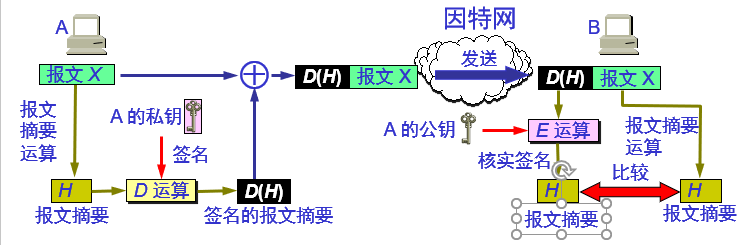
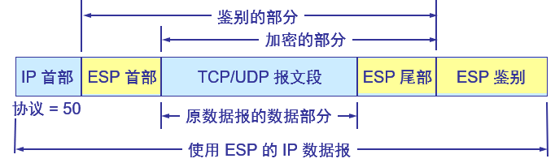
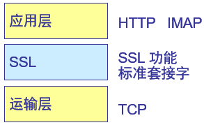
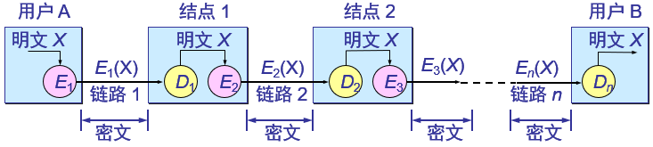
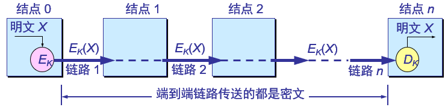
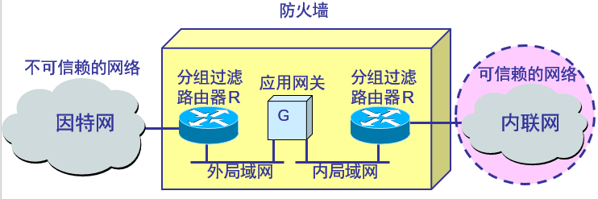

# 安全

## 计算机网络面临的安全性威胁

计算机网络上的通信面临以下的四种威胁：

- 截获：从网络上窃听他人的通信内容。
- 中断：有意中断他人在网络上的通信。
- 篡改：故意篡改网络上传送的报文。
- 伪造：伪造信息在网络上传送。

## 主动攻击和被动攻击

- 截获信息的攻击称为被动攻击，而更改信息和拒绝用户使用资源的攻击称为主动攻击。在被动攻击中，攻击者只是观察和分析某一个协议数据单元PDU而不干扰信息流。
- 主动攻击是指攻击者对某个连接中通过的PDU进行各种处理。
  - 更改报文流
  - 拒绝报文服务
  - 伪造连接初始化

## 计算机网络通信安全的目标

- 防止析出报文内容；
- 防止通信量分析；
- 检测更改报文流；
- 检测拒绝报文服务；
- 检测伪造初始化连接。

## 恶意程序（rogue program）

- 计算机病毒：会“传染”其他程序的程序，“传染”是通过修改其他程序来把自身或其变种复制进去完成的。
- 计算机蠕虫：通过网络的通信功能将自身从一个结点发送到另一个结点并启动运行的程序。
- 特洛伊木马：一种程序，它执行的功能超出所声称的功能。
- 逻辑炸弹：一种当运行环境满足某种特定条件时执行其他特殊功能的程序。

## 计算机网络安全的内容

- 保密性
- 安全协议的设计
- 访问控制

## 密码学

- **密码编码学**（cryptography）：是密码体制的设计学
- **密码分析学**（cryptanalysis）：是在未知密钥的情况下从密文推演出明文或密钥的技术。
- 密码编码学与密码分析学合起来即为**密码学**（cryptology）。
- 如果不论截取者获得了多少密文，但在密文中都没有足够的信息来唯一地确定出对应的明文，则这一密码体制称为**无条件安全的**，或称为**理论上是不可破的**。
- 如果密码体制中的密码不能被可使用的计算资源破译，则这一密码体制称为**在计算上是安全的**。

### 对称密钥系统

所谓常规密钥密码体制，即加密密钥与解密密钥是相同的密码体制。这种加密系统又称为对称密钥系统。

#### 数据加密标准DES

数据加密标准DES属于常规密钥密码体制，是一种分组密码。

- 在加密前，先对整个明文进行分组。每一个组长为64位。
- 然后对每一个64位二进制数据进行加密处理，产生一组64位密文数据。
- 最后将各组密文串接起来，即得出整个的密文。
- 使用的密钥为64位（实际密钥长度为56位，有8位用于奇偶校验）。

DES的保密性：

- DES的保密性仅取决于对密钥的保密，而算法是公开的。尽管人们在破译DES方面取得了许多进展，但至今仍未能找到比穷举搜索密钥更有效的方法。
- DES是世界上第一个公认的实用密码算法标准，它曾对密码学的发展做出了重大贡献。
- 目前较为严重的问题是DES的密钥的长度。
- 现在已经设计出来搜索DES密钥的专用芯片。

### 公钥密码体制

公钥密码体制使用不同的加密密钥与解密密钥，是一种“由已知加密密钥推导出解密密钥在计算上是不可行的”密码体制。公钥密码体制的产生主要是因为两个方面的原因，一是由于常规密钥密码体制的密钥分配问题，一是由于对数字签名的需求。

现有最著名的公钥密码体制是RSA体制，它基于数论中大数分解问题的体制，由美国三位科学家Rivest, Shamir和Adleman于1976年提出并在1978年正式发表的。

#### 加密密钥与解密密钥

在公钥密码体制中：

- 加密密钥（即公钥）PK是公开信息，而解密密钥（即私钥或秘钥）SK是需要保密的。
- 加密算法E和解密算法D也都是公开的。
- 虽然秘钥SK是由公钥PK决定的，但却不能根据PK计算出SK。

应当注意：

- 任何加密方法的安全性取决于密钥的长度，以及攻破密文所需的计算量。在这方面，公钥密码体制并不具有比传统加密体制更加优越之处。
- 由于目前公钥加密算法的开销较大，在可见的将来还看不出来要放弃传统的加密方法。公钥还需要密钥分配协议，具体的分配过程并不比采用传统加密方法时更简单。

#### 公钥算法的特点

- 发送者A用B的公钥$PK_B$对明文$X$加密（E运算）后，在接收者B用自己的私钥$SK_B$解密（$D$运算），即可恢复出明文：$D_{SK_B}(Y)= D_{SK_B}(E_{PK_B}(X))= X$
- 解密密钥是接收者专用的秘钥，对其他人都保密。
- 加密密钥是公开的，但不能用它来解密，即：$D_{PK_B}(E_{PK_B}(X))= X$
- 加密和解密的运算可以对调，即：$E_{PK_B}(D_{SK_B}(X))= D_{SK_B}(E_{PK_B}(X))= X$
- 在计算机上可容易地产生成对的$PK$和$SK$。
- 从已知的$PK$实际上不可能推导出$SK$，即从$PK$到$SK$是“计算上不可能的”。
- 加密和解密算法都是公开的

### 数字签名

#### 数字签名必须保证以下三点

- 报文鉴别——接收者能够核实发送者对报文的签名；
- 报文的完整性——发送者事后不能抵赖对报文的签名；
- 不可否认——接收者不能伪造对报文的签名。

#### 数字签名的实现

现在已有多种实现各种数字签名的方法。但采用公钥算法更容易实现。

- 因为除A外没有别人能具有A的私钥，所以除A外没有别人能产生这个密文。因此B相信报文X是A签名发送的。
- 若A要抵赖曾发送报文给B，B可将明文和对应的密文出示给第三者。第三者很容易用A的公钥去证实A确实发送X给B。
- 反之，若B将X伪造成X'，则B不能在第三者前出示对应的密文。这样就证明了B伪造了报文。

#### 具有保密性的数字签名

### 鉴别

在信息的安全领域中，**对付被动攻击的重要措施是加密，而对付主动攻击中的篡改和伪造则要用鉴别**（authentication）。

报文鉴别使得通信的接收方能够验证所收到的报文（发送者和报文内容、发送时间、序列等）的真伪。使用加密就可达到报文鉴别的目的。但在网络的应用中，许多报文并不需要加密。应当使接收者能用很简单的方法鉴别报文的真伪。

鉴别与授权不同。授权涉及到的问题是，所进行的过程是否被允许（如是否可以对某文件进行读或写）。

注意：

- 许多报文并不需要加密但却需要数字签名，以便让报文的接收者能够鉴别报文的真伪。
- 然而对很长的报文进行数字签名会使计算机增加很大的负担（需要进行很长时间的运算Z）。
- 当我们传送不需要加密的报文时，应当使接收者能用很简单的方法鉴别报文的真伪。

#### 报文摘要MD（Message Digest）

A将报文X经过报文摘要算法运算后得出很短的报文摘要$H$。然后然后用自己的私钥对$H$进行$D$运算，即进行数字签名。得出已签名的报文摘要$D(H)$后，并将其追加在报文X后面发送给B。

B收到报文后首先把已签名的$D(H)$和报文X分离。然后再做两件事。

- 用A的公钥对$D(H)$进行$E$运算，得出报文摘要$H$。
- 对报文X进行报文摘要运算，看是否能够得出同样的报文摘要$H$。如一样，就能以极高的概率断定收到的报文是A产生的。否则就不是。

#### 报文摘要的优点

- 仅对短得多的定长报文摘$H$要进行数字签名要比对整个长报文进行数字签名要简单得多，所耗费的计算资源也小得多。
- 但对鉴别报文X来说，效果是一样的。也就是说，报文X和已签名的报文摘要$(H)$合在一起是不可伪造的，是可检验的和不可否认的。

#### 报文摘要算法

- 报文摘要算法就是一种**散列函数**。这种散列函数也叫做密码编码的检验和。报文摘要算法是防止报文被人恶意篡改。
- 报文摘要算法是精心选择的一种单向函数。
- 可以很容易地计算出一个长报文X的报文摘要$H$，但要想从报文摘要$H$反过来找到原始的报文X，则实际上是不可能的。
- 若想找到任意两个报文，使得它们具有相同的报文摘要，那么实际上也是不可能的。

#### 报文摘要的实现

#### 实体鉴别

- 实体鉴别和报文鉴别不同。
- 报文鉴别是对每一个收到的报文都要鉴别报文的发送者
- 实体鉴别是在系统接入的全部持续时间内对和自己通信的对方实体只需验证一次。

### 秘钥分配

#### 秘钥管理

- 产生
- 分配
- 注入
- 验证
- 使用

#### 密钥分配

- 是密钥管理中最大的问题。密钥必须通过最安全的通路进行分配。
- 目前常用的密钥分配方式是设立密钥分配中心KDC（Key Distribution Center），通过KDC来分配密钥。

#### 对称密钥的分配

- 目前常用的密钥分配方式是设立密钥分配中心KDC（Key Distribution Center）。
- KDC是大家都信任的机构，其任务就是给需要进行秘密通信的用户临时分配一个会话密钥（仅使用一次）。
- 用户A和B都是KDC的登记用户，并已经在KDC的服务器上安装了各自和KDC进行通信的主密钥（master key）KA和KB。“主密钥”可简称为“密钥”。

#### 公钥的分配

- 需要有一个值得信赖的机构——即**认证中心CA**（Certification Authority），来将公钥与其对应的实体（人或机器）进行绑定（binding）。
- 认证中心一般由政府出资建立。每个实体都有CA发来的证书（certificate），里面有公钥及其拥有者的标识信息。此证书被CA进行了数字签名。任何用户都可从可信的地方获得认证中心CA的公钥，此公钥用来验证某个公钥是否为某个实体所拥有。有的大公司也提供认证中心服务。

## 因特网使用的安全协议

### 网络层安全协议IPsec

网络层保密是指所有在IP数据报中的数据都是加密的。

#### IPsec中最主要的两个部分

- 鉴别首部AH（Authentication Header）：AH鉴别源点和检查数据完整性，但不能保密。
- 封装安全有效载荷ESP（Encapsulation Security Payload）：ESP比AH复杂得多，它鉴别源点、检查数据完整性和提供保密。

#### 安全关联SA（Security Association）

在使用AH或ESP之前，先要从源主机到目的主机建立一条网络层的逻辑连接。此逻辑连接叫做安全关联SA。

安全关联的特点：

- 安全关联是一个单向连接。它由一个三元组唯一地确定，包括：
  - 安全协议（使用AH或ESP）的标识符
  - 此单向连接的源IP地址
  - 一个32位的连接标识符，称为安全参数索引SPI（Security Parameter Index）
- 对于一个给定的安全关联SA，每一个IPsec数据报都有一个存放SPI的字段。通过此SA的所有数据报都使用同样的SPI值。

#### 鉴别首部协议AH

在使用鉴别首部协议AH时，把AH首部插在原数据报数据部分的前面，同时把IP首部中的协议字段置为51。在传输过程中，中间的路由器都不查看AH首部。当数据报到达终点时，目的主机才处理AH字段，以鉴别源点和检查数据报的完整性。

AH首部：

- 下一个首部（8位）。标志紧接着本首部的下一个首部的类型（如TCP或UDP）。
- 有效载荷长度（8位），即鉴别数据字段的长度，以32位为单位。
- 安全参数索引SPI（32位）。标志安全关联。
- 序号（32位）。鉴别数据字段的长度，以32位字为单位。
- 保留（16位）。为今后用。
- 鉴别数据（可变）。为32位字的整数倍，它包含了经数字签名的报文摘要。因此可用来鉴别源主机和检查IP数据报的完整性。

#### 封装安全有效载荷ESP

使用ESP时，IP数据报首部的协议字段置为50。当IP首部检查到协议字段是50时，就知道在IP首部后面紧接着的是ESP首部，同时在原IP数据报后面增加了两个字段，即ESP尾部和ESP数据。

在ESP首部中有标识一个安全关联的安全参数索引SPI（32位），和序号（32位）。

### 运输层安全协议

#### 安全套接层SSL

SSL是安全套接层（Secure Socket Layer），可对万维网客户与服务器之间传送的数据进行加密和鉴别。

SSL在双方的联络阶段协商将使用的加密算法和密钥，以及客户与服务器之间的鉴别。在联络阶段完成之后，所有传送的数据都使用在联络阶段商定的会话密钥。

SSL不仅被所有常用的浏览器和万维网服务器所支持，而且也是运输层安全协议TLS（Transport Layer Security）的基础。

SSL的位置：

SSL提供以下三个功能：

- SSL服务器鉴别：允许用户证实服务器的身份。具有SSL功能的浏览器维持一个表，上面有一些可信赖的认证中心CA（Certificate Authority）和它们的公钥。
- 加密的SSL会话：客户和服务器交互的所有数据都在发送方加密，在接收方解密。
- SSL客户鉴别：允许服务器证实客户的身份。

#### 安全电子交易SET（Secure Electronic Transaction）

安全电子交易SET是专为在因特网上进行安全支付卡交易的协议。

SET的主要特点是：

- SET是专为与支付有关的报文进行加密的。
- SET协议涉及到三方，即顾客、商家和商业银行。所有在这三方之间交互的敏感信息都被加密。
- SET要求这三方都有证书。在SET交易中，商家看不见顾客传送给商业银行的信用卡号码

#### PGP（Pretty Good Privacy）

- PGP是一个完整的电子邮件安全软件包，包括加密、鉴别、电子签名和压缩等技术。
- PGP并没有使用什么新的概念，它只是将现有的一些算法如MD5，RSA，以及IDEA等综合在一起而已。
- 虽然PGP已被广泛使用，但PGP并不是因特网的正式标准。

#### PEM（Privacy Enhanced Mail）

PEM是因特网的邮件加密建议标准，由四个RFC文档来描述：

- RFC 1421：报文加密与鉴别过程
- RFC 1422：基于证书的密钥管理
- RFC 1423：PEM的算法、工作方式和 标识符
- RFC 1424：密钥证书和相关的服务

PEM的主要特点：

- PEM的功能和PGP的差不多，都是对基于RFC 822的电子邮件进行加密和鉴别。
- PEM有比PGP更加完善的密钥管理机制。由认证中心发布证书，上面有用户姓名、公钥以及密钥的使用期限。每个证书有一个唯一的序号。证书还包括用认证中心秘钥签了名的MD5散列函数。

### 链路加密与端到端加密

#### 链路加密

在采用链路加密的网络中，每条通信链路上的加密是独立实现的。通常对每条链路使用不同的加密密钥。

相邻结点之间具有相同的密钥，因而密钥管理易于实现。链路加密对用户来说是透明的，因为加密的功能是由通信子网提供的。

特点：

- 由于报文是以明文形式在各结点内加密的，所以结点本身必须是安全的。
- 所有的中间结点（包括可能经过的路由器）未必都是安全的。因此必须采取有效措施。
- 链路加密的最大缺点是在中间结点暴露了信息的内容。
- 在网络互连的情况下，仅采用链路加密是不能实现通信安全的。

#### 端到端加密

端到端加密是在源结点和目的结点中对传送的PDU进行加密和解密，报文的安全性不会因中间结点的不可靠而受到影响。

在端到端加密的情况下，PDU的控制信息部分（如源结点地址、目的结点地址、路由信息等）不能被加密，否则中间结点就不能正确选择路由。

#### 防火墙（firewall）

防火墙是由软件、硬件构成的系统，是一种特殊编程的路由器，用来在两个网络之间实施接入控制策略。接入控制策略是由使用防火墙的单位自行制订的，为的是可以最适合本单位的需要。

防火墙内的网络称为“可信赖的网络”（trusted network），而将外部的因特网称为“不可信赖的网络”（untrusted network）。

防火墙可用来解决内联网和外联网的安全问题。

防火墙在互连网络中的位置：

防火墙的功能:

- 防火墙的功能有两个：阻止和允许。
- “阻止”就是阻止某种类型的通信量通过防火墙（从外部网络到内部网络，或反过来）。
- “允许”的功能与“阻止”恰好相反。
- 防火墙必须能够识别通信量的各种类型。不过在大多数情况下防火墙的主要功能是“阻止”。

防火墙技术一般分为两类：

- 网络级防火墙——用来防止整个网络出现外来非法的入侵。属于这类的有分组过滤和授权服务器。前者检查所有流入本网络的信息，然后拒绝不符合事先制订好的一套准则的数据，而后者则是检查用户的登录是否合法。
- 应用级防火墙——从应用程序来进行接入控制。通常使用应用网关或代理服务器来区分各种应用。例如，可以只允许通过访问万维网的应用，而阻止FTP应用的通过。
