# 应用层

## 常见应用层协议

|       应用       | 应用层协议 | 端口号  | 传输层协议 |            备注             |
| :--------------: | :--------: | :-----: | :--------: | :-------------------------: |
|     域名解析     |    DNS     |   53    |  UDP/TCP   | 长度超过512字节时使用TCP |
| 动态主机配置协议 |    DHCP    |  67/68  |    UDP     |                             |
| 简单网络管理协议 |    SNMP    | 161/162 |    UDP     |                             |
|   文件传送协议   |    FTP     |  20/21  |    TCP     |  控制连接21，数据连接20   |
|   远程终端协议   |   TELNET   |   23    |    TCP     |                             |
|  超文本传送协议  |    HTTP    |   80    |    TCP     |                             |
| 简单邮件传送协议 |    SMTP    |   25    |    TCP     |                             |
|   邮件读取协议   |    POP3    |   110   |    TCP     |                             |
| 网际报文存取协议 |    IMAP    |   143   |    TCP     |                             |

## 应用层协议的特点

每个应用层协议都是为了解决某一类应用问题，而问题的解决又往往是通过位于不同主机中的多个应用进程之间的通信和协同工作来完成的。应用层的具体内容就是规定应用进程在通信时所遵循的协议。

应用层的许多协议都是基于客户服务器方式。客户（client）和服务器（server）都是指通信中所涉及的两个应用进程。客户服务器方式所描述的是进程之间服务和被服务的关系。客户是服务请求方，服务器是服务提供方。

## DNS

许多应用层软件经常直接使用域名系统DNS（Domain Name System），但计算机的用户只是间接而不是直接使用域名系统。

因特网采用**层次结构的命名树**作为主机的名字，并使用**分布式**的域名系统DNS。

名字到IP地址的解析是由若干个域名服务器程序完成的。域名服务器程序在专设的结点上运行，运行该程序的机器称为域名服务器。

### 域名

#### 因特网的域名结构

- 因特网采用了层次树状结构的命名方法。
- 任何一个连接在因特网上的主机或路由器，都有一个唯一的层次结构的名字，即域名。
- 域名的结构由标号序列组成，各标号之间用点隔开：xxx.三级域名.二级域名.顶级域名

#### 域名只是逻辑概念

- 域名只是个逻辑概念，并不代表计算机所在的物理地点。
- 变长的域名和使用有助记忆的字符串，是为了便于人来使用。而IP地址是定长的32位二进制数字则非常便于机器进行处理。
- 域名中的“点”和点分十进制IP地址中的“点”并无一一对应的关系。点分十进制IP地址中一定是包含三个“点”，但每一个域名中“点”的数目则不一定正好是三个。

#### 因特网的域名空间

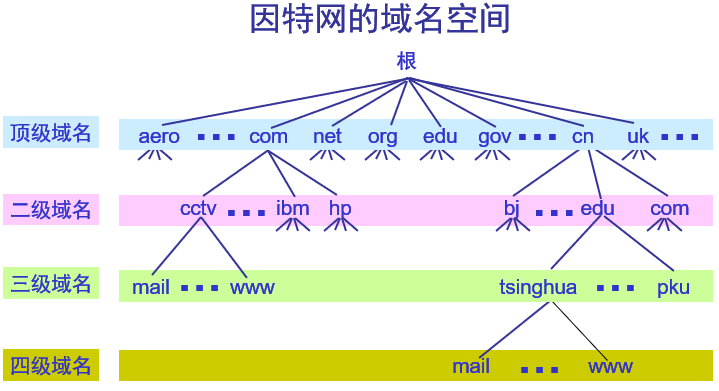

#### 顶级域名TLD（Top Level Domain）

- 国家顶级域名nTLD：如：.cn表示中国，.us表示美国，.uk表示英国，等等。
- 通用顶级域名gTLD：最早的顶级域名是：
  - .com：公司和企业
  - .net：网络服务机构
  - .org：非营利性组织
  - .edu：美国专用的教育机构
  - .gov：美国专用的政府部门
  - .mil：美国专用的军事部门
  - .int：国际组织
- 基础结构域名（infrastructure domain）：这种顶级域名只有一个，即.arpa，用于反向域名解析，因此又称为反向域名。

### 域名服务器

#### 区（Zone）

一个服务器所负责管辖的（或有权限的）范围叫做区。各单位根据具体情况来划分自己管辖范围的区。但在一个区中的所有节点必须是能够连通的。每一个区设置相应的权限域名服务器，用来保存该区中的所有主机的域名到IP地址的映射。

DNS服务器的管辖范围不是以“域”为单位，而是以“区”为单位。

#### 树状结构的DNS域名服务器

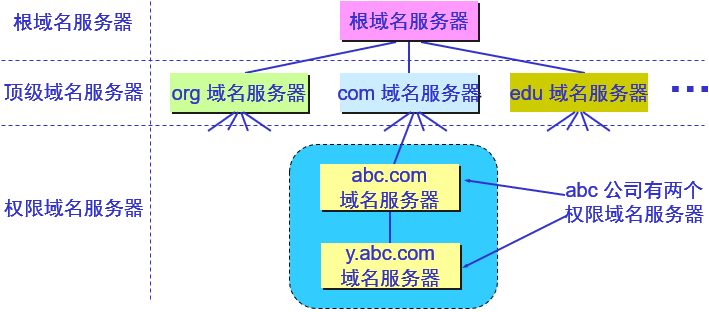

#### 域名服务器分类

根域名服务器：

- 根域名服务器是最重要的域名服务器。所有的根域名服务器都知道所有的顶级域名服务器的域名和IP地址。
- 不管是哪一个本地域名服务器，若要对因特网上任何一个域名进行解析，只要自己无法解析，就首先求助于根域名服务器。
- 在因特网上共有13个不同IP地址的根域名服务器，它们的名字是用一个英文字母命名，从a一直到m（a.rootservers.net...）。
- 根域名服务器共有13套装置（不是13个机器）。
- 到2006年底全世界已经安装了一百多个根域名服务器机器，分布在世界各地。
- 这样做的目的是为了方便用户，使世界上大部分DNS域名服务器都能就近找到一个根域名服务器。
- 根域名服务器并不直接把域名直接转换成IP地址。在使用迭代查询时，根域名服务器把下一步应当找的顶级域名服务器的IP地址告诉本地域名服务器。

顶级域名服务器：

- 这些域名服务器负责管理在该顶级域名服务器注册的所有二级域名。
- 当收到DNS查询请求时，就给出相应的回答（可能是最后的结果，也可能是下一步应当找的域名服务器的IP地址）

权限域名服务器：

- 这就是前面已经讲过的负责一个区的域名服务器。
- 当一个权限域名服务器还不能给出最后的查询回答时，就会告诉发出查询请求的DNS客户，下一步应当找哪一个权限域名服务器。

本地域名服务器：

- 本地域名服务器对域名系统非常重要。
- 当一个主机发出DNS查询请求时，这个查询请求报文就发送给本地域名服务器。
- 每一个因特网服务提供者ISP，或一个大学，甚至一个大学里的系，都可以拥有一个本地域名服务器，
- 这种域名服务器有时也称为默认域名服务器。

#### 提高域名服务器的可靠性

- DNS域名服务器都把数据复制到几个域名服务器来保存，其中的一个是主域名服务器，其他的是辅助域名服务器。
- 当主域名服务器出故障时，辅助域名服务器可以保证DNS的查询工作不会中断。
- 主域名服务器定期把数据复制到辅助域名服务器中，而更改数据只能在主域名服务器中进行。这样就保证了数据的一致性。

### 域名的解析过程

主机向本地域名服务器的查询一般都是采用**递归查询**。如果主机所询问的本地域名服务器不知道被查询域名的IP地址，那么本地域名服务器就以DNS客户的身份，向其他根域名服务器继续发出查询请求报文。

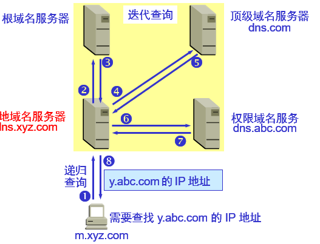

本地域名服务器向根域名服务器的查询通常是采用**迭代查询**。当根域名服务器收到本地域名服务器的迭代查询请求报文时，要么给出所要查询的IP地址，要么告诉本地域名服务器：“你下一步应当向哪一个域名服务器进行查询”。然后让本地域名服务器进行后续的查询。

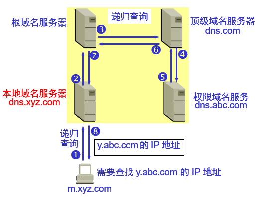

### 域名的高速缓存

每个域名服务器都维护一个高速缓存，存放最近用过的名字以及从何处获得名字映射信息的记录，可大大减轻根域名服务器的负荷，使因特网上的DNS查询请求和回答报文的数量大为减少。

为保持高速缓存中的内容正确，域名服务器应为每项内容设置计时器，并处理超过合理时间的项（例如，每个项目只存放两天）。

当权限域名服务器回答一个查询请求时，在响应中都指明绑定有效存在的时间值。增加此时间值可减少网络开销，而减少此时间值可提高域名转换的准确性。

## FTP

文件传送协议FTP（File Transfer Protocol）是因特网上使用得最广泛的文件传送协议。

- FTP提供交互式的访问，允许客户指明文件的类型与格式，并允许文件具有存取权限。
- FTP屏蔽了各计算机系统的细节，因而适合于在异构网络中任意计算机之间传送文件。

RFC 959很早就成为了因特网的正式标准。

### 网络环境下复制文件的复杂性

网络环境中的一项基本应用就是将文件从一台计算机中复制到另一台可能相距很远的计算机中。初看起来，在两个主机之间传送文件是很简单的事情。其实这往往非常困难。原因是众多的计算机厂商研制出的文件系统多达数百种，且差别很大。

网络环境下复制文件的复杂性：

- 计算机存储数据的格式不同。
- 文件的目录结构和文件命名的规定不同。
- 对于相同的文件存取功能，操作系统使用的命令不同。
- 访问控制方法不同。

### FTP特点

- 文件传送协议FTP只提供文件传送的一些基本的服务，它使用TCP可靠的运输服务。
- FTP的主要功能是减少或消除在不同操作系统下处理文件的不兼容性。
- FTP使用客户服务器方式。一个FTP服务器进程可同时为多个客户进程提供服务。FTP的服务器进程由两大部分组成：一个主进程，负责接受新的请求；另外有若干个从属进程，负责处理单个请求。

### 工作步骤

- 打开熟知端口（端口号为21），使客户进程能够连接上。
- 等待客户进程发出连接请求。
- 启动从属进程来处理客户进程发来的请求。从属进程对客户进程的请求处理完毕后即终止，但从属进程在运行期间根据需要还可能创建其他一些子进程。
- 回到等待状态，继续接受其他客户进程发来的请求。主进程与从属进程的处理是并发地进行。

### 两个连接

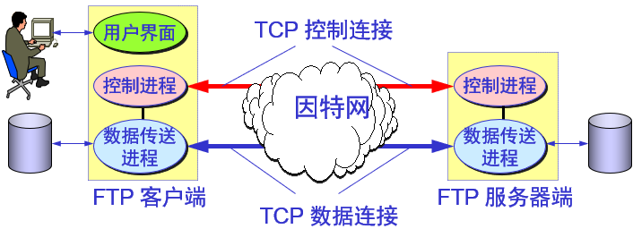

- **控制连接**在整个会话期间一直保持打开，FTP客户发出的传送请求通过控制连接发送给服务器端的控制进程，但控制连接不用来传送文件。
- 实际用于传输文件的是**数据连接**。服务器端的控制进程在接收到FTP客户发送来的文件传输请求后就创建“数据传送进程”和“数据连接”，用来连接客户端和服务器端的数据传送进程。数据传送进程实际完成文件的传送，在传送完毕后关闭“数据传送连接”并结束运行

### 两个不同的端口号

当客户进程向服务器进程发出建立连接请求时，要寻找连接服务器进程的熟知端口（21），同时还要告诉服务器进程自己的另一个端口号码，用于建立数据传送连接。接着，服务器进程用自己传送数据的熟知端口（20）与客户进程所提供的端口号码建立数据传送连接。

使用两个不同端口号的好处：

- 由于FTP使用了两个不同的端口号，所以数据连接与控制连接不会发生混乱。
- 使协议更加简单和更容易实现。
- 在传输文件时还可以利用控制连接（例如，客户发送请求终止传输）。

### NFS（网络文件系统）

- NFS允许应用进程打开一个远地文件，并能在该文件的某一个特定的位置上开始读写数据。
- NFS可使用户只复制一个大文件中的一个很小的片段，而不需要复制整个大文件。
- 对于上述例子，计算机A的NFS客户软件，把要添加的数据和在文件后面写数据的请求一起发送到远地的计算机B的NFS服务器。NFS服务器更新文件后返回应答信息。
- 在网络上传送的只是少量的修改数据。

### TFTP（Trivial File Transfer Protocol，简单文件传送协议）

- TFTP是一个很小且易于实现的文件传送协议。
- TFTP使用客户服务器方式和使用UDP数据报，因此TFTP需要有自己的差错改正措施。
- TFTP只支持文件传输而不支持交互。
- TFTP没有一个庞大的命令集，没有列目录的功能，也不能对用户进行身份鉴别。

#### TFTP的主要特点

- 每次传送的数据PDU中有512字节的数据，但最后一次可不足512字节。
- 数据PDU也称为文件块（block），每个块按序编号，从1开始。
- 支持ASCII码或二进制传送。
- 可对文件进行读或写。
- 使用很简单的首部。
- TFTP的工作很像停止等待协议
  - 发送完一个文件块后就等待对方的确认，确认时应指明所确认的块编号。
  - 发完数据后在规定时间内收不到确认就要重发数据PDU。
  - 发送确认PDU的一方若在规定时间内收不到下一个文件块，也要重发确认PDU。这样就可保证文件的传送不致因某一个数据报的丢失而告失败。

#### 工作流程

1. 在一开始工作时。TFTP客户进程发送一个读请求PDU或写请求PDU给TFTP服务器进程，其熟知端口号码为69。
2. TFTP服务器进程要选择一个新的端口和TFTP客户进程进行通信。
3. 若文件长度恰好为512字节的整数倍，则在文件传送完毕后，还必须在最后发送一个只含首部而无数据的数据PDU。
4. 若文件长度不是512字节的整数倍，则最后传送数据PDU的数据字段一定不满512字节，这正好可作为文件结束的标志。

## TELNET

TELNET是一个简单的远程终端协议，也是因特网的正式标准。用户用TELNET就可在其所在地通过TCP连接注册（即登录）到远地的另一个主机上（使用主机名或IP地址）。

TELNET能将用户的击键传到远地主机，同时也能将远地主机的输出通过TCP连接返回到用户屏幕。这种服务是透明的，因为用户感觉到好像键盘和显示器是直接连在远地主机上。

### 客户服务器方式

现在由于PC机的功能越来越强，用户已较少使用TELNET了。TELNET也使用客户服务器方式。在本地系统运行TELNET客户进程，而在远地主机则运行TELNET服务器进程。和FTP的情况相似，服务器中的主进程等待新的请求，并产生从属进程来处理每一个连接。

### 网络虚拟终端NVT格式

- 客户软件把用户的击键和命令转换成NVT格式，并送交服务器。
- 服务器软件把收到的数据和命令，从NVT格式转换成远地系统所需的格式。
- 向用户返回数据时，服务器把远地系统的格式转换为NVT格式，本地客户再从NVT格式转换到本地系统所需的格式。

## WWW

- 万维网WWW（World Wide Web）并非某种特殊的计算机网络。
- 万维网是一个大规模的、联机式的信息储藏所。
- 万维网用链接的方法能非常方便地从因特网上的一个站点访问另一个站点，从而主动地按需获取丰富的信息。这种访问方式称为“链接”。

### 万维网提供分布式服务

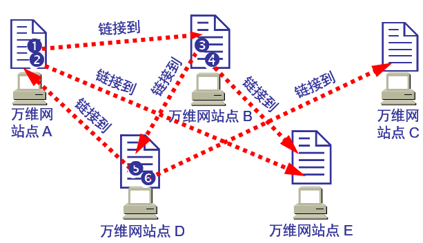

### 超文本和超媒体

万维网是分布式超媒体（hypermedia）系统，它是超文本（hypertext）系统的扩充。

一个超文本由多个信息源链接成。利用一个链接可使用户找到另一个文档。这些文档可以位于世界上任何一个接在因特网上的超文本系统中。超文本是万维网的基础。

超媒体与超文本的区别是文档内容不同。超文本文档仅包含文本信息，而超媒体文档还包含其他表示方式的信息，如图形、图像、声音、动画，甚至活动视频图像。

### 万维网工作方式

- 万维网以客户服务器方式工作。
- 浏览器就是在用户计算机上的万维网客户程序。万维网文档所驻留的计算机则运行服务器程序，因此这个计算机也称为万维网服务器。
- 客户程序向服务器程序发出请求，服务器程序向客户程序送回客户所要的万维网文档。
- 在一个客户程序主窗口上显示出的万维网文档称为页面（page）。

### 万维网必须解决的问题

怎样标志分布在整个因特网上的万维网文档？
> 使用统一资源定位符URL（Uniform Resource Locator）来标志万维网上的各种文档，使每一个文档在整个因特网的范围内具有唯一的标识符URL。

用何协议实现万维网上各种超链的链接？
> 在万维网客户程序与万维网服务器程序之间进行交互所使用的协议，是超文本传送协议HTTP（HyperText Transfer Protocol）。HTTP是一个应用层协议，它使用TCP连接进行可靠的传送。

怎样使各种万维网文档都能在因特网上的各种计算机上显示出来，同时使用户清楚地知道在什么地方存在着超链？
> 超文本标记语言HTML（HyperText Markup Language）使得万维网页面的设计者可以很方便地用一个超链从本页面的某处链接到因特网上的任何一个万维网页面，并且能够在自己的计算机屏幕上将这些页面显示出来

怎样使用户能够很方便地找到所需的信息？
> 为了在万维网上方便地查找信息，用户可使用各种的搜索工具（即搜索引擎）。

### URL

统一资源定位符URL是对可以从因特网上得到的资源的位置和访问方法的一种简洁的表示。

- URL给资源的位置提供一种抽象的识别方法，并用这种方法给资源定位。
- 只要能够对资源定位，系统就可以对资源进行各种操作，如存取、更新、替换和查找其属性。
- URL相当于一个文件名在网络范围的扩展。因此URL是与因特网相连的机器上的任何可访问对象的一个指针。

#### 一般形式

由以冒号隔开的两大部分组成，并且在URL中的字符对大写或小写没有要求。

URL的一般形式是：<协议>://<主机>:<端口>/<路径>

- 协议：ftp、http、news...
- 主机：是存放资源的主机在因特网中的域名
- 端口：使用协议默认端口时可省缺
- 路径：表示文件在服务器上的路径，可省缺

## HTTP

### HTTP的操作过程

为了使超文本的链接能够高效率地完成，需要用HTTP协议来传送一切必须的信息。从层次的角度看，HTTP是面向事务的（transaction-oriented）应用层协议，它是万维网上够可靠地交换文件（包括文本、声音、图像等各种多媒体文件）的重要基础。

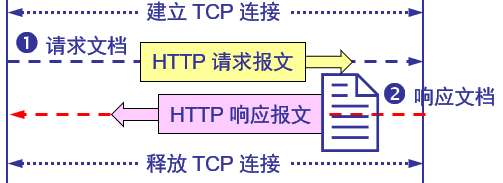

- 浏览器分析超链指向页面的URL。
- 浏览器向DNS请求解析域名对应的IP地址。
- 域名系统DNS解析出服务器的IP地址。
- 浏览器与服务器建立TCP连接
- 浏览器发出取文件命令：GET /index.htm。
- 服务器给出响应，把文件index.htm发给浏览器。
- TCP连接释放。
- 浏览器显示文件index.htm中的所有文本。

### 主要特点

- HTTP是面向事务的客户服务器协议。
- HTTP/1.0协议是无状态的（stateless）。
- HTTP协议本身也是无连接的，虽然它使用了面向连接的TCP向上提供的服务。

### 请求一个万维网文档所需的时间

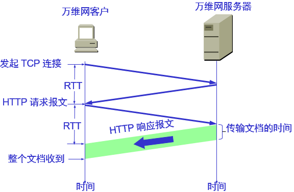

### 持续连接（persistent connection）

- HTTP/1.1协议使用持续连接。
- 万维网服务器在发送响应后仍然在一段时间内保持这条连接，使同一个客户（浏览器）和该服务器可以继续在这条连接上传送后续的HTTP请求报文和响应报文。
- 这并不局限于传送同一个页面上链接的文档，而是只要这些文档都在同一个服务器上就行。
- 目前一些流行的浏览器（例如，IE 6.0）的默认设置就是使用HTTP/1.1。

### 持续连接的两种工作方式

非流水线方式：客户在收到前一个响应后才能发出下一个请求。这比非持续连接的两倍RTT的开销节省了建立TCP连接所需的一个RTT时间。但服务器在发送完一个对象后，其TCP连接就处于空闲状态，浪费了服务器资源。

流水线方式：客户在收到HTTP的响应报文之前就能够接着发送新的请求报文。一个接一个的请求报文到达服务器后，服务器就可连续发回响应报文。使用流水线方式时，客户访问所有的对象只需花费一个RTT时间，使TCP连接中的空闲时间减少，提高了下载文档效率。

### 代理服务器

代理服务器（proxy server）又称为万维网高速缓存（Web cache），它代表浏览器发出HTTP请求。

万维网高速缓存把最近的一些请求和响应暂存在本地磁盘中。当与暂时存放的请求相同的新请求到达时，万维网高速缓存就把暂存的响应发送出去，而不需要按URL的地址再去因特网访问该资源。

使用高速缓存可减少访问因特网服务器的时延：

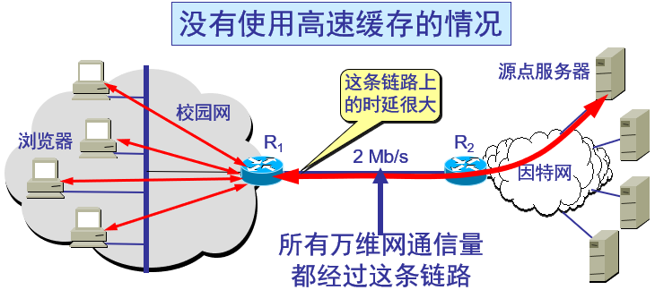
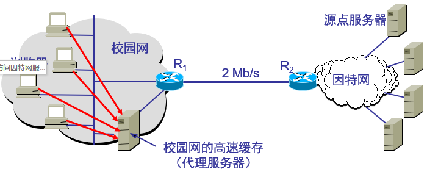

使用代理服务器的流程：

1. 浏览器访问因特网的服务器时，要先与高速缓存建立TCP连接，并向高速缓存发出HTTP请求报文
2. 若高速缓存已经存放了所请求的对象，则将此对象放入HTTP响应报文中返回给浏览器。
3. 否则，高速缓存就代表发出请求的用户浏览器，与因特网上的源点服务器建立TCP连接，并发送HTTP请求报文。
4. 源点服务器将所请求的对象放在HTTP响应报文中返回给高速缓存。
5. 高速缓存收到此对象后，先复制在其本地存储器中（为今后使用），然后再将该对象放在HTTP响应报文中，通过已建立的TCP连接，返回给请求该对象的浏览器。

### HTTP报文

两类：

- 请求报文：从客户向服务器发送请求报文。
- 响应报文：从服务器到客户的回答。

由于HTTP是面向正文的（text-oriented），因此在报文中的每一个字段都是一些ASCII码串，因而每个字段的长度都是不确定的。

#### 请求报文

报文由三个部分组成，即开始行、首部行和实体主体。在请求报文中，开始行就是请求行。

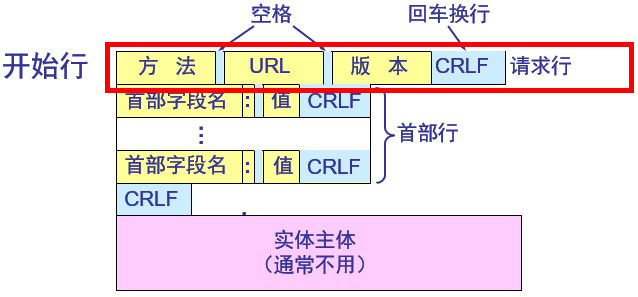

- [方法](#方法)
- URL：URL
- 版本：HTTP的版本

##### 方法

是面向对象技术中使用的专门名词。所谓“方法”就是对所请求的对象进行的操作，因此这些方法实际上也就是一些命令。因此，请求报文的类型是由它所采用的方法决定的。

| 方法（操作） | 意义                                               | 说明                                                                                                                                                                                                                                |
| :----------- | :------------------------------------------------- | :---------------------------------------------------------------------------------------------------------------------------------------------------------------------------------------------------------------------------------- |
| OPTIONS      | 请求一些选项的信息（查询支持的方法）                | 查询指定的URL能够支持的方法。会返回Allow: GET, POST, HEAD, OPTIONS这样的内容。                                                                                                                                                  |
| GET          | 请求读取由URL所标志的信息（获取资源）               | 当前网络请求中，绝大部分使用的是GET方法。                                                                                                                                                                                          |
| HEAD         | 请求读取由URL所标志的信息的首部（获取报文首部）     | 获取报文首部。和GET方法类似，但是不返回报文实体主体部分。主要用于确认URL的有效性以及资源更新的日期时间等。                                                                                                                      |
| POST         | 给服务器添加信息。例如：注释（传输实体主体）        | POST主要用来传输数据，而GET主要用来获取资源。                                                                                                                                                                                      |
| PUT          | 在指明的URL下存储一个文档（上传文件）               | 由于自身不带验证机制，任何人都可以上传文件，因此存在安全性问题，一般不使用该方法                                                                                                                                                    |
| DELETE       | 删除指明的URL所标志的资源（删除文件）               | 与PUT功能相反，并且同样不带验证机制。                                                                                                                                                                                               |
| PATCH        | 对资源进行部分修改                                 | PUT也可以用于修改资源，但是只能完全替代原始资源，PATCH允许部分修改。                                                                                                                                                              |
| TRACE        | 用来进行环回测试的请求报文（追踪路径）              | 1. 服务器会将通信路径返回给客户端。 2. 发送请求时，在Max-Forwards首部字段中填入数值，每经过一个服务器就会减1，当数值为0时就停止传输。 3. 通常不会使用TRACE，并且它容易受到XST攻击（Cross-Site Tracing，跨站追踪）。 |
| CONNECT      | 用于代理服务器（要求在与代理服务器通信时建立隧道） | 使用SSL（Secure Sockets Layer，安全套接层）和TLS（Transport Layer Security，传输层安全）协议把通信内容加密后经网络隧道传输。                                                                                                      |

#### 响应报文

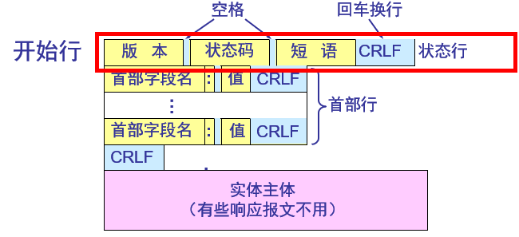

- 响应报文的开始行是状态行。
- 状态行包括三项内容，即HTTP的版本，状态码，以及解释状态码的简单短语。

##### 状态码

| 状态码 | 类别                         | 含义                       |
| :----- | :--------------------------- | :------------------------- |
| 1xx    | Informational（信息性）      | 接收的请求正在处理         |
| 2xx    | Success（成功）              | 请求正常处理完毕           |
| 3xx    | Redirection（重定向）        | 需要进行附加操作以完成请求 |
| 4xx    | Client Error（客户端错误）   | 服务器无法处理请求         |
| 5xx    | Server Error（服务器端错误） | 服务器处理请求出错         |

常用状态码及其短语：

| 状态码 | 短语                  | 说明                                                                                                                                                    |
| ------ | --------------------- | ------------------------------------------------------------------------------------------------------------------------------------------------------- |
| 100    | Continue              | 表明到目前为止都很正常，客户端可以继续发送请求或者忽略这个响。                                                                                          |
| 200    | OK                    |
| 204    | No Content            | 请求已经成功处理，但是返回的响应报文不包含实体的主体部分。一般在只需要从客户端往服务器发送信息，而不需要返回数据时使用                                  |
| 206    | Partial Content       | 表示客户端进行了范围请求，响应报文包含由Content-Range指定范围的实体内容                                                                               |
| 301    | Moved Permanently     | 永久性重定向                                                                                                                                            |
| 302    | Found                 | 临时性重定向                                                                                                                                            |
| 303    | See Other             | 和302有着相同的功能，但是303明确要求客户端应该采用GET方法获取资源                                                                                 |
| 304    | Not Modified          | 如果请求报文首部包含一些条件，例如If-Match，If-Modified-Since，If-None-Match，If-Range，If-Unmodified-Since，如果不满足条件，则服务器会返回304状态码 |
| 307    | Temporary Redirect    | 临时重定向，与302的含义类似，但是307要求浏览器不会把重定向请求的POST方法改成GET方法                                                             |
| 400    | Bad Request           | 请求报文中存在语法错误                                                                                                                                  |
| 401    | Unauthorized          | 该状态码表示发送的请求需要有认证信息（BASIC认证、DIGEST认证）。如果之前已进行过一次请求，则表示用户认证失败                                           |
| 403    | Forbidden             | 请求被拒绝                                                                                                                                              |
| 404    | Not Found             |
| 500    | Internal Server Error | 服务器正在执行请求时发生错误                                                                                                                            |
| 503    | Service Unavailable   | 服务器暂时处于超负载或正在进行停机维护，现在无法处理请求                                                                                                |

注：虽然HTTP协议规定301、302状态下重定向时不允许把POST方法改成GET方法，但是大多数浏览器都会在301、302和303状态下的重定向把POST方法改成GET方法。

### HTTP首部字段

有4种类型的首部字段：通用首部字段、请求首部字段、响应首部字段和实体首部字段。
各种首部字段及其含义如下（不需要全记，仅供查阅）：

#### 通用首部字段

|    首部字段名     |                    说明                    |
| :---------------: | :----------------------------------------: |
|   Cache-Control   |               控制缓存的行为               |
|    Connection     | 控制不再转发给代理的首部字段、管理持久连接 |
|       Date        |             创建报文的日期时间             |
|      Pragma       |                  报文指令                  |
|      Trailer      |             报文末端的首部一览             |
| Transfer-Encoding |         指定报文主体的传输编码方式         |
|      Upgrade      |               升级为其他协议               |
|        Via        |            代理服务器的相关信息            |
|      Warning      |                  错误通知                  |

#### 请求首部字段

|     首部字段名      |                      说明                       |
| :-----------------: | :---------------------------------------------: |
|   Accept-Language   |             优先的语言（自然语言）              |
|    Authorization    |                  Web认证信息                   |
|       Expect        |              期待服务器的特定行为               |
|        From         |               用户的电子邮箱地址                |
|        Host         |               请求资源所在服务器                |
|      If-Match       |              比较实体标记（ETag）               |
|  If-Modified-Since  |               比较资源的更新时间                |
|    If-None-Match    |        比较实体标记（与If-Match相反）         |
|      If-Range       |      资源未更新时发送实体Byte的范围请求       |
| If-Unmodified-Since | 比较资源的更新时间（与If-Modified-Since相反） |
|    Max-Forwards     |                 最大传输逐跳数                  |
| Proxy-Authorization |         代理服务器要求客户端的认证信息          |
|        Range        |               实体的字节范围请求                |
|       Referer       |            对请求中URI的原始获取方            |
|         TE          |                传输编码的优先级                 |
|     User-Agent      |              HTTP客户端程序的信息              |

#### 响应首部字段

​
|     首部字段名     |             说明             |
| :----------------: | :--------------------------: |
|   Accept-Ranges    |     是否接受字节范围请求     |
|        Age         |     推算资源创建经过时间     |
|        ETag        |        资源的匹配信息        |
|      Location      |   令客户端重定向至指定URI   |
| Proxy-Authenticate | 代理服务器对客户端的认证信息 |
|    Retry-After     |   对再次发起请求的时机要求   |
|       Server       |    HTTP服务器的安装信息     |
|        Vary        |   代理服务器缓存的管理信息   |
|  WWW-Authenticate  |   服务器对客户端的认证信息   |
​

#### 实体首部字段

​
|    首部字段名    |          说明          |
| :--------------: | :--------------------: |
|      Allow       | 资源可支持的HTTP方法 |
| Content-Encoding | 实体主体适用的编码方式 |
| Content-Language |   实体主体的自然语言   |
|  Content-Length  |     实体主体的大小     |
| Content-Location |   替代对应资源的URI   |
|   Content-MD5    |   实体主体的报文摘要   |
|  Content-Range   |   实体主体的位置范围   |
|   Content-Type   |   实体主体的媒体类型   |
|     Expires      | 实体主体过期的日期时间 |
|  Last-Modified   | 资源的最后修改日期时间 |

### Cookie在服务器上存放用户的信息

万维网站点使用Cookie来跟踪用户。

Cookie表示在HTTP服务器和客户之间传递的状态信息。使用Cookie的网站服务器为用户产生一个唯一的识别码。利用此识别码，网站就能够跟踪该用户在该网站的活动。

### 两种连接

- 远程链接：超链的终点是其他网点上的页面。
- 本地链接：超链指向本计算机中的某个文件。

## 电子邮件

电子邮件（e-mail）是因特网上使用得最多的和最受用户欢迎的一种应用。

- 电子邮件把邮件发送到收件人使用的邮件服务器，并放在其中的收件人邮箱中，收件人可随时上网到自己使用的邮件服务器进行读取。
- 电子邮件不仅使用方便，而且还具有传递迅速和费用低廉的优点。
- 现在电子邮件不仅可传送文字信息，而且还可附上声音和图像。

### 电子邮件的一些标准/协议

- 发送邮件的协议：SMTP
- 读取邮件的协议：POP3和IMAP
- MIME在其邮件首部中说明了邮件的数据类型（如文本、声音、图像、视像等），使用MIME可在邮件中同时传送多种类型的数据。

### 过程

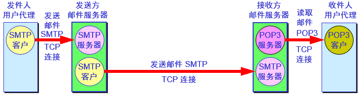

### 用户代理UA

用户代理UA（User Agent）就是用户与电子邮件系统的接口，是电子邮件客户端软件。

用户代理的功能：撰写、显示、处理和通信。

- 邮件服务器的功能是发送和接收邮件，同时还要向发信人报告邮件传送的情况（已交付、被拒绝、丢失等）。
- 邮件服务器按照客户服务器方式工作。邮件服务器需要使用发送和读取两个不同的协议

### 电子邮件的组成

- 电子邮件由信封（envelope）和内容（content）两部分组成。
- 电子邮件的传输程序根据邮件信封上的信息来传送邮件。用户在从自己的邮箱中读取邮件时才能见到邮件的内容。
- 在邮件的信封上，最重要的就是收件人的地址。
- 电子邮件地址的格式："收件人邮箱名@邮箱所在主机的域名"

### SMTP

- SMTP（简单邮件传送协议）所规定的就是在两个相互通信的SMTP进程之间应如何交换信息。
- 由于SMTP使用客户服务器方式，因此负责发送邮件的SMTP进程就是SMTP客户，而负责接收邮件的SMTP进程就是SMTP服务器。
- SMTP规定了14条命令和21种应答信息。每条命令用4个字母组成，而每一种应答信息一般只有一行信息，由一个3位数字的代码开始，后面附上（也可不附上）很简单的文字说明。

#### 通信的三个阶段

- 连接建立：连接是在发送主机的SMTP客户和接收主机的SMTP服务器之间建立的。SMTP不使用中间的邮件服务器。
- 邮件传送
- 连接释放：邮件发送完毕后，SMTP应释放TCP连接。

#### SMTP缺点

- SMTP不能传送可执行文件或其他的二进制对象。
- SMTP限于传送7位的ASCII码。许多其他非英语国家的文字（如中文、俄文，甚至带重音符号的法文或德文）就无法传送。
- SMTP服务器会拒绝超过一定长度的邮件。
- 某些SMTP的实现并没有完全按照RFC 821的SMTP标准。

### 电子邮件的信息格式

一个电子邮件分为信封和内容两大部分。RFC 822只规定了邮件内容中的首部（header）格式，而对邮件的主体（body）部分则让用户自由撰写。

用户写好首部后，邮件系统将自动地将信封所需的信息提取出来并写在信封上。所以用户不需要填写电子邮件信封上的信息。

邮件内容首部包括一些关键字，后面加上冒号。最重要的关键字是To和Subject。

- To：后面填入一个或多个收件人的电子邮件地址。用户只需打开地址簿，点击收件人名字，收件人的电子邮件地址就会自动地填入到合适的位置上。
- Subject：是邮件的主题。它反映了邮件的主要内容，便于用户查找邮件。
- Cc（抄送）：表示应给某某人发送一个邮件副本。
- From”和“Date”：表示发信人的电子邮件地址和发信日期。
- Reply-To：是对方回信所用的地址。

### POP3

POP（邮局协议）是一个非常简单、但功能有限的邮件读取协议，现在使用的是它的第三个版本POP3。

POP也使用客户服务器的工作方式。在接收邮件的用户PC机中必须运行POP客户程序，而在用户所连接的ISP的邮件服务器中则运行POP服务器程序。

### IMAP

- IMAP（Internet Message Access Protocol）也是按客户服务器方式工作，现在较新的是版本4，即IMAP4。
- 用户在自己的PC机上就可以操纵ISP的邮件服务器的邮箱，就像在本地操纵一样。
- 因此IMAP是一个联机协议。当用户PC机上的IMAP客户程序打开IMAP服务器的邮箱时，用户就可看到邮件的首部。若用户需要打开某个邮件，则该邮件才传到用户的计算机上。

#### IMAP的特点

- IMAP最大的好处就是用户可以在不同的地方使用不同的计算机随时上网阅读和处理自己的邮件。
- IMAP还允许收件人只读取邮件中的某一个部分。例如，收到了一个带有视像附件（此文件可能很大）的邮件。为了节省时间，可以先下载邮件的正文部分，待以后有时间再读取或下载这个很长的附件。
- IMAP的缺点是如果用户没有将邮件复制到自己的PC机上，则邮件一直是存放在IMAP服务器上。因此用户需要经常与IMAP服务器建立连接。

### 基于万维网的电子邮件

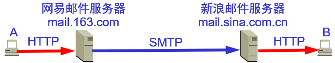

### MIME

多用途互联网邮件扩展类型：Multipurpose Internet Mail Extensions

#### 特点

- MIME并没有改动SMTP或取代它。
- MIME的意图是继续使用目前的RFC 822格式，但增加了邮件主体的结构，并定义了传送非ASCII码的编码规则。

#### SMTP和MIME

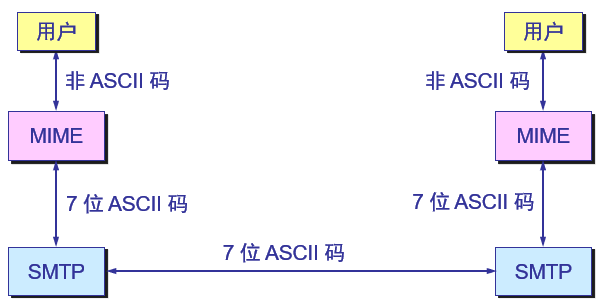

#### MIME主要包括三个部分

- 5个新的邮件首部字段，它们可包含在RFC 822首部中。这些字段提供了有关邮件主体的信息。
- 定义了许多邮件内容的格式，对多媒体电子邮件的表示方法进行了标准化。
- 定义了传送编码，可对任何内容格式进行转换，而不会被邮件系统改变。

#### MIME增加5个新的邮件首部

- MIME-Version: 标志MIME的版本。现在的版本号是1.0。若无此行，则为英文文本。
- Content-Description: 这是可读字符串，说明此邮件是什么。和邮件的主题差不多。
- Content-Id: 邮件的唯一标识符。
- Content-Transfer-Encoding: 在传送时邮件的主体是如何编码的。
- Content-Type: 说明邮件的性质。

## DHCP

### 协议配置

- 在协议软件中给这些参数赋值的动作叫做协议配置。
- 一个软件协议在使用之前必须是已正确配置的。
- 具体的配置信息有哪些则取决于协议栈。

### 需要配置的项目

- IP地址
- 子网掩码
- 默认路由器的IP地址
- 域名服务器的IP地址
- 这些信息通常存储在一个配置文件中，计算机在引导过程中可以对这个文件进行存取。

### DHCP

- 动态主机配置协议DHCP提供了即插即用连网（plug-and-play networking）的机制。
- 这种机制允许一台计算机加入新的网络和获取IP地址而不用手工参与。

### DHCP使用客户服务器方式

- 需要IP地址的主机在启动时就向DHCP服务器广播发送发现报文（DHCPDISCOVER），这时该主机就成为DHCP客户。
- 本地网络上所有主机都能收到此广播报文，但只有DHCP服务器才回答此广播报文。
- DHCP服务器先在其数据库中查找该计算机的配置信息。若找到，则返回找到的信息。若找不到，则从服务器的IP地址池（address pool）中取一个地址分配给该计算机。DHCP服务器的回答报文叫做提供报文（DHCPOFFER）。

### DHCP中继代理（relay agent）

并不是每个网络上都有DHCP服务器，这样会使DHCP服务器的数量太多。现在是每一个网络至少有一个DHCP中继代理，它配置了DHCP服务器的IP地址信息。

当DHCP中继代理收到主机发送的发现报文后，就以单播方式向DHCP服务器转发此报文，并等待其回答。收到DHCP服务器回答的提供报文后，DHCP中继代理再将此提供报文发回给主机。

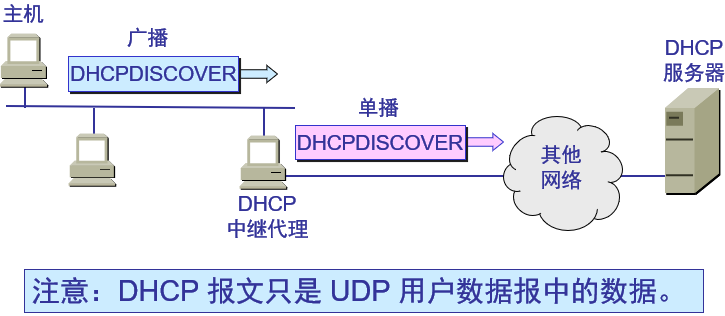

### 租用期（lease period）

DHCP服务器分配给DHCP客户的IP地址的临时的，因此DHCP客户只能在一段有限的时间内使用这个分配到的IP地址。DHCP协议称这段时间为租用期。租用期的数值应由DHCP服务器自己决定，DHCP客户也可在自己发送的报文中（例如，发现报文）提出对租用期的要求。

### DHCP协议的工作过程

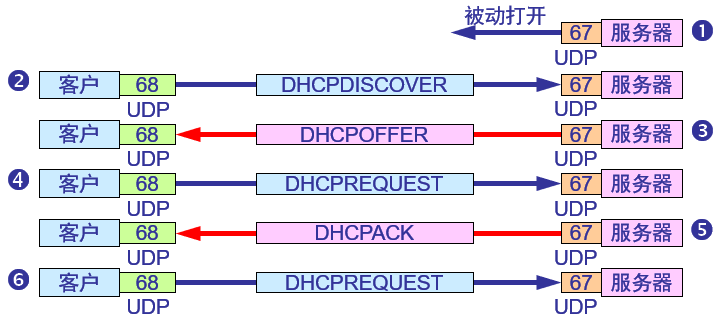

1. DHCP服务器被动打开UDP端口67，等待客户端发来的报文。
2. DHCP客户从UDP端口68发送DHCP发现报文。
3. 凡收到DHCP发现报文的DHCP服务器都发出DHCP提供报文，因此DHCP客户可能收到多个DHCP提供报文。
4. DHCP客户从几个DHCP服务器中选择其中的一个，并向所选择的DHCP服务器发送DHCP请求报文。
5. 被选择的DHCP服务器发送确认报文DHCPACK，进入已绑定状态，并可开始使用得到的临时IP地址了。
6. 租用期过了一半（T1时间到），DHCP发送请求报文DHCPREQUEST要求更新租用期。DHCP客户现在要根据服务器提供的租用期T设置两个计时器T1和T2，它们的超时时间分别是0.5T和0.875T。当超时时间到就要请求更新租用期。
7. DHCP服务器若同意，则发回确认报文DHCPACK。DHCP客户得到了新的租用期，重新设置计时器。
8. DHCP服务器若不同意，则发回否认报文DHCPNACK。这时DHCP客户必须立即停止使用原来的IP地址，而必须重新申请IP地址（步骤2）
9. 若DHCP服务器不响应步骤6的请求报文DHCPREQUEST，则在租用期过了87.5% 时，DHCP客户必须重新发送请求报文DHCPREQUEST（重复步骤6），然后又继续后面的步骤
10. DHCP客户可随时提前终止服务器所提供的租用期，这时只需向DHCP服务器发送释放报文DHCPRELEASE即可。

## SNMP

简单网络管理协议：网络管理包括对硬件、软件和人力的使用、综合与协调，以便对网络资源进行监视、测试、配置、分析、评价和控制，这样就能以合理的价格满足网络的一些需求，如实时运行性能，服务质量等。网络管理常简称为网管。

网络管理并不是指对网络进行行政上的管理。

### 网络管理的一般模型

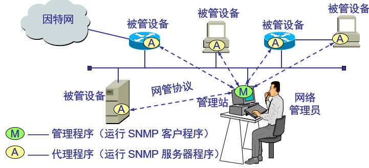

- 管理站：也常称为网络运行中心NOC（Network Operations Center），是网络管理系统的核心。
- 管理程序：在运行时就成为管理进程。
- 管理者：Manager不是指人而是指机器或软件。管理站（硬件）或管理程序（软件）都可称为管理者。
- 网络管理员（administrator）指的是人。大型网络往往实行多级管理，因而有多个管理者，而一个管理者一般只管理本地网络的设备。
- 被管对象（Managed Object）：有时可称为网络元素或网元。网络的每一个被管设备中可能有多个被管对象。在被管设备中也会有一些不能被管的对象。

## 应用进程跨越网络的通信

### 系统调用和应用编程接口

大多数操作系统使用系统调用（system call）的机制在应用程序和操作系统之间传递控制权。

对程序员来说，每一个系统调用和一般程序设计中的函数调用非常相似，只是系统调用是将控制权传递给了操作系统，多个应用进程使用系统调用的机制

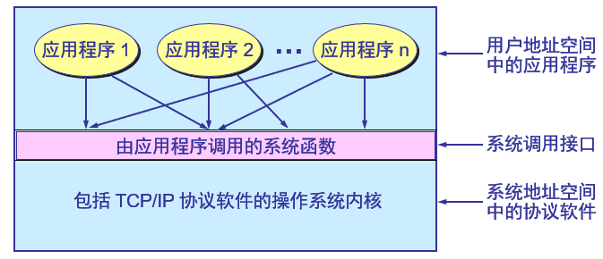

### 应用编程接口API

- 当某个应用进程启动系统调用时，控制权就从应用进程传递给了**系统调用接口**。
- 此接口再将控制权传递给计算机的**操作系统**。操作系统将此调用转给某个**内部过程**，并执行所请求的操作。
- 内部过程一旦执行完毕，控制权就又通过系统调用接口返回给应用进程。
- 系统调用接口实际上就是应用进程的控制权和操作系统的控制权进行转换的一个接口，即应用编程接口API（Application Programming Interface）。

几种应用编程接口API

- Berkeley UNIX操作系统定义了一种API，它又称为套接字接口（socket interface）。
- 微软公司在其操作系统中采用了套接字接口API，形成了一个稍有不同的API，并称之为Windows Socket。
- AT&T为其UNIX系统V定义了一种API，简写为TLI（Transport Layer Interface）。

### 套接字

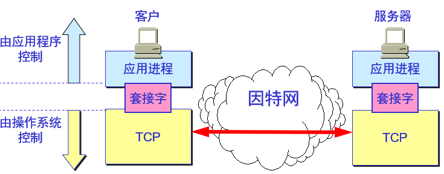

当应用进程需要使用网络进行通信时就发出系统调用，请求操作系统为其创建“套接字”，以便把网络通信所需要的系统资源分配给该应用进程。

操作系统为这些资源的总和用一个叫做**套接字描述符**的号码来表示，并把此号码返回给应用进程。应用进程所进行的网络操作都必须使用这个号码。

通信完毕后，应用进程通过一个关闭套接字的系统调用通知操作系统回收与该“号码”相关的所有资源。

### 几种常用的系统调用

- 连接建立阶段。
- 当套接字被创建后，它的端口号和IP地址都是空的，因此应用进程要调用`bind`（绑定）来指明套接字的本地地址。在服务器端调用`bind`时就是把熟知端口号和本地IP地址填写到已创建的套接字中。这就叫做把本地地址绑定到套接字。
- 服务器在调用`bind`后，还必须调用`listen`（收听）把套接字设置为被动方式，以便随时接受客户的服务请求。UDP服务器由于只提供无连接服务，不使用`listen`系统调用。
- 服务器紧接着就调用`accept`（接受），以便把远地客户进程发来的连接请求提取出来。系统调用`accept`的一个变量就是要指明从哪一个套接字发起的连接。

示例：

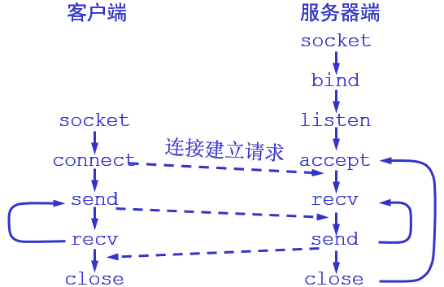
