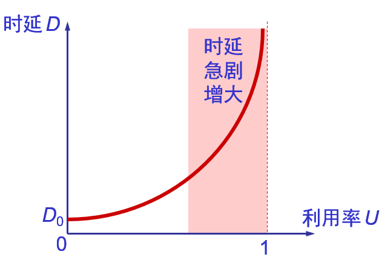

# 概述

## 计算机网络向用户提供的最重要的功能

- 连通性：计算机网络使上网用户之间都可以交换信息，好像这些用户的计算机都可以彼此直接连通一样。
- 共享：即资源共享。可以是信息共享、软件共享，也可以是硬件共享。

## 网络和互联网

网络把许多计算机连接在一起。因特网则把许多网络连接在一起。

## internet和Internet

internet：互联网或互连网，是一个通用名词，它泛指由多个计算机网络互连而成的网络。

Internet：因特网，则是一个专用名词，它指当前全球最大的、开放的、由众多网络相互连接而成的特定计算机网络，它采用TCP/IP协议族作为通信的规则，且其前身是美国的ARPANET。

## 因特网的组成

边缘部分：由所有连接在因特网上的主机组成。这部分是用户直接使用的，用来进行通信（传送数据、音频或视频）和资源共享。

核心部分：由大量网络和连接这些网络的路由器组成。这部分是为边缘部分提供服务的（提供连通性和交换）。

## 两种通信方式

### 客户/服务器方式（C/S方式）

客户（client）和服务器（server）都是指通信中所涉及的两个应用进程。客户/服务器方式所描述的是进程之间服务和被服务的关系。客户是服务的请求方，服务器是服务的提供方。

客户软件的特点：被用户调用后运行，在打算通信时主动向远地服务器发起通信（请求服务）。因此，客户程序必须知道服务器程序的地址。不需要特殊的硬件和很复杂的操作系统。

服务器软件的特点：一种专门用来提供某种服务的程序，可同时处理多个远地或本地客户的请求。系统启动后即自动调用并一直不断地运行着，被动地等待并接受来自各地的客户的通信请求。因此，服务器程序不需要知道客户程序的地址。一般需要强大的硬件和高级的操作系统支持。

### 对等方式（P2P方式）

对等连接（Peer-to-Peer，简写为P2P）是指两个主机在通信时并不区分哪一个是服务请求方还是服务提供方。只要两个主机都运行了对等连接软件（P2P软件），它们就可以进行平等的、对等连接通信。双方都可以下载对方已经存储在硬盘中的共享文档。

对等连接方式的特点：对等连接方式从本质上看仍然是使用客户服务器方式，只是对等连接中的每一个主机既是客户又同时是服务器。

## 路由器

网络核心部分，是因特网中最复杂的部分。

网络中的核心部分要向网络边缘中的大量主机提供连通性，使边缘部分中的任何一个主机都能够向其他主机通信（即传送或接收各种形式的数据）。而在网络核心部分起特殊作用的就是路由器（router）。

### 路由器的重要任务

路由器是实现分组交换（packet switching）的关键构件，其任务是转发收到的分组，这是网络核心部分最重要的功能。在路由器中的输入和输出端口之间没有直接连线。

### 路由器处理分组的过程

1. 把收到的分组先放入缓存（暂时存储）；
2. 查找转发表，找出到某个目的地址应从哪个端口转发；
3. 把分组送到适当的端口转发出去。

### 主机和路由器

主机是为用户进行信息处理的，并向网络发送分组，从网络接收分组。

路由器对分组进行存储转发，最后把分组交付目的主机。

## 电路交换的特点

电路交换必定是面向连接的。

电路交换的三个阶段：建立连接、通信、释放连接

电路交换传送计算机数据效率低：计算机数据具有突发性，这导致通信线路的利用率很低

## 分组交换

### 过程

1. 在发送端，先把较长的报文划分成较短的、固定长度的数据段。
2. 每一个数据段前面添加上首部构成分组。
3. 分组交换网以“分组”作为数据传输单元，依次把各分组发送到接收端。
4. 每一个分组的首部都含有地址等控制信息。
5. 分组交换网中的结点交换机根据收到的分组的首部中的地址信息，把分组转发到下一个结点交换机。
6. 用这样的存储转发方式，最后分组就能到达最终目的地。
7. 接收端收到分组后剥去首部还原成报文。
8. 最后，在接收端把收到的数据恢复成为原来的报文。

### 优缺点

优点：

- 高效 动态分配传输带宽，对通信链路是逐段占用。
- 灵活 以分组为传送单位和查找路由。
- 迅速 不必先建立连接就能向其他主机发送分组。
- 可靠 保证可靠性的网络协议；分布式的路由选择协议使网络有很好的生存性

缺点：

- 分组在各结点存储转发时需要排队，这就会造成一定的时延。
- 分组必须携带的首部（里面有必不可少的控制信息）也造成了一定的开销。

## 计算机网络分类

不同作用范围的网络

- 广域网WAN（Wide Area Network）
- 局域网LAN（Local Area Network）
- 城域网MAN（Metropolitan Area Network）
- 个人区域网PAN（Personal Area Network）

从网络的使用者进行分类

- 公用网（public network）
- 专用网（private network）

用来把用户接入到因特网的网络

- 接入网AN（Access Network），它又称为本地接入网或居民接入网。由ISP提供的接入网只是起到让用户能够与因特网连接的 “桥梁” 作用。

## 计算机网络的性能指标

### 速率

即数据率（data rate）或比特率（bit rate），是计算机网络中最重要的一个性能指标。速率的单位是b/s，或kb/s,Mb/s,Gb/s等。

速率往往是指额定速率或标称速率。

### 带宽（bandwidth）

“带宽”本来是指信号具有的频带宽度，单位是赫（或千赫、兆赫、吉赫等）。现在“带宽”是数字信道所能传送的“最高数据率”的同义语，单位是“比特每秒”，或b/s（bit/s）。更常用的带宽单位是：千比每秒：kb/s（10^3b/s）、兆比每秒：Mb/s（10^6b/s）、吉比每秒：Gb/s（10^9b/s）、太比每秒：Tb/s（10^12b/s），请注意：在计算机界，K = 2^10，M = 2^20，G = 2^30，T = 2^40。

数字信号流随时间的变化，在时间轴上信号的宽度随带宽的增大而变窄。

### 吞吐量（throughput）

表示在单位时间内通过某个网络（或信道、接口）的数据量。更经常地用于对现实世界中的网络的一种测量，以便知道实际上到底有多少数据量能够通过网络。

吞吐量受网络的带宽或网络的额定速率的限制。

### 时延（delay或latency）

总时延 = 发送时延 + 传播时延 + 处理时延 + 处理时延

注意：对于高速网络链路，我们提高的仅仅是数据的发送速率而不是比特在链路上的传播速率。提高链路带宽只是减小了数据的发送时延。

#### 传输时延（发送时延）

发送数据时，数据块从结点进入到传输媒体所需要的时间。也就是从发送数据帧的第一个比特算起，到该帧的最后一个比特发送完毕所需的时间。

发送时延（s）= 数据块长度（bit） / 信带宽度（bit/s）

#### 传播时延

电磁波在信道中需要传播一定的距离而花费的时间。信号传输速率（即发送速率）和信号在信道上的传播速率是完全不同的概念。

传播时延（s）= 信道长度（m） / 信号在信道中的传播速率（m/s）

#### 处理时延

交换结点为存储转发而进行一些必要的处理所花费的时间。

#### 排队时延

结点缓存队列中分组排队所经历的时延。排队时延的长短往往取决于网络中当时的通信量。

#### 时延带宽积

链路的时延带宽积又称为以比特为单位的链路长度。

时延带宽积 = 传播时延 * 带宽

#### 利用率

信道利用率指出某信道有百分之几的时间是被利用的（有数据通过）。完全空闲的信道的利用率是零；网络利用率则是全网络的信道利用率的加权平均值。

信道利用率并非越高越好。根据排队论的理论，当某信道的利用率增大时，该信道引起的时延也就迅速增加。

在适当的假定条件下：$D = \frac{D_0}{（1 - U）}$，即：$U = 1 - \frac{D}{D_0}$，$D_0$表示网络空闲时的时延，$D$表示网络当前的时延，$U$表示信道利用率

## 计算机网络的非性能特征

- 费用
- 质量
- 标准化
- 可靠性
- 可扩展性和可升级性
- 易于管理和维护

## 网络协议

计算机网络中的数据交换必须遵守事先约定好的规则。这些规则明确规定了所交换的数据的格式以及有关的同步问题（同步含有时序的意思）。

网络协议（network protocol），简称为协议，是为进行网络中的数据交换而建立的规则、标准或约定。

### 网络协议的组成要素

- 语法：数据与控制信息的结构或格式。
- 语义：需要发出何种控制信息，完成何种动作以及做出何种响应。
- 同步：事件实现顺序的详细说明。

### 网络协议分层

#### 划分层次的必要性

相互通信的两个计算机系统必须高度协调工作才行，而这种“协调”是相当复杂的。

“分层”可将庞大而复杂的问题，转化为若干较小的局部问题，而这些较小的局部问题就比较易于研究和处理。

#### 分层的好处

- 各层之间是独立的。
- 灵活性好。
- 结构上可分割开。
- 易于实现和维护。
- 能促进标准化工作。

## OSI/RM（七层协议）

（Open System Interconnection Reference Model）开放系统互联参考模型

|                      | 数据格式                      | 功能与连接方式                                                                                              | 典型设备                                     |
| :------------------- | :---------------------------- | :---------------------------------------------------------------------------------------------------------- | :------------------------------------------- |
| 应用层Application   | ATPU                          | 网络服务与使用者应用程序间的一个接口                                                                        | 终端设备                                     |
| 表示层Presenation   | PTPU                          | 数据表示、数据安全、数据压缩                                                                                | 终端设备                                     |
| 会话层Session       | DTPU                          | 会话层连接到传输层的映射；会话连接的流量控制；数据传输；会话连接恢复与释放；会话连接管理、差错控制          | 终端设备                                     |
| 传输层Transport     | Segment，数据组织成数据段     | 用一个寻址机制来标识一个特定的应用程序（端口号）                                                            | 终端设备                                     |
| 网络层Network       | Packet，分割和重新组合数据包  | 基于网络层地址（IP地址）进行不同网络系统间的路径选择                                                       | 网关、路由器                                 |
| 数据链路层Data Link | Frame，将比特信息封装成数据帧 | 在物理层上建立、撤销、标识逻辑链接和链路复用 以及差错校验等功能。通过使用接收系统的硬件地址或物理地址来寻址 | 网桥、交换机                                 |
| 物理层Physical      | Bit，传输比特流               | 建立、维护和取消物理连接                                                                                    | 光纤、同轴电缆、双绞线、网卡、中继器、集线器 |

### 物理层

物理层是OSI分层结构体系中最重要、最基础的一层，它建立在传输媒介基础上，起建立、维护和取消物理连接作用，实现设备之间的物理接口。

物理层只接收和发送一串比特（bit）流，不考虑信息的意义和信息结构。

对连接到网络上的设备描述其各种规定：

- **机械特性**：规定了网络连接时所需接插件的规格尺寸、引脚数量和排列情况等；
- **电气特性**：规定了在物理连接上传输bit流时线路上信号电平的大小、阻抗匹配、传输速率距离限制等；
- **功能特性**：是指对各个信号先分配确切的信号含义，即定义了DTE（数据终端设备）和DCE（数据通信设备）之间各个线路的功能；
- **过程特性**：定义了利用信号线进行bit流传输的一组操作规程，是指在物理连接的建立、维护、交换信息时，DTE和DCE双方在各电路上的动作系列。物理层的数据单位是位。

主要功能：

- **为数据端设备提供传送数据的通路**，数据通路可以是一个物理媒体，也可以是多个物理媒体连接而成。一次完整的数据传输，包括激活物理连接，传送数据，终止物理连接。所谓激活，就是不管有多少物理媒体参与，都要在通信的两个数据终端设备间连接起来，形成一条通路。
- **传输数据**。物理层要形成适合数据传输需要的实体，为数据传送服务：
    - 保证数据按位传输的正确性；
    - 向数据链路层提供一个透明的位传输；
    - 提供足够的带宽（带宽是指每秒钟内能通过的比特数），以减少信道上的拥塞。传输数据的方式能满足点到点，一点到多点，串行或并行，半双工或全双工，同步或异步传输的需要。
- **完成物理层的一些管理工作**。如在数据终端设备、数据通信和交换设备等设备之间完成对数据链路的建立、保持和拆除操作。

### 数据链路层

在物理层提供比特流服务的基础上，将比特信息封装成数据帧Frame，起到在物理层上建立、撤销、标识逻辑链接和链路复用以及差错校验等功能。

通过使用接收系统的硬件地址或物理地址来寻址。

建立相邻结点之间的数据链路，通过差错控制提供数据帧（Frame）在信道上无差错的传输，同时为其上面的网络层提供有效的服务。

数据链路层在不可靠的物理介质上提供可靠的传输。该层的作用包括：物理地址寻址、数据的成帧、流量控制、数据的检错、重发等。

链路层是为网络层提供数据传送服务的，这种服务要依靠本层具备的功能来实现。链路层应具备如下功能：

- 链路连接的建立，拆除，分离。
- 帧定界和帧同步。链路层的数据传输单元是帧，协议不同，帧的长短和界面也有差别，但无论如何必须对帧进行定界。
- 顺序控制，指对帧的收发顺序的控制。
- 差错检测。差错检测多用方阵码校验和循环码校验来检测信道上数据的误码，而帧丢失等用序号检测。各种错误的恢复则常靠反馈重发技术来完成。
- 恢复、链路标识、流量控制等等。

### 网络层

网络层也称通信子网层，是高层协议之间的界面层，用于控制通信子网的操作，是通信子网与资源子网的接口。

在计算机网络中进行通信的两个计算机之间可能会经过很多个数据链路，也可能还要经过很多通信子网。网络层的任务就是选择合适的网间路由和交换结点，确保数据及时传送。

主要功能：

- 网络层将解封装数据链路层收到的帧，提取数据包，包中封装有网络层包头，其中含有逻辑地址信息源站点和目的站点地址的网络地址。
- IP是第3层问题的一部分，此外还有一些路由协议和地址解析协议（ARP）。有关路由的一切事情都在第3层处理。**地址解析**和**路由**是3层的重要目的。
- 网络层还可以实现 **拥塞控制**、**网际互连**、**信息包顺序控制** 及 **网络记账** 等功能。

为建立网络连接和为上层提供服务，应具备以下主要功能：

- 路由选择和中继；
- 激活，终止网络连接；
- 在一条数据链路上复用多条网络连接，多采取分时复用技术；
- 差错检测与恢复；
- 排序，流量控制；
- 服务选择；
- 网络管理；
- 网络层标准简介。

### 传输层

传输层建立在网络层和会话层之间，实质上它是网络体系结构中高低层之间衔接的一个接口层。

传输层用一个寻址机制来标识一个特定的应用程序（端口号）。

传输层不仅是一个单独的结构层，它还是整个分层体系协议的核心，没有传输层整个分层协议就没有意义。

传输层的数据单元是由数据组织成的数据段（segment）这个层负责获取全部信息，因此，它必须跟踪数据单元碎片、乱序到达的数据包和其它在传输过程中可能发生的危险。

传输层获得下层提供的服务包括：

- 发送和接收正确的数据块分组序列，并用其构成传输层数据；
- 获得网络层地址，包括虚拟信道和逻辑信道。

传输层向上层提供的服务包括：

- 无差错的有序的报文收发；
- 提供传输连接；
- 进行流量控制。

传输层为上层提供端到端（最终用户到最终用户）的透明的、可靠的数据传输服务，所谓透明的传输是指在通信过程中传输层对上层屏蔽了通信传输系统的具体细节。

传输层是两台计算机经过网络进行数据通信时，第一个端到端的层次，具有缓冲作用。当网络层服务质量不能满足要求时，它将服务加以提高，以满足高层的要求；当网络层服务质量较好时，它只用很少的工作。传输层还可进行复用，即在一个网络连接上创建多个逻辑连接。

传输层的服务一般要经历**传输连接建立阶段、数据传送阶段、传输连接释放**阶段3个阶段才算完成一个完整的服务过程。而在数据传送阶段又分为一般数据传送和加速数据传送两种。传输层服务分成5种类型。基本可以满足对传送质量、传送速度、传送费用的各种不同需要。

### 会话层

这一层也可以称为会晤层或对话层，在会话层及以上的高层次中，数据传送的单位不再另外命名，统称为**报文**。

会话层不参与具体的传输，它提供包括访问验证和会话管理在内的建立和维护应用之间通信的机制。如服务器验证用户登录便是由会话层完成的。

会话层提供的服务可使应用建立和维持会话，并能使会话获得同步。会话层使用校验点可使通信会话在通信失效时从校验点继续恢复通信。这种能力对于传送大的文件极为重要。会话层、表示层、应用层构成开放系统的高3层，面对应用进程提供分布处理，对话管理，信息表示，恢复最后的差错等。

会话层同样要担负应用进程服务要求，而运输层不能完成的那部分工作，给运输层功能差距以弥补。主要的功能是对话管理，数据流同步和重新同步。要完成这些功能，需要由大量的服务单元功能组合，已经制定的功能单元已有几十种。

主要功能：

- 会话层连接到传输层的映射；
- 会话连接的流量控制；
- 数据传输；
- 会话连接恢复与释放；
- 会话连接管理、差错控制。

工作内容：

为会话实体间建立连接、为给两个对等会话服务用户建立一个会话连接，应该做如下几项工作：

- 将会话地址映射为运输地址；
- 选择需要的运输服务质量参数（QOS）；
- 对会话参数进行协商；
- 识别各个会话连接；
- 传送有限的透明用户数据；
- 数据传输阶段。这个阶段是在两个会话用户之间实现有组织的，同步的数据传输。用户数据单元为SSDU，而协议数据单元为SPDU。会话用户之间的数据传送过程是将SSDU转变成SPDU进行的。
- 连接释放。连接释放是通过 "有序释放"、"废弃"、"有限量透明用户数据传送" 等功能单元来释放会话连接的。

功能单元：

- 会话层标准为了使会话连接建立阶段能进行功能协商，也为了便于其它国际标准参考和引用，定义了12种功能单元。
- 各个系统可根据自身情况和需要，以核心功能服务单元为基础，选配其他功能单元组成合理的会话服务子集。
- 会话层的主要标准有DIS8236（会话服务定义）和DIS8237（会话协议规范）。

### 表示层

表示层向上对应用层提供服务，向下接收来自会话层的服务。

表示层是为在应用过程之间传送的信息提供表示方法的服务，它关心的只是发出信息的语法与语义。

表示层要完成某些特定的功能，主要有**不同数据编码格式的转换，提供数据压缩、解压缩服务，对数据进行加密、解密**。例如图像格式的显示，就是由位于表示层的协议来支持。

表示层为应用层提供服务包括语法选择、语法转换等。语法选择是提供一种初始语法和以后修改这种选择的手段。语法转换涉及代码转换和字符集的转换、数据格式的修改以及对数据结构操作的适配

### 应用层

网络应用层是通信用户之间的窗口，为用户提供网络管理、文件传输、事务处理等服务。其中包含了若干个独立的、用户通用的服务协议模块。

网络应用层是OSI的最高层，为网络用户之间的通信提供专用的程序。

应用层的内容主要取决于用户的各自需要，这一层设计的主要问题是分布数据库、分布计算技术、网络操作系统和分布操作系统、远程文件传输、电子邮件、终端电话及远程作业登录与控制等。

**应用层为操作系统或网络应用程序提供访问网络服务的接口**。

## TCP/IP（四层协议）

互联网协议套件（英语：Internet Protocol Suite，缩写IPS）是一个网络通信模型，以及一整个网络传输协议家族，为网际网络的基础通信架构。它常被通称为**TCP/IP协议族**（英语：TCP/IP Protocol Suite，或TCP/IP Protocols），**简称TCP/IP**。因为该协议家族的两个核心协议：TCP（传输控制协议）和IP（网际协议），为该家族中最早通过的标准。由于在网络通讯协议普遍采用分层的结构，当多个层次的协议共同工作时，类似计算机科学中的堆栈，因此又被称为**TCP/IP协议栈**（英语：TCP/IP Protocol Stack）。这些协议最早发源于美国国防部（缩写为DoD）的ARPA网项目，因此也被称作**DoD模型**（DoD Model）。这个协议族由互联网工程任务组负责维护。

|            | 说明                                                                                                                                                   | 常用协议                                                                                                                                                                      |
| :--------- | :----------------------------------------------------------------------------------------------------------------------------------------------------- | :---------------------------------------------------------------------------------------------------------------------------------------------------------------------------- |
| 网络接口层 | 有时也称作数据链路层或网络接口层，通常包括操作系统中的设备驱动程序和计算机中对应的网络接口卡。它们一起处理与电缆（或其他任何传输媒介）的物理接口细节。 | ARP（Address Resolution Protocol，地址解析协议）RARP（Reverse Address Resolution Protocol，逆地址解析协议）                                                                   |
| 网络层     | 网络层处理分组在网络中的活动，例如分组的选路                                                                                                           | IP协议（Internet Protocol，网际协议）、ICMP协议（Internet Control Message Protocol，网际控制报文协议）和IGMP协议（Internet Group Management Protocol，网际组管理协议      |
| 传输层     | 传输层主要为两台主机上的应用程序提供端到端的通信。                                                                                                     | TCP（Transmission Control Protocol，传输控制协议）和UDP（User Datagram Protocol，用户数据报协议）                                                                            |
| 应用层     | 应用层负责处理特定的应用程序细节。                                                                                                                     | Telnet远程登录、SMTP（Simple Mail Transfer Protocol，简单邮件传输协议）、FTP（File Transfer Protocol，文件传输协议）、HTTP（Hyper Text Transfer Protocol，超文本传输协议）等 |

## 五层协议

- 应用层
- 传输层
- 网络层
- 数据链路层
- 物理层

## 三种模型对比

