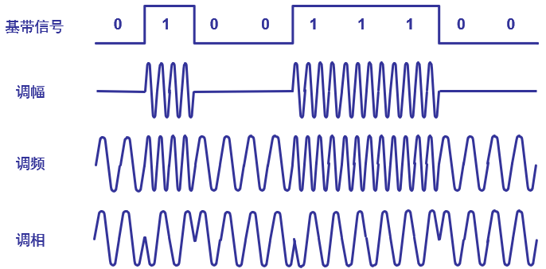
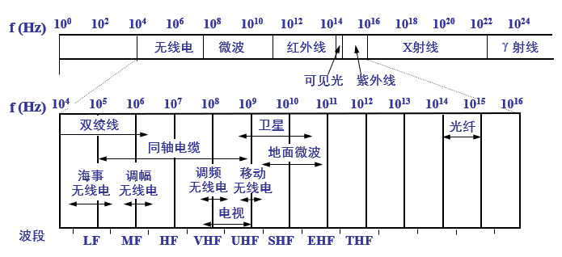
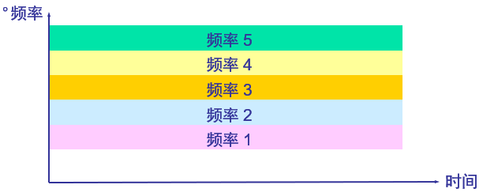
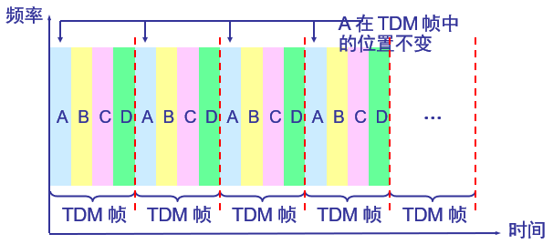
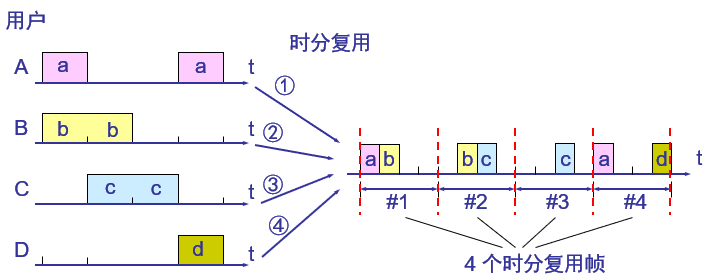
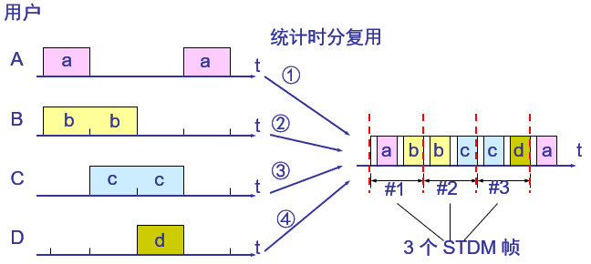
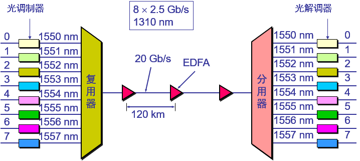
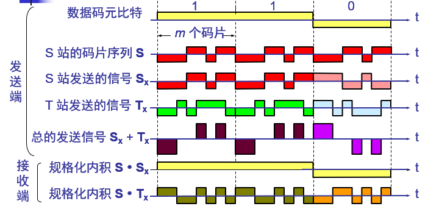
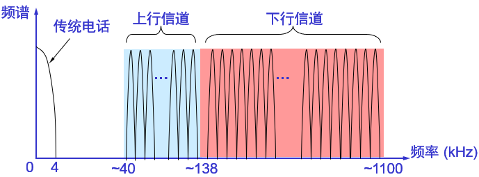

# 物理层

## 物理层的主要任务

描述为确定与传输媒体的接口的一些特性，即：

- 机械特性：指明接口所用接线器的形状和尺寸、引线数目和排列、固定和锁定装置等等。
- 电气特性：指明在接口电缆的各条线上出现的电压的范围。
- 功能特性：指明某条线上出现的某一电平的电压表示何种意义。
- 过程特性：指明对于不同功能的各种可能事件的出现顺序。

## 信号

数据（data）：运送消息的实体。

信号（signal）：数据的电气的或电磁的表现。

### 分类

模拟的（analogous）：代表消息的参数的取值是连续的。

数字的（digital）：代表消息的参数的取值是离散的。

### 信号通信方式

单向通信/单工通信：只能有一个方向的通信而没有反方向的交互。

双向交替通信/半双工通信：通信的双方都可以发送信息，但不能双方同时发送或同时接受。

双向同时通信/全双工通信：通信的双方可以同时发送和接收信息。

### 基带信号

即基本频带信号，来自信源的信号。像计算机输出的代表各种文字或图像文件的数据信号都属于基带信号。

基带信号往往包含有较多的低频成分，甚至有直流成分，而许多信道并不能传输这种低频分量或直流分量。因此必须对基带信号进行调制（modulation）。

最基本的二元制调制方法有以下几种：

- 调幅（AM）：载波的振幅随基带数字信号而变化。
- 调频（FM）：载波的频率随基带数字信号而变化。
- 调相（PM）：载波的初始相位随基带数字信号而变化。

### 带通信号

把基带信号经过载波调制后，把信号的频率范围搬移到较高的频段以便在信道中传输（即仅在一段频率范围内能够通过信道）。

## 信道

信道是传输信号的通道，也即媒介。

### 极限容量和奈氏准则

码元（code）：在使用时间域（或简称为时域）的波形表示数字信号时，代表不同离散数值的基本波形。

任何实际的信道都不是理想的，在传输信号时会产生各种失真以及带来多种干扰。码元传输的速率越高，或信号传输的距离越远，在信道的输出端的波形的失真就越严重。

**奈氏准则**：在假定的理想条件下，为了避免码间串扰，码元的传输速率的上限值。

在任何信道中，码元传输的速率是有上限的，否则就会出现**码间串扰**的问题，使接收端对码元的判决（即识别）成为不可能。如果信道的频带越宽，也就是能够通过的信号高频分量越多，那么就可以用更高的速率传送码元而不出现码间串扰。

### 信噪比和香农公式

香农（Shannon）用信息论的理论推导出了带宽受限且有高斯白噪声干扰的信道的极限、无差错的信息传输速率。

信道的极限信息传输速率：$C = W*log_2(1 + \frac{S}{N})bit/s$
> W为信道的带宽（以Hz为单位）；S为信道内所传信号的平均功率；N为信道内部的高斯噪声功率。

香农公式表明：

- 信道的带宽或信道中的信噪比越大，则信息的极限传输速率就越高。
- 只要信息传输速率低于信道的极限信息传输速率，就一定可以找到某种办法来实现无差错的传输。
- 若信道带宽$W$或信噪比$\frac{S}{N}$没有上限（当然实际信道不可能是这样的），则信道的极限信息传输速率$C$也就没有上限。
- 实际信道上能够达到的信息传输速率要比香农的极限传输速率低不少。

对于频带宽度已确定的信道，如果信噪比不能再提高了，并且码元传输速率也达到了上限值，那么还有办法提高信息的传输速率。这就是用编码的方法让每一个码元携带更多比特的信息量。

### 物理层下面的传输媒体

电信领域使用的电磁波的频谱：

导向传输媒体：

- 双绞线
  - 屏蔽双绞线STP（Shielded Twisted Pair）
  - 无屏蔽双绞线UTP（Unshielded Twisted Pair）
- 同轴电缆
  - 50Ω同轴电缆
  - 75Ω同轴电缆
- 光缆

非导向传播媒体：

- 无线传输所使用的频段很广
- 短波通信主要是靠电离层的反射，但短波信道的通信质量较差
- 微波在空间主要是直线传播
  - 地面微波接力通信
  - 卫星通信

## 信道复用技术

复用（multiplexing）是通信技术中的基本概念。

### 频分复用FDM（Frequency Division Multiplexing）

用户在分配到一定的频带后，在通信过程中自始至终都占用这个频带。

频分复用的所有用户在同样的时间占用不同的带宽资源（请注意，这里的“带宽”是频率带宽而不是数据的发送速率）。

### 时分复用TDM（Time Division Multiplexing）

时分复用则是将时间划分为一段段等长的时分复用帧（TDM帧）。每一个时分复用的用户在每一个TDM帧中占用固定序号的时隙。每一个用户所占用的时隙是周期性地出现（其周期就是TDM帧的长度）。TDM信号也称为等时（isochronous）信号。

时分复用的所有用户是在不同的时间占用同样的频带宽度。

时分复用可能会造成线路资源的浪费，某个用户可能在某TDM帧内无数据。

### 统计时分复用STDM（Statistic TDM）

修复时分复用线路资源浪费。

### 波分复用WDM（Wavelength Division Multiplexing）

波分复用就是光的频分复用。

### 码分复用CDM（Code Division Multiplexing）

#### 码分多址CDMA（Code Division Multiple Access）

各用户使用经过特殊挑选的不同码型，因此彼此不会造成干扰。这种系统发送的信号有很强的抗干扰能力，其频谱类似于白噪声，不易被敌人发现。每一个比特时间划分为m个短的间隔，称为码片（chip）。

每个站被指派一个唯一的m bit码片序列。如发送比特1，则发送自己的m bit码片序列，如发送比特0，则发送该码片序列的二进制反码。例如：发送比特1时，就发送序列00011011，发送比特0时，就发送序列11100100。则码片序列为（–1–1–1+1+1–1+1+1）。

CDMA的重要特点：

- 每个站分配的码片序列不仅必须各不相同，并且还必须互相正交（orthogonal）。
- 在实用的系统中是使用伪随机码序列。
- $S·T = \frac{1}{m} \sum_{i = 1}^{m} S_i T_i$
  - 向量S表示站S的码片向量，T表示其他任何站的码片向量。
  - 两个不同站的码片序列正交，就是向量S和T的规格化内积（inner product）都是0

## 数字传输系统

### 脉码调制PCM体制

脉码调制PCM体制最初是为了在电话局之间的中继线上传送多路的电话。由于历史上的原因，PCM有两个互不兼容的国际标准，即北美的24路PCM（简称为T1）和欧洲的30路PCM（简称为E1）。我国采用的是欧洲的E1标准，E1的速率是2.048Mb/s，而T1的速率是1.544Mb/s。当需要有更高的数据率时，可采用复用的方法。

### 同步光纤网SONET和同步数字系列SDH

### 宽带接入技术

#### xDSL

xDSL技术就是用数字技术对现有的模拟电话用户线进行改造，使它能够承载宽带业务。

DSL就是数字用户线（Digital Subscriber Line）的缩写。而DSL的前缀x则表示在数字用户线上实现的不同宽带方案。虽然标准模拟电话信号的频带被限制在300~3400kHz的范围内，但用户线本身实际可通过的信号频率仍然超过1MHz。

xDSL技术就把0~4kHz低端频谱留给传统电话使用，而把原来没有被利用的高端频谱留给用户上网使用。

常见类型：

- ADSL（Asymmetric Digital Subscriber Line）：非对称数字用户线
- HDSL（High speed DSL）：高速数字用户线
- SDSL（Single-line DSL）：1对线的数字用户线
- VDSL（Very high speed DSL）：甚高速数字用户线
- RADSL（Rate-Adaptive DSL）：速率自适应  DSL，是ADSL的一个子集，可自动调节线路速率）。
- DSL：ISDN（Integrated Services Digital Network）用户线。

#### ADSL

ADSL的极限传输距离：与数据率以及用户线的线径都有很大的关系（用户线越细，信号传输时的衰减就越大），而所能得到的最高数据传输速率与实际的用户线上的信噪比密切相关。

##### ADSL的特点

- 上行和下行带宽做成不对称的。
- 上行指从用户到ISP，而下行指从ISP到用户。
- ADSL在用户线（铜线）的两端各安装一个ADSL调制解调器。

##### DMT（Discrete Multi-Tone）调制技术

- 这里的“多音调”就是“多载波”或“多子信道”的意思
- DMT调制技术采用频分复用的方法，把40kHz以上一直到1.1MHz的高端频谱划分为许多的子信道，其中25个子信道用于上行信道，而249个子信道用于下行信道。
- 每个子信道占据4kHz带宽（严格讲是4.3125kHz），并使用不同的载波（即不同的音调）进行数字调制。这种做法相当于在一对用户线上使用许多小的调制解调器并行地传送数据。

ADSL的数据率：由于用户线的具体条件往往相差很大（距离、线径、受到相邻用户线的干扰程度等都不同），因此ADSL采用自适应调制技术使用户线能够传送尽可能高的数据率。当ADSL启动时，用户线两端的ADSL调制解调器就测试可用的频率、各子信道受到的干扰情况，以及在每一个频率上测试信号的传输质量。ADSL不能保证固定的数据率。对于质量很差的用户线甚至无法开通ADSL。通常下行数据率在32kb/s到6.4Mb/s之间，而上行数据率在32kb/s到640kb/s之间。

#### 光纤同轴混合网HFC（Hybrid Fiber Coax）

HFC网是在目前覆盖面很广的有线电视网CATV的基础上开发的一种居民宽带接入网。HFC网除可传送CATV外，还提供电话、数据和其他宽带交互型业务。

现有的CATV网是树形拓扑结构的同轴电缆网络，它采用模拟技术的频分复用对电视节目进行单向传输。而HFC网则需要对CATV网进行改造，

##### HFC的特点

- HFC网的主干线路采用光纤
- HFC网采用结点体系结构
- HFC网具有比CATV网更宽的频谱，且具有双向传输功能
- 每个家庭要安装一个用户接口盒。用户接口盒UIB（User Interface Box）要提供三种连接，即：
  - 使用同轴电缆连接到机顶盒（set-top box），然后再连接到用户的电视机。
  - 使用双绞线连接到用户的电话机。
  - 使用电缆调制解调器连接到用户的计算机。

##### 电缆调制解调器（cable modem）

电缆调制解调器是为HFC网而使用的调制解调器。电缆调制解调器最大的特点就是传输速率高。其下行速率一般在310Mb/s之间，最高可达30Mb/s，而上行速率一般为0.2~2Mb/s，最高可达10Mb/s。电缆调制解调器比在普通电话线上使用的调制解调器要复杂得多，并且不是成对使用，而是只安装在用户端。

##### HFC的优缺点

- 具有很宽的频带，并且能够利用已经有相当大的覆盖面的有线电视网。
- 要将现有的450MHz单向传输的有线电视网络改造为750MHz双向传输的HFC网（还要将所有的用户服务区互连起来而不是一个个HFC网的孤岛），也需要相当的资金和时间。
- 在电信政策方面也有一些需要协调解决的问题。

#### FTTx技术

FTTx（光纤到……）也是一种实现宽带居民接入网的方案。这里字母x可代表不同意思。

- 光纤到家FTTH（Fiber To The Home）：光纤一直铺设到用户家庭可能是居民接入网最后的解决方法。
- 光纤到大楼FTTB（Fiber To The Building）：光纤进入大楼后就转换为电信号，然后用电缆或双绞线分配到各用户。
- 光纤到路边FTTC（Fiber To The Curb）：从路边到各用户可使用星形结构双绞线作为传输媒体。
