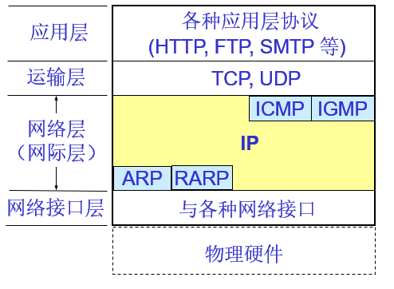
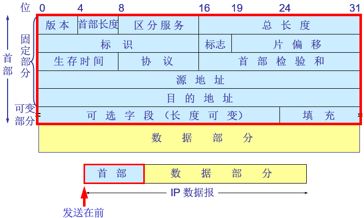
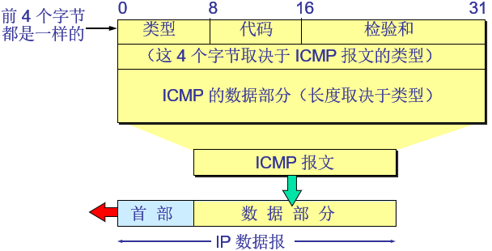
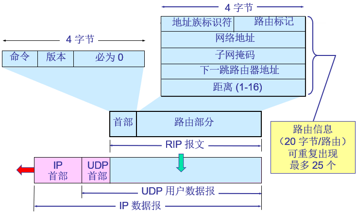
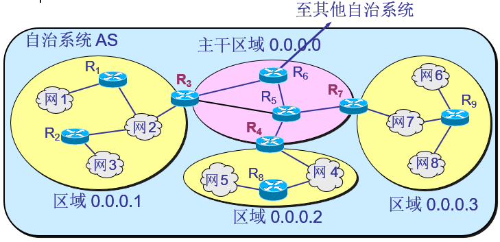
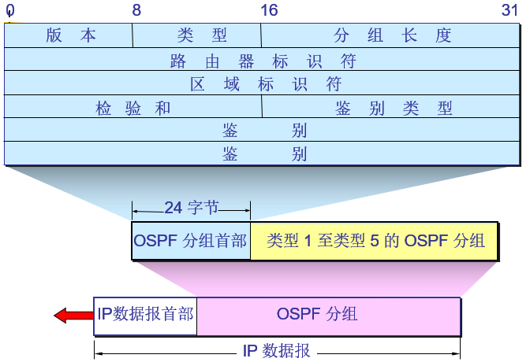
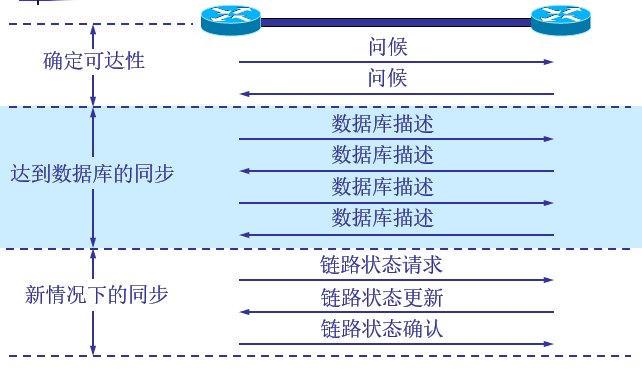
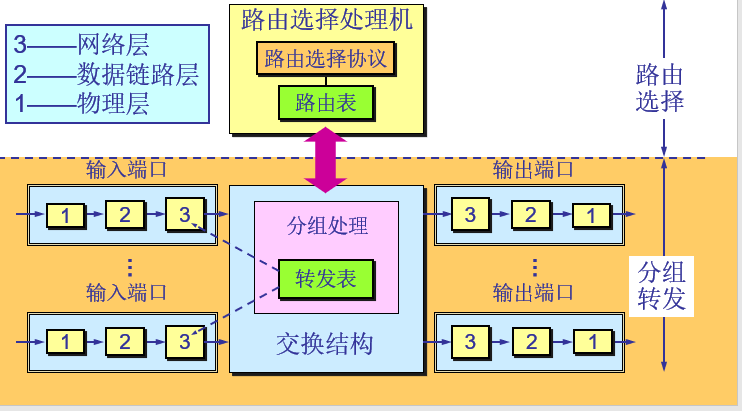
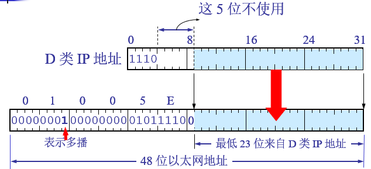
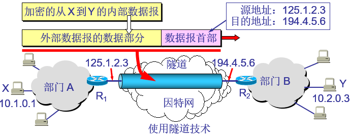

# 网络层

## 争论

在计算机网络领域，网络层应该向运输层提供怎样的服务（“面向连接”还是“无连接”）曾引起了长期的争论。争论焦点的实质就是：在计算机通信中，可靠交付应当由谁来负责？是网络还是端系统？

## 因特网采用的设计思路

网络层向上只提供**简单灵活的、无连接的、尽最大努力交付**的数据报服务。

网络在发送分组时不需要先建立连接。每一个分组（即IP数据报）独立发送，与其前后的分组无关（不进行编号）。

网络层不提供服务质量的承诺。即所传送的分组可能出错、丢失、重复和失序（不按序到达终点），当然也不保证分组传送的时限。

尽最大努力交付的好处：

- 由于传输网络不提供端到端的可靠传输服务，这就使网络中的路由器可以做得比较简单，而且价格低廉（与电信网的交换机相比较）。
- 如果主机（即端系统）中的进程之间的通信需要是可靠的，那么就由网络的主机中的运输层负责（包括差错处理、流量控制等）。
- 采用这种设计思路的好处是：网络的造价大大降低，运行方式灵活，能够适应多种应用。

## 网络层提供的两种服务

**虚电路服务**：虚电路表示这只是一条**逻辑上的连接**，分组都沿着这条逻辑连接按照存储转发方式传送，而并不是真正建立了一条物理连接。请注意，电路交换的电话通信是先建立了一条真正的连接。因此分组交换的虚连接和电路交换的连接只是类似，但并不完全一样。

**数据报服务**：

| 对比方面                   | 虚电路服务                                     | 数据报服务                                         |
| :------------------------- | :--------------------------------------------- | :------------------------------------------------- |
| 思路                       | 可靠通信应当由网络来保证                       | 可靠通信应当由网络来保证                           |
| 连接的建立                 | 必须有                                         | 不需要                                             |
| 终点地址                   | 仅在连接建立阶段使用，每个分组使用短的虚电路号 | 每个分组都有终点的完整地址                         |
| 分组的转发                 | 属于同一条虚电路的分组均按照同一路由进行转发   | 每个分组独立选择路由进行转发                       |
| 当结点出故障时             | 所有通过出故障的结点的虚电路均不能工作         | 出故障的结点可能会丢失分组，一些路由可能会发生变化 |
| 分组的顺序                 | 总是按发送顺序到达终点                         | 到达终点时不一定按发送顺序                         |
| 端到端的差错处理和流量控制 | 可以由网络负责，也可以由用户主机负责           | 由用户主机负责                                     |

## 网际协议IP

## 网际层的IP协议及配套协议

网际协议IP是TCP/IP体系中两个最主要的协议之一。与IP协议配套使用的还有四个协议：

- 地址解析协议ARP（Address Resolution Protocol）
- 逆地址解析协议RARP（Reverse Address Resolution Protocol）
- 网际控制报文协议ICMP（Internet Control Message Protocol）
- 网际组管理协议IGMP（Internet Group Management Protocol）

## 中间设备

中间设备又称为中间系统或中继（relay）系统。

各层中继系统：

- 物理层：转发器（repeater）
- 数据链路层：网桥或桥接器（bridge）
- 网络层：路由器（router）
- 网络层以上：网关（gateway）
- 网桥和路由器的混合物：桥路器（brouter）

当中继系统是转发器或网桥时，一般并不称之为网络互连，因为这仅仅是把一个网络扩大了，而这仍然是一个网络。

网关：由于比较复杂，目前使用得较少。互联网都是指用路由器进行互连的网络。由于历史的原因，许多有关TCP/IP的文献将网络层使用的路由器称为网关。

## 虚拟互联网

互连在一起的网络要进行通信，会遇到许多问题需要解决，如：

- 不同的寻址方案
- 不同的最大分组长度
- 不同的网络接入机制
- 不同的超时控制
- 不同的差错恢复方法
- 不同的状态报告方法
- 不同的路由选择技术
- 不同的用户接入控制
- 不同的服务（面向连接服务和无连接服务）
- 不同的管理与控制方式

所谓虚拟互连网络也就是逻辑互连网络，它的意思就是互连起来的各种物理网络的异构性本来是客观存在的，但是我们利用IP协议就可以使这些性能各异的网络从用户看起来好像是一个统一的网络。使用IP协议的虚拟互连网络可简称为IP网。

使用虚拟互连网络的好处是：当互联网上的主机进行通信时，就好像在一个网络上通信一样，而看不见互连的各具体的网络异构细节。

## 分类的IP地址（IPv4）

### IP概述

我们把整个因特网看成为一个单一的、抽象的网络。IP地址就是给每个连接在因特网上的主机（或路由器）分配一个在全世界范围是唯一的32位的标识符。

IP地址现在由因特网名字与号码指派公司ICANN（Internet Corporation for Assigned Names and Numbers）进行分配

每一类地址都由两个固定长度的字段组成，其中一个字段是网络号net-id，它标志主机（或路由器）所连接到的网络，而另一个字段则是主机号host-id，它标志该主机（或路由器）。

两级的IP地址可以记为：**IP地址 ::= {<网络号>,<主机号>}**
> ::= 代表“定义为”

### 分类

| 地址类型 | 起始位 | 最大网络数 | 第一个可用的网络号 | 最后一个可用网络号 | 每个网络中最大主机数 | 其中私有      |
| :------- | :----- | :--------- | :----------------- | :----------------- | :------------------- | :------------ |
| A类地址  | 0      | 2^7 - 2    | 1                  | 126                | 2^24 - 2             | 10            |
| B类地址  | 10     | 2^14 - 1   | 128.1              | 191.255            | 2^16 - 2             | 172.16~172.31 |
| C类地址  | 110    | 2^21 - 1   | 192.0.1            | 223.255.255        | 2^8 - 2              | 192.168       |
| D类地址  | 1110   |            |                    |                    |                      |
| E类地址  | 1111   |            |                    |                    |                      |

### 特殊IP地址

- {0,0}: 网络号和主机号都全部为0，表示“本网络上的本主机”，只能用作源地址。
- {0,host-id}: 本网络上的某台主机。只能用作源地址。
- {-1,-1}：表示网络号和主机号的所有位上都是1（二进制），用于本网络上的广播，只能用作目的地址，发到该地址的数据包不能转发到源地址所在网络之外。
- {net-id,-1}: 直接广播到指定的网络上。只能用作目的地址。
- {net-id,subnet-id,-1}: 直接广播到指定网络的指定子网络上。只用作目的地址。
- {net-id,-1,-1}: 直接广播到指定网络的所有子网络上。只能用作目的地址。
- {127,}: 即网络号为127的任意ip地址。都是内部主机回环地址（loopback）, 永远都不能出现在主机外部的网络中。
- localhost、127.0.0.1和0.0.0.0
  - 0.0.0.0
    - 用于表示一个无效的，未知的或者不可用的目标。
    - 在服务器中，0.0.0.0指的是本机上的所有IPv4地址，如果一个主机有两个IP地址，192.168.1.1和10.1.2.1，并且该主机上的一个服务监听的地址是0.0.0.0, 那么通过两个ip地址都能够访问该服务。
    - 在路由中，0.0.0.0表示的是默认路由，即当路由表中没有找到完全匹配的路由的时候所对应的路由。
  - 127.0.0.1
    - 属于{127,}集合中的一个，回环地址包含127.0.0.1。
    - 回环地址：所有发往该类地址的数据包都应该被loop back。
    - 回环测试：通过使用ping 127.0.0.1测试某台机器上的网络设备，操作系统或者TCP/IP实现是否工作正常。
    - DDos攻击防御：网站收到DDos攻击之后，将域名A记录到127.0.0.1，即让攻击者自己攻击自己。
    - 大部分Web容器测试的时候绑定的本机地址。
  - localhost
    - 相比127.0.0.1，localhost具有更多的意义。localhost是个域名，用于指代this computer或者this host, 可以用它来获取运行在本机上的网络服务。
    - 在大多数系统中，localhost被指向了IPv4的127.0.0.1和IPv6的::1。

### IP地址的重要特点

IP地址是一种分等级的地址结构。分两个等级的好处是：第一，IP地址管理机构在分配IP地址时只分配网络号，而剩下的主机号则由得到该网络号的单位自行分配。这样就方便了IP地址的管理。第二，路由器仅根据目的主机所连接的网络号来转发分组（而不考虑目的主机号），这样就可以使路由表中的项目数大幅度减少，从而减小了路由表所占的存储空间。

实际上IP地址是标志一个主机（或路由器）和一条链路的接口。当一个主机同时连接到两个网络上时，该主机就必须同时具有两个相应的IP地址，其网络号net-id必须是不同的。这种主机称为多归属主机（multihomed host）。由于一个路由器至少应当连接到两个网络（这样它才能将IP数据报从一个网络转发到另一个网络），因此一个路由器至少应当有两个不同的IP地址。

用转发器或网桥连接起来的若干个局域网仍为一个网络，因此这些局域网都具有同样的网络号net-id。所有分配到网络号net-id的网络，范围很小的局域网，还是可能覆盖很大地理范围的广域网，都是平等的。

### 子网划分和构造超网

需要子网划分和构造超网的原因：IP地址空间的利用率有时候很低，地址浪费大

- 只有两、三台主机的网络，也至少要一个C类IP地址，A、B类浪费更严重，少有达上万台主机的大型IP网络。
- 路由表太大，影响网络性能
- 路由器需要能够从路由表中找出怎样到达其他网络的下一跳地址，而一个物理网络对应一个网络号，如果网络越多，则路由表越大，路由器的存储空间就需要越大，查找也更耗时，但使用构造超网，则能减少网络数，提升性能。
- 不够灵活。企业有很多部门，每个部门可能需要各自独立的网络，这怎么办呢？再申请网络？可是人数又不多，怎么办呢？划分子网刚好可以解决这个问题，而且便于管理。

子网划分：子网掩码是一个应用于TCP/IP网络的32位二进制值，它可以屏蔽掉ip地址中的一部分，从而分离出ip地址中的网络部分与主机部分，基于子网掩码，管理员可以将网络进一步划分为若干子网。
> 子网掩码与IP地址进行位运算可以将主机位归零，获取网络位

超网（supernetting），也称无类别域间路由选择（CIDR，Classless Inter-Domain Routeing）。CIDR消除了传统的A类、B类和C类地址以及划分子网的概念，CIDR使用各种长度的“网络前缀” 来代替分类地址中的网络号和子网号，CIDR不再使用“子网”的概念而使用网络前缀，使IP地址从三级编址又回到了两级编址，即无分类的两级编址。**IP = 网络前缀 + 主机号**

- 表示方法：“斜线记法”，即在IP地址后写上斜线“/”，然后写上网络前缀所占的位数（对应子网掩码中1的bit数）。例如：192.168.1.0/22。网络前缀为22位，也代表掩码前22位为1
- 作用：将一个组织所属的几个小网络合并成为一个更大地址范围的逻辑网络。 即CIDR将网络前缀相同的连续的IP地址组成一个“CIDR地址块”。

## ARP和RARP

ARP（Adress Resolution Protocal），地址解析协议：不管网络层使用的是什么协议，在实际网络的链路上传送数据帧时，最终还是必须使用硬件地址。每一个主机都设有一个ARP高速缓存（ARP cache），里面有所在的局域网上的各主机和路由器的IP地址到硬件地址的映射表。

当主机A欲向本局域网上的某个主机B发送IP数据报时，就先在其ARP高速缓存中查看有无主机B的IP地址。如有，就可查出其对应的硬件地址，再将此硬件地址写入MAC帧，然后通过局域网将该MAC帧发往此硬件地址。

RARP（Reverse Address Resolution Protocol），逆向地址解析协议：逆地址解析协议RARP使只知道自己硬件地址的主机能够知道其IP地址。这种主机往往是无盘工作站。因此RARP协议目前已很少使用。

## IP数据报的格式

一个IP数据报由首部和数据两部分组成。首部的前一部分是固定长度，共20字节，是所有IP数据报必须具有的。在首部的固定部分的后面是一些可选字段，其长度是可变的。

- 版本：指IP协议的版本。4为IPv4，6为IPv6。
- 首部长度：表示的最大数值是15个单位（一个单位为4字节），因此IP的首部长度的最大值是**60字节**。
- 区分服务：用来获得更好的服务。在旧标准中叫做服务类型，但实际上一直未被使用过。1998年这个字段改名为区分服务。只有在使用区分服务（DiffServ）时，这个字段才起作用。在一般的情况下都不使用这个字段。
- 总长度：指首部和数据之和的长度，单位为字节，因此数据报的最大长度为2^16（**65536**）字节。总长度必须不超过最大传送单元（MTU）。
- 标识：它是一个计数器，用来产生数据报的标识。
- 标志：目前只有前两位有意义。
  - 标志字段中间的一位是DF（Don't Fragment）。只有当DF = 0时才允许分片。
  - 标志字段的最低位是MF（More Fragment）。MF = 1表示后面“还有分片”。MF = 0表示最后一个分片。
- 片偏移：较长的分组在分片后某片在原分组中的相对位置。片偏移以8个字节为偏移单位。
- 生存时间：记为TTL（Time To Live），数据报在网络中可通过的路由器数的最大值。
- 协议：指出此数据报携带的数据使用何种协议以便目的主机的IP层将数据部分上交给哪个处理过程.
- 首部检验和：只检验数据报的首部，不检验数据部分。这里不采用CRC检验码而采用简单的计算方法。
- 源地址：源IP地址。
- 目的地址：目标IP地址。
- 可选字段和填充：就是一个选项字段，用来支持排错、测量以及安全等措施，内容很丰富。
  - 选项字段的长度可变，从1个字节到40个字节不等，取决于所选择的项目。
  - 增加首部的可变部分是为了增加IP数据报的功能，但这同时也使得IP数据报的首部长度成为可变的。这就增加了每一个路由器处理数据报的开销。
  - 实际上这些选项很少被使用。

## IP数据报分组转发

- 查找路由表：根据目的网络地址就能确定下一跳路由器，这样做的结果是：
    - IP数据报最终一定可以找到目的主机所在目的网络上的路由器（可能要通过多次的间接交付）。
    - 只有到达最后一个路由器时，才试图向目的主机进行直接交付。
- 特定主机路由：
    - 这种路由是为特定的目的主机指明一个路由。
    - 采用特定主机路由可使网络管理人员能更方便地控制网络和测试网络，同时也可在需要考虑某种安全问题时采用这种特定主机路由。
- 强调
    - IP数据报的首部中没有地方可以用来指明“下一跳路由器的IP地址”。
    - 当路由器收到待转发的数据报，不是将下一跳路由器的IP地址填入IP数据报，而是送交下层的网络接口软件。
    - 网络接口软件使用ARP负责将下一跳路由器的IP地址转换成硬件地址，并将此硬件地址放在链路层的MAC帧的首部，然后根据这个硬件地址找到下一跳路由器。
- 分组转发算法
    - 从数据报的首部提取目的主机的IP地址D，得出目的网络地址为N。
    - 若网络N与此路由器直接相连，则把数据报直接交付目的主机D；否则是间接交付，执行3。
    - 若路由表中有目的地址为D的特定主机路由，则把数据报传送给路由表中所指明的下一跳路由器；否则，执行4。
    - 若路由表中有到达网络N的路由，则把数据报传送给路由表指明的下一跳路由器；否则，执行5。
    - 若路由表中有一个默认路由，则把数据报传送给路由表中所指明的默认路由器；否则，执行6。
    - 报告转发分组出错。

## ICMP

- 为了提高IP数据报交付成功的机会，在网际层使用了网际控制报文协议ICMP（Internet Control Message Protocol）。
- ICMP允许主机或路由器报告差错情况和提供有关异常情况的报告。
- ICMP不是高层协议，而是IP层的协议。
- ICMP报文作为IP层数据报的数据，加上数据报的首部，组成IP数据报发送出去。

## ICMP报文格式

- ICMP报文的前4个字节是统一的格式，共有三个字段：即类型、代码和检验和。接着的4个字节的内容与ICMP的类型有关。

## ICMP类型

- ICMP差错报告报文
    - 终点不可达
    - 源点抑制（Source quench）
    - 时间超过
    - 参数问题
    - 改变路由（重定向）（Redirect）
- ICMP询问报文。
    - 回送请求和回答报文
    - 时间戳请求和回答报文

## Ping（Packet InterNet Groper）

- PING用来测试两个主机之间的连通性。
- PING使用了ICMP回送请求与回送回答报文。
- PING是应用层直接使用网络层ICMP的例子，它没有通过运输层的TCP或UDP。
- 相关命令：
    - ping
    - tracert
    - traceroute

# 因特网的路由选择协议

- 理想的路由算法
    - 算法必须是正确的和完整的。
    - 算法在计算上应简单。
    - 算法应能适应通信量和网络拓扑的变化，这就是说，要有自适应性。
    - 算法应具有稳定性。
    - 算法应是公平的。
    - 算法应是最佳的。
- 关于最佳路由
    - 不存在一种绝对的最佳路由算法。
    - 所谓 “最佳” 只能是相对于某一种特定要求下得出的较为合理的选择而已。
    - 实际的路由选择算法，应尽可能接近于理想的算法。
    - 路由选择是个非常复杂的问题
        - 它是网络中的所有结点共同协调工作的结果。
        - 路由选择的环境往往是不断变化的，而这种变化有时无法事先知道。
- 从路由算法的自适应性考虑
    - 静态路由选择策略——即非自适应路由选择，其特点是简单和开销较小，但不能及时适应网络状态的变化。
    - 动态路由选择策略——即自适应路由选择，其特点是能较好地适应网络状态的变化，但实现起来较为复杂，开销也比较大。

## 自治系统AS（Autonomous System）

- 定义：
    - 在单一的技术管理下的一组路由器
    - 这些路由器使用一种AS内部的路由选择协议和共同的度量以确定分组在该AS内的路由
    - 同时还使用一种AS之间的路由选择协议用以确定分组在AS之间的路由。
- 现在对自治系统AS的定义是强调下面的事实：
    - 尽管一个AS使用了多种内部路由选择协议和度量，但重要的是一个AS对其他AS表现出的是一个单一的和一致的路由选择策略。
- 因特网有两大类路由选择协议
    - 内部网关协议IGP（Interior Gateway Protocol）   即在一个自治系统内部使用的路由选择协议。目前这类路由选择协议使用得最多，如 **RIP**和**OSPF** 协议。
    - 外部网关协议EGP（External Gateway Protocol）   若源站和目的站处在不同的自治系统中，当数据报传到一个自治系统的边界时，就需要使用一种协议将路由选择信息传递到另一个自治系统中。这样的协议就是外部网关协议EGP。在外部网关协议中目前使用最多的是BGP-4。
- 自治系统和内外部网关协议
    - 自治系统之间的路由选择也叫做域间路由选择（interdomain routing），
    - 在自治系统内部的路由选择叫做域内路由选择（intradomain routing）
    

## RIP（Routing Information Protocol）

### 工作原理

- 路由信息协议RIP是内部网关协议IGP中最先得到广泛使用的协议。
- RIP是一种分布式的基于 **距离向量** 的路由选择协议。
- RIP协议要求网络中的每一个路由器都要维护从它自己到其他每一个目的网络的距离记录。

### 距离的定义

- 从一路由器到直接连接的网络的距离定义为1。从一个路由器到非直接连接的网络的距离定义为所经过的路由器数加1。
- RIP协议中的 **“距离”也称为“跳数”（hop count）** ，因为每经过一个路由器，跳数就加1。
- 这里的 “距离” 实际上指的是“最短距离”，RIP认为一个好的路由就是它通过的路由器的数目少，即“距离短”。
- RIP允许一条路径最多只能包含15个路由器。“距离”的最大值为16时即相当于不可达。可见RIP只适用于小型互联网。
- RIP不能在两个网络之间同时使用多条路由。RIP选择一个具有最少路由器的路由（即最短路由），哪怕还存在另一条高速（低时延）但路由器较多的路由。

### 三个要点

- 仅和相邻路由器交换信息。
- 交换的信息是当前本路由器所知道的全部信息，即自己的路由表。
- 按固定的时间间隔交换路由信息，例如，每隔30秒。

### RIP2报文

- RIP2报文中的路由部分由若干个路由信息组成。每个路由信息需要用20个字节。地址族标识符（又称为地址类别）字段用来标志所使用的地址协议。
- 路由标记填入自治系统的号码，这是考虑使RIP有可能收到本自治系统以外的路由选择信息。再后面指出某个网络地址、该网络的子网掩码、下一跳路由器地址以及到此网络的距离。

### 距离向量算法

- 收到相邻路由器（其地址为X）的一个RIP报文：
- 先修改此RIP报文中的所有项目：把 “下一跳” 字段中的地址都改为X，并把所有的 “距离” 字段的值加1。
- 对修改后的RIP报文中的每一个项目，重复以下步骤：
    - 若项目中的目的网络不在路由表中，则把该项目加到路由表中。
    - 否则
        若下一跳字段给出的路由器地址是同样的，则把收到的项目替换原路由表中的项目。
    - 否则
        若收到项目中的距离小于路由表中的距离，则进行更新，
    - 否则，什么也不做。
- 若3分钟还没有收到相邻路由器的更新路由表，则把此相邻路由器记为不可达路由器，即将距离置为16（距离为16表示不可达）。
- 返回。

### 优缺点

- RIP存在的一个问题是当网络出现故障时，要经过比较长的时间才能将此信息传送到所有的路由器。
- RIP协议最大的优点就是实现简单，开销较小。
- RIP限制了网络的规模，它能使用的最大距离为15（16表示不可达）。
- 路由器之间交换的路由信息是路由器中的完整路由表，因而随着网络规模的扩大，开销也就增加。

## OSPF（Open Shortest Path First）

### 基本特点

- “开放”表明OSPF协议不是受某一家厂商控制，而是公开发表的。
- “最短路径优先”是因为使用了Dijkstra提出的 **最短路径算法（SPF）**
- OSPF只是一个协议的名字，它并不表示其他的路由选择协议不是“最短路径优先”。
- 是分布式的链路状态协议。

### 三个要素

- 向本自治系统中所有路由器发送信息，这里使用的方法是洪泛法。
- 发送的信息就是与本路由器相邻的所有路由器的链路状态，但这只是路由器所知道的部分信息。
    - “链路状态”就是说明本路由器都和哪些路由器相邻，以及该链路的“度量”（metric）。
- 只有当链路状态发生变化时，路由器才用洪泛法向所有路由器发送此信息。

### 链路状态数据库（link-state database）

- 由于各路由器之间频繁地交换链路状态信息，因此所有的路由器最终都能建立一个链路状态数据库。
- 这个数据库实际上就是全网的拓扑结构图，它在全网范围内是一致的（这称为链路状态数据库的同步）。
- OSPF的链路状态数据库能较快地进行更新，使各个路由器能及时更新其路由表。**OSPF的更新过程收敛得快是其重要优点**。

### 划分区域

- 划分区域的好处就是将利用洪泛法交换链路状态信息的范围局限于每一个区域而不是整个的自治系统，这就减少了整个网络上的通信量。
- 在一个区域内部的路由器只知道本区域的完整网络拓扑，而不知道其他区域的网络拓扑的情况。
- OSPF使用层次结构的区域划分。在上层的区域叫作主干区域（backbone area）。主干区域的标识符规定为0.0.0.0。主干区域的作用是用来连通其他在下层的区域。
    

### OSPF直接用IP数据报传送

- OSPF不用UDP而是直接用IP数据报传送。
- OSPF构成的数据报很短。这样做可减少路由信息的通信量。
- 数据报很短的另一好处是可以不必将长的数据报分片传送。分片传送的数据报只要丢失一个，就无法组装成原来的数据报，而整个数据报就必须重传。

### 其他特点

- OSPF对不同的链路可根据IP分组的不同服务类型TOS而设置成不同的代价。因此，OSPF对于不同类型的业务可计算出不同的路由。
- 如果到同一个目的网络有多条相同代价的路径，那么可以将通信量分配给这几条路径。这叫作多路径间的负载平衡。
- 所有在OSPF路由器之间交换的分组都具有鉴别的功能。
- 支持可变长度的子网划分和无分类编址CIDR。
- 每一个链路状态都带上一个32位的序号，序号越大状态就越新。
- OSPF还规定每隔一段时间，如30分钟，要刷新一次数据库中的链路状态。
- 由于一个路由器的链路状态只涉及到与相邻路由器的连通状态，因而与整个互联网的规模并无直接关系。因此当互联网规模很大时，OSPF协议要比距离向量协议RIP好得多。
- OSPF没有 “坏消息传播得慢” 的问题，据统计，其响应网络变化的时间小于100 ms。

### OSPF分组

- 类型1，问候（Hello）分组。
- 类型2，数据库描述（Database Description）分组。
- 类型3，链路状态请求（Link State Request）分组。
- 类型4，链路状态更新（Link State Update）分组，用洪泛法对全网更新链路状态。
- 类型5，链路状态确认（Link State Acknowledgment）分组。

### OSPF基本操作

- 指定的路由器（designated router）
- 多点接入的局域网采用了指定的路由器的方法，使广播的信息量大大减少。
- 指定的路由器代表该局域网上所有的链路向连接到该网络上的各路由器发送状态信息。

## BGP（Border Gateway Protocol）

BGP是不同自治系统的路由器之间交换路由信息的协议。BGP较新版本是2006年1月发表的BGP-4（BGP第4个版本），即RFC 4271~4278。可以将BGP-4简写为BGP。

### 使用环境

- 因特网的规模太大，使得自治系统之间路由选择非常困难。对于自治系统之间的路由选择，要寻找最佳路由是很不现实的。
- 当一条路径通过几个不同AS时，要想对这样的路径计算出有意义的代价是不太可能的。
- 比较合理的做法是在AS之间交换 “可达性” 信息。
- 自治系统之间的路由选择必须考虑有关策略。
- 因此，边界网关协议BGP只能是力求寻找一条能够到达目的网络且比较好的路由（不能兜圈子），而并非要寻找一条最佳路由。

### BGP发言人（BGP speaker）

- 每一个自治系统的管理员要选择至少一个路由器作为该自治系统的“BGP发言人” 。
- 一般说来，两个BGP发言人都是通过一个共享网络连接在一起的，而BGP发言人往往就是BGP边界路由器，但也可以不是BGP边界路由器。

### BGP交换路由信息

- 一个BGP发言人与其他自治系统中的BGP发言人要交换路由信息，就要先建立TCP连接，然后在此连接上交换BGP报文以建立BGP会话（session），利用BGP会话交换路由信息。
- 使用TCP连接能提供可靠的服务，也简化了路由选择协议。
- 使用TCP连接交换路由信息的两个BGP发言人，彼此成为对方的邻站或对等站。

### BGP特点

- BGP协议交换路由信息的结点数量级是自治系统数的量级，这要比这些自治系统中的网络数少很多。
- 每一个自治系统中BGP发言人（或边界路由器）的数目是很少的。这样就使得自治系统之间的路由选择不致过分复杂
- BGP支持CIDR，因此BGP的路由表也就应当包括目的网络前缀、下一跳路由器，以及到达该目的网络所要经过的各个自治系统序列。
- 在BGP刚刚运行时，BGP的邻站是交换整个的BGP路由表。但以后只需要在发生变化时更新有变化的部分。这样做对节省网络带宽和减少路由器的处理开销方面都有好处

### BGP-4报文

- 打开（OPEN）报文，用来与相邻的另一个BGP发言人建立关系。
- 更新（UPDATE）报文，用来发送某一路由的信息，以及列出要撤消的多条路由。
- 保活（KEEPALIVE）报文，用来确认打开报文和周期性地证实邻站关系。
- 通知（NOTIFICATION）报文，用来发送检测到的差错。
- 在RFC 2918中增加了ROUTE-REFRESH报文，用来请求对等端重新通告。

## 路由器

### 在网际互连中的作用

- 路由器是一种具有多个输入端口和多个输出端口的专用计算机，其任务是转发分组。也就是说，将路由器某个输入端口收到的分组，按照分组要去的目的地（即目的网络），把该分组从路由器的某个合适的输出端口转发给下一跳路由器。
- 下一跳路由器也按照这种方法处理分组，直到该分组到达终点为止。
- 典型路由器结构
    

### “转发” 和 “路由选择”

- “转发”（forwarding）就是路由器根据转发表将用户的IP数据报从合适的端口转发出去。
- “路由选择”（routing）则是按照分布式算法，根据从各相邻路由器得到的关于网络拓扑的变化         情况，动态地改变所选择的路由。
- 路由表是根据路由选择算法得出的。而转发表是从路由表得出的。
- 在讨论路由选择的原理时，往往不去区分转发表和路由表的区别。

### 分组丢弃

- 若路由器处理分组的速率赶不上分组进入队列的速率，则队列的存储空间最终必定减少到零，这就使后面再进入队列的分组由于没有存储空间而只能被丢弃。
- 路由器中的输入或输出队列产生溢出是造成分组丢失的重要原因。

# IP多播

多播可明显地减少网络中资源的消耗

## 多播的特点

- 多播使用组地址——IP使用D类地址支持多播。多播地址只能用于目的地址，而不能用于源地址
- 永久组地址——由因特网号码指派管理局IANA负责指派。
- 动态的组成员
- 使用硬件进行多播

## 在局域网上进行硬件多播

- 因特网号码指派管理局IANA拥有的以太网地址块的高24位为00-00-5E。
- 因此TCP/IP协议使用的以太网多播地址块的范围是：从00-00-5E-00-00-00到00-00-5E-FF-FF-FF
- D类IP地址可供分配的有28位，在这28位中的前5位不能用来构成以太网硬件地址。
- D类IP地址与以太网多播地址的映射关系
    

## IP多播需要的两种协议

### IGMP

网际组管理协议IGMP（Internet Group Management Protocol）

- IGMP作用：使路由器知道多播组成员的信息。
- IGMP特点：和ICMP相似，IGMP使用IP数据报传递其报文（即IGMP报文加上IP首部构成IP数据报），但它也向IP提供服务。因此，我们不把IGMP看成是一个单独的协议，而是属于整个网际协议IP的一个组成部分

IGMP可分为两个阶段：

1. 第一阶段：当某个主机加入新的多播组时，该主机应向多播组的多播地址发送IGMP报文，声明自己要成为该组的成员。本地的多播路由器收到IGMP报文后，将组成员关系转发给因特网上的其他多播路由器。
2. 第二阶段：因为组成员关系是动态的，因此本地多播路由器要周期性地探询本地局域网上的主机，以便知道这些主机是否还继续是组的成员。
    - 只要对某个组有一个主机响应，那么多播路由器就认为这个组是活跃的。
    - 但一个组在经过几次的探询后仍然没有一个主机响应，则不再将该组的成员关系转发给其他的多播路由器。

IGMP的措施：

- 在主机和多播路由器之间的所有通信都是使用IP多播。
- 多播路由器在探询组成员关系时，只需要对所有的组发送一个请求信息的询问报文，而不需要对每一个组发送一个询问报文。默认的询问速率是每125秒发送一次。
- 当同一个网络上连接有几个多播路由器时，它们能够迅速和有效地选择其中的一个来探询主机的成员关系。
- 在IGMP的询问报文中有一个数值N，它指明一个最长响应时间（默认值为10秒）。当收到询问时，主机在0到N之间随机选择发送响应所需经过的时延。对应于最小时延的响应最先发送。
- 同一个组内的每一个主机都要监听响应，只要有本组的其他主机先发送了响应，自己就可以不再发送响应了。

### 多播路由选择协议

作用：连接在局域网上的多播路由器还必须和因特网上的其他多播路由器协同工作，以便把多播数据报用最小代价传送给所有的组成员。

特点：

- 多播路由选择协议比单播路由选择协议复杂得多
- 多播转发必须动态地适应多播组成员的变化（这时网络拓扑并未发生变化）。请注意，单播路由选择通常是在网络拓扑发生变化时才需要更新路由。
- 多播路由器在转发多播数据报时，不能仅仅根据多播数据报中的目的地址，而是还要考虑这个多播数据报从什么地方来和要到什么地方去。
- 多播数据报可以由没有加入多播组的主机发出，也可以通过没有组成员接入的网络。

# 虚拟专用网VPN和网络地址转换NAT

## 虚拟专用网VPN

- 本地地址——仅在机构内部使用的IP地址，可以由本机构自行分配，而不需要向因特网的管理机构申请。
- 全球地址——全球唯一的IP地址，必须向因特网的管理机构申请。
- 用隧道技术实现虚拟专用网
    

## 内联网intranet和外联网extranet

- 都是基于TCP/IP协议。
- 由部门A和B的内部网络所构成的虚拟专用网VPN又称为内联网（intranet），表示部门A和B都是在同一个机构的内部。
- 一个机构和某些外部机构共同建立的虚拟专用网VPN又称为外联网（extranet）。

## 网络地址转换NAT（Network Address Translation）

- 网络地址转换NAT  方法于1994年提出。
- 需要在专用网连接到因特网的路由器上安装NAT软件。装有NAT软件的路由器叫做NAT路由器，它至少有一个有效的外部全球地址$IP_G$。
- 所有使用本地地址的主机在和外界通信时都要在NAT路由器上将其本地地址转换成$IP_G$才能和因特网连接。
- 转换过程：
    1. 内部主机X用本地地址$IP_X$和因特网上主机Y通信所发送的数据报必须经过NAT路由器。
    2. NAT路由器将数据报的源地址$IP_X$转换成全球地址$IP_G$，但目的地址$IP_Y$保持不变，然后发送到因特网。
    3. NAT路由器收到主机Y发回的数据报时，知道数据报中的源地址是$IP_Y$而目的地址是$IP_G$。
    4. 根据NAT转换表，NAT路由器将目的地址$IP_G$转换为$IP_X$，转发给最终的内部主机X。
